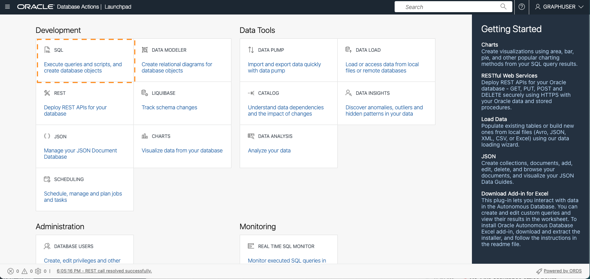
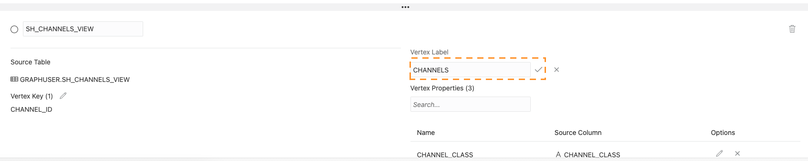

# Creación de un gráfico a partir de datos relacionales existentes mediante Graph Studio

## Introducción

En este laboratorio, descubrirá más información sobre Graph Studio y aprenderá a crear gráficos a partir de datos relacionales existentes almacenados en la instancia de Autonomous Data Warehouse - Shared Infrastructure (ADW) o Autonomous Transaction Processing - Shared Infrastructure (ATP).

Tiempo estimado: 30 minutos.

### Objetivos

*   Descubra cómo modelar un gráfico a partir del juego de datos de ejemplo Sales History (SH)
*   Aprender a supervisar un trabajo de creación de gráficos
*   Descubra cómo inspeccionar los gráficos y modelos de gráficos creados

### Requisitos

*   En la siguiente práctica se necesita una cuenta de Autonomous Data Warehouse - Shared Infrastructure o Autonomous Transaction Processing - Shared Infrastructure.
*   Se supone que ha completado el primer laboratorio, que explica cómo puede acceder a la interfaz de Graph Studio de la instancia de base de datos e ilustra algunos conceptos básicos.

## Tarea 1: Creación de las vistas necesarias

1.  En la página Detalles de Autonomous Database de OCI, seleccione Acciones de base de datos
    
    
    
2.  Por defecto, se conectará como usuario administrador. Cierre la sesión y vuelva a iniciarla como usuario de Graph.
    

 

3.  Seleccionar SQL

4.  En este laboratorio, utilizamos el esquema de ejemplo Sales History (SH) para crear nuestro gráfico de demostración. El esquema SH está disponible en todas las instancias de Autonomous Database. Cree vistas para CUSTOMERS, TIMES, CHANNELS, PRODUCTS y PROMOTIONS de las tablas SH, utilizando solo un subjuego de las columnas de esas tablas.

    <copy>
    CREATE OR REPLACE VIEW SH_CUSTOMERS_VIEW (CUST_ID, CUST_FIRST_NAME, CUST_LAST_NAME, CUST_EMAIL, CUST_GENDER, CUST_CITY, CUST_STATE_PROVINCE, COUNTRY_ID)
    	DEFAULT COLLATION "USING_NLS_COMP"  AS
    	select cust_id, cust_first_name, cust_last_name, cust_email, cust_gender, cust_city, cust_state_province, country_id from sh.customers;
    
    CREATE OR REPLACE  VIEW SH_CHANNELS_VIEW (CHANNEL_ID, CHANNEL_DESC, CHANNEL_CLASS) DEFAULT COLLATION "USING_NLS_COMP"  AS
    	select channel_id, channel_desc, channel_class from sh.channels ;
    
    CREATE OR REPLACE VIEW SH_TIMES_VIEW (ID, TIME_ID, DAY_NAME, DAY_NUMBER_IN_MONTH, CALENDAR_MONTH_NUMBER,  CALENDAR_YEAR)
    	DEFAULT COLLATION "USING_NLS_COMP"  AS select rownum id, time_id, day_name, day_number_in_month, calendar_month_number, calendar_year from sh.times ;
    
    CREATE OR REPLACE VIEW SH_PRODUCTS_VIEW (PROD_ID, PROD_NAME, PROD_DESC, PROD_CATEGORY, PROD_STATUS)
    	DEFAULT COLLATION "USING_NLS_COMP"  AS select cast(prod_id as number) as prod_id, prod_name, prod_desc, prod_category, prod_status from sh.products;
    
    CREATE OR REPLACE VIEW SH_PROMOTIONS_VIEW (PROMO_ID, PROMO_NAME, PROMO_SUBCATEGORY, PROMO_CATEGORY, PROMO_COST)
    	DEFAULT COLLATION "USING_NLS_COMP"  AS select cast(promo_id as number) promo_id, promo_name, promo_subcategory, promo_category, promo_cost from sh.promotions;
    
    CREATE OR REPLACE VIEW SH_SALES_VIEW (SALE_ID, CUST_ID, PROD_ID, PROMO_ID, DATE_OF_SALE_ID, CHANNEL_ID, AMOUNT_SOLD, QUANTITY_SOLD)
    	DEFAULT COLLATION "USING_NLS_COMP" AS
    	select rownum sale_id, s.cust_id, s.prod_id, s.promo_id, tv.id as date_of_sale_id, s.channel_id, s.amount_sold, s.quantity_sold from sh.sales s, sh_times_view tv where s.time_id = tv.time_id
    </copy>
    

5.  Agregar las claves primarias relevantes a las vistas

    <copy>
    ALTER VIEW SH_CUSTOMERS_VIEW ADD CONSTRAINT SH_CUSTOMER_VIEW_PK PRIMARY KEY (CUST_ID) DISABLE ;
    
    ALTER VIEW SH_CHANNELS_VIEW ADD CONSTRAINT SH_CHANNEL_VIEW_PK PRIMARY KEY (CHANNEL_ID) DISABLE ;
    
    ALTER VIEW SH_TIMES_VIEW ADD CONSTRAINT SH_TIMES_VIEW_PK PRIMARY KEY (ID) DISABLE ;
    
    ALTER VIEW SH_PRODUCTS_VIEW ADD CONSTRAINT SH_PRODUCT_VIEW_PK PRIMARY KEY (PROD_ID) DISABLE;
    
    ALTER VIEW SH_PROMOTIONS_VIEW ADD CONSTRAINT SH_PROMO_VIEW_PK PRIMARY KEY (PROMO_ID) DISABLE;
    
    ALTER VIEW SH_SALES_VIEW ADD CONSTRAINT SH_SALES_VIEW_PK PRIMARY KEY (SALE_ID) DISABLE;
    </copy>
    

6.  Agregar las claves ajenas relevantes para la vista de ventas

    <copy>
    ALTER VIEW SH_SALES_VIEW ADD CONSTRAINT SH_SALES_PROMO_VIEW_FK FOREIGN KEY (PROMO_ID) REFERENCES SH_PROMOTIONS_VIEW (PROMO_ID) DISABLE;
    
    ALTER VIEW SH_SALES_VIEW ADD CONSTRAINT SH_SALES_PRODUCT_VIEW_FK FOREIGN KEY (PROD_ID) REFERENCES SH_PRODUCTS_VIEW (PROD_ID) DISABLE;
    
    ALTER VIEW SH_SALES_VIEW ADD CONSTRAINT SH_SALES_CUST_VIEW_FK FOREIGN KEY (CUST_ID) REFERENCES SH_CUSTOMERS_VIEW (CUST_ID) DISABLE ;
    
    ALTER VIEW SH_SALES_VIEW ADD CONSTRAINT SH_SALES_CHANNEL_VIEW_FK FOREIGN KEY (CHANNEL_ID) REFERENCES SH_CHANNELS_VIEW (CHANNEL_ID) DISABLE ;
    
    ALTER VIEW SH_SALES_VIEW ADD CONSTRAINT SH_SALES_TIMES_VIEW_FK FOREIGN KEY (DATE_OF_SALE_ID) REFERENCES SH_TIMES_VIEW (ID) DISABLE ;
    </copy>
    

7.  Ahora que ha creado las vistas necesarias, puede crear un gráfico en Graph Studio. Por lo tanto, vuelva a la página Detalles de Autonomous Database en OCI, seleccione herramientas y, a continuación, "Open Graph Studio"

8.  Inicie sesión en Graph Studio con el usuario de Graph

## Tarea 2: Seleccionar las tablas desde las que crear el gráfico

1.  En la siguiente captura de pantalla se muestra la interfaz de usuario de Graph Studio con los iconos de menú o navegación de la izquierda. Navegan a las páginas Home, Models, Graphs, Notebooks y Jobs, respectivamente.
    
    
    
2.  Haga clic en el icono de menú **Gráficos** y haga clic en Crear.
    
    
    
    En este laboratorio, utilizamos las vistas creadas a partir del esquema de ejemplo Sales History (SH) para crear nuestro gráfico de demostración. El esquema SH está disponible en todas las instancias de Autonomous Database. Sin embargo, puede aplicar los pasos de este ejercicio práctico a cualquier dato relacional disponible en la base de datos, independientemente de dónde se hayan originado los datos. Todos los esquemas y tablas, incluidas las vistas, a los que tiene acceso se mostrarán como posibles tablas de entrada al inicio del flujo de trabajo de modelado.
    
3.  Abra el esquema **GRAPHUSER** y haga doble clic en la tabla **SH\_PRODUCTS\_VIEW**.
    
    Verá algunos detalles sobre esta tabla, como todas las columnas que tiene y sus tipos, así como qué columna es la clave primaria:
    
    
    
4.  En la parte inferior izquierda, haga clic en el separador **GRAPHUSER.SH\_PRODUCTS\_VIEW - Data** (Datos).
    
    Verá una vista previa de los valores de esa tabla. Por defecto, muestra las diez primeras filas, pero puede aumentar el tamaño de ejemplo. También puede buscar cualquier valor en esa tabla y buscarlo en la vista previa.
    
5.  En este laboratorio, seleccionamos todas las vistas que hemos creado anteriormente como entrada para nuestro modelo de gráfico. Si el usuario de Graph sólo contiene esas vistas, puede seleccionar _GRAPHUSER_ y, a continuación, hacer clic en el botón del medio para mover todas las vistas a la sección seleccionada de la derecha. De lo contrario, seleccione las vistas relevantes y, a continuación, haga clic en el botón del centro para mover todas las vistas a la sección seleccionada a la derecha.
    
    
    
6.  Haga clic en el botón **Next** (Siguiente) en la parte superior derecha para pasar al siguiente paso. Graph Studio analiza las restricciones de clave ajena y sugiere una posible asignación de las vistas seleccionadas a una estructura de gráfico de propiedades. Esto puede tardar unos segundos. Cuando haya terminado, verá toda la entrada que ha seleccionado a la izquierda y la asignación a tablas de vértice y de borde a la derecha.
    
    
    
    Este modelo se puede modificar si es necesario.
    

## Tarea 3: Editar el modelo de gráfico

1.  Haga clic en la tabla de vértices **SH\_CHANNELS\_VIEW**.
    
    El modelador de gráficos automático sugiere convertir cada fila de la entrada _SH\_CHANNELS\_VIEW_ en un vértice en el gráfico de propiedades de destino. En el modelo de gráfico de propiedades, el vértice y los bordes pueden tener una _etiqueta_ para clasificarlos en diferentes tipos de vértices y bordes. Cada etiqueta puede tener un conjunto diferente de propiedades asociadas. El modelador de gráficos define automáticamente la etiqueta con el nombre de la tabla de entrada. De esta manera podemos identificar fácilmente de qué tipo es cada vértice o borde en nuestro gráfico generado. Además, vemos que cada _columna_ de la tabla de entrada se ha convertido en una _propiedad_ en nuestro modelo de gráfico. En el modelo de gráfico de propiedades, las propiedades son pares de clave/valor arbitrarios asociados a cada vértice o borde de nuestro gráfico. Al asignar todos los valores de columna en propiedades, nos aseguramos de que todos los datos de entrada se conserven en nuestro gráfico.
    
    Sin embargo, el modelador de gráficos le permite personalizar cómo se asignan los datos y eliminar tablas y columnas innecesarias que no sean relevantes para el análisis. Reducir la cantidad de datos que se procesarán reducirá la cantidad de recursos de procesamiento y almacenamiento necesarios para el análisis de gráficos. Eliminamos columnas innecesarias al crear las vistas para este gráfico, por lo que no hay nada que eliminar en esta instancia.
    
2.  Cambie el nombre de la etiqueta de vértice a **CHANNELS**:
    
    
    
3.  Repita para todas las demás tablas de vértices:
    
    | Nombre de vista actual | Etiqueta de vértice renombrada |
    | --- | --- |
    | SH\_SALES\_VIEW | VENTAS |
    | SH\_CUSTOMERS\_VIEW | CLIENTES |
    | SH\_TIMES\_VIEW | TIEMPOS |
    | SH\_PROMOTIONS\_VIEW | PROMOCIONES |
    | SH\_PRODUCTS\_VIEW | PRODUCTOS |
    
4.  Haga clic en la tabla de perímetro **SH\_SALES\_VIEW\_SH\_CUSTOMERS\_VIEW**.
    
    Como puede ver en la información de **Source Vertex** y **Destination Vertex** (Vértice de origen), este tipo de perímetro asigna todas las relaciones de **SH\_SALES\_VIEW** a **SH\_CUSTOMERS\_VIEW**. En otras palabras, modela las relaciones **compradas por**. Por defecto, el modelador ha proporcionado a este tipo de borde la etiqueta **SH\_SALES\_VIEW\_SH\_CUSTOMERS\_VIEW**.
    
    **Nota**: Si la tabla de bordes no está visible, puede cambiar el tamaño del panel superior. Utilice el divisor (la línea horizontal con tres puntos `...` que separan los dos paneles) para aumentar su tamaño. Haga clic en el divisor y arrástrelo hacia abajo o hacia arriba.
    
5.  Cambie el nombre de la etiqueta de borde a **TO\_CUSTOMER**:
    
    
    
6.  Repita el proceso para el resto de tablas de bordes:
    

| Nombre de arista actual | Etiqueta de borde renombrada |
| --- | --- |
| SH\_SALES\_VIEW\_SH\_TIMES\_VIEW | DATE\_OF\_SALE |
| SH\_SALES\_VIEW\_SH\_PROMOTIONS\_VIEW | USING\_PROMOTION |
| SH\_SALES\_VIEW\_SH\_PRODUCTS\_VIEW | PRODUCT\_SOLD |
| SH\_SALES\_VIEW\_SH\_CHANNELS\_VIEW | VIA\_CHANNEL |

7.  Haga clic en el separador **Origen** en la parte superior izquierda.
    
    
    
    Verá el código fuente de este modelo. El código fuente está escrito en la sintaxis del lenguaje de definición de datos (DDL) de PGQL. Puede encontrar más información sobre el idioma en la [última especificación de PGQL](https://pgql-lang.org/spec/latest/#create-property-graph).
    
    Los usuarios avanzados pueden editar el código fuente directamente. Los cambios se reflejarán inmediatamente en la vista de diseñador y viceversa.
    
8.  Haga clic en el separador **Vista previa** en la parte superior izquierda.
    
    
    
    Usted ve una representación visual de nuestro modelo de grafos hasta ahora. Cada círculo del gráfico representa un tipo de vértice (etiqueta). Y la relación de borde en el gráfico representa un tipo de borde (etiqueta) entre los círculos. Puede reorganizar el gráfico haciendo clic y arrastrando elementos. También puede hacer clic con el botón derecho en cada elemento para ver la lista de propiedades que contendrá.
    
    
    
9.  Haga clic en **Next** (Siguiente) en la parte superior derecha.
    
    
    
    Verá un resumen del modelo que hemos creado. Todas las tablas de entrada y cómo queremos asignarlas a un gráfico de propiedades.
    

## Tarea 4: Inicio del trabajo de creación de gráficos

1.  Haga clic en **Crear gráfico** en la parte superior derecha.
    
2.  Introduzca **SH\_PGVIEW\_GRAPH** como nombre de gráfico, **SH\_MODEL** como nombre de modelo y, opcionalmente, proporcione al gráfico una descripción y algunas etiquetas para identificarlo más fácilmente más adelante. Deje marcada la opción **Cargar en memoria**. A continuación, haga clic en **Crear**.
    
    
    
    Se le redirige a la página de trabajos donde puede ver el trabajo de creación de gráficos.
    
    
    
3.  Haga clic en el trabajo en ejecución. En la sección de detalles, haga clic en el icono **Logs** en la parte superior derecha.
    
    
    
    Esto abre un diálogo con el log.
    
    
    
    Puede dejar el cuadro de diálogo de logs resultante abierto para supervisar el progreso de la creación del gráfico. Graph Studio actualiza automáticamente los logs una vez cada pocos segundos. El trabajo de creación de gráficos se debe realizar correctamente después de unos minutos. Después de la finalización, se inicia automáticamente otro trabajo de **Carga en memoria**.
    
    
    
4.  Espere a que ambos trabajos se completen correctamente.
    

## Tarea 5: Inspeccionar el gráfico y el modelo creados

1.  Haga clic en el icono de menú **Gráficos**.
    
2.  Haga clic en el gráfico **SH\_PGVIEW\_GRAPH** que acabamos de crear.
    
    
    
    Puede ver una vista previa del gráfico, editar su nombre o metadatos, compartirlo con otros, cargarlo en la memoria o suprimirlo.
    
3.  Haga clic en la opción de menú **Models** (Modelos).
    
4.  Haga clic en el **modelo SH** que acabamos de crear:
    
    
    
    Al igual que el gráfico, el modelo también se almacena. Puedes ver el código fuente de este modelo, compartirlo con otros, editar sus metadatos o eliminarlo. También puede iniciar otro trabajo de creación de gráficos desde el mismo modelo.
    

¡Felicidades! Ha convertido correctamente las tablas relacionales en un gráfico de propiedades. Ahora puede seguir adelante y analizar las relaciones en esos datos mediante potentes consultas y algoritmos de gráficos.

Ahora puede **proceder al siguiente laboratorio**.

## Reconocimientos

*   **Autor**: Korbi Schmid, Desarrollo de productos
*   **Contribuyentes**: Jayant Sharma, Rahul Tasker, gestión de productos
*   **Última actualización por/fecha**: Jayant Sharma, junio de 2023