# Créer un graphique à partir de données relationnelles existantes avec Graph Studio

## Présentation

Dans cet atelier, vous allez découvrir davantage Graph Studio et apprendre à créer des graphiques à partir de données relationnelles existantes stockées dans votre instance Autonomous Data Warehouse - Shared Infrastructure (ADW) ou Autonomous Transaction Processing - Shared Infrastructure (ATP).

Durée estimée : 30 minutes.

### Objectifs

*   Apprendre à modéliser un graphique à partir de l'exemple de jeu de données Sales History (SH)
*   Apprendre à surveiller un travail de création de graphique
*   Découvrir comment inspecter les graphiques et les modèles de graphique créés

### Prérequis

*   L'exercice suivant requiert un compte Autonomous Data Warehouse - Shared Infrastructure ou Autonomous Transaction Processing - Shared Infrastructure.
*   Il suppose que vous ayez terminé le premier exercice qui explique comment accéder à l'interface Graph Studio de votre instance de base de données et illustre certains concepts de base.

## Tâche 1 : créer les vues requises

1.  Sur la page de détails de l'instance Autonomous Database dans OCI, sélectionnez Database Actions.
    
    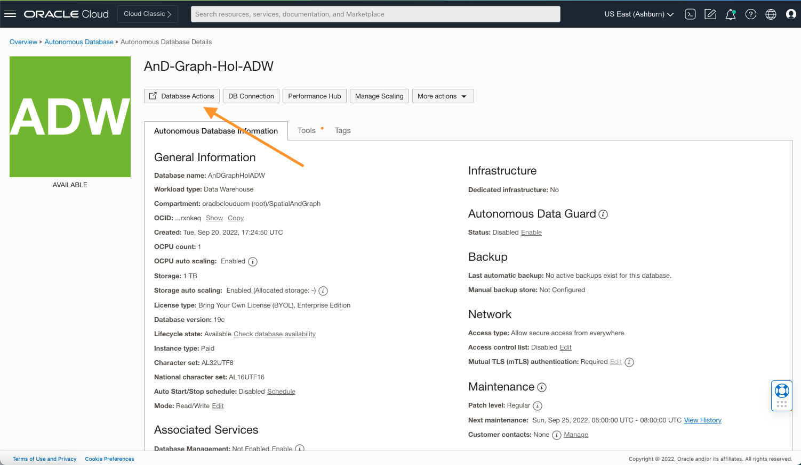
    
2.  Par défaut, vous serez connecté en tant qu'administrateur. Déconnectez-vous, puis reconnectez-vous en tant qu'utilisateur de graphique.
    

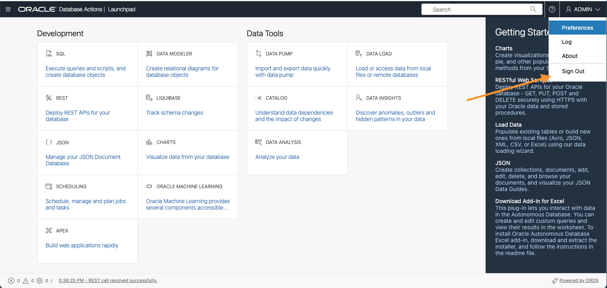 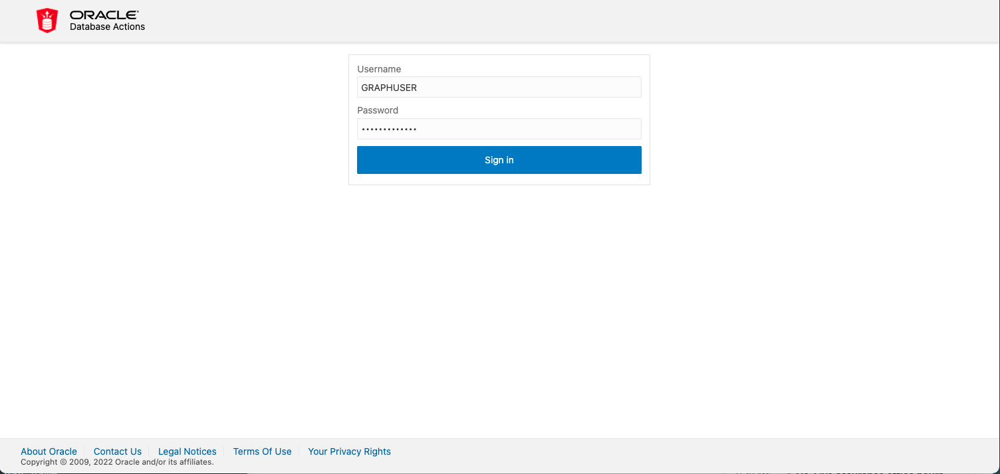

3.  Sélectionner SQL

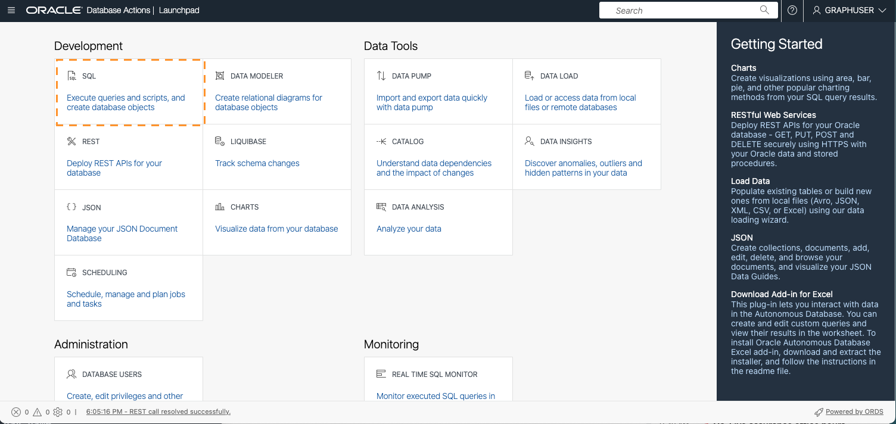

4.  Dans cet atelier, nous utilisons l'exemple de schéma Sales History (SH) pour créer notre graphique de démonstration. Le schéma SH est disponible dans toutes les instances Autonomous Database. Créez des vues pour CUSTOMERS, TIMES, CHANNELS, PRODUCTS et PROMOTIONS à partir des tables SH, en utilisant uniquement un sous-ensemble des colonnes de ces tables.

    <copy>
    CREATE OR REPLACE VIEW SH_CUSTOMERS_VIEW (CUST_ID, CUST_FIRST_NAME, CUST_LAST_NAME, CUST_EMAIL, CUST_GENDER, CUST_CITY, CUST_STATE_PROVINCE, COUNTRY_ID)
    	DEFAULT COLLATION "USING_NLS_COMP"  AS
    	select cust_id, cust_first_name, cust_last_name, cust_email, cust_gender, cust_city, cust_state_province, country_id from sh.customers;
    
    CREATE OR REPLACE  VIEW SH_CHANNELS_VIEW (CHANNEL_ID, CHANNEL_DESC, CHANNEL_CLASS) DEFAULT COLLATION "USING_NLS_COMP"  AS
    	select channel_id, channel_desc, channel_class from sh.channels ;
    
    CREATE OR REPLACE VIEW SH_TIMES_VIEW (ID, TIME_ID, DAY_NAME, DAY_NUMBER_IN_MONTH, CALENDAR_MONTH_NUMBER,  CALENDAR_YEAR)
    	DEFAULT COLLATION "USING_NLS_COMP"  AS select rownum id, time_id, day_name, day_number_in_month, calendar_month_number, calendar_year from sh.times ;
    
    CREATE OR REPLACE VIEW SH_PRODUCTS_VIEW (PROD_ID, PROD_NAME, PROD_DESC, PROD_CATEGORY, PROD_STATUS)
    	DEFAULT COLLATION "USING_NLS_COMP"  AS select cast(prod_id as number) as prod_id, prod_name, prod_desc, prod_category, prod_status from sh.products;
    
    CREATE OR REPLACE VIEW SH_PROMOTIONS_VIEW (PROMO_ID, PROMO_NAME, PROMO_SUBCATEGORY, PROMO_CATEGORY, PROMO_COST)
    	DEFAULT COLLATION "USING_NLS_COMP"  AS select cast(promo_id as number) promo_id, promo_name, promo_subcategory, promo_category, promo_cost from sh.promotions;
    
    CREATE OR REPLACE VIEW SH_SALES_VIEW (SALE_ID, CUST_ID, PROD_ID, PROMO_ID, DATE_OF_SALE_ID, CHANNEL_ID, AMOUNT_SOLD, QUANTITY_SOLD)
    	DEFAULT COLLATION "USING_NLS_COMP" AS
    	select rownum sale_id, s.cust_id, s.prod_id, s.promo_id, tv.id as date_of_sale_id, s.channel_id, s.amount_sold, s.quantity_sold from sh.sales s, sh_times_view tv where s.time_id = tv.time_id
    </copy>
    

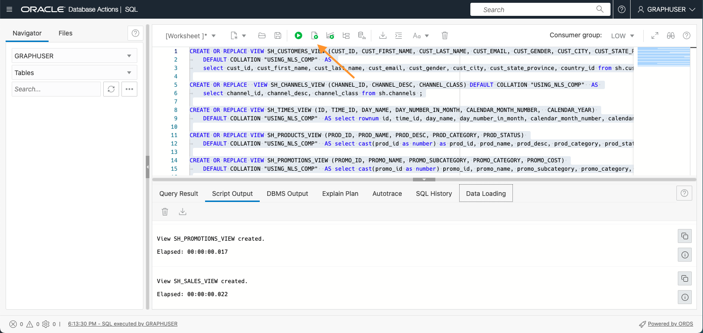

5.  Ajouter les clés primaires pertinentes aux vues

    <copy>
    ALTER VIEW SH_CUSTOMERS_VIEW ADD CONSTRAINT SH_CUSTOMER_VIEW_PK PRIMARY KEY (CUST_ID) DISABLE ;
    
    ALTER VIEW SH_CHANNELS_VIEW ADD CONSTRAINT SH_CHANNEL_VIEW_PK PRIMARY KEY (CHANNEL_ID) DISABLE ;
    
    ALTER VIEW SH_TIMES_VIEW ADD CONSTRAINT SH_TIMES_VIEW_PK PRIMARY KEY (ID) DISABLE ;
    
    ALTER VIEW SH_PRODUCTS_VIEW ADD CONSTRAINT SH_PRODUCT_VIEW_PK PRIMARY KEY (PROD_ID) DISABLE;
    
    ALTER VIEW SH_PROMOTIONS_VIEW ADD CONSTRAINT SH_PROMO_VIEW_PK PRIMARY KEY (PROMO_ID) DISABLE;
    
    ALTER VIEW SH_SALES_VIEW ADD CONSTRAINT SH_SALES_VIEW_PK PRIMARY KEY (SALE_ID) DISABLE;
    </copy>
    

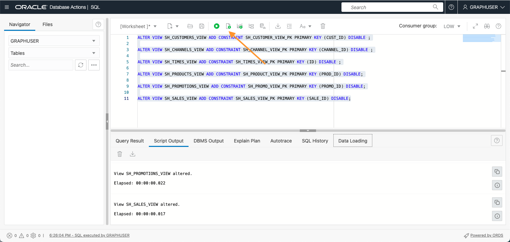

6.  Ajouter les clés étrangères pertinentes pour la vue Ventes

    <copy>
    ALTER VIEW SH_SALES_VIEW ADD CONSTRAINT SH_SALES_PROMO_VIEW_FK FOREIGN KEY (PROMO_ID) REFERENCES SH_PROMOTIONS_VIEW (PROMO_ID) DISABLE;
    
    ALTER VIEW SH_SALES_VIEW ADD CONSTRAINT SH_SALES_PRODUCT_VIEW_FK FOREIGN KEY (PROD_ID) REFERENCES SH_PRODUCTS_VIEW (PROD_ID) DISABLE;
    
    ALTER VIEW SH_SALES_VIEW ADD CONSTRAINT SH_SALES_CUST_VIEW_FK FOREIGN KEY (CUST_ID) REFERENCES SH_CUSTOMERS_VIEW (CUST_ID) DISABLE ;
    
    ALTER VIEW SH_SALES_VIEW ADD CONSTRAINT SH_SALES_CHANNEL_VIEW_FK FOREIGN KEY (CHANNEL_ID) REFERENCES SH_CHANNELS_VIEW (CHANNEL_ID) DISABLE ;
    
    ALTER VIEW SH_SALES_VIEW ADD CONSTRAINT SH_SALES_TIMES_VIEW_FK FOREIGN KEY (DATE_OF_SALE_ID) REFERENCES SH_TIMES_VIEW (ID) DISABLE ;
    </copy>
    

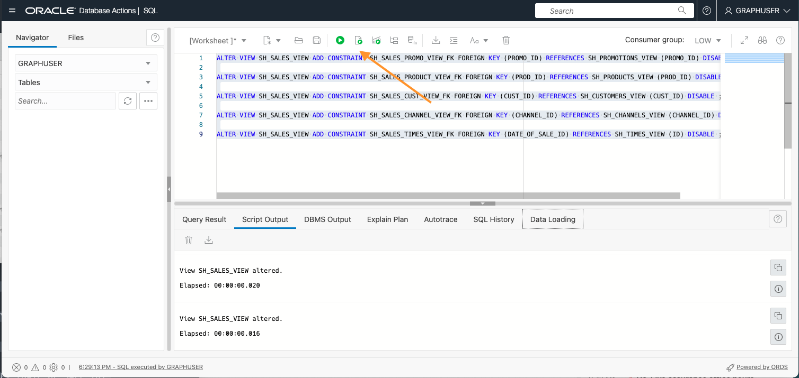

7.  Maintenant que vous avez créé les vues nécessaires, vous pouvez créer un graphique dans Graph Studio. Revenez donc à la page Autonomous Database Details (Détails sur la base de données autonome) dans OCI, sélectionnez Tools (Outils), puis Open Graph Studio (Ouvrir Graph Studio).

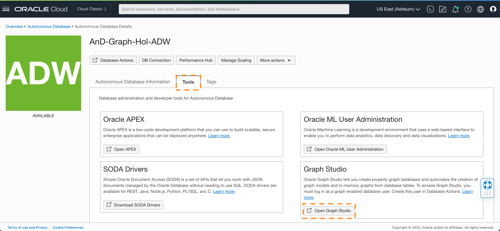

8.  Connectez-vous à Graph Studio avec votre utilisateur Graph

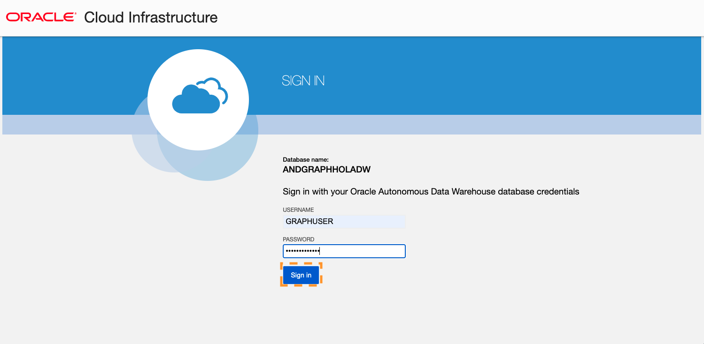

## Tâche 2 : sélectionner les tables à partir desquelles créer le graphique

1.  La capture d'écran suivante présente l'interface utilisateur de Graph Studio avec les icônes de menu ou de navigation sur la gauche. Ils accèdent respectivement aux pages Accueil, Modèles, Graphiques, Blocs-notes et Travaux.
    
    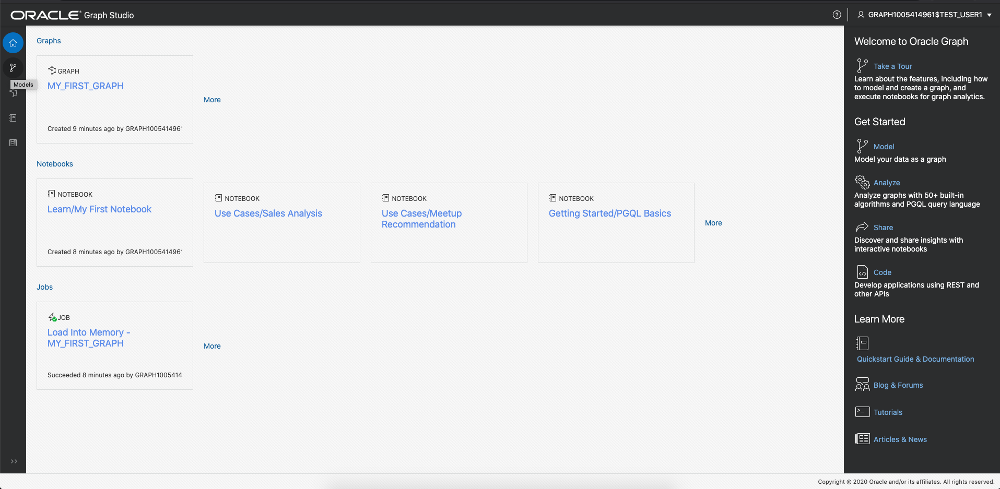
    
2.  Cliquez sur l'icône de menu **Graphes** et cliquez sur Créer.
    
    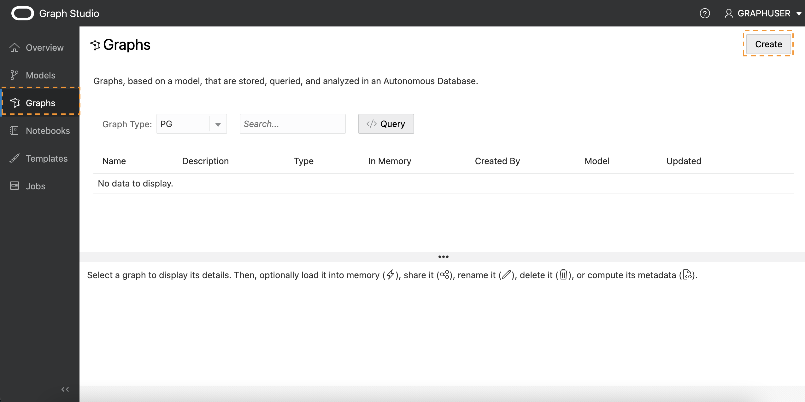
    
    Dans cet exercice, nous utilisons les vues créées à partir de l'exemple de schéma Sales History (SH) pour créer notre graphique de démonstration. Le schéma SH est disponible dans toutes les instances Autonomous Database. Vous pouvez toutefois appliquer les étapes de cet exercice à toutes les données relationnelles disponibles dans votre base de données, quelle que soit leur origine. Tous les schémas et toutes les tables (y compris les vues) auxquels vous avez accès apparaîtront en tant que tables d'entrée possibles au début du workflow de modélisation.
    
3.  Ouvrez le schéma **GRAPHUSER** et cliquez deux fois sur la table **SH\_PRODUCTS\_VIEW**.
    
    Vous voyez des détails sur cette table, comme toutes les colonnes dont elle dispose et leur type, ainsi que la colonne qui est la clé primaire :
    
    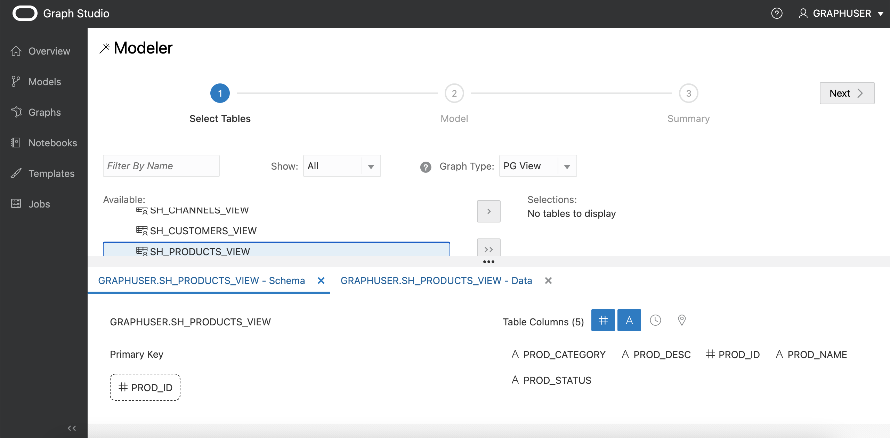
    
4.  En bas à gauche, cliquez sur l'onglet **GRAPHUSER.SH\_PRODUCTS\_VIEW - Data**.
    
    Un aperçu des valeurs de cette table s'affiche. Par défaut, elle affiche les dix premières lignes, mais vous pouvez augmenter la taille de l'échantillon. Vous pouvez également rechercher n'importe quelle valeur dans cette table et paginer dans l'aperçu.
    
5.  Pour cet exercice, nous choisissons toutes les vues que nous avons créées précédemment comme entrées pour notre modèle de graphique. Si l'utilisateur Graph ne contient que ces vues, vous pouvez sélectionner _GRAPHUSER_, puis cliquer sur le bouton situé au milieu pour déplacer toutes les vues vers la section sélectionnée à droite. Sinon, sélectionnez les vues appropriées, puis cliquez sur le bouton au milieu pour déplacer toutes les vues vers la section sélectionnée à droite.
    
    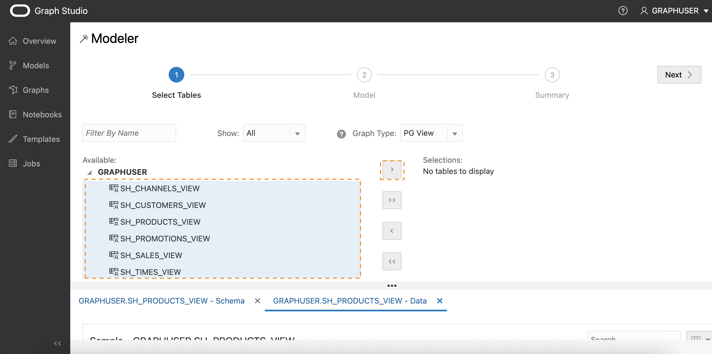
    
6.  Cliquez sur le bouton **Suivant** en haut à droite pour passer à l'étape suivante. Graph Studio analyse les contraintes de clé étrangère et suggère un mapping possible entre les vues sélectionnées et une structure de graphique de propriétés. Cela peut prendre quelques secondes. Une fois que vous avez terminé, vous voyez toutes les entrées que vous avez sélectionnées à gauche et le mappage aux tables de sommets et de bords à droite.
    
    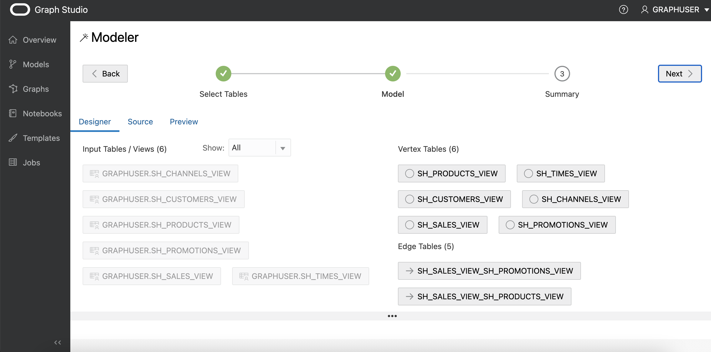
    
    Ce modèle peut être modifié si nécessaire.
    

## Tâche 3 : modifier le modèle de graphique

1.  Cliquez sur la table de sommets **SH\_CHANNELS\_VIEW**.
    
    Le modélisateur de graphiques automatique suggère de convertir chaque ligne de l'entrée _SH\_CHANNELS\_VIEW_ en sommet dans le graphique de propriétés cible. Dans le modèle de graphe de propriétés, les sommets et les arêtes peuvent avoir une _étiquette_ pour les classer en différents types de sommets et d'arêtes. Chaque libellé peut être associé à un ensemble de propriétés différent. Le modélisateur de graphiques définit automatiquement le libellé sur le nom de la table d'entrée. De cette façon, nous pourrons facilement identifier plus tard le type de chaque sommet ou arête de notre graphique généré. En outre, nous voyons que chaque _colonne_ de la table d'entrée a été convertie en _propriété_ dans notre modèle de graphique. Dans le modèle de graphe de propriétés, les propriétés sont des paires clé/valeur arbitraires associées à chaque sommet ou arête de notre graphe. En mappant toutes les valeurs de colonne dans des propriétés, nous veillons à ce que toutes les données d'entrée soient conservées dans notre graphique.
    
    Toutefois, le modélisateur de graphiques vous permet de personnaliser la manière dont les données sont mappées et d'enlever les tables et/ou colonnes inutiles qui ne sont pas pertinentes pour votre analyse. La réduction de la quantité de données à traiter réduira la quantité de ressources de traitement et de stockage nécessaires à l'analyse graphique. Nous avons enlevé les colonnes inutiles lors de la création des vues pour ce graphique. Il n'y a donc rien à enlever dans cette instance.
    
2.  Renommez l'étiquette de sommet en **CHANNELS** :
    
    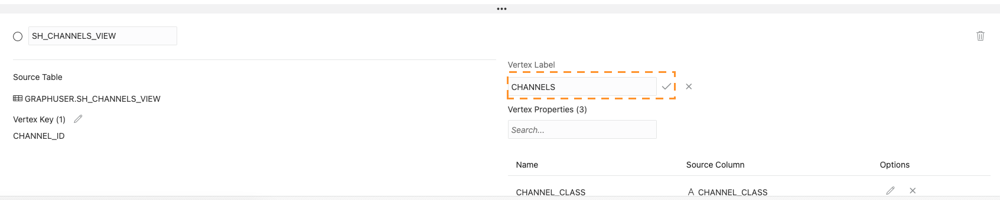
    
3.  Répétez cette opération pour toutes les autres tables de sommets :
    
    | Nom de la vue actuelle | Libellé de sommet renommé |
    | --- | --- |
    | SH\_SALES\_VIEW | VENTES |
    | SH\_CUSTOMERS\_VIEW | CLIENTS |
    | SH\_TIMES\_VIEW | TEMPS |
    | SH\_PROMOTIONS\_VIEW | PROMOTIONS |
    | SH\_PRODUCTS\_VIEW | PRODUITS |
    
4.  Cliquez sur le tableau d'arêtes **SH\_SALES\_VIEW\_SH\_CUSTOMERS\_VIEW**.
    
    Comme vous pouvez le voir dans les informations **Sommet source** et **Sommet de destination**, ce type d'arête met en correspondance toutes les relations de **SH\_SALES\_VIEW** avec **SH\_CUSTOMERS\_VIEW**. En d'autres termes, il modélise les relations **achetées par**. Par défaut, le modélisateur a attribué à ce type d'arête l'étiquette **SH\_SALES\_VIEW\_SH\_CUSTOMERS\_VIEW**.
    
    **Remarque :** si le tableau d'arêtes n'est pas visible, vous pouvez modifier la taille du volet supérieur. Utilisez le séparateur (ligne horizontale avec trois points `...` séparant les deux volets) pour augmenter sa taille. Cliquez sur le séparateur et faites-le glisser vers le bas ou vers le haut.
    
5.  Renommez l'étiquette d'arête **TO\_CUSTOMER** :
    
    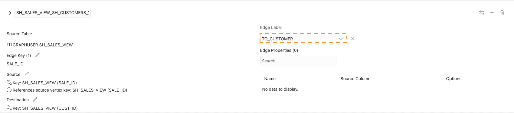
    
6.  Répétez l'opération pour tous les autres tableaux d'arêtes :
    

| Nom d'arête actuel | Libellé de bord renommé |
| --- | --- |
| SH\_SALES\_VIEW\_SH\_TIMES\_VIEW | DATE\_OF\_SALE |
| SH\_SALES\_VIEW\_SH\_PROMOTIONS\_VIEW | USING\_PROMOTION |
| SH\_SALES\_VIEW\_SH\_PRODUCTS\_VIEW | PRODUCT\_SOLD |
| SH\_SALES\_VIEW\_SH\_CHANNELS\_VIEW | VIA\_CHANNEL |

7.  Cliquez sur l'onglet **Source** en haut à gauche.
    
    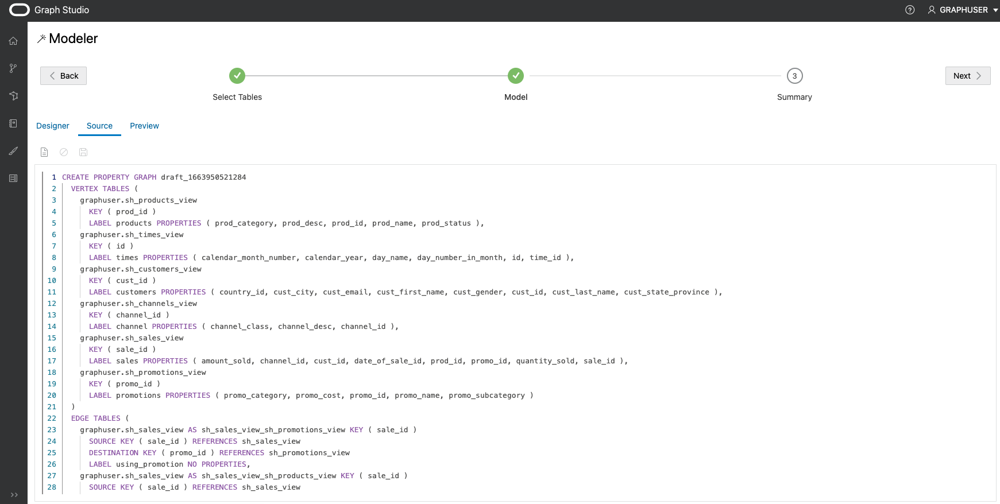
    
    Vous voyez le code source de ce modèle. Le code source est écrit en syntaxe LDD (Data Definition Language) PGQL. Vous trouverez plus d'informations sur la langue dans la [dernière spécification PGQL](https://pgql-lang.org/spec/latest/#create-property-graph).
    
    Les utilisateurs avancés peuvent modifier le code source directement. Les modifications seront répercutées immédiatement dans la vue du concepteur et vice versa.
    
8.  Cliquez sur l'onglet **Aperçu** en haut à gauche.
    
    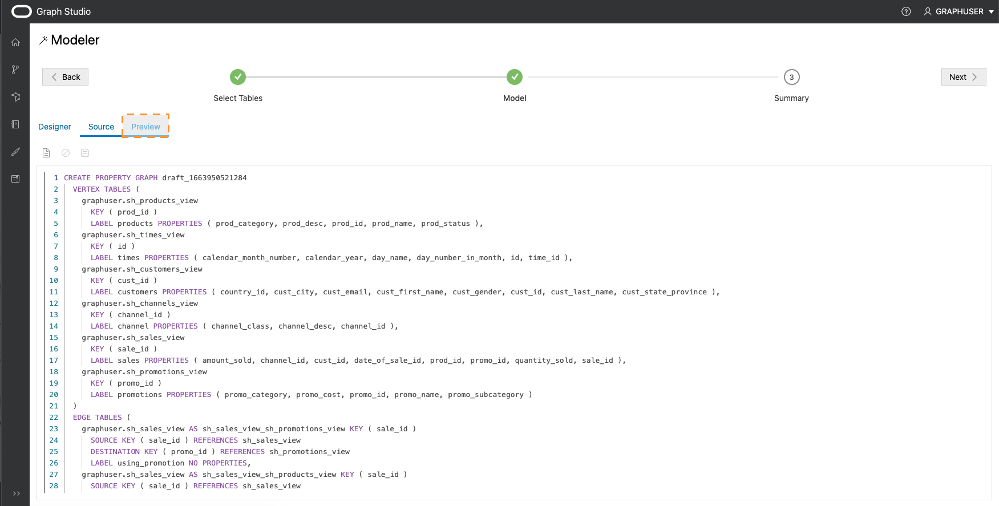
    
    Vous voyez une représentation visuelle de notre modèle graphique jusqu'à présent. Chaque cercle du graphique représente un type de sommet (libellé). Et la relation d'arête dans le graphique représente un type d'arête (étiquette) entre les cercles. Vous pouvez réorganiser le graphique en cliquant sur des éléments et en les faisant glisser. Vous pouvez également cliquer avec le bouton droit de la souris sur chaque élément pour afficher la liste des propriétés qu'il contiendra.
    
    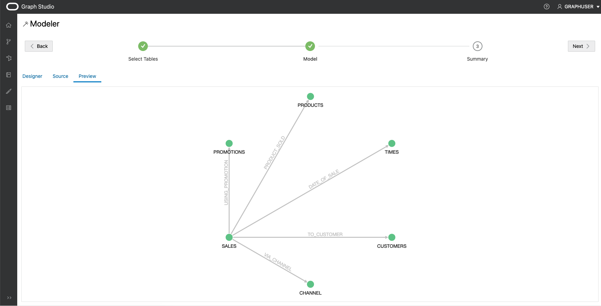
    
9.  Cliquez sur **Suivant** en haut à droite.
    
    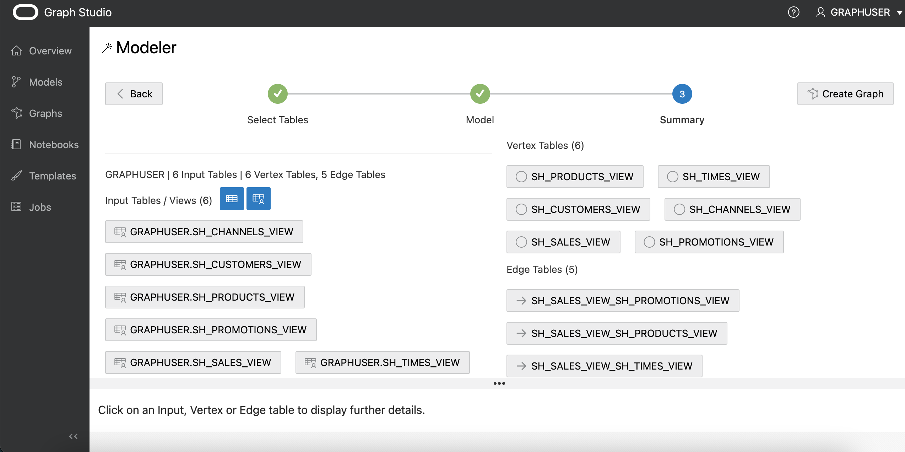
    
    Vous voyez un résumé du modèle que nous avons créé. Toutes les tables d'entrée et comment les mettre en correspondance avec un graphique de propriétés.
    

## Tâche 4 : démarrer le travail de création de graphique

1.  Cliquez sur **Créer un graphique** en haut à droite.
    
2.  Entrez **SH\_PGVIEW\_GRAPH** en tant que nom de graphique, **SH\_MODEL** en tant que nom de modèle, et éventuellement donnez au graphique une description et des balises pour l'identifier plus facilement ultérieurement. Laissez l'option **Load into memory** cochée. Cliquez ensuite sur **Créer**.
    
    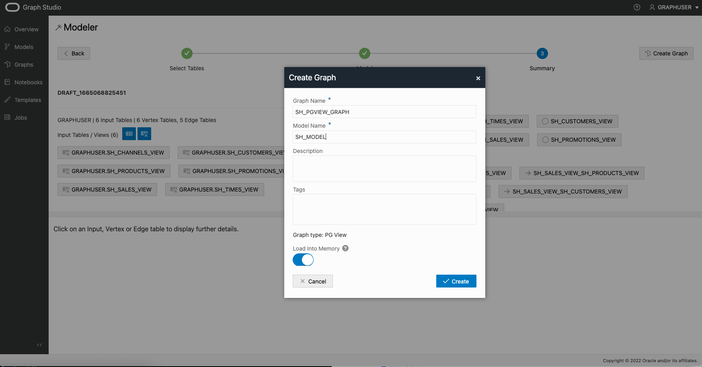
    
    Vous êtes redirigé vers la page des travaux sur laquelle apparaît le travail de création de graphique.
    
    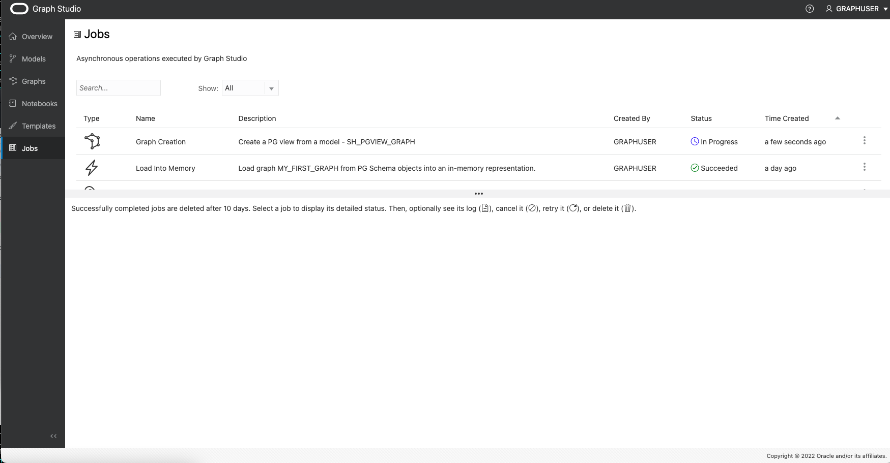
    
3.  Cliquez sur le travail en cours d'exécution. Dans la section des détails, cliquez sur l'icône **Journaux** en haut à droite.
    
    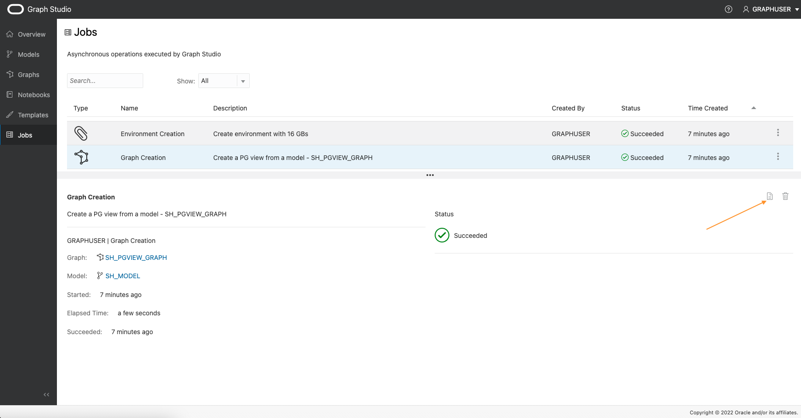
    
    Cela permet de dialoguer avec le journal.
    
    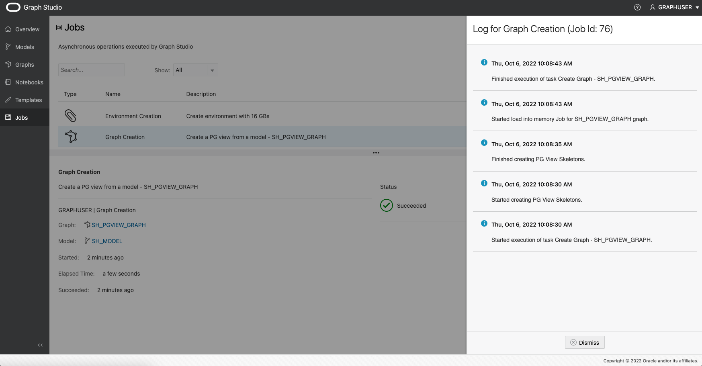
    
    Vous pouvez laisser la boîte de dialogue des journaux résultants ouverte pour surveiller la progression de la création du graphique. Graph Studio actualise automatiquement les journaux toutes les quelques secondes. Le travail de création de graphique doit aboutir au bout de quelques minutes. Une fois terminé, un autre travail **Charger dans la mémoire** est démarré automatiquement.
    
    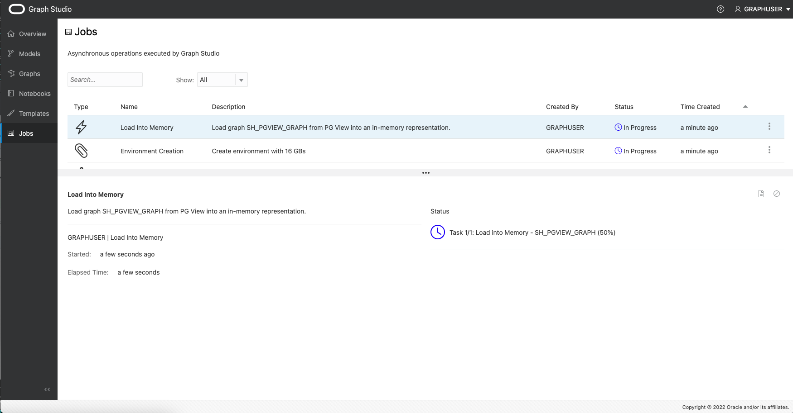
    
4.  Attendez que les deux travaux se terminent avec succès.
    

## Tâche 5 : Examiner le graphique et le modèle créés

1.  Cliquez sur l'icône de menu **Graphiques**.
    
2.  Cliquez sur le graphique **SH\_PGVIEW\_GRAPH** que nous venons de créer.
    
    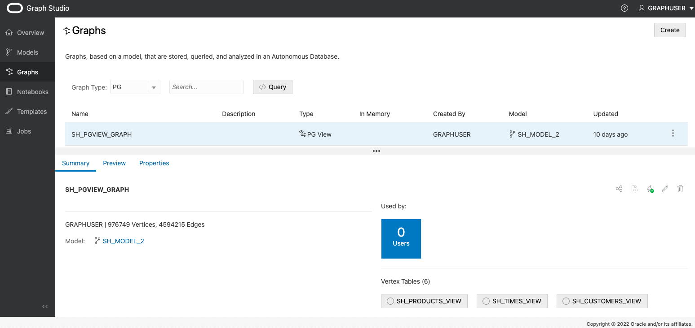
    
    Vous pouvez afficher un aperçu du graphique, modifier son nom ou ses métadonnées, le partager avec d'autres utilisateurs, le charger en mémoire ou le supprimer.
    
3.  Cliquez sur l'option de menu **Models**.
    
4.  Cliquez sur le **modèle SH** que nous venons de créer :
    
    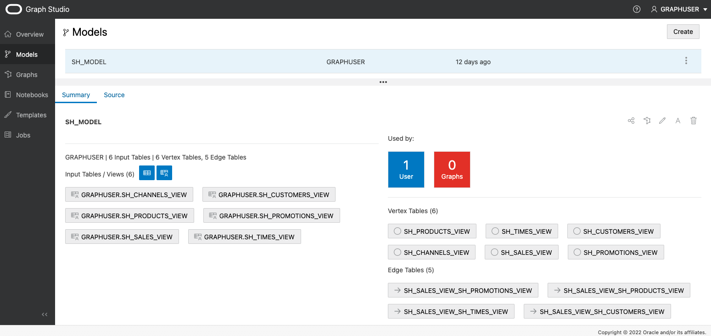
    
    Tout comme le graphique, le modèle est également stocké. Vous pouvez voir le code source de ce modèle, le partager avec d'autres personnes, modifier ses métadonnées ou le supprimer. Vous pouvez également lancer un autre travail de création de graphique à partir du même modèle.
    

Félicitations ! Vous avez converti avec succès des tables relationnelles en graphe de propriétés. Vous pouvez maintenant aller de l'avant et analyser les relations dans ces données à l'aide de requêtes et d'algorithmes graphiques puissants.

Vous pouvez maintenant **passer à l'exercice suivant**.

## Accusés de réception

*   **Auteur** - Korbi Schmid, Développement de produits
*   **Contributeurs** - Jayant Sharma, Rahul Tasker, Gestion de produits
*   **Dernière mise à jour par/date** - Jayant Sharma, juin 2023