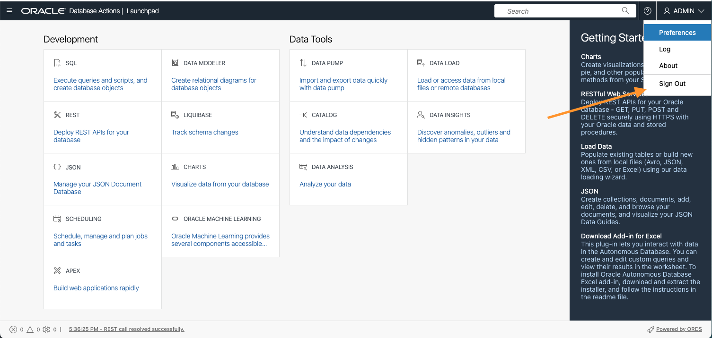
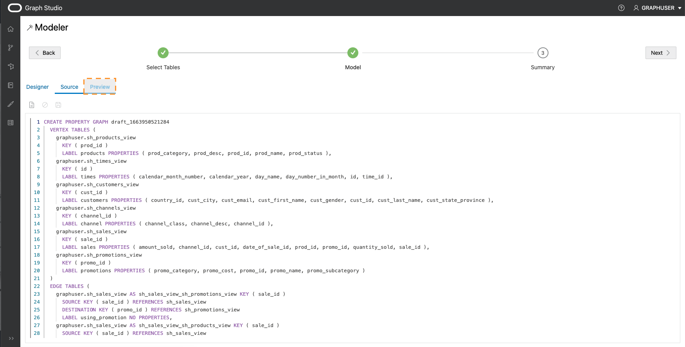
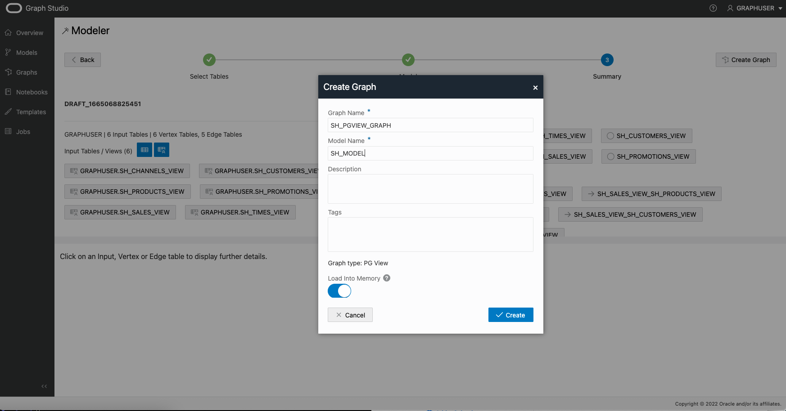

# Graph Studioを使用した既存のリレーショナル・データからのグラフの作成

## 概要

このラボでは、Graph Studioの詳細を確認し、Autonomous Data Warehouse - 共有インフラストラクチャ(ADW)またはAutonomous Transaction Processing - 共有インフラストラクチャ(ATP)インスタンスに格納されている既存のリレーショナル・データからグラフを作成する方法について学習します。

見積時間: 30分。

### 目標

*   Sales History (SH)サンプル・データ・セットからグラフをモデル化する方法を学習します
*   グラフ作成ジョブをモニターする方法を学習します
*   作成されたグラフおよびグラフ・モデルの検査方法

### 前提条件

*   次のラボでは、Autonomous Data Warehouse - Shared InfrastructureまたはAutonomous Transaction Processing - Shared Infrastructureアカウントが必要です。
*   ここでは、データベース・インスタンスのGraph Studioインタフェースへのアクセス方法を説明し、いくつかの基本的な概念を説明する最初の演習を完了していることを前提としています。

## タスク1: 必要なビューの作成

1.  OCIのAutonomous Databaseの詳細ページで、「データベース・アクション」を選択します
    
    
    
2.  デフォルトでは、管理ユーザーとしてログインします。サインアウトし、グラフ・ユーザーとして再度サインインします。
    

 

3.  SQLの選択

4.  この演習では、Sales History (SH)サンプル・スキーマを使用してデモ・グラフを作成します。SHスキーマは、すべてのAutonomous Databaseインスタンスで使用できます。これらの表の列のサブセットのみを使用して、SH表からCUSTOMERS、TIMES、CHANNELS、PRODUCTSおよびPROMOTIONSのビューを作成します。

    <copy>
    CREATE OR REPLACE VIEW SH_CUSTOMERS_VIEW (CUST_ID, CUST_FIRST_NAME, CUST_LAST_NAME, CUST_EMAIL, CUST_GENDER, CUST_CITY, CUST_STATE_PROVINCE, COUNTRY_ID)
    	DEFAULT COLLATION "USING_NLS_COMP"  AS
    	select cust_id, cust_first_name, cust_last_name, cust_email, cust_gender, cust_city, cust_state_province, country_id from sh.customers;
    
    CREATE OR REPLACE  VIEW SH_CHANNELS_VIEW (CHANNEL_ID, CHANNEL_DESC, CHANNEL_CLASS) DEFAULT COLLATION "USING_NLS_COMP"  AS
    	select channel_id, channel_desc, channel_class from sh.channels ;
    
    CREATE OR REPLACE VIEW SH_TIMES_VIEW (ID, TIME_ID, DAY_NAME, DAY_NUMBER_IN_MONTH, CALENDAR_MONTH_NUMBER,  CALENDAR_YEAR)
    	DEFAULT COLLATION "USING_NLS_COMP"  AS select rownum id, time_id, day_name, day_number_in_month, calendar_month_number, calendar_year from sh.times ;
    
    CREATE OR REPLACE VIEW SH_PRODUCTS_VIEW (PROD_ID, PROD_NAME, PROD_DESC, PROD_CATEGORY, PROD_STATUS)
    	DEFAULT COLLATION "USING_NLS_COMP"  AS select cast(prod_id as number) as prod_id, prod_name, prod_desc, prod_category, prod_status from sh.products;
    
    CREATE OR REPLACE VIEW SH_PROMOTIONS_VIEW (PROMO_ID, PROMO_NAME, PROMO_SUBCATEGORY, PROMO_CATEGORY, PROMO_COST)
    	DEFAULT COLLATION "USING_NLS_COMP"  AS select cast(promo_id as number) promo_id, promo_name, promo_subcategory, promo_category, promo_cost from sh.promotions;
    
    CREATE OR REPLACE VIEW SH_SALES_VIEW (SALE_ID, CUST_ID, PROD_ID, PROMO_ID, DATE_OF_SALE_ID, CHANNEL_ID, AMOUNT_SOLD, QUANTITY_SOLD)
    	DEFAULT COLLATION "USING_NLS_COMP" AS
    	select rownum sale_id, s.cust_id, s.prod_id, s.promo_id, tv.id as date_of_sale_id, s.channel_id, s.amount_sold, s.quantity_sold from sh.sales s, sh_times_view tv where s.time_id = tv.time_id
    </copy>
    

5.  ビューへの関連主キーの追加

    <copy>
    ALTER VIEW SH_CUSTOMERS_VIEW ADD CONSTRAINT SH_CUSTOMER_VIEW_PK PRIMARY KEY (CUST_ID) DISABLE ;
    
    ALTER VIEW SH_CHANNELS_VIEW ADD CONSTRAINT SH_CHANNEL_VIEW_PK PRIMARY KEY (CHANNEL_ID) DISABLE ;
    
    ALTER VIEW SH_TIMES_VIEW ADD CONSTRAINT SH_TIMES_VIEW_PK PRIMARY KEY (ID) DISABLE ;
    
    ALTER VIEW SH_PRODUCTS_VIEW ADD CONSTRAINT SH_PRODUCT_VIEW_PK PRIMARY KEY (PROD_ID) DISABLE;
    
    ALTER VIEW SH_PROMOTIONS_VIEW ADD CONSTRAINT SH_PROMO_VIEW_PK PRIMARY KEY (PROMO_ID) DISABLE;
    
    ALTER VIEW SH_SALES_VIEW ADD CONSTRAINT SH_SALES_VIEW_PK PRIMARY KEY (SALE_ID) DISABLE;
    </copy>
    

6.  販売ビューに関連する外部キーの追加

    <copy>
    ALTER VIEW SH_SALES_VIEW ADD CONSTRAINT SH_SALES_PROMO_VIEW_FK FOREIGN KEY (PROMO_ID) REFERENCES SH_PROMOTIONS_VIEW (PROMO_ID) DISABLE;
    
    ALTER VIEW SH_SALES_VIEW ADD CONSTRAINT SH_SALES_PRODUCT_VIEW_FK FOREIGN KEY (PROD_ID) REFERENCES SH_PRODUCTS_VIEW (PROD_ID) DISABLE;
    
    ALTER VIEW SH_SALES_VIEW ADD CONSTRAINT SH_SALES_CUST_VIEW_FK FOREIGN KEY (CUST_ID) REFERENCES SH_CUSTOMERS_VIEW (CUST_ID) DISABLE ;
    
    ALTER VIEW SH_SALES_VIEW ADD CONSTRAINT SH_SALES_CHANNEL_VIEW_FK FOREIGN KEY (CHANNEL_ID) REFERENCES SH_CHANNELS_VIEW (CHANNEL_ID) DISABLE ;
    
    ALTER VIEW SH_SALES_VIEW ADD CONSTRAINT SH_SALES_TIMES_VIEW_FK FOREIGN KEY (DATE_OF_SALE_ID) REFERENCES SH_TIMES_VIEW (ID) DISABLE ;
    </copy>
    

7.  必要なビューを作成したので、Graph Studioでグラフを作成できます。そのため、OCIのAutonomous Databaseの詳細ページに戻り、ツールを選択してから「Open Graph Studio」を選択します

8.  GraphユーザーでGraph Studioにログインします。

## タスク2: グラフを作成する表の選択

1.  次のスクリーンショットは、左側にメニューまたはナビゲーション・アイコンが表示されたGraph Studioユーザー・インタフェースを示しています。「ホーム」、「モデル」、「グラフ」、「ノートブック」および「ジョブ」の各ページにそれぞれナビゲートします。
    
    
    
2.  **「グラフ」**メニュー・アイコンをクリックして、「作成」をクリックします。
    
    
    
    この演習では、Sales History (SH)サンプル・スキーマから作成されたビューを使用して、デモ・グラフを作成します。SHスキーマは、すべてのAutonomous Databaseインスタンスで使用できます。ただし、データの発生元に関係なく、この演習のステップをデータベースで使用可能なリレーショナル・データに適用できます。アクセス権を持つすべてのスキーマおよび表(ビューを含む)は、モデリング・ワークフローの開始時に可能な入力表として表示されます。
    
3.  **GRAPHUSER**スキーマを開き、**SH\_PRODUCTS\_VIEW**表をダブルクリックします。
    
    この表に関する詳細(すべての列とそのタイプ、および主キーである列など)が表示されます。
    
    
    
4.  左下にある**「GRAPHUSER.SH\_PRODUCTS\_VIEW - データ」**タブをクリックします。
    
    その表の値のプレビューが表示されます。デフォルトでは、最初の10行が表示されますが、サンプル・サイズを増やすことができます。また、その表の任意の値を検索し、プレビューでページ区切りすることもできます。
    
5.  この演習では、前に作成したすべてのビューをグラフ・モデルの入力として選択します。グラフ・ユーザーにこれらのビューのみが含まれている場合は、_「GRAPHUSER」_を選択し、中央のボタンをクリックして、すべてのビューを右側の選択したセクションに移動できます。それ以外の場合は、関連するビューを選択し、中央のボタンをクリックして、すべてのビューを右側の選択したセクションに移動します。
    
    
    
6.  右上の「**Next**」ボタンをクリックして、次のステップに移動します。Graph Studioは外部キー制約を分析し、選択したビューからプロパティ・グラフ構造へのマッピングを提案します。これには数秒かかる場合があります。完了すると、左側に選択したすべての入力と、右側に頂点およびエッジ表へのマッピングが表示されます。
    
    
    
    このモデルは、必要に応じて変更できます。
    

## タスク3: グラフ・モデルの編集

1.  **SH\_CHANNELS\_VIEW**頂点表をクリックします。
    
    自動グラフ・モデラーは、_SH\_CHANNELS\_VIEW_入力の各行をターゲット・プロパティ・グラフの頂点に変換することを提案します。プロパティ・グラフ・モデルでは、頂点とエッジに_ラベル_を設定して、それらを様々なタイプの頂点とエッジに分類できます。各ラベルには、それぞれ異なるプロパティ・セットを関連付けることができます。グラフ・モデラーは、ラベルを入力表の名前に自動的に設定します。これにより、生成されたグラフの各頂点またはエッジのタイプを簡単に識別できます。さらに、入力表の各_列_がグラフ・モデルの_プロパティ_に変換されたことがわかります。プロパティ・グラフ・モデルでは、プロパティは、グラフの各頂点またはエッジに関連付けられた任意のキー/値のペアです。すべての列値をプロパティにマッピングすることで、すべての入力データがグラフに保持されます。
    
    ただし、グラフ・モデラーを使用すると、データのマップ方法をカスタマイズし、分析に関連しない不要な表や列を削除できます。処理するデータの量を減らすと、グラフ分析に必要な処理リソースとストレージの量が削減されます。このグラフのビューの作成時に不要な列を削除したため、このインスタンスで削除するものはありません。
    
2.  頂点ラベルの名前を**CHANNELS**に変更します。
    
    
    
3.  他のすべての頂点表に対して繰り返します。
    
    | 現在のビュー名 | 名前変更済垂直ラベル |
    | --- | --- |
    | SH\_SALES\_VIEW | 販売 |
    | SH\_CUSTOMERS\_VIEW | 顧客 |
    | SH\_TIMES\_VIEW | 時間 |
    | SH\_PROMOTIONS\_VIEW | プロモーション |
    | SH\_PRODUCTS\_VIEW | 製品 |
    
4.  **SH\_SALES\_VIEW\_SH\_CUSTOMERS\_VIEW**エッジ表をクリックします。
    
    **「ソース頂点」**および**「宛先頂点」**の情報からわかるように、このエッジ・タイプは**SH\_SALES\_VIEW**から**SH\_CUSTOMERS\_VIEW**へのすべての関係をマップします。つまり、**購入者**の関係をモデル化します。デフォルトでは、モデラーはこのエッジ・タイプにラベル**SH\_SALES\_VIEW\_SH\_CUSTOMERS\_VIEW**を付与しました。
    
    **ノート**: エッジ表が表示されていない場合は、上部のペインのサイズを変更できます。スプリッタ(2つのペインを区切る3つのドット`...`を持つ水平線)を使用して、そのサイズを大きくします。スプリッタをクリックし、上下にドラッグします。
    
5.  エッジ・ラベルの名前を**TO\_CUSTOMER**に変更します。
    
    
    
6.  他のすべてのエッジ表に対して繰り返します。
    

| 現在のエッジ名 | 名前変更済エッジ・ラベル |
| --- | --- |
| SH\_SALES\_VIEW\_SH\_TIMES\_VIEW | DATE\_OF\_SALE |
| SH\_SALES\_VIEW\_SH\_PROMOTIONS\_VIEW | USING\_PROMOTION |
| SH\_SALES\_VIEW\_SH\_PRODUCTS\_VIEW | PRODUCT\_SOLD |
| SH\_SALES\_VIEW\_SH\_CHANNELS\_VIEW | VIA\_CHANNEL |

7.  左上の**「ソース」**タブをクリックします。
    
    
    
    このモデルのソース・コードが表示されます。ソース・コードはPGQLデータ定義言語(DDL)構文で記述されます。言語の詳細は、[最新のPGQL仕様](https://pgql-lang.org/spec/latest/#create-property-graph)を参照してください。
    
    上級ユーザーは、ソース・コードを直接編集できます。変更はデザイナ・ビューに即時に反映され、その逆も同様です。
    
8.  左上の**「プレビュー」**タブをクリックします。
    
    
    
    これまでのグラフ・モデルを視覚的に表現できます。グラフ内の各円は、頂点タイプ(ラベル)を表します。グラフのエッジ関係は、円間のエッジ・タイプ(ラベル)を表します。要素をクリックしてドラッグすることで、グラフを再配置できます。各要素を右クリックして、そこに含まれるプロパティのリストを表示することもできます。
    
    
    
9.  右上の**「次」**をクリックします。
    
    
    
    作成したモデルのサマリーが表示されます。すべての入力表と、これらをプロパティ・グラフにマップする方法。
    

## タスク4: グラフ作成ジョブの開始

1.  右上にある**「グラフの作成」**をクリックします。
    
2.  グラフ名として**SH\_PGVIEW\_GRAPH**、モデル名として**SH\_MODEL**を入力し、オプションでグラフに説明と、後で簡単に識別できるようにいくつかのタグを指定します。**「メモリーにロード」**オプションはチェックしたままにします。次に、**「作成」**をクリックします。
    
    
    
    グラフ作成ジョブが表示されるジョブ・ページにリダイレクトされます。
    
    
    
3.  実行中のジョブをクリックします。詳細セクションで、右上の**「ログ」**アイコンをクリックします。
    
    
    
    ログを含むダイアログが表示されます。
    
    
    
    表示されるログ・ダイアログを開いたままにして、グラフ作成の進行状況を監視できます。Graph Studioは、数秒ごとにログを自動的にリフレッシュします。グラフ作成ジョブは数分後に成功します。完了すると、別の**メモリーへのロード**・ジョブが自動的に開始されます。
    
    
    
4.  両方のジョブが正常に完了するまで待機します。
    

## タスク5: 作成されたグラフおよびモデルの調査

1.  **「グラフ」**メニュー・アイコンをクリックします。
    
2.  作成した**SH\_PGVIEW\_GRAPH**グラフをクリックします。
    
    
    
    グラフのプレビューの表示、名前やメタデータの編集、他のユーザーとの共有、メモリーへのロードまたは削除を行うことができます。
    
3.  **「モデル」**メニュー項目をクリックします。
    
4.  作成した**「SHモデル」**をクリックします。
    
    
    
    グラフと同様に、モデルも格納されます。このモデルのソース・コードの表示、他のモデルとの共有、メタ・データの編集または削除を行うことができます。同じモデルから別のグラフ作成ジョブを開始することもできます。
    

おめでとうございます!リレーショナル表をプロパティ・グラフに正常に変換しました。強力なグラフクエリとアルゴリズムを使用して、そのデータの関係を分析できるようになりました。

**次の演習に進む**ことができます。

## 確認

*   **著者** - 製品開発、Korbi Schmid
*   **貢献者** - Jayant Sharma、Rahul Tasker、製品管理
*   **最終更新者/日付** - Jayant Sharma、2023年6月