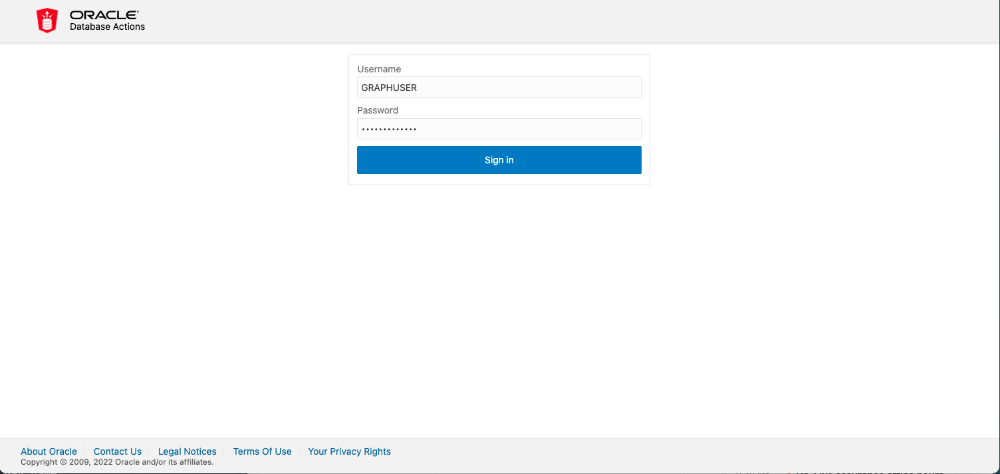
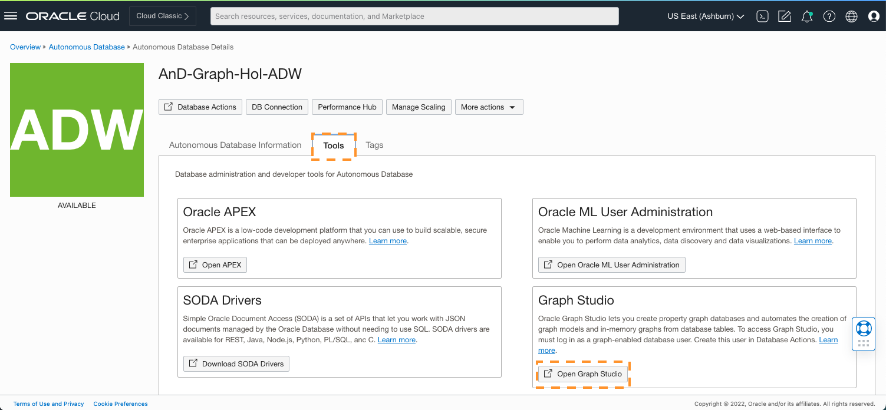
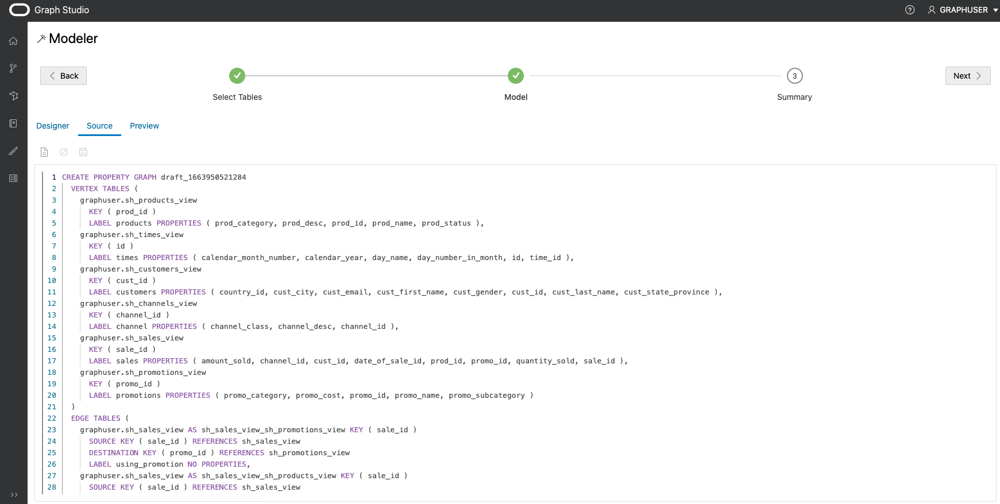
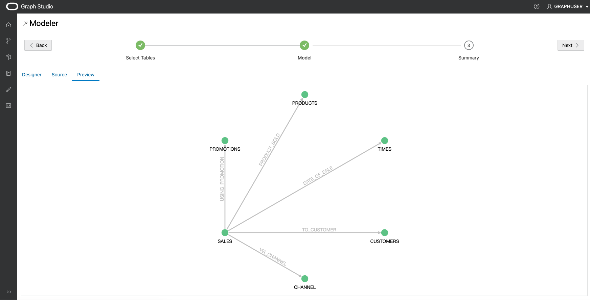
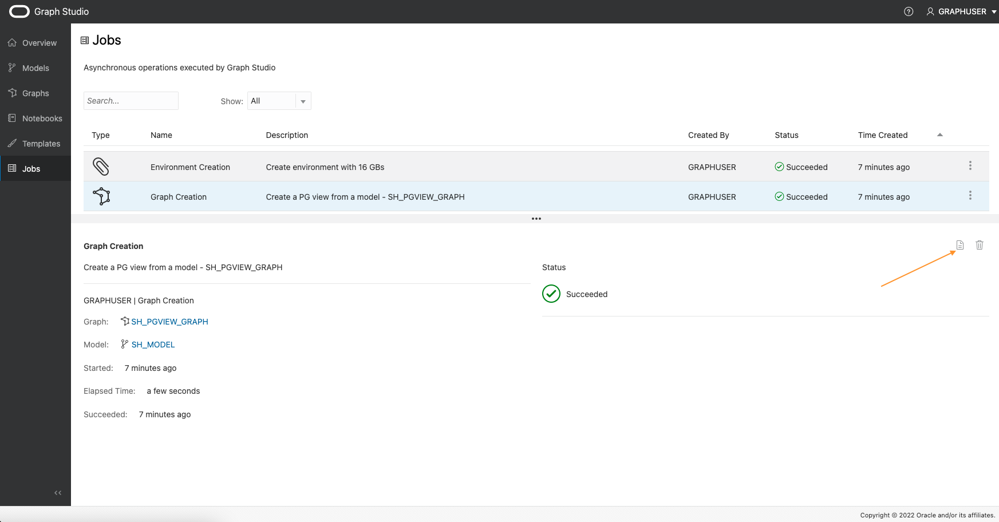

# Graph Studio를 사용하여 기존 관계형 데이터에서 그래프 생성

## 소개

이 실습에서는 Graph Studio에 대해 자세히 알아보고 Autonomous Data Warehouse - Shared Infrastructure(ADW) 또는 Autonomous Transaction Processing - Shared Infrastructure(ATP) 인스턴스에 저장된 기존 관계형 데이터에서 그래프를 생성하는 방법에 대해 알아봅니다.

예상 시간: 30분

### 목표

*   판매 내역(SH) 샘플 데이터 집합에서 그래프를 모델링하는 방법 학습
*   그래프 생성 작업을 모니터하는 방법 학습
*   생성된 그래프 및 그래프 모델을 검사하는 방법 알아보기

### 필요 조건

*   다음 실습에서는 Autonomous Data Warehouse - Shared Infrastructure 또는 Autonomous Transaction Processing - Shared Infrastructure 계정이 필요합니다.
*   여기에서는 데이터베이스 인스턴스의 Graph Studio 인터페이스에 액세스하는 방법을 설명하고 몇 가지 기본 개념을 설명하는 첫번째 실습을 완료했다고 가정합니다.

## 작업 1: 필요한 뷰 생성

1.  OCI의 Autonomous Database Details 페이지에서 Database Actions를 선택합니다.
    
    
    
2.  기본적으로 관리 사용자로 로그인됩니다. 로그아웃한 후 Graph User로 다시 사인인합니다.
    

 

3.  SQL 선택

4.  이 연습에서는 Sales History (SH) 샘플 스키마를 사용하여 데모 그래프를 생성합니다. SH 스키마는 모든 Autonomous Database 인스턴스에서 사용할 수 있습니다. SH 테이블에서 CUSTOMERS, TIMES, CHANNELS, PRODUCTS 및 PROMOTIONS에 대한 뷰를 생성하고 이 테이블의 열 부분 집합만 사용합니다.

    <copy>
    CREATE OR REPLACE VIEW SH_CUSTOMERS_VIEW (CUST_ID, CUST_FIRST_NAME, CUST_LAST_NAME, CUST_EMAIL, CUST_GENDER, CUST_CITY, CUST_STATE_PROVINCE, COUNTRY_ID)
    	DEFAULT COLLATION "USING_NLS_COMP"  AS
    	select cust_id, cust_first_name, cust_last_name, cust_email, cust_gender, cust_city, cust_state_province, country_id from sh.customers;
    
    CREATE OR REPLACE  VIEW SH_CHANNELS_VIEW (CHANNEL_ID, CHANNEL_DESC, CHANNEL_CLASS) DEFAULT COLLATION "USING_NLS_COMP"  AS
    	select channel_id, channel_desc, channel_class from sh.channels ;
    
    CREATE OR REPLACE VIEW SH_TIMES_VIEW (ID, TIME_ID, DAY_NAME, DAY_NUMBER_IN_MONTH, CALENDAR_MONTH_NUMBER,  CALENDAR_YEAR)
    	DEFAULT COLLATION "USING_NLS_COMP"  AS select rownum id, time_id, day_name, day_number_in_month, calendar_month_number, calendar_year from sh.times ;
    
    CREATE OR REPLACE VIEW SH_PRODUCTS_VIEW (PROD_ID, PROD_NAME, PROD_DESC, PROD_CATEGORY, PROD_STATUS)
    	DEFAULT COLLATION "USING_NLS_COMP"  AS select cast(prod_id as number) as prod_id, prod_name, prod_desc, prod_category, prod_status from sh.products;
    
    CREATE OR REPLACE VIEW SH_PROMOTIONS_VIEW (PROMO_ID, PROMO_NAME, PROMO_SUBCATEGORY, PROMO_CATEGORY, PROMO_COST)
    	DEFAULT COLLATION "USING_NLS_COMP"  AS select cast(promo_id as number) promo_id, promo_name, promo_subcategory, promo_category, promo_cost from sh.promotions;
    
    CREATE OR REPLACE VIEW SH_SALES_VIEW (SALE_ID, CUST_ID, PROD_ID, PROMO_ID, DATE_OF_SALE_ID, CHANNEL_ID, AMOUNT_SOLD, QUANTITY_SOLD)
    	DEFAULT COLLATION "USING_NLS_COMP" AS
    	select rownum sale_id, s.cust_id, s.prod_id, s.promo_id, tv.id as date_of_sale_id, s.channel_id, s.amount_sold, s.quantity_sold from sh.sales s, sh_times_view tv where s.time_id = tv.time_id
    </copy>
    

5.  뷰에 관련 Primary Key 추가

    <copy>
    ALTER VIEW SH_CUSTOMERS_VIEW ADD CONSTRAINT SH_CUSTOMER_VIEW_PK PRIMARY KEY (CUST_ID) DISABLE ;
    
    ALTER VIEW SH_CHANNELS_VIEW ADD CONSTRAINT SH_CHANNEL_VIEW_PK PRIMARY KEY (CHANNEL_ID) DISABLE ;
    
    ALTER VIEW SH_TIMES_VIEW ADD CONSTRAINT SH_TIMES_VIEW_PK PRIMARY KEY (ID) DISABLE ;
    
    ALTER VIEW SH_PRODUCTS_VIEW ADD CONSTRAINT SH_PRODUCT_VIEW_PK PRIMARY KEY (PROD_ID) DISABLE;
    
    ALTER VIEW SH_PROMOTIONS_VIEW ADD CONSTRAINT SH_PROMO_VIEW_PK PRIMARY KEY (PROMO_ID) DISABLE;
    
    ALTER VIEW SH_SALES_VIEW ADD CONSTRAINT SH_SALES_VIEW_PK PRIMARY KEY (SALE_ID) DISABLE;
    </copy>
    

6.  판매 뷰에 대한 관련 외래 키 추가

    <copy>
    ALTER VIEW SH_SALES_VIEW ADD CONSTRAINT SH_SALES_PROMO_VIEW_FK FOREIGN KEY (PROMO_ID) REFERENCES SH_PROMOTIONS_VIEW (PROMO_ID) DISABLE;
    
    ALTER VIEW SH_SALES_VIEW ADD CONSTRAINT SH_SALES_PRODUCT_VIEW_FK FOREIGN KEY (PROD_ID) REFERENCES SH_PRODUCTS_VIEW (PROD_ID) DISABLE;
    
    ALTER VIEW SH_SALES_VIEW ADD CONSTRAINT SH_SALES_CUST_VIEW_FK FOREIGN KEY (CUST_ID) REFERENCES SH_CUSTOMERS_VIEW (CUST_ID) DISABLE ;
    
    ALTER VIEW SH_SALES_VIEW ADD CONSTRAINT SH_SALES_CHANNEL_VIEW_FK FOREIGN KEY (CHANNEL_ID) REFERENCES SH_CHANNELS_VIEW (CHANNEL_ID) DISABLE ;
    
    ALTER VIEW SH_SALES_VIEW ADD CONSTRAINT SH_SALES_TIMES_VIEW_FK FOREIGN KEY (DATE_OF_SALE_ID) REFERENCES SH_TIMES_VIEW (ID) DISABLE ;
    </copy>
    

7.  이제 필요한 뷰를 생성했으므로 Graph Studio에서 그래프를 생성할 수 있습니다. 따라서 OCI의 Autonomous Database Details 페이지로 돌아가서 도구를 선택한 다음 "Open Graph Studio"를 선택합니다.

8.  Graph 사용자로 Graph Studio에 로그인합니다.

## 작업 2: 다음에서 그래프를 생성할 테이블 선택

1.  다음 스크린샷은 왼쪽에 있는 메뉴 또는 탐색 아이콘이 있는 Graph Studio 사용자 인터페이스를 보여줍니다. 홈, 모델, 그래프, 노트북 및 작업 페이지로 각각 이동합니다.
    
    
    
2.  **그래프** 메뉴 아이콘을 누르고 생성을 누릅니다.
    
    
    
    이 실습에서는 Sales History (SH) 샘플 스키마에서 생성된 뷰를 사용하여 데모 그래프를 생성합니다. SH 스키마는 모든 Autonomous Database 인스턴스에서 사용할 수 있습니다. 그러나 데이터의 출처와 관계없이 데이터베이스에서 사용 가능한 관계형 데이터에 이 실습의 단계를 적용할 수 있습니다. 액세스 권한이 있는 뷰를 포함한 모든 스키마 및 테이블은 모델링 워크플로우 시작 시 가능한 입력 테이블을 표시합니다.
    
3.  **GRAPHUSER** 스키마를 열고 **SH\_PRODUCTS\_VIEW** 테이블을 두 번 누릅니다.
    
    이 테이블에 대한 일부 세부 정보(예: 모든 열 및 해당 유형), Primary Key 열이 표시됩니다.
    
    
    
4.  왼쪽 하단에서 **GRAPHUSER.SH\_PRODUCTS\_VIEW - Data** 탭을 누릅니다.
    
    해당 테이블 값의 미리보기가 표시됩니다. 기본적으로 처음 10개 행이 표시되지만 샘플 크기를 늘릴 수 있습니다. 해당 테이블에서 값을 검색하고 미리보기를 통해 페이지 매김을 수행할 수도 있습니다.
    
5.  이 실습에서는 이전에 생성한 모든 뷰를 그래프 모델의 입력으로 선택합니다. 그래프 사용자에게 해당 뷰만 포함된 경우 _GRAPHUSER_를 선택한 다음 가운데 단추를 눌러 모든 뷰를 오른쪽의 선택된 섹션으로 이동할 수 있습니다. 그렇지 않으면 관련 뷰를 선택한 다음 가운데 단추를 클릭하여 모든 뷰를 오른쪽의 선택한 섹션으로 이동합니다.
    
    
    
6.  오른쪽 위에 있는 **다음** 단추를 눌러 다음 단계로 이동합니다. Graph Studio는 외래 키 제약 조건을 분석하고 선택한 뷰에서 속성 그래프 구조로의 가능한 매핑을 제안합니다. 이 작업은 몇 초 정도 걸릴 수 있습니다. 완료되면 왼쪽에서 선택한 모든 입력과 오른쪽의 정점 및 모서리 테이블에 대한 매핑이 표시됩니다.
    
    
    
    필요한 경우 이 모델을 수정할 수 있습니다.
    

## 작업 3: 그래프 모델 편집

1.  **SH\_CHANNELS\_VIEW** 정점 테이블을 누릅니다.
    
    자동 그래프 모델러는 _SH\_CHANNELS\_VIEW_ 입력의 각 행을 대상 속성 그래프의 정점으로 변환할 것을 제안합니다. 속성 그래프 모델에서 정점과 가장자리에는 _레이블_이 있어 여러 유형의 정점과 가장자리로 분류할 수 있습니다. 각 레이블에는 연관된 다른 등록 정보 세트가 있을 수 있습니다. 그래프 모델러는 입력 테이블의 이름으로 레이블을 자동으로 설정합니다. 이렇게 하면 나중에 생성된 그래프에서 각 정점 또는 가장자리의 유형을 쉽게 식별할 수 있습니다. 또한 입력 테이블의 각 _열_이 그래프 모델에서 _속성_으로 변환되었음을 알 수 있습니다. 특성 그래프 모델에서 특성은 그래프의 각 정점 또는 모서리와 연관된 임의의 키/값 쌍입니다. 모든 열 값을 속성에 매핑하면 모든 입력 데이터가 그래프에 보존됩니다.
    
    그러나 그래프 모델러를 사용하면 데이터 매핑 방법을 사용자 정의하고 불필요한 테이블 및/또는 분석과 관련이 없는 열을 제거할 수 있습니다. 처리할 데이터 양을 줄이면 그래프 분석에 필요한 처리 리소스 및 저장소의 양이 줄어듭니다. 이 그래프에 대한 뷰를 생성할 때 불필요한 열을 제거했으므로 이 인스턴스에서 제거할 항목이 없습니다.
    
2.  정점 레이블의 이름을 **CHANNELS**로 바꿉니다.
    
    
    
3.  다른 모든 정점 테이블에 대해 반복:
    
    | 현재 뷰 이름 | 이름이 바뀐 정점 레이블 |
    | --- | --- |
    | SH\_SALES\_VIEW | 영업 |
    | SH\_CUSTOMERS\_VIEW | 고객 |
    | SH\_TIMES\_VIEW | 시간 |
    | SH\_PROMOTIONS\_VIEW | 판촉 |
    | SH\_PRODUCTS\_VIEW | 제품 |
    
4.  **SH\_SALES\_VIEW\_SH\_CUSTOMERS\_VIEW** 에지 테이블을 누릅니다.
    
    **소스 정점** 및 **대상 정점** 정보에서 볼 수 있듯이 이 가장자리 유형은 **SH\_SALES\_VIEW**에서 **SH\_CUSTOMERS\_VIEW**로 모든 관계를 매핑합니다. 즉, **구매자** 관계를 모델링합니다. 기본적으로 모델러는 이 모서리 유형을 **SH\_SALES\_VIEW\_SH\_CUSTOMERS\_VIEW** 레이블로 지정했습니다.
    
    **주**: 가장자리 테이블이 표시되지 않으면 위쪽 창의 크기를 변경할 수 있습니다. 스플리터(두 창을 구분하는 점 `...` 세 개가 있는 가로선)를 사용하여 크기를 늘립니다. 분할선을 클릭하고 아래로 또는 위로 끕니다.
    
5.  모서리 레이블의 이름을 **TO\_CUSTOMER**로 바꿉니다.
    
    
    
6.  다른 모든 모서리 테이블에 대해서도 이 과정을 반복합니다.
    

| 현재 모서리 이름 | 이름이 바뀐 가장자리 레이블 |
| --- | --- |
| SH\_SALES\_VIEW\_SH\_TIMES\_VIEW | DATE\_OF\_SALE |
| SH\_SALES\_VIEW\_SH\_PROMOTIONS\_VIEW | USING\_PROMOTION |
| SH\_SALES\_VIEW\_SH\_PRODUCTS\_VIEW | PRODUCT\_SOLD |
| SH\_SALES\_VIEW\_SH\_CHANNELS\_VIEW | VIA\_CHANNEL |

7.  왼쪽 위에 있는 **소스** 탭을 누릅니다.
    
    
    
    이 모델의 소스 코드가 표시됩니다. 소스 코드는 PGQL DDL(데이터 정의어) 구문으로 작성됩니다. 언어에 대한 자세한 내용은 [최신 PGQL 사양](https://pgql-lang.org/spec/latest/#create-property-graph)에서 확인할 수 있습니다.
    
    고급 사용자는 소스 코드를 직접 편집할 수 있습니다. 변경사항은 디자이너 보기에 즉시 반영되며 그 반대의 경우도 마찬가지입니다.
    
8.  왼쪽 위에 있는 **Preview** 탭을 누릅니다.
    
    
    
    지금까지 그래프 모델의 시각적 표현을 확인할 수 있습니다. 그래프의 각 원은 정점 유형(레이블)을 나타냅니다. 그래프의 모서리 관계는 원 사이의 모서리 유형(레이블)을 나타냅니다. 요소를 누른 채 끌어서 그래프를 재배열할 수 있습니다. 각 요소를 마우스 오른쪽 단추로 눌러 포함할 속성 목록을 볼 수도 있습니다.
    
    
    
9.  오른쪽 위에서 **다음**을 누릅니다.
    
    
    
    생성한 모델의 요약이 표시됩니다. 모든 입력 테이블 및 속성 그래프에 매핑하는 방법
    

## 작업 4: 그래프 생성 작업 시작

1.  오른쪽 위에 있는 **그래프 생성**을 누릅니다.
    
2.  그래프 이름으로 **SH\_PGVIEW\_GRAPH**, 모델 이름으로 **SH\_MODEL**를 입력하고 선택적으로 그래프에 설명과 일부 태그를 제공하여 나중에 쉽게 식별할 수 있습니다. **Load into memory** 옵션을 선택한 상태로 둡니다. 그런 다음 **생성**을 누릅니다.
    
    
    
    그래프 생성 작업이 표시되는 Jobs 페이지로 재지정됩니다.
    
    
    
3.  실행 중인 작업을 누릅니다. 세부정보 섹션에서 오른쪽 위에 있는 **로그** 아이콘을 누릅니다.
    
    
    
    그러면 로그와 함께 대화상자가 나타납니다.
    
    
    
    결과 로그 대화상자를 열어 두면 그래프 생성 진행률을 모니터할 수 있습니다. Graph Studio는 몇 초마다 한 번씩 로그를 자동으로 새로고침합니다. 그래프 생성 작업은 몇 분 후에 성공해야 합니다. 완료 후 다른 **메모리로 로드** 작업이 자동으로 시작됩니다.
    
    
    
4.  두 작업이 성공적으로 완료될 때까지 기다립니다.
    

## 작업 5: 생성된 그래프 및 모델 검사

1.  **그래프** 메뉴 아이콘을 누릅니다.
    
2.  방금 만든 **SH\_PGVIEW\_GRAPH** 그래프를 누릅니다.
    
    
    
    그래프의 미리보기, 이름 또는 메타 데이터 편집, 다른 사용자와 공유, 메모리에 로드 또는 삭제를 볼 수 있습니다.
    
3.  **Models** 메뉴 항목을 누릅니다.
    
4.  방금 생성한 **SH 모델**을 누릅니다.
    
    
    
    그래프와 마찬가지로 모델도 저장됩니다. 이 모델의 소스 코드를 보고, 다른 사람과 공유하고, 메타 데이터를 편집하거나 삭제할 수 있습니다. 동일한 모델에서 다른 그래프 생성 작업을 시작할 수도 있습니다.
    

축하합니다! 관계형 테이블을 속성 그래프로 성공적으로 변환했습니다. 이제 강력한 그래프 쿼리 및 알고리즘을 사용하여 해당 데이터의 관계를 분석할 수 있습니다.

이제 **다음 실습을 진행하십시오**.

## 확인

*   **작가** - Korbi Schmid, 제품 개발
*   **공헌자** - Jayant Sharma, Rahul Tasker, 제품 관리
*   **최종 업데이트 수행자/날짜** - Jayant Sharma, 2023년 6월