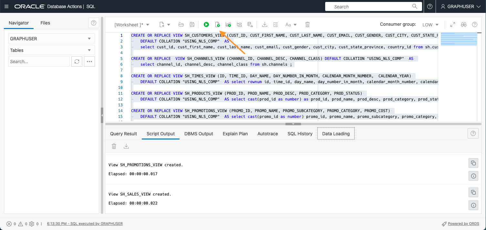
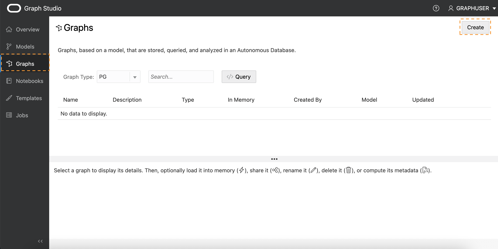
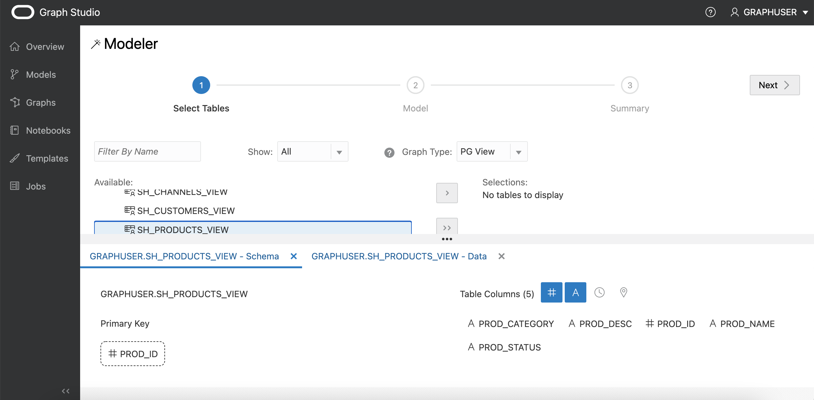
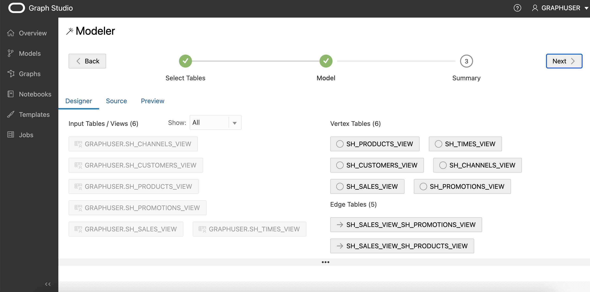
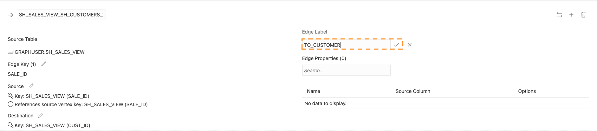
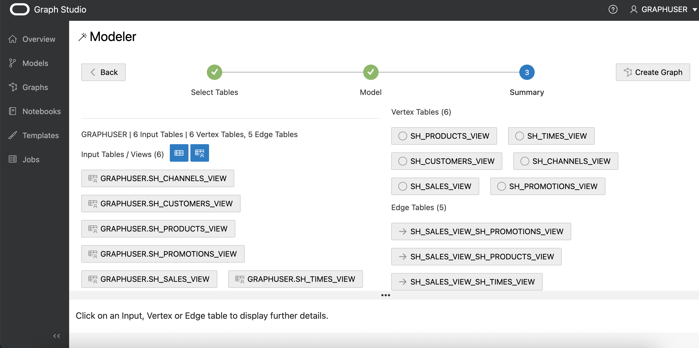

# Criar um Gráfico com Base em Dados Relacionais Existentes usando o Graph Studio

## Introdução

Neste laboratório, você explorará mais do Graph Studio e aprenderá como criar gráficos com base em dados relacionais existentes armazenados em sua instância do Autonomous Data Warehouse - Shared Infrastructure (ADW) ou do Autonomous Transaction Processing - Shared Infrastructure (ATP).

Tempo Estimado: 30 minutos.

### Objetivos

*   Aprender a modelar um gráfico com base no conjunto de dados de amostra do Histórico de Vendas (SH)
*   Saiba como monitorar um job de criação de gráfico
*   Saiba como inspecionar gráficos e modelos de gráficos criados

### Pré-requisitos

*   O laboratório a seguir requer uma conta do Autonomous Data Warehouse - Shared Infrastructure ou do Autonomous Transaction Processing - Shared Infrastructure.
*   Ele pressupõe que você tenha concluído o primeiro laboratório, que explica como acessar a interface do Graph Studio da sua instância de banco de dados e ilustra alguns conceitos básicos.

## Tarefa 1: Criar as Views Obrigatórias

1.  Na sua página Detalhes do Autonomous Database no OCI, selecione Database Actions
    
    
    
2.  Por padrão, você será conectado como usuário Admin. Saia e entre novamente como Usuário do Gráfico.
    

 

3.  Selecionar SQL

4.  Neste laboratório, usamos o esquema de amostra SH (Histórico de Vendas) para criar nosso gráfico de demonstração. O esquema SH está disponível em todas as instâncias do Autonomous Database. Crie Views para CUSTOMERS, TIMES, CHANNELS, PRODUCTS e PROMOTIONS das tabelas SH, usando apenas um subconjunto das colunas dessas tabelas.

    <copy>
    CREATE OR REPLACE VIEW SH_CUSTOMERS_VIEW (CUST_ID, CUST_FIRST_NAME, CUST_LAST_NAME, CUST_EMAIL, CUST_GENDER, CUST_CITY, CUST_STATE_PROVINCE, COUNTRY_ID)
    	DEFAULT COLLATION "USING_NLS_COMP"  AS
    	select cust_id, cust_first_name, cust_last_name, cust_email, cust_gender, cust_city, cust_state_province, country_id from sh.customers;
    
    CREATE OR REPLACE  VIEW SH_CHANNELS_VIEW (CHANNEL_ID, CHANNEL_DESC, CHANNEL_CLASS) DEFAULT COLLATION "USING_NLS_COMP"  AS
    	select channel_id, channel_desc, channel_class from sh.channels ;
    
    CREATE OR REPLACE VIEW SH_TIMES_VIEW (ID, TIME_ID, DAY_NAME, DAY_NUMBER_IN_MONTH, CALENDAR_MONTH_NUMBER,  CALENDAR_YEAR)
    	DEFAULT COLLATION "USING_NLS_COMP"  AS select rownum id, time_id, day_name, day_number_in_month, calendar_month_number, calendar_year from sh.times ;
    
    CREATE OR REPLACE VIEW SH_PRODUCTS_VIEW (PROD_ID, PROD_NAME, PROD_DESC, PROD_CATEGORY, PROD_STATUS)
    	DEFAULT COLLATION "USING_NLS_COMP"  AS select cast(prod_id as number) as prod_id, prod_name, prod_desc, prod_category, prod_status from sh.products;
    
    CREATE OR REPLACE VIEW SH_PROMOTIONS_VIEW (PROMO_ID, PROMO_NAME, PROMO_SUBCATEGORY, PROMO_CATEGORY, PROMO_COST)
    	DEFAULT COLLATION "USING_NLS_COMP"  AS select cast(promo_id as number) promo_id, promo_name, promo_subcategory, promo_category, promo_cost from sh.promotions;
    
    CREATE OR REPLACE VIEW SH_SALES_VIEW (SALE_ID, CUST_ID, PROD_ID, PROMO_ID, DATE_OF_SALE_ID, CHANNEL_ID, AMOUNT_SOLD, QUANTITY_SOLD)
    	DEFAULT COLLATION "USING_NLS_COMP" AS
    	select rownum sale_id, s.cust_id, s.prod_id, s.promo_id, tv.id as date_of_sale_id, s.channel_id, s.amount_sold, s.quantity_sold from sh.sales s, sh_times_view tv where s.time_id = tv.time_id
    </copy>
    

5.  Adicionar as Chaves Primárias relevantes às Views

    <copy>
    ALTER VIEW SH_CUSTOMERS_VIEW ADD CONSTRAINT SH_CUSTOMER_VIEW_PK PRIMARY KEY (CUST_ID) DISABLE ;
    
    ALTER VIEW SH_CHANNELS_VIEW ADD CONSTRAINT SH_CHANNEL_VIEW_PK PRIMARY KEY (CHANNEL_ID) DISABLE ;
    
    ALTER VIEW SH_TIMES_VIEW ADD CONSTRAINT SH_TIMES_VIEW_PK PRIMARY KEY (ID) DISABLE ;
    
    ALTER VIEW SH_PRODUCTS_VIEW ADD CONSTRAINT SH_PRODUCT_VIEW_PK PRIMARY KEY (PROD_ID) DISABLE;
    
    ALTER VIEW SH_PROMOTIONS_VIEW ADD CONSTRAINT SH_PROMO_VIEW_PK PRIMARY KEY (PROMO_ID) DISABLE;
    
    ALTER VIEW SH_SALES_VIEW ADD CONSTRAINT SH_SALES_VIEW_PK PRIMARY KEY (SALE_ID) DISABLE;
    </copy>
    

6.  Adicionar as Chaves Estrangeiras relevantes para a Exibição de Vendas

    <copy>
    ALTER VIEW SH_SALES_VIEW ADD CONSTRAINT SH_SALES_PROMO_VIEW_FK FOREIGN KEY (PROMO_ID) REFERENCES SH_PROMOTIONS_VIEW (PROMO_ID) DISABLE;
    
    ALTER VIEW SH_SALES_VIEW ADD CONSTRAINT SH_SALES_PRODUCT_VIEW_FK FOREIGN KEY (PROD_ID) REFERENCES SH_PRODUCTS_VIEW (PROD_ID) DISABLE;
    
    ALTER VIEW SH_SALES_VIEW ADD CONSTRAINT SH_SALES_CUST_VIEW_FK FOREIGN KEY (CUST_ID) REFERENCES SH_CUSTOMERS_VIEW (CUST_ID) DISABLE ;
    
    ALTER VIEW SH_SALES_VIEW ADD CONSTRAINT SH_SALES_CHANNEL_VIEW_FK FOREIGN KEY (CHANNEL_ID) REFERENCES SH_CHANNELS_VIEW (CHANNEL_ID) DISABLE ;
    
    ALTER VIEW SH_SALES_VIEW ADD CONSTRAINT SH_SALES_TIMES_VIEW_FK FOREIGN KEY (DATE_OF_SALE_ID) REFERENCES SH_TIMES_VIEW (ID) DISABLE ;
    </copy>
    

7.  Agora que você criou as views necessárias, poderá criar um Gráfico no Graph Studio. Portanto, navegue de volta para a página Detalhes do Autonomous Database no OCI, selecione ferramentas e, em seguida, "Abrir Graph Studio"

8.  Faça log-in no Graph Studio com seu usuário do Graph

## Tarefa 2: Selecionar as Tabelas das quais Criar o Gráfico

1.  A captura de tela a seguir mostra a interface do usuário do Graph Studio com o menu, ou ícones de navegação, à esquerda. Eles navegam até as páginas Home, Modelos, Gráficos, Notebooks e Jobs, respectivamente.
    
    
    
2.  Clique no ícone de menu **Gráficos** e clique em criar.
    
    
    
    Neste laboratório, usamos as views criadas com base no esquema de amostra SH (Histórico de Vendas) para criar nosso gráfico de demonstração. O esquema SH está disponível em todas as instâncias do Autonomous Database. No entanto, você pode aplicar as etapas deste laboratório a quaisquer dados relacionais disponíveis em seu banco de dados, independentemente de onde os dados se originaram. Todos os esquemas e tabelas - incluindo views - aos quais você tem acesso aparecerão como possíveis tabelas de entrada no início do workflow de modelagem.
    
3.  Abra o esquema **GRAPHUSER** e clique duas vezes na tabela **SH\_PRODUCTS\_VIEW**.
    
    Você verá alguns detalhes sobre essa tabela, como todas as colunas que ela tem e seus tipos, bem como qual coluna é a chave primária:
    
    
    
4.  Na parte inferior esquerda, clique na guia **GRAPHUSER.SH\_PRODUCTS\_VIEW - Dados**.
    
    Você verá uma visualização dos valores dessa tabela. Por padrão, ele exibe as dez primeiras linhas, mas você pode aumentar o tamanho da amostra. Você também pode procurar qualquer valor nessa tabela e paginar através da visualização.
    
5.  Para este laboratório, escolhemos todas as views que criamos anteriormente como entrada para nosso modelo de gráfico. Se o usuário do Gráfico contiver apenas essas exibições, você poderá selecionar _GRAPHUSER_ e clicar no botão no meio para mover todas as exibições para a seção selecionada à direita. Caso contrário, selecione as exibições relevantes e clique no botão no meio para mover todas as exibições para a seção selecionada à direita.
    
    
    
6.  Clique no botão **Próximo** no canto superior direito para passar para a próxima etapa. O Graph Studio analisa as restrições de chave estrangeira e sugere um possível mapeamento das views selecionadas para uma estrutura de gráfico de propriedade. Isso pode levar alguns segundos. Quando terminar, você verá toda a entrada selecionada à esquerda e o mapeamento para tabelas de vértice e borda à direita.
    
    
    
    Esse modelo pode ser modificado, se necessário.
    

## Tarefa 3: Editar seu Modelo de Gráfico

1.  Clique na tabela de vértices **SH\_CHANNELS\_VIEW**.
    
    O modelador de gráfico automático sugere converter cada linha da entrada _SH\_CHANNELS\_VIEW_ em um vértice no gráfico de propriedades de destino. No modelo de gráfico de propriedades, vértices e arestas podem ter um _rótulo_ para categorizá-los em diferentes tipos de vértices e arestas. Cada rótulo pode ter um conjunto diferente de propriedades associadas a ele. O modelador de gráfico define automaticamente o rótulo com o nome da tabela de entrada. Dessa forma, podemos identificar facilmente qual é o tipo de cada vértice ou borda em nosso gráfico gerado. Além disso, vemos que cada _coluna_ da tabela de entrada foi convertida em uma _propriedade_ em nosso modelo de gráfico. No modelo de gráfico de propriedades, as propriedades são pares de chave/valor arbitrários associados a cada vértice ou borda em nosso gráfico. Ao mapear todos os valores de coluna em propriedades, garantimos que todos os dados de entrada sejam preservados em nosso gráfico.
    
    No entanto, o modelador de gráfico permite personalizar como os dados são mapeados e remover tabelas e/ou colunas desnecessárias não relevantes para sua análise. A redução da quantidade de dados a serem processados reduzirá a quantidade de recursos de processamento e armazenamento necessários para a análise de gráficos. Removemos colunas desnecessárias ao criar as views para este gráfico; portanto, não há nada a ser removido nesta instância.
    
2.  Renomeie o label de vértice como **CHANNELS**:
    
    
    
3.  Repita para todas as outras tabelas de vértices:
    
    | Nome da Exibição Atual | Rótulo do Vértice Renomeado |
    | --- | --- |
    | SH\_SALES\_VIEW | VENDAS |
    | SH\_CUSTOMERS\_VIEW | CLIENTES |
    | SH\_TIMES\_VIEW | TEMPOS |
    | SH\_PROMOTIONS\_VIEW | PROMOÇÕES |
    | SH\_PRODUCTS\_VIEW | PRODUTOS |
    
4.  Clique na tabela de borda **SH\_SALES\_VIEW\_SH\_CUSTOMERS\_VIEW**.
    
    Como você pode ver nas informações **Vértice de Origem** e **Vértice de Destino**, esse tipo de borda mapeia todas as relações de **SH\_SALES\_VIEW** para **SH\_CUSTOMERS\_VIEW**. Em outras palavras, ela modela relacionamentos **comprados por**. Por padrão, o modelador deu a esse tipo de borda o label **SH\_SALES\_VIEW\_SH\_CUSTOMERS\_VIEW**.
    
    **Observação**: se a tabela de borda não estiver visível, você poderá alterar o tamanho do painel superior. Use o divisor (a linha horizontal com três pontos `...` separando os dois painéis) para aumentar seu tamanho. Clique no divisor e arraste-o para baixo ou para cima.
    
5.  Renomeie o label de borda como **TO\_CUSTOMER**:
    
    
    
6.  Repita para as outras tabelas de borda:
    

| Nome da Borda Atual | Label da Borda Renomeada |
| --- | --- |
| SH\_SALES\_VIEW\_SH\_TIMES\_VIEW | DATE\_OF\_SALE |
| SH\_SALES\_VIEW\_SH\_PROMOTIONS\_VIEW | USING\_PROMOTION |
| SH\_SALES\_VIEW\_SH\_PRODUCTS\_VIEW | PRODUCT\_SOLD |
| SH\_SALES\_VIEW\_SH\_CHANNELS\_VIEW | VIA\_CHANNEL |

7.  Clique na guia **Origem** no canto superior esquerdo.
    
    
    
    Você vê o código-fonte desse modelo. O código-fonte é gravado na sintaxe DDL (Data Definition Language) PGQL. Você pode encontrar mais informações sobre o idioma na [especificação PGQL mais recente](https://pgql-lang.org/spec/latest/#create-property-graph).
    
    Os usuários avançados podem editar o código-fonte diretamente. As alterações serão refletidas imediatamente na visualização do designer e vice-versa.
    
8.  Clique na guia **Visualizar** no canto superior esquerdo.
    
    
    
    Você vê uma representação visual do nosso modelo gráfico até agora. Cada círculo no gráfico representa um tipo de vértice (rótulo). E o relacionamento de borda no gráfico representa um tipo de borda (rótulo) entre os círculos. Você pode reorganizar o gráfico clicando e arrastando elementos. Você também pode clicar com o botão direito do mouse em cada elemento para ver a lista de propriedades que ele conterá.
    
    
    
9.  Clique em **Próximo** no canto superior direito.
    
    
    
    Você verá um resumo do modelo que criamos. Todas as tabelas de entrada e como queremos mapeá-las para um gráfico de propriedades.
    

## Tarefa 4: Iniciar o Job de Criação de Gráfico

1.  Clique em **Criar Gráfico** no canto superior direito.
    
2.  Informe **SH\_PGVIEW\_GRAPH** como nome do gráfico, **SH\_MODEL** como nome do modelo e, opcionalmente, forneça ao gráfico uma descrição e algumas tags para identificá-lo mais facilmente posteriormente. Deixe a opção **Carregar na memória** marcada. Em seguida, clique em **Criar**.
    
    
    
    Você é redirecionado para a página de jobs na qual vê seu job de criação de gráfico.
    
    
    
3.  Clique no job em execução. Na seção de detalhes, clique no ícone **Logs** no canto superior direito.
    
    
    
    Isso abre um diálogo com o log.
    
    
    
    Você pode deixar a caixa de diálogo de logs resultante aberta para monitorar o andamento da criação do gráfico. O Graph Studio atualiza automaticamente os logs a cada poucos segundos. O job de criação de gráfico deve ser bem-sucedido após alguns minutos. Após a conclusão, outro job **Carregar na memória** é iniciado automaticamente.
    
    
    
4.  Aguarde a conclusão bem-sucedida dos dois jobs.
    

## Tarefa 5: Inspecionar o Gráfico e o Modelo Criados

1.  Clique no ícone de menu **Gráficos**.
    
2.  Clique no gráfico **SH\_PGVIEW\_GRAPH** que acabamos de criar.
    
    
    
    Você pode ver uma visualização do gráfico, editar seu nome ou metadados, compartilhá-lo com outras pessoas, carregá-lo na memória ou excluí-lo.
    
3.  Clique no item de menu **Modelos**
    
4.  Clique no **Modelo SH** que acabamos de criar:
    
    
    
    Assim como o gráfico, o modelo também é armazenado. Você pode ver o código-fonte deste modelo, compartilhá-lo com outras pessoas, editar seus metadados ou excluí-lo. Você também pode iniciar outro job de criação de gráfico do mesmo modelo.
    

Parabéns! Você converteu com sucesso tabelas relacionais em um gráfico de propriedades. Agora você pode ir em frente e analisar os relacionamentos nesses dados usando consultas e algoritmos gráficos avançados.

Agora você pode **prosseguir para o próximo laboratório**.

## Agradecimentos

*   **Autor** - Korbi Schmid, Desenvolvimento de Produtos
*   **Colaboradores** - Jayant Sharma, Rahul Tasker, Gerenciamento de produtos
*   **Última Atualização em/Data** - Jayant Sharma, junho de 2023