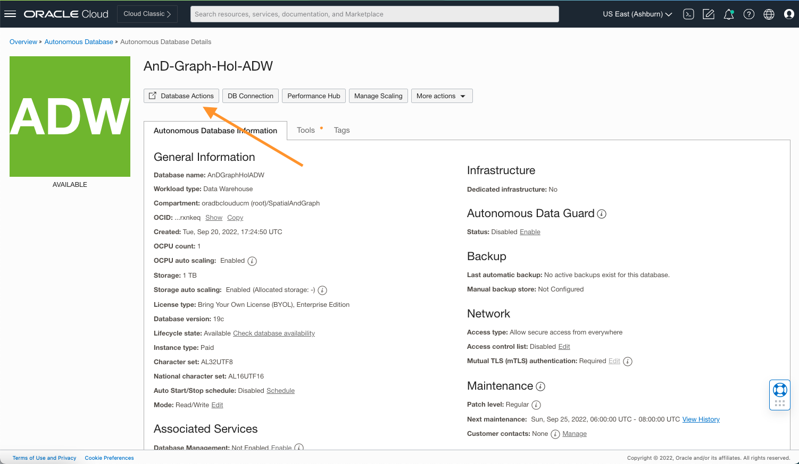
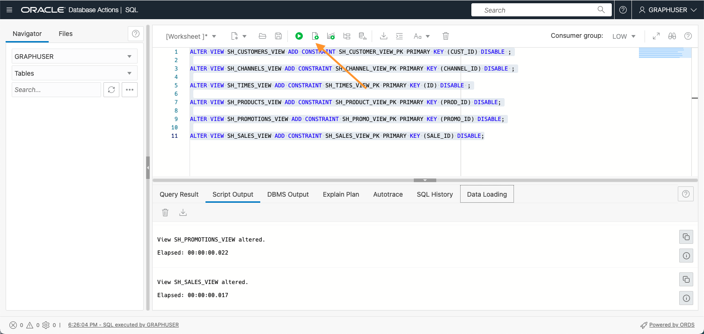
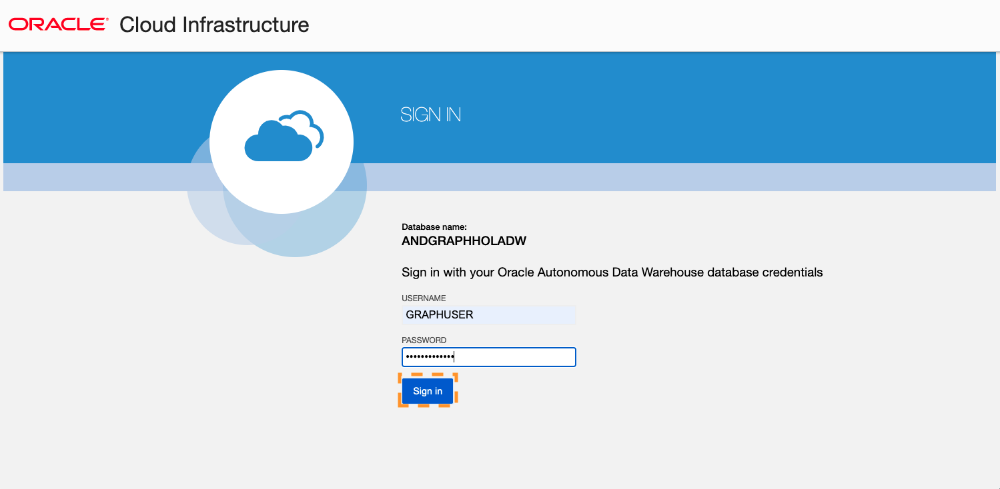
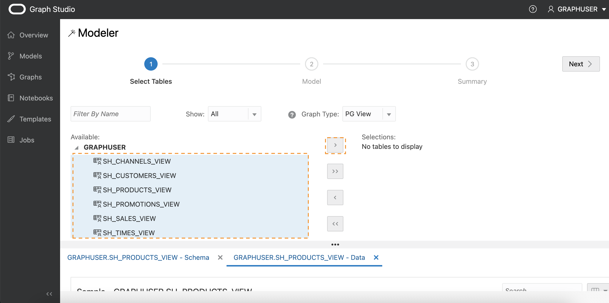
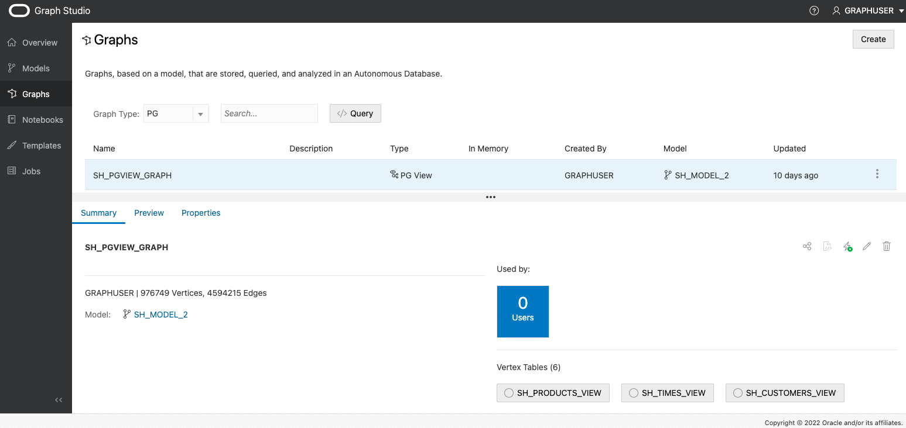

# 使用 Graph Studio 基于现有关系数据创建图形

## 简介

在此实验室中，您将了解 Graph Studio 的更多信息，并了解如何基于存储在 Autonomous Data Warehouse - Shared Infrastructure (ADW) 或 Autonomous Transaction Processing - Shared Infrastructure (ATP) 实例中的现有关系数据创建图形。

估计时间：30 分钟。

### 目标

*   了解如何从销售历史记录 (SH) 示例数据集对图形进行建模
*   了解如何监视图形创建作业
*   了解如何检查创建的图形和图形模型

### 先备条件

*   下面的练习需要一个 Autonomous Data Warehouse - Shared Infrastructure 或 Autonomous Transaction Processing - Shared Infrastructure 账户。
*   假设您已完成第一个练习，其中说明了如何访问数据库实例的 Graph Studio 界面并说明了一些基本概念。

## 任务 1：创建所需的视图

1.  从 OCI 中的 Autonomous Database 详细信息页面中，选择 Database Actions
    
    
    
2.  默认情况下，您将以 Admin 用户身份登录。注销，然后以图形用户身份重新登录。
    

 

3.  选择 SQL

4.  在此实验室中，我们使用销售历史记录 (SH) 示例方案创建演示图。SH 方案在所有 Autonomous Database 实例中都可用。从 SH 表中创建“顾客”、“时间”、“渠道”、“产品”和“促销”视图，只使用这些表中的部分列。

    <copy>
    CREATE OR REPLACE VIEW SH_CUSTOMERS_VIEW (CUST_ID, CUST_FIRST_NAME, CUST_LAST_NAME, CUST_EMAIL, CUST_GENDER, CUST_CITY, CUST_STATE_PROVINCE, COUNTRY_ID)
    	DEFAULT COLLATION "USING_NLS_COMP"  AS
    	select cust_id, cust_first_name, cust_last_name, cust_email, cust_gender, cust_city, cust_state_province, country_id from sh.customers;
    
    CREATE OR REPLACE  VIEW SH_CHANNELS_VIEW (CHANNEL_ID, CHANNEL_DESC, CHANNEL_CLASS) DEFAULT COLLATION "USING_NLS_COMP"  AS
    	select channel_id, channel_desc, channel_class from sh.channels ;
    
    CREATE OR REPLACE VIEW SH_TIMES_VIEW (ID, TIME_ID, DAY_NAME, DAY_NUMBER_IN_MONTH, CALENDAR_MONTH_NUMBER,  CALENDAR_YEAR)
    	DEFAULT COLLATION "USING_NLS_COMP"  AS select rownum id, time_id, day_name, day_number_in_month, calendar_month_number, calendar_year from sh.times ;
    
    CREATE OR REPLACE VIEW SH_PRODUCTS_VIEW (PROD_ID, PROD_NAME, PROD_DESC, PROD_CATEGORY, PROD_STATUS)
    	DEFAULT COLLATION "USING_NLS_COMP"  AS select cast(prod_id as number) as prod_id, prod_name, prod_desc, prod_category, prod_status from sh.products;
    
    CREATE OR REPLACE VIEW SH_PROMOTIONS_VIEW (PROMO_ID, PROMO_NAME, PROMO_SUBCATEGORY, PROMO_CATEGORY, PROMO_COST)
    	DEFAULT COLLATION "USING_NLS_COMP"  AS select cast(promo_id as number) promo_id, promo_name, promo_subcategory, promo_category, promo_cost from sh.promotions;
    
    CREATE OR REPLACE VIEW SH_SALES_VIEW (SALE_ID, CUST_ID, PROD_ID, PROMO_ID, DATE_OF_SALE_ID, CHANNEL_ID, AMOUNT_SOLD, QUANTITY_SOLD)
    	DEFAULT COLLATION "USING_NLS_COMP" AS
    	select rownum sale_id, s.cust_id, s.prod_id, s.promo_id, tv.id as date_of_sale_id, s.channel_id, s.amount_sold, s.quantity_sold from sh.sales s, sh_times_view tv where s.time_id = tv.time_id
    </copy>
    

5.  将相关主键添加到视图中

    <copy>
    ALTER VIEW SH_CUSTOMERS_VIEW ADD CONSTRAINT SH_CUSTOMER_VIEW_PK PRIMARY KEY (CUST_ID) DISABLE ;
    
    ALTER VIEW SH_CHANNELS_VIEW ADD CONSTRAINT SH_CHANNEL_VIEW_PK PRIMARY KEY (CHANNEL_ID) DISABLE ;
    
    ALTER VIEW SH_TIMES_VIEW ADD CONSTRAINT SH_TIMES_VIEW_PK PRIMARY KEY (ID) DISABLE ;
    
    ALTER VIEW SH_PRODUCTS_VIEW ADD CONSTRAINT SH_PRODUCT_VIEW_PK PRIMARY KEY (PROD_ID) DISABLE;
    
    ALTER VIEW SH_PROMOTIONS_VIEW ADD CONSTRAINT SH_PROMO_VIEW_PK PRIMARY KEY (PROMO_ID) DISABLE;
    
    ALTER VIEW SH_SALES_VIEW ADD CONSTRAINT SH_SALES_VIEW_PK PRIMARY KEY (SALE_ID) DISABLE;
    </copy>
    

6.  添加销售视图的相关外键

    <copy>
    ALTER VIEW SH_SALES_VIEW ADD CONSTRAINT SH_SALES_PROMO_VIEW_FK FOREIGN KEY (PROMO_ID) REFERENCES SH_PROMOTIONS_VIEW (PROMO_ID) DISABLE;
    
    ALTER VIEW SH_SALES_VIEW ADD CONSTRAINT SH_SALES_PRODUCT_VIEW_FK FOREIGN KEY (PROD_ID) REFERENCES SH_PRODUCTS_VIEW (PROD_ID) DISABLE;
    
    ALTER VIEW SH_SALES_VIEW ADD CONSTRAINT SH_SALES_CUST_VIEW_FK FOREIGN KEY (CUST_ID) REFERENCES SH_CUSTOMERS_VIEW (CUST_ID) DISABLE ;
    
    ALTER VIEW SH_SALES_VIEW ADD CONSTRAINT SH_SALES_CHANNEL_VIEW_FK FOREIGN KEY (CHANNEL_ID) REFERENCES SH_CHANNELS_VIEW (CHANNEL_ID) DISABLE ;
    
    ALTER VIEW SH_SALES_VIEW ADD CONSTRAINT SH_SALES_TIMES_VIEW_FK FOREIGN KEY (DATE_OF_SALE_ID) REFERENCES SH_TIMES_VIEW (ID) DISABLE ;
    </copy>
    

7.  现在已创建了必要的视图，您可以在 Graph Studio 中创建图形。因此，请导航回 OCI 中的 Autonomous Database 详细信息页面，选择工具，然后选择“Open Graph Studio”

8.  使用您的 Graph 用户登录到 Graph Studio

## 任务 2：选择要从中创建图形的表

1.  以下屏幕截图显示了具有菜单或导航图标的 Graph Studio 用户界面。它们分别导航到 "Home"（主页）、"Models"（模型）、"Graphs"（图形）、"Notebooks"（记事本）和 "Jobs"（作业）页面。
    
    
    
2.  单击**图形**菜单图标，然后单击“创建”。
    
    
    
    在此实验室中，我们使用从销售历史记录 (SH) 示例方案创建的视图来创建演示图。SH 方案在所有 Autonomous Database 实例中都可用。但是，您可以将此实验室的步骤应用于数据库中可用的任何关系数据，而不管数据来自何处。您有权访问的所有方案和表（包括视图）将在建模工作流开始时显示为可能的输入表。
    
3.  打开 **GRAPHUSER** 方案，然后双击 **SH\_PRODUCTS\_VIEW** 表。
    
    您会看到有关此表的一些详细信息，例如它具有的所有列及其类型，以及哪个列是主键：
    
    
    
4.  在左下角，单击 **GRAPHUSER.SH\_PRODUCTS\_VIEW - Data** 选项卡。
    
    您将看到该表值的预览。默认情况下，它显示前十行，但您可以增大样本大小。还可以搜索该表中的任何值，并在预览中分页。
    
5.  对于此实验室，我们选择之前创建的所有视图作为图形模型的输入。如果图形用户仅包含这些视图，则可以选择 _GRAPHUSER_ ，然后单击中间的按钮，将所有视图移至右侧的选定部分。否则，请选择相关视图，然后单击中间的按钮，将所有视图移至右侧的选定部分。
    
    
    
6.  单击右上角的**下一步**按钮可移至下一步。Graph Studio 分析外键约束，并建议从所选视图到属性图形结构的可能映射。这可能需要几秒钟。完成后，您将看到您在左侧选择的所有输入，以及右侧到顶点和边缘表的映射。
    
    
    
    如有必要，可以修改此模型。
    

## 任务 3：编辑图形模型

1.  单击 **SH\_CHANNELS\_VIEW** 顶点表。
    
    自动图形建模器建议将 _SH\_CHANNELS\_VIEW_ 输入的每一行转换为目标属性图形中的顶点。在属性图形模型中，顶点和边缘可以具有_标签_，以将其分类为不同类型的顶点和边缘。每个标签可以关联一组不同的属性。图形建模器自动将标签设置为输入表的名称。这样，我们以后可以很容易地确定生成的图形中每个顶点或边缘的类型。此外，我们看到输入表的每个_列_都已转换为图形模型中的_属性_。在属性图模型中，属性是与图形中的每个顶点或边缘关联的任意键/值对。通过将所有列值映射到属性，确保所有输入数据都保留在图形中。
    
    但是，图形建模器允许您自定义数据的映射方式，并删除与分析无关的不必要的表和列。减少要处理的数据量将减少图形分析所需的处理资源和存储量。在为此图形创建视图时，我们删除了不必要的列，因此在此实例中没有要删除的内容。
    
2.  将顶点标签重命名为 **CHANNELS** ：
    
    
    
3.  对所有其他顶点表重复：
    
    | 当前视图名称 | 重命名的顶点标签 |
    | --- | --- |
    | SH\_SALES\_VIEW | 销售 |
    | SH\_CUSTOMERS\_VIEW | 客户 |
    | SH\_TIMES\_VIEW | 时间 |
    | SH\_PROMOTIONS\_VIEW | 促销 |
    | SH\_PRODUCTS\_VIEW | 产品 |
    
4.  单击 **SH\_SALES\_VIEW\_SH\_CUSTOMERS\_VIEW** 边缘表。
    
    从**源顶点**和**目标顶点**信息中可以看到，此边缘类型将所有关系从 **SH\_SALES\_VIEW** 映射到 **SH\_CUSTOMERS\_VIEW** 。换句话说，它模拟**购买者**关系。缺省情况下，建模器将此边缘类型命名为 **SH\_SALES\_VIEW\_SH\_CUSTOMERS\_VIEW** 。
    
    **注**：如果边缘表不可见，则可以更改上方窗格的大小。使用拆分器（水平线，用三个点 `...` 分隔两个窗格）来增加其大小。单击拆分器并将其向下或向上拖动。
    
5.  将边缘标签重命名为 **TO\_CUSTOMER** ：
    
    
    
6.  对其他所有边缘表重复此操作：
    

| 当前边名称 | 已重命名的边缘标签 |
| --- | --- |
| SH\_SALES\_VIEW\_SH\_TIMES\_VIEW | DATE\_OF\_SALE |
| SH\_SALES\_VIEW\_SH\_PROMOTIONS\_VIEW | USING\_PROMOTION |
| SH\_SALES\_VIEW\_SH\_PRODUCTS\_VIEW | PRODUCT\_SOLD |
| SH\_SALES\_VIEW\_SH\_CHANNELS\_VIEW | VIA\_CHANNEL |

7.  单击左上角的**源**选项卡。
    
    
    
    您将看到此模型的源代码。源代码使用 PGQL 数据定义语言 (Data Definition Language，DDL) 语法编写。您可以在[最新的 PGQL 规范](https://pgql-lang.org/spec/latest/#create-property-graph)中找到有关该语言的更多信息。
    
    高级用户可以直接编辑源代码。更改将立即反映在设计器视图中，反之亦然。
    
8.  单击左上角的**预览**选项卡。
    
    
    
    到目前为止，您已经看到了图形模型的可视化表示形式。图形中的每个圆代表一个顶点类型（标签）。图形中的边缘关系表示圆圈之间的边缘类型（标签）。您可以通过单击并拖动元素来重新排列图形。还可以右键单击每个元素以查看其将包含的属性列表。
    
    
    
9.  单击右上方的**下一步**。
    
    
    
    您将看到我们创建的模型的概要。所有输入表以及我们希望如何将这些表映射到属性图。
    

## 任务 4：启动图形创建作业

1.  单击右上方的**创建图形**。
    
2.  输入 **SH\_PGVIEW\_GRAPH** 作为图形名称，输入 **SH\_MODEL** 作为模型名称，并根据需要为图形提供说明和一些标记，以便以后更容易标识。选中 **Load into memory** 选项。然后单击**创建**。
    
    
    
    您将重定向到作业页，在该页上可以看到图形创建作业。
    
    
    
3.  单击正在运行的作业。在详细信息部分中，单击右上角的**日志**图标。
    
    
    
    这将显示一个包含日志的对话框。
    
    
    
    您可以将生成的日志对话框保持打开状态以监视图形创建进度。Graph Studio 每隔几秒自动刷新一次日志。图形创建作业应在几分钟后成功。完成后，将自动启动另一个**加载到内存**作业。
    
    
    
4.  等待两个作业成功完成。
    

## 任务 5：检查创建的图形和模型

1.  单击**图形**菜单图标。
    
2.  单击刚刚创建的 **SH\_PGVIEW\_GRAPH** 图形。
    
    
    
    您可以查看图形预览，编辑其名称或元数据，与其他人共享，将其加载到内存或删除。
    
3.  单击**模型**菜单项
    
4.  单击我们刚才创建的 **SH 模型**：
    
    
    
    与图形一样，模型也会存储。您可以查看此模型的源代码，与其他人共享，编辑其元数据或删除它。您还可以从同一模型启动另一个图形创建作业。
    

恭喜！已成功将关系表转换为属性图。现在，您可以使用强大的图形查询和算法继续分析该数据中的关系。

现在，您可以**进入下一个练习**。

## 确认

*   **作者** - 产品开发 Korbi Schmid
*   **贡献者** - 产品管理 Rahul Tasker 的 Jayant Sharma
*   **上次更新者/日期** - Jayant Sharma，2023 年 6 月