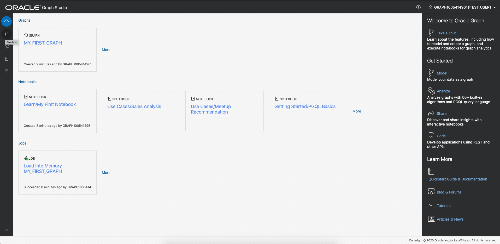
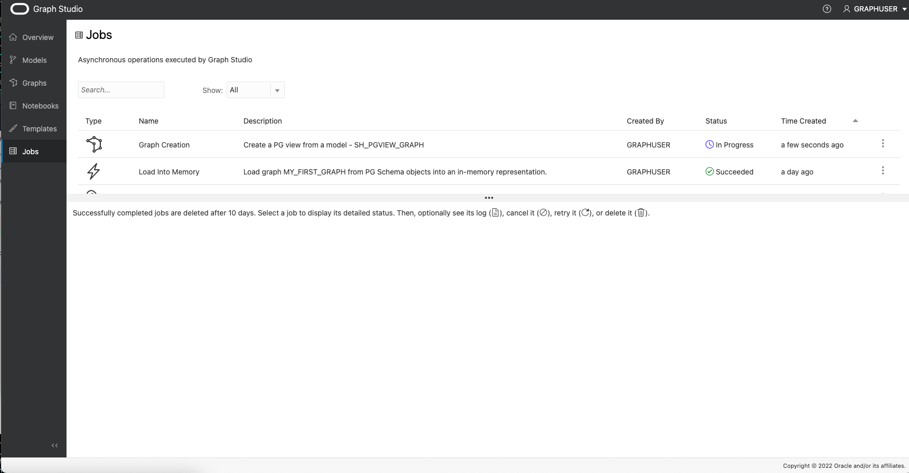

# 使用 Graph Studio 從現有的關聯式資料建立圖表

## 簡介

在這個實驗室中，您將探索更多 Graph Studio，並瞭解如何從儲存在 Autonomous Data Warehouse - Shared Infrastructure (ADW) 或 Autonomous Transaction Processing - Shared Infrastructure (ATP) 執行處理中的現有關聯資料建立圖表。

預估時間：30 分鐘。

### 目標

*   瞭解如何從銷售歷史記錄 (SH) 範例資料集建立圖表模型
*   瞭解如何監督圖表建立工作
*   瞭解如何檢驗建立的圖表和圖形模型

### 先決條件

*   下列實驗室需要 Autonomous Data Warehouse - Shared Infrastructure 或 Autonomous Transaction Processing - Shared Infrastructure 帳戶。
*   假設您已經完成第一個實驗室，其中說明如何存取資料庫執行處理的 Graph Studio 介面，並說明一些基本概念。

## 作業 1：建立必要檢視表

1.  從 OCI 的 Autonomous Database 詳細資訊頁面選取資料庫動作
    
    
    
2.  預設會以管理員使用者身分登入。登出後再以圖形使用者身分登入。
    

 

3.  選取 SQL

4.  在此實驗室中，我們使用「銷售歷史記錄 (SH)」範例綱要來建立示範圖表。所有 Autonomous Database 執行處理都可以使用 SH 綱要。從 SH 表格建立 CUSTOMERS、TIMES、CHANNELS、PRODUCTS 以及 PROMOTIONS 的檢視，只使用這些表格的資料欄子集。

    <copy>
    CREATE OR REPLACE VIEW SH_CUSTOMERS_VIEW (CUST_ID, CUST_FIRST_NAME, CUST_LAST_NAME, CUST_EMAIL, CUST_GENDER, CUST_CITY, CUST_STATE_PROVINCE, COUNTRY_ID)
    	DEFAULT COLLATION "USING_NLS_COMP"  AS
    	select cust_id, cust_first_name, cust_last_name, cust_email, cust_gender, cust_city, cust_state_province, country_id from sh.customers;
    
    CREATE OR REPLACE  VIEW SH_CHANNELS_VIEW (CHANNEL_ID, CHANNEL_DESC, CHANNEL_CLASS) DEFAULT COLLATION "USING_NLS_COMP"  AS
    	select channel_id, channel_desc, channel_class from sh.channels ;
    
    CREATE OR REPLACE VIEW SH_TIMES_VIEW (ID, TIME_ID, DAY_NAME, DAY_NUMBER_IN_MONTH, CALENDAR_MONTH_NUMBER,  CALENDAR_YEAR)
    	DEFAULT COLLATION "USING_NLS_COMP"  AS select rownum id, time_id, day_name, day_number_in_month, calendar_month_number, calendar_year from sh.times ;
    
    CREATE OR REPLACE VIEW SH_PRODUCTS_VIEW (PROD_ID, PROD_NAME, PROD_DESC, PROD_CATEGORY, PROD_STATUS)
    	DEFAULT COLLATION "USING_NLS_COMP"  AS select cast(prod_id as number) as prod_id, prod_name, prod_desc, prod_category, prod_status from sh.products;
    
    CREATE OR REPLACE VIEW SH_PROMOTIONS_VIEW (PROMO_ID, PROMO_NAME, PROMO_SUBCATEGORY, PROMO_CATEGORY, PROMO_COST)
    	DEFAULT COLLATION "USING_NLS_COMP"  AS select cast(promo_id as number) promo_id, promo_name, promo_subcategory, promo_category, promo_cost from sh.promotions;
    
    CREATE OR REPLACE VIEW SH_SALES_VIEW (SALE_ID, CUST_ID, PROD_ID, PROMO_ID, DATE_OF_SALE_ID, CHANNEL_ID, AMOUNT_SOLD, QUANTITY_SOLD)
    	DEFAULT COLLATION "USING_NLS_COMP" AS
    	select rownum sale_id, s.cust_id, s.prod_id, s.promo_id, tv.id as date_of_sale_id, s.channel_id, s.amount_sold, s.quantity_sold from sh.sales s, sh_times_view tv where s.time_id = tv.time_id
    </copy>
    

5.  將相關主索引鍵新增至檢視

    <copy>
    ALTER VIEW SH_CUSTOMERS_VIEW ADD CONSTRAINT SH_CUSTOMER_VIEW_PK PRIMARY KEY (CUST_ID) DISABLE ;
    
    ALTER VIEW SH_CHANNELS_VIEW ADD CONSTRAINT SH_CHANNEL_VIEW_PK PRIMARY KEY (CHANNEL_ID) DISABLE ;
    
    ALTER VIEW SH_TIMES_VIEW ADD CONSTRAINT SH_TIMES_VIEW_PK PRIMARY KEY (ID) DISABLE ;
    
    ALTER VIEW SH_PRODUCTS_VIEW ADD CONSTRAINT SH_PRODUCT_VIEW_PK PRIMARY KEY (PROD_ID) DISABLE;
    
    ALTER VIEW SH_PROMOTIONS_VIEW ADD CONSTRAINT SH_PROMO_VIEW_PK PRIMARY KEY (PROMO_ID) DISABLE;
    
    ALTER VIEW SH_SALES_VIEW ADD CONSTRAINT SH_SALES_VIEW_PK PRIMARY KEY (SALE_ID) DISABLE;
    </copy>
    

6.  新增銷售檢視的相關外來鍵

    <copy>
    ALTER VIEW SH_SALES_VIEW ADD CONSTRAINT SH_SALES_PROMO_VIEW_FK FOREIGN KEY (PROMO_ID) REFERENCES SH_PROMOTIONS_VIEW (PROMO_ID) DISABLE;
    
    ALTER VIEW SH_SALES_VIEW ADD CONSTRAINT SH_SALES_PRODUCT_VIEW_FK FOREIGN KEY (PROD_ID) REFERENCES SH_PRODUCTS_VIEW (PROD_ID) DISABLE;
    
    ALTER VIEW SH_SALES_VIEW ADD CONSTRAINT SH_SALES_CUST_VIEW_FK FOREIGN KEY (CUST_ID) REFERENCES SH_CUSTOMERS_VIEW (CUST_ID) DISABLE ;
    
    ALTER VIEW SH_SALES_VIEW ADD CONSTRAINT SH_SALES_CHANNEL_VIEW_FK FOREIGN KEY (CHANNEL_ID) REFERENCES SH_CHANNELS_VIEW (CHANNEL_ID) DISABLE ;
    
    ALTER VIEW SH_SALES_VIEW ADD CONSTRAINT SH_SALES_TIMES_VIEW_FK FOREIGN KEY (DATE_OF_SALE_ID) REFERENCES SH_TIMES_VIEW (ID) DISABLE ;
    </copy>
    

7.  現在您已建立必要檢視，可以在 Graph Studio 中建立 Graph。因此，請瀏覽回 OCI 中的 Autonomous Database 詳細資訊頁面，選取工具，然後選取「開啟 Graph Studio」

8.  使用您的 Graph 使用者登入 Graph Studio

## 作業 2：選取要從其建立圖表的表格

1.  下列螢幕擷取畫面顯示具有功能表的 Graph Studio 使用者介面，或是左側的瀏覽圖示。它們會分別瀏覽至「首頁」、「模型」、「圖表」、「記事本」和「工作」頁面。
    
    
    
2.  按一下**圖表**功能表圖示，然後按一下「建立」。
    
    
    
    在此實驗室中，我們使用從「銷售歷史記錄 (SH)」範例綱要建立的檢視來建立示範圖表。所有 Autonomous Database 執行處理都可以使用 SH 綱要。不過，您可以將此實驗室的步驟套用至資料庫中可用的任何關聯式資料，無論資料的來源位置為何。您有權存取的所有綱要和表格 (包括檢視) 會在建模工作流程的開頭顯示可能的輸入表格。
    
3.  開啟 **GRAPHUSER** 綱要，然後按兩下 **SH\_PRODUCTS\_VIEW** 表格。
    
    您會看到關於此表格的一些詳細資訊，例如它擁有的所有資料欄及其類型，以及主要索引鍵的資料欄：
    
    
    
4.  在左下方，按一下 **GRAPHUSER.SH\_PRODUCTS\_VIEW - 資料**頁籤。
    
    您會看到該表格值的預覽。依預設，它會顯示前 10 個資料列，但您可以增加範例大小。您也可以搜尋該表格中的任何值，然後透過預覽分頁。
    
5.  針對此實驗室，請選擇我們先前建立的所有檢視作為圖表模型的輸入。如果您的 Graph 使用者只包含這些檢視，您可以選取 _GRAPHUSER_ ，然後按一下中間的按鈕，將所有檢視移至右側的所選區段。否則，請選取相關檢視，然後按一下中間的按鈕，將所有檢視移至右側的所選區段。
    
    
    
6.  按一下右上方的**下一步**按鈕，即可移至下一個步驟。Graph Studio 會分析外來索引鍵限制條件，並建議從選取的視觀表對應至特性圖表結構的可能對應。這可能需要幾秒鐘的時間。完成後，您會看到您在左側選取的所有輸入，以及對應至右側的頂點與邊緣表格。
    
    
    
    如有必要，可修改此模型。
    

## 作業 3：編輯您的圖表模型

1.  按一下 **SH\_CHANNELS\_VIEW** 頂點表格。
    
    自動圖形模型製作器建議將 _SH\_CHANNELS\_VIEW_ 輸入的每一列轉換成目標特性圖表中的頂點。在性質圖模型中，頂點和邊可以有_標籤_，將它們分類為不同類型的頂點和邊。每個標籤可以有不同的相關屬性集。圖形模型製作器會自動將標籤設為輸入表格的名稱。如此一來，我們便可以在產生的圖表中輕鬆識別每個頂點或邊緣的類型。此外，我們看到輸入表格的每個_資料欄_都已轉換成圖表模型中的_特性_。在性質圖模型中，性質是與圖形中每個頂點或邊緣相關的任意鍵 / 值對。藉由將所有資料欄值對應至特性，我們確保圖形中會保留所有輸入資料。
    
    不過，圖形模型製作器可讓您自訂資料的對應方式，並移除與分析無關的不必要表格和 (或) 資料欄。減少要處理的資料量，將可減少圖表分析所需的處理資源和儲存容量。建立此圖表的視觀表時，我們會移除不必要的資料欄，因此在此執行處理中沒有任何要移除的資料欄。
    
2.  將頂點標籤重新命名為 **CHANNELS** ：
    
    
    
3.  為所有其他頂點表格重複：
    
    | 目前檢視名稱 | 重新命名的頂點標籤 |
    | --- | --- |
    | SH\_SALES\_VIEW | 銷售 |
    | SH\_CUSTOMERS\_VIEW | 客戶 |
    | SH\_TIMES\_VIEW | 時間 |
    | SH\_PROMOTIONS\_VIEW | 促銷活動 |
    | SH\_PRODUCTS\_VIEW | 產品 |
    
4.  按一下 **SH\_SALES\_VIEW\_SH\_CUSTOMERS\_VIEW** 邊緣表格。
    
    如**來源頂點**和**目的地頂點**資訊所見，此邊緣類型會將所有關係從 **SH\_SALES\_VIEW** 對應至 **SH\_CUSTOMERS\_VIEW** 。換句話說，它會塑造**依**關係的模型。根據預設，塑模工具提供此邊緣類型標籤 **SH\_SALES\_VIEW\_SH\_CUSTOMERS\_VIEW** 。
    
    **注意**：如果無法看見邊緣表格，您可以變更上方窗格的大小。使用分隔線 (分隔兩個窗格的三個點為 `...` 的水平線) 增加其大小。按一下分隔器，然後將其下拖曳至上。
    
5.  將邊緣標籤重新命名為 **TO\_CUSTOMER** ：
    
    
    
6.  為其他所有邊緣表格重複：
    

| 目前的邊緣名稱 | 重新命名的邊緣標籤 |
| --- | --- |
| SH\_SALES\_VIEW\_SH\_TIMES\_VIEW | DATE\_OF\_SALE |
| SH\_SALES\_VIEW\_SH\_PROMOTIONS\_VIEW | USING\_PROMOTION |
| SH\_SALES\_VIEW\_SH\_PRODUCTS\_VIEW | PRODUCT\_SOLD |
| SH\_SALES\_VIEW\_SH\_CHANNELS\_VIEW | VIA\_CHANNEL |

7.  按一下左上方的**來源**頁籤。
    
    
    
    您會看到此模型的原始碼。原始程式碼是以 PGQL 資料定義語言 (DDL) 語法撰寫。您可以在[最新的 PGQL 規格](https://pgql-lang.org/spec/latest/#create-property-graph)中找到有關語言的詳細資訊。
    
    進階使用者可以直接編輯原始碼。變更將會立即反映在設計工具檢視中，反之亦然。
    
8.  按一下左上方的**預覽**頁籤。
    
    
    
    到目前為止，您看到圖形模型的視覺表現。圖形中的每個圓形代表頂點類型 (標籤)。圖形中的邊緣關係代表圓形之間的邊緣類型 (標籤)。您可以按一下並拖曳元素來重新排列圖形。您也可以對每個元素按一下滑鼠右鍵，以查看將包含的屬性清單。
    
    
    
9.  按一下右上方的**下一步 (Next)** 。
    
    
    
    您會看到我們建立的模型摘要。所有輸入表以及我們要如何將這些表對應至屬性圖。
    

## 作業 4：啟動圖表建立工作

1.  按一下右上角的**建立圖表 (Create Graph)** 。
    
2.  輸入 **SH\_PGVIEW\_GRAPH** 作為圖表名稱，輸入 **SH\_MODEL** 作為模型名稱，並選擇性提供圖形描述與部分標記以供日後識別之用。讓**載入記憶體**選項維持勾選。然後按一下**建立 (Create)** 。
    
    
    
    系統會將您重新導向至看見圖表建立工作的工作頁面。
    
    
    
3.  按一下執行中的工作。在「詳細資訊」區段中，按一下右上方的**日誌**圖示。
    
    
    
    這會開啟一對話框。
    
    
    
    您可以將產生的日誌對話方塊保持開啟，以監督圖表建立的進度。Graph Studio 會每幾秒鐘自動重新整理一次日誌。圖形建立工作應該在幾分鐘後成功。完成之後，會自動啟動另一個**載入記憶體**工作。
    
    
    
4.  請等待兩個工作順利完成。
    

## 作業 5：檢查建立的圖表與模型

1.  按一下**圖表**功能表圖示。
    
2.  按一下剛剛建立的 **SH\_PGVIEW\_GRAPH** 圖表。
    
    
    
    您可以看到圖形的預覽、 編輯名稱或中繼資料、 與他人共用、 將圖形載入記憶體中或刪除圖形 。
    
3.  按一下**模型**功能表項目
    
4.  按一下我們剛建立的 **SH 模型**：
    
    
    
    與圖形一樣，模型也會一併儲存。您可以查看此模型的原始程式碼、與其他模型共用、編輯其中繼資料或將其刪除。您也可以從相同模型啟動另一個圖表建立工作。
    

恭喜！您已順利將關聯式表格轉換成特性圖表。您現在可以使用強大的圖形查詢與演算法，繼續分析該資料中的關係。

您現在可以**進入下一個實驗室**。

## 確認

*   **作者** - Korbi Schmid，產品開發
*   **貢獻者** - Jayant Sharma，Rahul Tasker，產品管理
*   **上次更新者 / 日期** - Jayant Sharma，2023 年 6 月