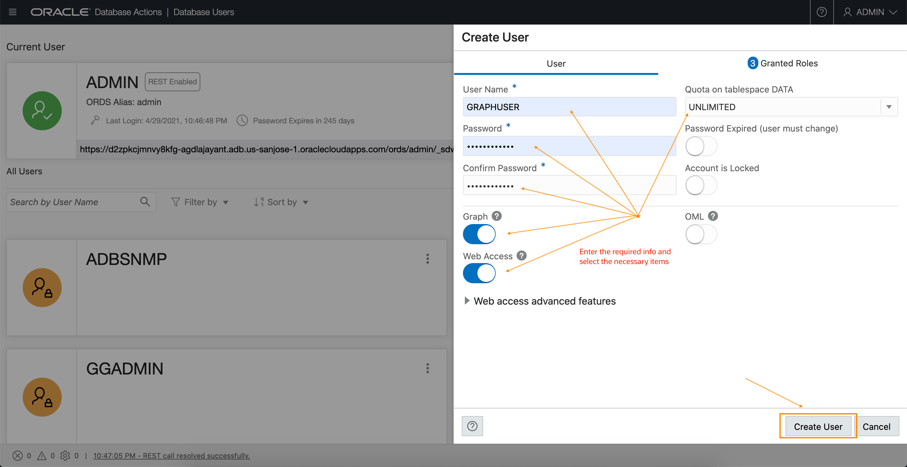
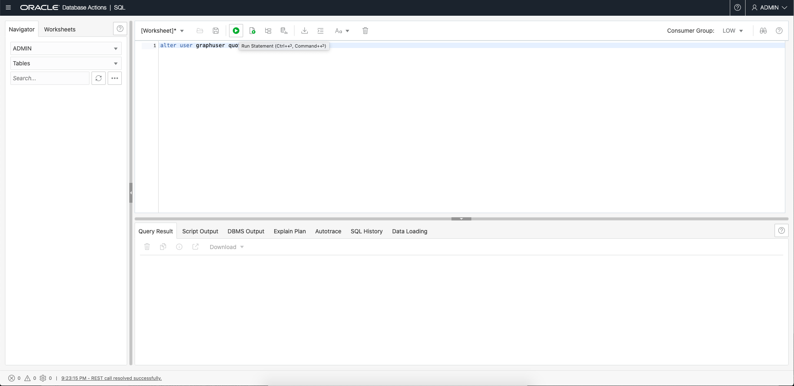
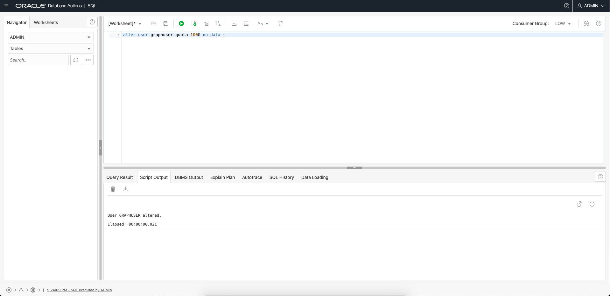

# Crear el usuario de Graph

## Introducción

En este laboratorio, creará un usuario de base de datos con los roles y privilegios adecuados necesarios para utilizar las capacidades de gráfico de Autonomous Database.

Tiempo estimado: 5 minutos.

Vea el siguiente video para ver un breve recorrido por el laboratorio.

[Enlace al vídeo de este taller](youtube:CQh8Q24Rboc)

### Objetivos

Información sobre cómo

*   Crear un usuario de base de datos con los roles y privilegios adecuados necesarios para acceder a **Graph Studio**

### Requisitos

*   En el siguiente laboratorio se necesita una cuenta de Autonomous Data Warehouse - Shared Infrastructure o Autonomous Transaction Processing - Shared Infrastructure

## Tarea 1: Conexión a Database Actions para la instancia de Autonomous Database

1.  Abra la página de detalles del servicio para la instancia de Autonomous Database en la consola de OCI.
    
    A continuación, haga clic en el enlace **Database Actions** para abrirlo.
    
    
    

## Tarea 2: Crear el acceso web y el usuario habilitado para gráficos

1.  Conéctese como usuario ADMIN para la instancia de Autonomous Database.
    
    
    
2.  Haga clic en el mosaico **DATABASE USERS** en **Administration**.
    
    
    
3.  Haga clic en el icono **\+ Crear usuario**.
    
    
    
4.  Introduzca los detalles necesarios, es decir, el nombre de usuario y la contraseña. Active los botones de radio **Activación de gráfico** y **Acceso web**. Y seleccione una cuota, por ejemplo, **UNLIMITED**, para asignar en el tablespace `DATA`.
    
    Nota: La contraseña debe cumplir los siguientes requisitos:
    
    *   La contraseña debe tener entre 12 y 30 caracteres de longitud y debe incluir al menos una letra en mayúsculas, una letra en minúsculas y un carácter numérico.
    *   La contraseña no puede contener el nombre de usuario.
    *   La contraseña no puede contener comillas dobles (").
    *   La contraseña debe ser diferente a las 4 últimas contraseñas utilizadas para este usuario.
    *   La contraseña no debe ser la misma que se haya establecido hace menos de 24 horas.
    
    
    
    **Nota: No active Graph Active el usuario ADMIN y no inicie sesión en Graph Studio como usuario ADMIN. El usuario ADMIN tiene privilegios adicionales por defecto. Cree y utilice una cuenta con solo los privilegios necesarios con datos de gráficos y análisis.**
    
    Haga clic en el botón **Crear usuario** en la parte inferior del panel para crear el usuario con las credenciales especificadas.
    
    Se mostrará el usuario recién creado.
    
    
    
    **Nota:** _Los pasos de la interfaz de usuario anteriores se pueden realizar ejecutando los siguientes comandos SQL que se muestran a continuación cuando se conecta como ADMIN. Por lo tanto, el paso 5 a continuación no es necesario. Muestra una forma alternativa de crear y activar GRAPHUSER._
    
5.  Asigne una cuota de espacio de tabla deseada al usuario recién creado. Abra la página SQL y ejecute el comando alter.
    
    Por ejemplo, `ALTER USER GRAPHUSER QUOTA UNLIMITED ON DATA;`  
    asignará una cuota al usuario `GRAPHUSER` en el tablespace denominado `DATA`.  
    Copie y pegue el siguiente comando en la hoja de trabajo de SQL.  
    Sustituya los valores correctos por `<username>` y `<quota>` y, a continuación, haga clic en Ejecutar para ejecutarlo.
    
        <copy>
        -- Optional statement to use in place of the UI of the Administration page
        ALTER USER <username> QUOTA <quota> ON DATA;
        </copy>
        
    
        <copy>
        -- Optional statements to use in place of the UI of the Administration page
        GRANT GRAPH_DEVELOPER TO <username> ;
        ALTER USER <username> GRANT CONNECT THROUGH "GRAPH$PROXY_USER";
        </copy>
        
    
    Las siguientes capturas de pantalla muestran un ejemplo de ejecución de la sentencia ALTER USER.
    
    
    
    
    
    
    
6.  También puede utilizar sentencias SQL para verificar que GRAPHUSER se ha configurado correctamente.
    
    Debe estar conectado a SQL de acciones de datos como `ADMIN` y, a continuación, introducir las siguientes sentencias SQL y ejecutarlas.
    
        <copy>
        select * from dba_role_privs where grantee='GRAPHUSER';
        
        select * from dba_proxies where client='GRAPHUSER';
        </copy>
        
    
    Los resultados deben ser los mismos que en las capturas de pantalla siguientes.
    
    
    
    
    

**Ir al siguiente laboratorio** para aprender a crear y analizar gráficos en ADB.

## Reconocimientos

*   **Autor**: Jayant Sharma, gestión de productos
*   **Contribuyentes**: Korbi Schmid, Rahul Tasker
*   **Última actualización por/fecha**: Jayant Sharma, junio de 2023