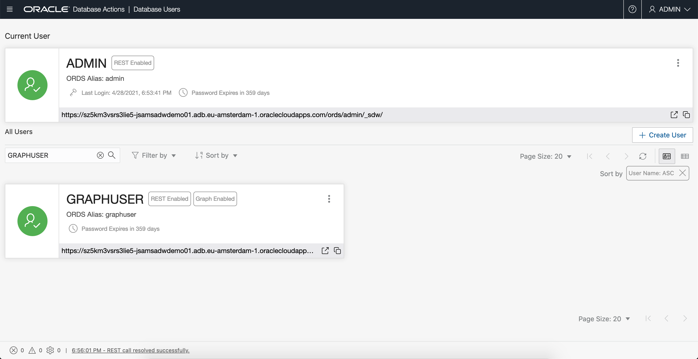

# Créer l'utilisateur de Graph

## Présentation

Dans cet exercice, vous allez créer un utilisateur de base de données doté des rôles et privilèges appropriés requis pour utiliser les fonctionnalités graphiques d'Autonomous Database.

Durée estimée : 5 minutes.

Regardez la vidéo ci-dessous pour une présentation rapide du laboratoire.

[Lien vers la vidéo de cet atelier](youtube:CQh8Q24Rboc)

### Objectifs

Découvrez comment :

*   créer un utilisateur de base de données avec les rôles et privilèges appropriés requis pour accéder à **Graph Studio**

### Prérequis

*   L'exercice suivant requiert un compte d'infrastructure partagée Autonomous Data Warehouse ou Autonomous Transaction Processing.

## Tâche 1 : connexion à Database Actions pour votre instance Autonomous Database

1.  Ouvrez la page de détails du service pour votre instance Autonomous Database dans la console OCI.
    
    Cliquez ensuite sur le lien **Database Actions** pour l'ouvrir.
    
    
    

## Tâche 2 : créer l'accès Web et l'utilisateur compatible avec les graphiques

1.  Connectez-vous en tant qu'utilisateur ADMIN de l'instance Autonomous Database.
    
    
    
2.  Cliquez sur la mosaïque **DATABASE USERS** sous **Administration**.
    
    
    
3.  Cliquez sur l'icône **\+ Créer un utilisateur**.
    
    . ")
    
4.  Entrez les détails requis, c'est-à-dire le nom d'utilisateur et le mot de passe. Activez les boutons radio **Graph Enable** et **Web Access**. Sélectionnez un quota, par exemple **UNLIMITED**, à allouer sur le tablespace `DATA`.
    
    Remarque : Le mot de passe doit répondre aux exigences suivantes :
    
    *   Le mot de passe doit comporter entre 12 et 30 caractères, et inclure au moins une lettre majuscule, une lettre minuscule et un caractère numérique.
    *   Le mot de passe ne peut pas contenir le nom utilisateur.
    *   Le mot de passe ne peut pas contenir de apostrophes (").
    *   Le mot de passe doit être différent des 4 derniers mots de passe utilisés pour cet utilisateur.
    *   Le mot de passe ne doit pas être le même qu'il y a moins de 24 heures.
    
    
    
    **Remarque : N'activez pas l'utilisateur ADMIN et ne vous connectez pas à Graph Studio en tant qu'utilisateur ADMIN. Par défaut, l'utilisateur ADMIN dispose de privilèges supplémentaires. Créez et utilisez un compte disposant uniquement des privilèges nécessaires avec les données graphiques et les analyses.**
    
    Cliquez sur le bouton **Créer un utilisateur** en bas du panneau pour créer l'utilisateur avec les informations d'identification indiquées.
    
    L'utilisateur nouvellement créé sera désormais répertorié.
    
    
    
    **Remarque :** _Les étapes de l'interface utilisateur ci-dessus peuvent être effectuées en exécutant les commandes SQL suivantes répertoriées ci-dessous lors de la connexion en tant qu'ADMIN. L'étape 5 ci-dessous n'est donc pas nécessaire. Il présente une autre façon de créer et d'activer GRAPHUSER._
    
5.  Allouez un quota d'espace de table souhaité à l'utilisateur nouvellement créé. Ouvrez la page SQL et exécutez la commande alter.
    
    Par exemple, `ALTER USER GRAPHUSER QUOTA UNLIMITED ON DATA;`  
    alloue un quota à l'utilisateur `GRAPHUSER` dans le tablespace nommé `DATA`.  
    Copiez et collez la commande suivante dans la feuille de calcul SQL.  
    Remplacez les valeurs correctes pour `<username>` et `<quota>`, puis cliquez sur Exécuter pour l'exécuter.
    
        <copy>
        -- Optional statement to use in place of the UI of the Administration page
        ALTER USER <username> QUOTA <quota> ON DATA;
        </copy>
        
    
        <copy>
        -- Optional statements to use in place of the UI of the Administration page
        GRANT GRAPH_DEVELOPER TO <username> ;
        ALTER USER <username> GRANT CONNECT THROUGH "GRAPH$PROXY_USER";
        </copy>
        
    
    Les captures d'écran ci-dessous présentent un exemple d'exécution de l'instruction ALTER USER.
    
    
    
    
    
    
    
6.  Vous pouvez également utiliser des instructions SQL pour vérifier que GRAPHUSER a été correctement configuré.
    
    Vous devez être connecté au SQL Data Actions en tant que `ADMIN`, puis entrer les instructions SQL suivantes et les exécuter.
    
        <copy>
        select * from dba_role_privs where grantee='GRAPHUSER';
        
        select * from dba_proxies where client='GRAPHUSER';
        </copy>
        
    
    Les résultats doivent être les mêmes que dans les captures d'écran ci-dessous.
    
    
    
    
    

Pour en savoir plus sur la création et l'analyse de graphiques dans la base de données autonome, **passez à l'atelier suivant**.

## Accusés de réception

*   **Auteur** - Jayant Sharma, Product Management
*   **Contributeurs** - Korbi Schmid, Rahul Tasker
*   **Dernière mise à jour par/date** - Jayant Sharma, juin 2023