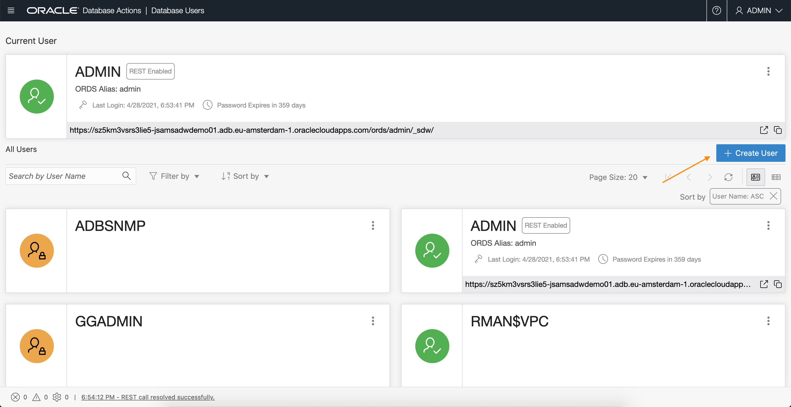
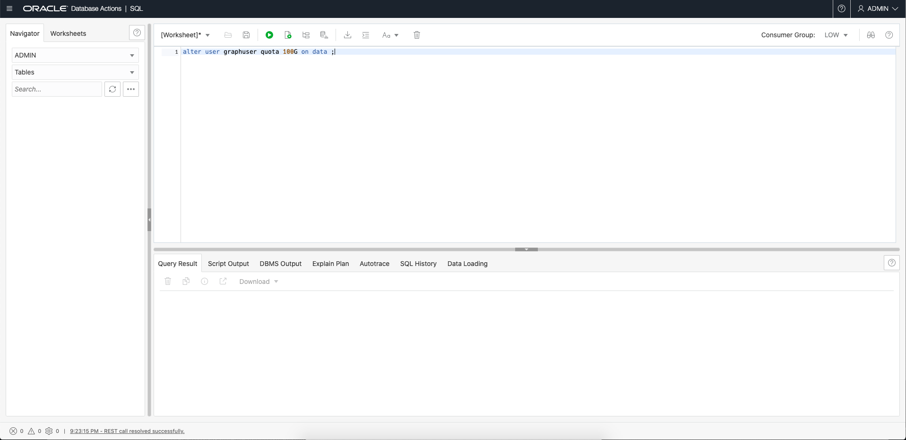
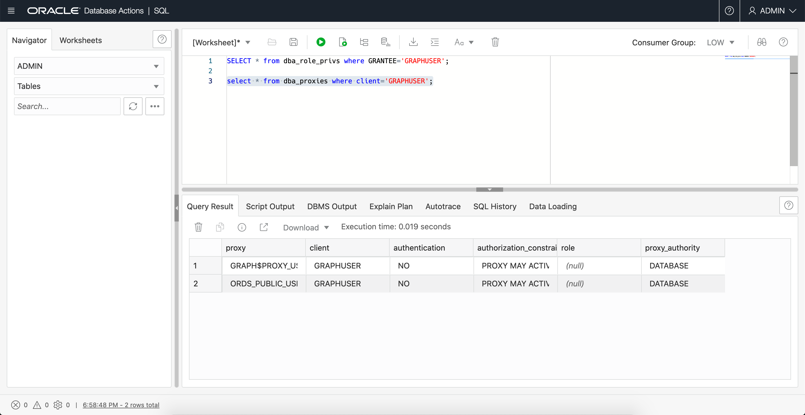

# グラフ・ユーザーの作成

## 概要

この演習では、Autonomous Databaseのグラフ機能の使用に必要な適切なロールおよび権限を持つデータベース・ユーザーを作成します。

見積時間: 5分。

ラボのクイック・ウォークスルーについては、次のビデオをご覧ください。

[このワークショップのビデオへのリンク](youtube:CQh8Q24Rboc)

### 目標

学習方法

*   **Graph Studio**へのアクセスに必要な適切なロールおよび権限を持つデータベース・ユーザーの作成

### 前提条件

*   次のラボには、Autonomous Data Warehouse - Shared InfrastructureまたはAutonomous Transaction Processing - Shared Infrastructureアカウントが必要です

## タスク1: Autonomous Databaseインスタンスのデータベース・アクションへの接続

1.  OCIコンソールでAutonomous Databaseインスタンスのサービス詳細ページを開きます。
    
    次に、**「データベース・アクション」**リンクをクリックして開きます。
    
    
    

## タスク2: Webアクセスおよびグラフ対応ユーザーの作成

1.  Autonomous DatabaseインスタンスのADMINユーザーとしてログインします。
    
    
    
2.  **「管理」**の**「DATABASE USERS」**タイルをクリックします。
    
    
    
3.  **「+ Create User」**アイコンをクリックします。
    
    
    
4.  必要な詳細(ユーザー名とパスワード)を入力します。**「グラフの有効化」**および**「Webアクセス」**ラジオ・ボタンをオンにします。`DATA`表領域に割り当てる割当て制限(**UNLIMITED**など)を選択します。
    
    ノート: パスワードは、次の要件を満たす必要があります。
    
    *   パスワードの長さは12から30文字とし、大文字、小文字および数字をそれぞれ1文字以上含める必要があります。
    *   パスワードにユーザー名を含めることはできません。
    *   パスワードに二重引用符(")を含めることはできません。
    *   パスワードは、このユーザーに対して過去4回に使用したパスワードとは異なる必要があります。
    *   パスワードは、設定してから24時間経過していないパスワードと同じにできません。
    
    
    
    **注意: Graph Enable the ADMINユーザーではなく、ADMINユーザーとしてGraph Studioにログインしないでください。ADMINユーザーには、デフォルトで追加の権限があります。グラフ・データおよび分析で必要な権限のみを持つアカウントを作成して使用します。**
    
    パネルの下部にある**「ユーザーの作成」**ボタンをクリックして、指定した資格証明を持つユーザーを作成します。
    
    新しく作成されたユーザーがリストされます。
    
    
    
    **ノート:** _前述のUIステップは、ADMINとしてログインするときに、次に示すSQLコマンドを実行することによって実行できます。したがって、以下の手順5は必要ありません。GRAPHUSERの作成および有効化の代替方法を示します。_
    
5.  新しく作成したユーザーに目的の表領域割当て制限を割り当てます。SQLページを開き、alterコマンドを発行します。
    
    たとえば、`ALTER USER GRAPHUSER QUOTA UNLIMITED ON DATA;`  
    は、ユーザー`GRAPHUSER`を`DATA`という名前の表領域に割り当てます。  
    次のコマンドをコピーしてSQLワークシートに貼り付けます。  
    正しい値を`<username>`および`<quota>`に置き換え、「実行」をクリックして実行します。
    
        <copy>
        -- Optional statement to use in place of the UI of the Administration page
        ALTER USER <username> QUOTA <quota> ON DATA;
        </copy>
        
    
        <copy>
        -- Optional statements to use in place of the UI of the Administration page
        GRANT GRAPH_DEVELOPER TO <username> ;
        ALTER USER <username> GRANT CONNECT THROUGH "GRAPH$PROXY_USER";
        </copy>
        
    
    次のスクリーンショットは、ALTER USER文の実行例を示しています。
    
    
    
    
    
    
    
6.  同様に、SQL文を使用して、GRAPHUSERが正しく設定されていることを確認できます。
    
    データ・アクションSQLに`ADMIN`としてログインし、次のSQL文を入力して実行する必要があります。
    
        <copy>
        select * from dba_role_privs where grantee='GRAPHUSER';
        
        select * from dba_proxies where client='GRAPHUSER';
        </copy>
        
    
    結果は、次のスクリーンショットと同じです。
    
    
    
    
    

ADBでグラフを作成および分析する方法を学習するには、**次の演習に進んでください**。

## 確認

*   **著者** - 製品管理、Jayant Sharma
*   **貢献者** - Rahul Tasker、Korbi Schmid
*   **最終更新者/日付** - Jayant Sharma、2023年6月