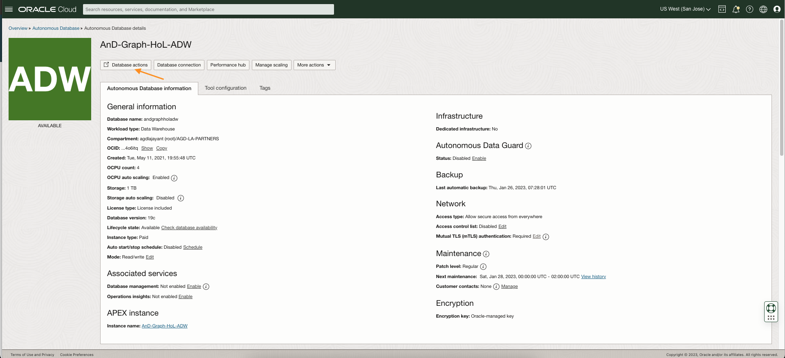
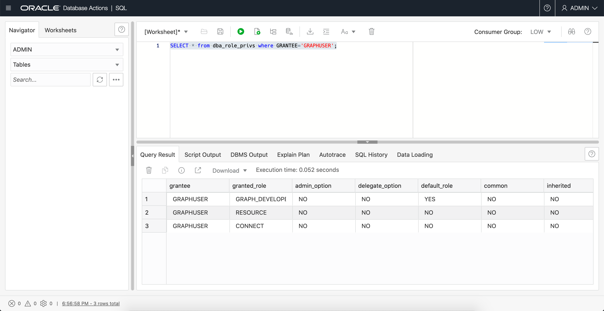

# 创建 Graph 用户

## 简介

在此实验室中，您将创建一个数据库用户，该用户具有使用 Autonomous Database 的图形功能所需的相应角色和权限。

估计时间：5 分钟。

观看下面的视频，快速浏览实验室。

[链接到此研讨会的视频](youtube:CQh8Q24Rboc)

### 目标

了解方法

*   创建具有访问 **Graph Studio** 所需的相应角色和权限的数据库用户

### 先备条件

*   下面的练习需要一个 Autonomous Data Warehouse - Shared Infrastructure or Autonomous Transaction Processing - Shared Infrastructure account

## 任务 1：连接到 Autonomous Database 实例的 Database Actions

1.  在 OCI 控制台中打开 Autonomous Database 实例的服务详细信息页面。
    
    然后单击**数据库操作**链接以将其打开。
    
    
    

## 任务 2：创建 Web 访问和支持图形的用户

1.  以 Autonomous Database 实例的 ADMIN 用户身份登录。
    
    
    
2.  单击 **Administration** 下面的 **DATABASE USERS** 磁贴。
    
    
    
3.  单击 **\+ 创建用户**图标。
    
    
    
4.  输入必需的详细信息，即用户名和密码。打开**图形启用**和 **Web 访问**单选按钮。然后选择配额（例如 **UNLIMITED** ）以在 `DATA` 表空间上分配。
    
    注：密码应满足以下要求：
    
    *   密码的长度必须介于 12 到 30 个字符之间，并且必须至少包含一个大写字母，一个小写字母和一个数字字符。
    *   密码不能包含用户名。
    *   密码不能包含双引号 (") 字符。
    *   密码必须不同于用于此用户的最后 4 个密码。
    *   密码不得为 24 小时内设置的同一密码。
    
    
    
    **注：请勿以 ADMIN 用户身份启用 Graph Studio，也不要以 ADMIN 用户身份登录 Graph Studio。默认情况下，ADMIN 用户具有其他权限。创建和使用仅具有图形数据和分析所需的权限的帐户。**
    
    单击面板底部的**创建用户**按钮以创建具有指定身份证明的用户。
    
    此时将列出新创建的用户。
    
    
    
    **注：**_可以改为在以 ADMIN 身份登录时执行以下列出的以下 SQL 命令来执行上述 UI 步骤。因此，以下步骤 5 不必要。它显示了创建和启用 GRAPHUSER 的另一种方式。_
    
5.  将所需的表空间限额分配给新创建的用户。打开 SQL 页面并发出 ALTER 命令。
    
    例如，`ALTER USER GRAPHUSER QUOTA UNLIMITED ON DATA;`  
    将在名为 `DATA` 的表空间中为用户 `GRAPHUSER` 分配配额。  
    将以下命令复制并粘贴到 SQL 工作表中。  
    用正确的值替换 `<username>` 和 `<quota>`，然后单击“Run（运行）”执行该语句。
    
        <copy>
        -- Optional statement to use in place of the UI of the Administration page
        ALTER USER <username> QUOTA <quota> ON DATA;
        </copy>
        
    
        <copy>
        -- Optional statements to use in place of the UI of the Administration page
        GRANT GRAPH_DEVELOPER TO <username> ;
        ALTER USER <username> GRANT CONNECT THROUGH "GRAPH$PROXY_USER";
        </copy>
        
    
    下面的屏幕截图显示了执行 ALTER USER 语句的示例。
    
    
    
    
    
    
    
6.  您也可以使用 SQL 语句验证 GRAPHUSER 设置是否正确。
    
    您必须以 `ADMIN` 身份登录到 Data Actions SQL，然后输入以下 SQL 语句并执行这些语句。
    
        <copy>
        select * from dba_role_privs where grantee='GRAPHUSER';
        
        select * from dba_proxies where client='GRAPHUSER';
        </copy>
        
    
    结果应与下面的屏幕截图相同。
    
    
    
    
    

要了解如何在 ADB 中创建和分析图形，请**转到下一个练习**。

## 确认

*   **作者** - 产品管理 Jayant Sharma
*   **贡献者** - Rahul Tasker Korbi Schmid
*   **上次更新者/日期** - Jayant Sharma，2023 年 6 月