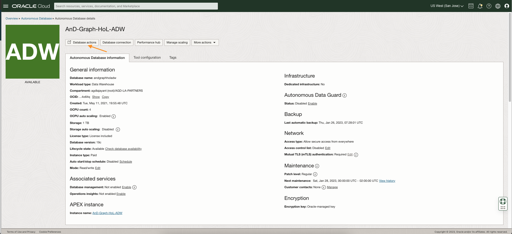
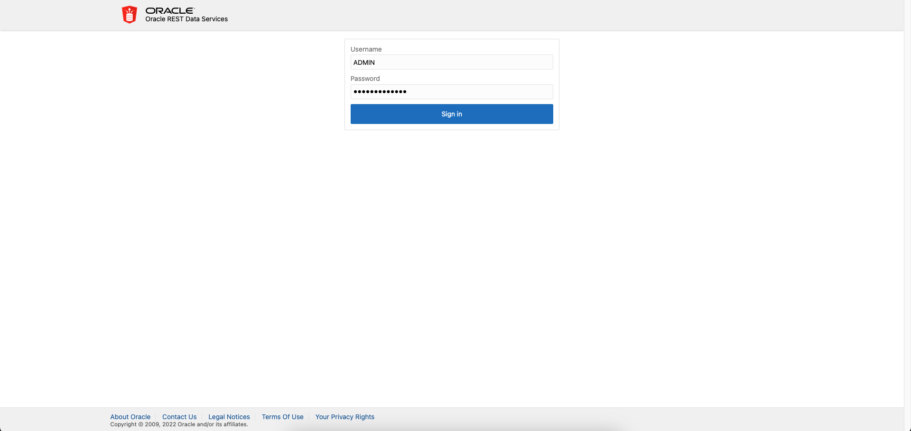
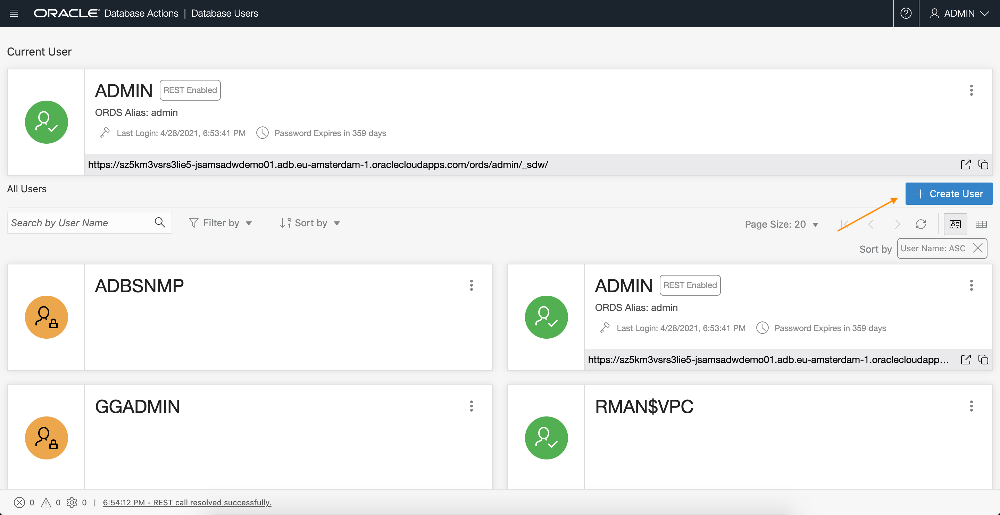
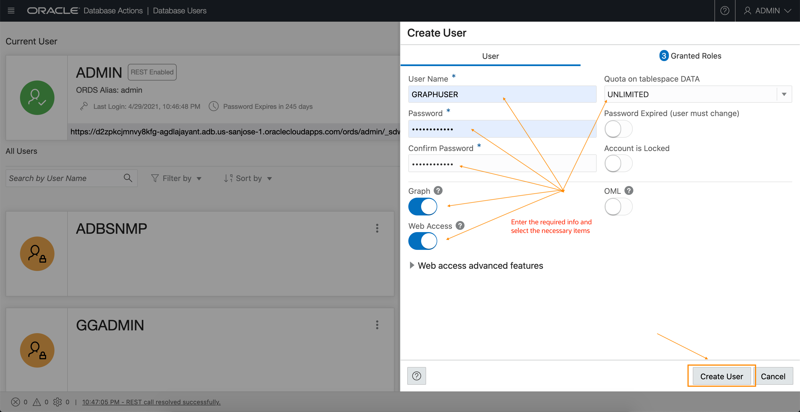
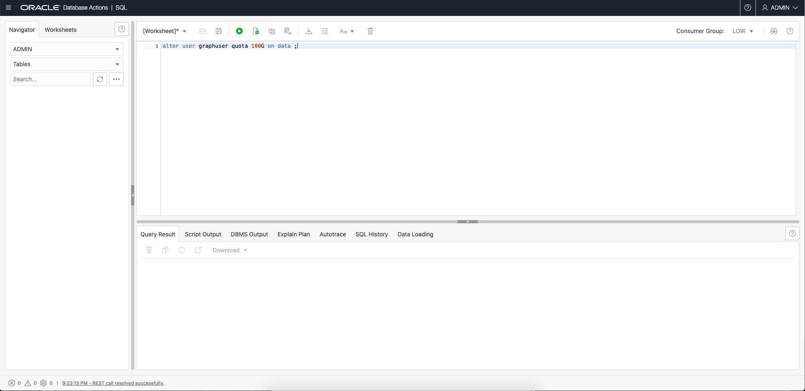
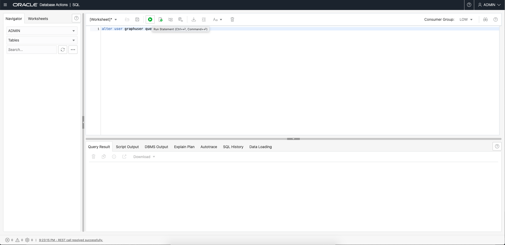
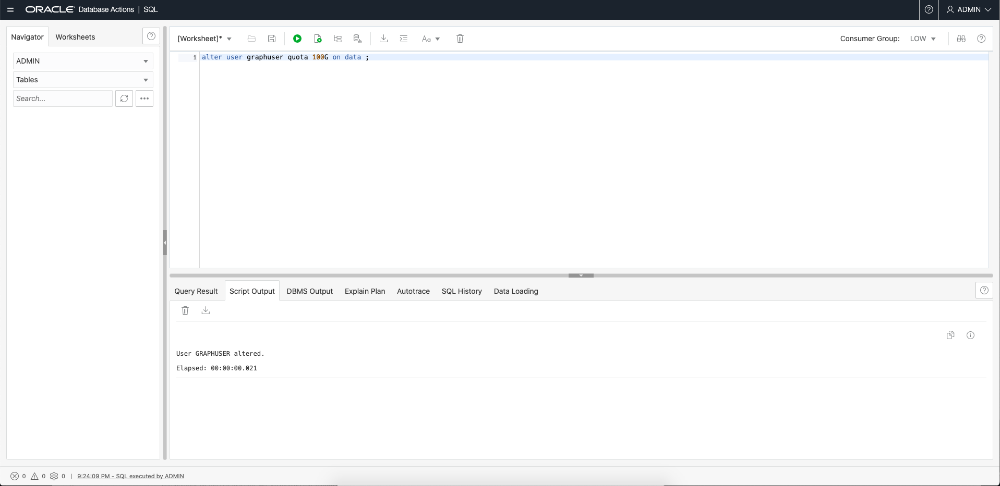
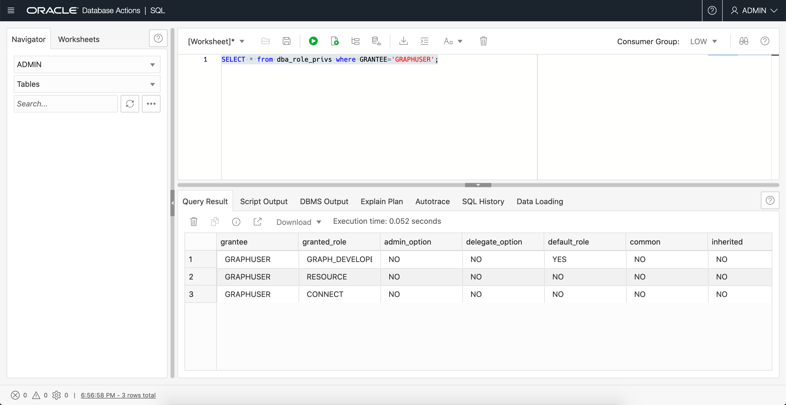
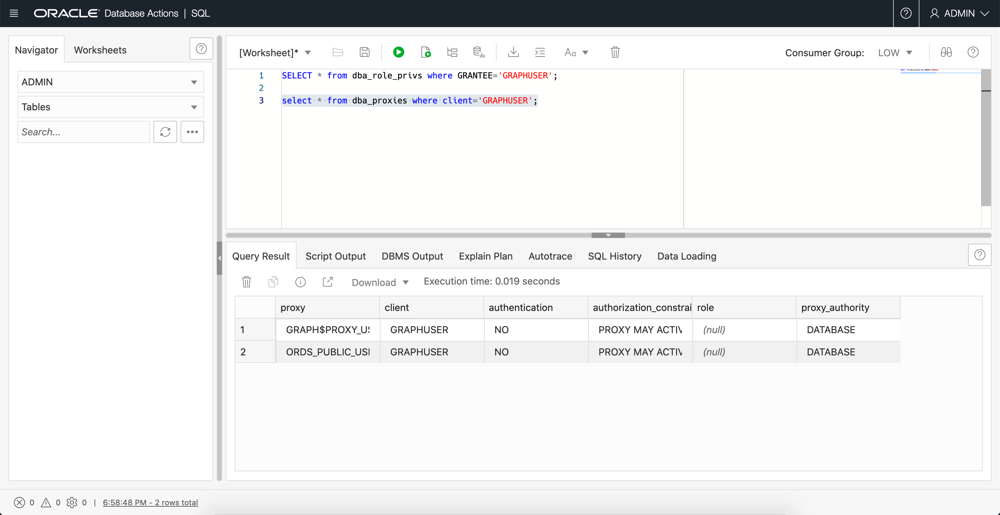

# 建立圖表使用者

## 簡介

在此實驗室中，您將建立具備使用 Autonomous Database 圖形功能所需之適當角色和權限的資料庫使用者。

預估時間：5 分鐘。

觀看下方影片快速瀏覽實驗室。

[此研討會影片的連結](youtube:CQh8Q24Rboc)

### 目標

瞭解如何

*   建立具備存取 **Graph Studio** 所需之適當角色和權限的資料庫使用者

### 先決條件

*   下列實驗室需要 Autonomous Data Warehouse - Shared Infrastructure 或 Autonomous Transaction Processing - Shared Infrastructure 帳戶

## 作業 1：連線至您 Autonomous Database 執行處理的資料庫動作

1.  在 OCI 主控台中開啟您 Autonomous Database 執行處理的服務詳細資訊頁面。
    
    然後按一下**資料庫動作 (Database Actions)** 連結來開啟它。
    
    
    

## 作業 2：建立啟用 Web 存取和啟用圖表的使用者

1.  以 ADMIN 使用者身分登入您的 Autonomous Database 執行處理。
    
    
    
2.  按一下**管理 (Administration)** 底下的 **DATABASE USERS** 磚塊。
    
    」動態磚")
    
3.  按一下 **\+ 建立使用者 (Create User)** 圖示。
    
    
    
4.  輸入必要的詳細資訊，例如使用者名稱和密碼。開啟**圖表啟用**和 **Web 存取**圓鈕。並選取要在 `DATA` 表格空間上配置的配額 (例如 **UNLIMITED**)。
    
    注意：密碼應符合下列需求：
    
    *   密碼長度必須介於 12 到 30 個字元之間，且必須至少包含一個大寫字母、一個小寫字母及一個數字字元。
    *   密碼不能包含使用者名稱。
    *   密碼不可包含雙引號 (") 字元。
    *   密碼必須與此使用者最後使用的 4 個密碼不同。
    *   密碼不得與 24 小時前設定的密碼相同。
    
    
    
    **注意：請勿使用 Graph 啟用 ADMIN 使用者，而且不要以 ADMIN 使用者身分登入 Graph Studio.ADMIN 使用者預設會有其他權限。建立並使用僅具備必要權限的帳戶搭配圖形資料與分析。**
    
    按一下面板底部的 \[ **建立使用者** \] 按鈕，使用指定的證明資料建立使用者。
    
    將會列出新建立的使用者。
    
    
    
    **注意：** _以 ADMIN 身分登入時，可執行下面列出的下列 SQL 命令來改為執行上述 UI 步驟。因此不需要以下步驟 5。它會顯示建立和啟用 GRAPHUSER 的替代方式。_
    
5.  將想要的表格空間配額配置給新建立的使用者。開啟 SQL 頁面並發出 change 命令。
    
    例如，`ALTER USER GRAPHUSER QUOTA UNLIMITED ON DATA;`  
    會在名為 `DATA` 的表格空間中配置使用者 `GRAPHUSER` 的配額。  
    將下列命令複製並貼到 SQL 工作表中。  
    替換 `<username>` 和 `<quota>` 的正確值，然後按一下「執行」來執行。
    
        <copy>
        -- Optional statement to use in place of the UI of the Administration page
        ALTER USER <username> QUOTA <quota> ON DATA;
        </copy>
        
    
        <copy>
        -- Optional statements to use in place of the UI of the Administration page
        GRANT GRAPH_DEVELOPER TO <username> ;
        ALTER USER <username> GRANT CONNECT THROUGH "GRAPH$PROXY_USER";
        </copy>
        
    
    下面的螢幕擷取畫面顯示執行 ALTER USER 敘述句的範例。
    
    
    
    
    
    
    
6.  您可使用 SQL 陳述式來驗證 GRAPHUSER 已正確設定。
    
    您必須以 `ADMIN` 的身分登入資料動作 SQL，然後輸入下列 SQL 陳述式並加以執行。
    
        <copy>
        select * from dba_role_privs where grantee='GRAPHUSER';
        
        select * from dba_proxies where client='GRAPHUSER';
        </copy>
        
    
    結果應與下方的螢幕擷取畫面相同。
    
    
    
    
    

請**進入下一個實驗室**以了解如何在 ADB 中建立及分析圖表。

## 確認

*   **作者** - 產品管理 Jayant Sharma
*   **貢獻者** - Korbi Schmid，Rahul Tasker
*   **上次更新者 / 日期** - Jayant Sharma，2023 年 6 月