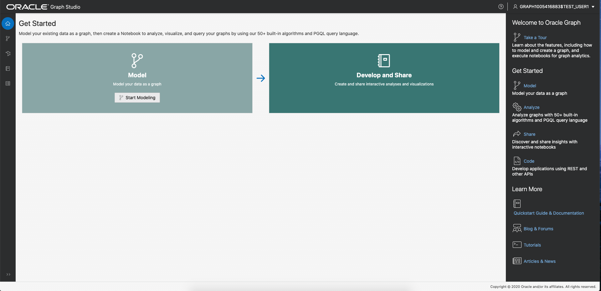
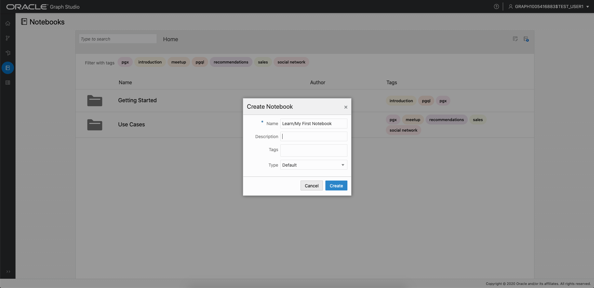
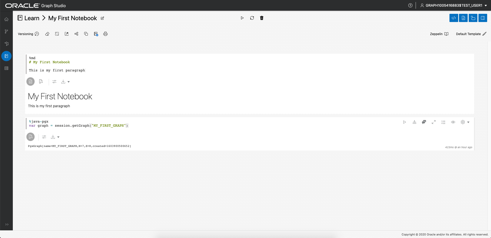

# Hello World: Graph von Grund auf neu erstellen, analysieren und visualisieren

## Einführung

In dieser Übung lernen Sie Graph Studio kennen und erfahren, wie Sie mit Autonomous Data Warehouse - Serverless-(ADW-) oder Autonomous Transaction Processing - Serverless-(ATP-)Instanz ganz schnell ein ganz neues Diagramm erstellen und analysieren können.

**Hinweis: Während diese Übung Autonomous Data Warehouse verwendet, sind die Schritte zum Erstellen und Herstellen einer Verbindung zu einer Autonomous Transaction Processing-Datenbank identisch.**

Geschätzte Zeit: 10 Minuten.

### Ziele

Vorgehensweise

*   Mit **Graph Studio** eine Verbindung zu Autonomous Database herstellen
*   Erstellen Sie schnell ein ganz einfaches Diagramm von Grund auf mit PGQL
*   Diagramme zur Analyse in den Speicher laden
*   Einfaches Notizbuch erstellen
*   Grundlegende Abschnitte für Markdown-, PGX-Java- und PGQL-Notizbücher schreiben und ausführen
*   Diagrammdaten visualisieren

### Voraussetzungen

*   Für die folgende Übung ist ein Account "Autonomous Data Warehouse - Serverless" oder "Autonomous Transaction Processing - Serverless" erforderlich.

## Aufgabe 1: Verbindung zu Autonomous Database mit Graph Studio herstellen

1.  Wenn Sie die Graph Studio-URL haben, fahren Sie mit Schritt 3 fort.
    
    Melden Sie sich bei der OCI-Konsole an, wählen Sie die Autonomous Database-Instanz aus, und klicken Sie im Menü auf der Detailseite links auf die Registerkarte "Toolskonfiguration".  
    Suchen Sie den Graph Studio-Link, kopieren Sie ihn, und fügen Sie ihn in eine neue Browserregisterkarte oder ein neues Fenster ein.
    
    
    
2.  Wenn Database Actions noch geöffnet ist, klicken Sie alternativ auf die Graph Studio-Karte, um sie auf einer neuen Seite oder Registerkarte in Ihrem Browser zu öffnen.
    
    
    
3.  Geben Sie die Zugangsdaten des Autonomous Database-Accounts oder den für Graph aktivierten Benutzer (z.B. `GRAPHUSER`) auf dem Anmeldebildschirm ein.  
    Verwenden Sie **nicht** `ADMIN`.
    
    
    
4.  Klicken Sie dann auf die Schaltfläche "Anmelden".
    

## Aufgabe 2: Einfaches Diagramm mit PGQL erstellen

1.  Der folgende Screenshot zeigt die Graph Studio-Benutzeroberfläche mit den Symbolen für das Menü oder die Navigation auf der linken Seite. Sie greifen auf die Home-, Models-, Graphs-, Notebooks- und Jobs-Seiten zu.
    
    
    
2.  Klicken Sie auf das Menüsymbol `Graphs`:
    
    
    
3.  Klicken Sie anschließend auf der Seite auf die Schaltfläche `</> Query`. Eine Seite mit dem Titel **</> Query Playground** wird angezeigt.
    
    
    
4.  Kopieren Sie den folgenden DDL-Code, und fügen Sie ihn in den PGQL-Eingabetextbereich ein:
    
        <copy>
        DROP PROPERTY GRAPH my_first_graph ;
        
        CREATE PROPERTY GRAPH my_first_graph ;
        
        INSERT INTO my_first_graph
            VERTEX austin LABELS (City) PROPERTIES (austin.name = 'Austin', austin.population = 964254),
            VERTEX tokyo LABELS (City) PROPERTIES (tokyo.name = 'Tokyo', tokyo.population = 9273672),
            VERTEX zurich LABELS (City) PROPERTIES (zurich.name = 'Zurich', zurich.population = 402762),
            VERTEX europe LABELS (Continent) PROPERTIES (europe.name = 'Europe'),
            VERTEX US LABELS (Country) PROPERTIES (US.name = 'United States of America'),
            VERTEX texas LABELS (State) PROPERTIES (texas.name = 'Texas', texas.area_size_km2 = 695662),
            VERTEX japan LABELS (Country) PROPERTIES (japan.name = 'Japan', japan.area_size_km2 = 377975),
            EDGE austinCapital BETWEEN austin AND texas LABELS (capital_of),
            EDGE austinCountry BETWEEN austin AND US LABELS (located_in),
            EDGE texasCountry BETWEEN texas AND US LABELS (located_in),
            EDGE zurichContinent BETWEEN zurich AND europe LABELS (located_in),
            EDGE tokyoCapital BETWEEN tokyo AND japan LABELS (capital_of),
            EDGE tokyoCountry BETWEEN tokyo AND japan LABELS (located_in),
            EDGE zurichTokyo BETWEEN zurich AND tokyo LABELS (connecting_flight) PROPERTIES (zurichTokyo.distance_km = 9576),
            EDGE zurichAustin BETWEEN zurich AND austin LABELS (connecting_flight) PROPERTIES (zurichAustin.distance_km = 8674)  
        
        </copy>
        
    
    Dadurch wird ein sehr einfaches Diagramm mit 7 Scheiteln und 8 Kanten erstellt. Weitere Informationen zur Syntax finden Sie in der [PGQL-Spezifikation](https://pgql-lang.org/spec/1.3/#inserting-vertices)
    
    5.  Klicken Sie oben links auf die Schaltfläche {\\b Execute}.
        
        
        

## Aufgabe 3: Diagramm in Speicher laden

1.  Navigieren Sie zur Seite "Diagramme":
    
     ")
    
2.  Klicken Sie auf `MY_FIRST_GRAPH`:
    
    
    
3.  Klicken Sie rechts neben dem Detailabschnitt auf das Symbol **In Speicher laden**:
    
    
    
    Klicken Sie im daraufhin angezeigten Dialogfeld auf **Ja**.
    
    
    
4.  Sie werden zur Seite "Jobs" umgeleitet. Warten Sie, bis der Job abgeschlossen ist.
    
    
    

## Aufgabe 4: Erstes Notizbuch erstellen

1.  Navigieren Sie zur Seite "Notizbücher":
    
    
    
2.  Klicken Sie rechts auf die Schaltfläche **Erstellen**.
    
3.  Benennen Sie das Notizbuch **Lernen/Mein erstes Notizbuch**, und klicken Sie auf **Erstellen**. Dadurch wird ein Ordner mit dem Namen `Learn` und der darin enthaltene Hinweis `My First Notebook` erstellt.
    
    
    
4.  Jedes Notizbuch ist in einer Gruppe von **Absätzen** organisiert. Jeder Absatz enthält eine Eingabe (_Code_) und eine Ausgabe (**Ergebnis**). In Graph Studio gibt es 7 Absätze:
    
    
    

Geben Sie den folgenden Text in den ersten Absatz ein.

    <copy>
    %md
    # My First Notebook
    
    This is my first paragraph
    </copy>
    

Die `%md` gibt an, dass die Absatzeingabe der Preisabschriftcode ist.

1.  Führen Sie den Absatz aus:
    
    
    
    Der Markdown-Code wird als HTML gerendert:
    
    
    
    Markdown-Absätze sind nützlich, um Ihren Notizbüchern Erklärungen hinzuzufügen und sie in Kapiteln zu ordnen. Sie können Bilder und sogar Videos mit Markdown- oder HTML-Syntax einbetten und es ausprobieren.
    

## Aufgabe 5: Diagramm analysieren, abfragen und visualisieren

1.  Fügen Sie dem Notizbuch einen weiteren Absatz hinzu, indem Sie mit der Maus auf die Mitte des unteren Bereichs der Paragra zeigen und auf die angezeigte Schaltfläche **+** klicken.
    
    
    
2.  Geben Sie dann den folgenden Code in den neuen Absatz ein.
    
        <copy>
        %java-pgx
        var graph = session.getGraph("MY_FIRST_GRAPH", GraphSource.PG_VIEW)
        </copy>
        
3.  Führen Sie diesen Absatz aus. Sie sehen, dass wir erfolgreich auf unser Diagramm verwiesen haben, das wir gerade mit den PGX-Java-APIs neu erstellt haben.
    
    
    

**Hinweis: Bei einigen Benutzern ist beim Kopieren und Einfügen des obigen Codes für `%md` und `%java-pgx` ein Problem aufgetreten.** Wenn die Fehlermeldung `"Invalid Parameter. No interpreter with the name 'java-pgx' is currently registered to the server."` angezeigt wird, löschen Sie den Text oder den Absatz, geben Sie denselben Text manuell ein, und führen Sie den Absatz erneut aus.  
Der folgende Screenshot zeigt die Fehlermeldung, die einige, aber nicht alle aufgetreten sind.  


4.  Ändern Sie den Absatz, um einen Diagrammalgorithmus auszuführen. Beispiel:
    
        <copy>
        %java-pgx
        var graph = session.getGraph("MY_FIRST_GRAPH")
        analyst.countTriangles(graph, true)
        </copy>
        
5.  Führen Sie den aktualisierten Absatz erneut aus. Nach Abschluss wird das Ergebnis angezeigt, d.h. das Diagramm enthält genau ein Dreieck.
    
    
    
6.  Fügen Sie einen Absatz hinzu, und geben Sie den folgenden Code ein. Dies ist ein PGQL-Absatz, da er mit der Zeile `%PGQL-pgx` beginnt.
    
        <copy>
        %pgql-pgx
        select v, e from match (v)-[e]->() on MY_FIRST_GRAPH
        </copy>
        
    
    
    
7.  Führen Sie diesen Absatz aus, und die Ergebnisse werden als interaktives Diagramm wiedergegeben.
    
    
    
8.  Klicken Sie mit der rechten Maustaste auf einen der Scheitelpunkte auf dem Bildschirm, um alle Details dieses Scheitels anzuzeigen.
    
    
    
9.  Klicken Sie auf das Einstellungssymbol der Visualisierung.
    
    
    
10.  Navigieren Sie zur Registerkarte **Visualisierung**, und wählen Sie **NAME** als Label aus, das neben den Scheiteln gerendert werden soll:
    

        
    
    You now see the name next to each vertex, which will help you better understand the visualization. There are lots of other options to help you make sense of the graph. Feel free to play around with the settings as you like.
    

11.  Fügen Sie einen weiteren Absatz mit der folgenden Abfrage hinzu, und führen Sie ihn aus.

    ```
    <copy>
    %pgql-pgx
    select c.NAME, c.POPULATION from match (c:City) on MY_FIRST_GRAPH order by c.POPULATION desc
    </copy>
    ```
    
    
    

12.  Ändern Sie die Ausgabe in ein Tortendiagramm.

       
    

Herzlichen Glückwunsch! Sie haben mit Graph Studio erfolgreich ein ganz neues Diagramm erstellt, analysiert und visualisiert. Hoffentlich hat Ihnen dieses kleine Beispiel ein Gefühl gegeben, wie Sie Ihre Autonomous Database als Diagrammdatenbank verwenden können.

**Fortfahren Sie mit der nächsten Übung**, um komplexere Beispiele zum Erstellen und Analysieren von Diagrammen anzuzeigen.

## Danksagungen

*   **Autor** - Jayant Sharma, Produktentwicklung
*   **Mitwirkende** - JKorbi Schmid, Rahul Tasker, Produktentwicklung
*   **Zuletzt aktualisiert am/um** - Jayant Sharma, Juni 2023