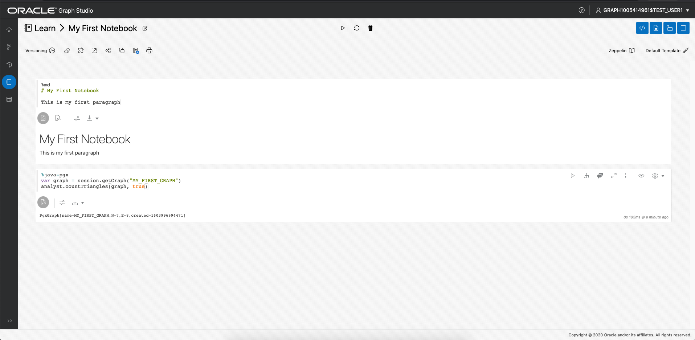
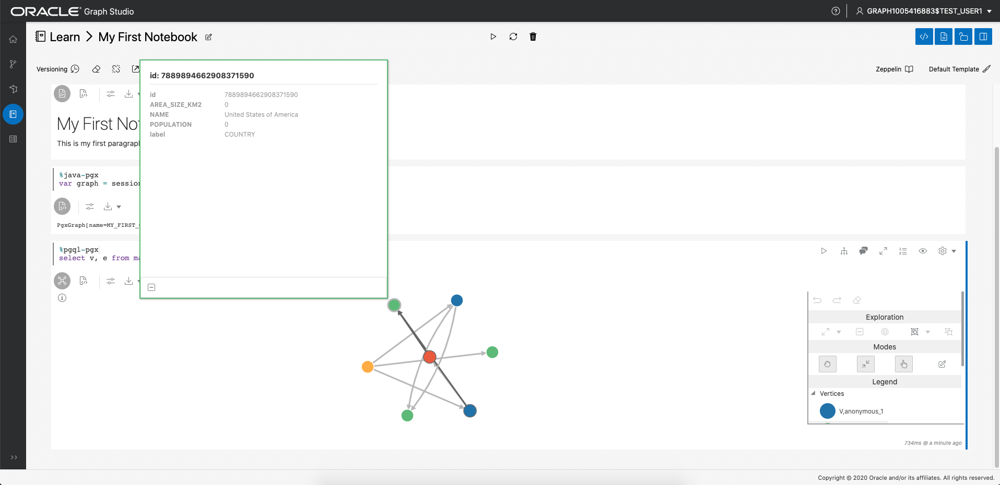

# Hello World: Crear, analizar y visualizar un gráfico desde cero

## Introducción

En este laboratorio, explorará Graph Studio y aprenderá cómo puede crear y analizar un gráfico desde cero muy rápidamente mediante la instancia de Autonomous Data Warehouse - Sin servidor (ADW) o Autonomous Transaction Processing - Sin servidor (ATP).

**Nota: Si bien este laboratorio utiliza Autonomous Data Warehouse, los pasos son idénticos para crear y conectarse a una base de datos de Autonomous Transaction Processing.**

Tiempo estimado: 10 minutos.

### Objetivos

Información sobre cómo

*   conexión a la instancia de Autonomous Database mediante **Graph Studio**
*   Crear rápidamente un gráfico muy simple desde cero utilizando PGQL
*   Cargar gráficos en memoria para análisis
*   crear un bloc de notas simple
*   escribir y ejecutar párrafos básicos de Markdown, PGX Java y PGQL para portátiles
*   visualizar datos de gráficos

### Requisitos

*   En la siguiente práctica se necesita una cuenta de Autonomous Data Warehouse - Sin servidor o Autonomous Transaction Processing - Sin servidor.

## Tarea 1: Conexión a Autonomous Database mediante Graph Studio

1.  Si tiene la URL de Graph Studio, continúe con el paso 3.
    
    Conéctese a la consola de OCI, seleccione la instancia de Autonomous Database y, a continuación, haga clic en el separador Configuración de herramientas del menú de la página de detalles de la izquierda.  
    Localice el enlace Graph Studio y cópielo y péguelo en una nueva ventana o separador del explorador.
    
    
    
2.  Como alternativa, si todavía tiene Database Actions abierto, haga clic en la tarjeta de Graph Studio para abrirla en una nueva página o pestaña del explorador.
    
    
    
3.  Introduzca las credenciales de la cuenta de Autonomous Database o el usuario activado para gráficos (por ejemplo, `GRAPHUSER`) en la pantalla de conexión.  
    **No** utilice `ADMIN`.
    
    
    
4.  Haga clic en el botón "Sign In".
    

## Tarea 2: Creación de un gráfico simple con PGQL

1.  En la siguiente captura de pantalla se muestra la interfaz de usuario de Graph Studio con los iconos de menú o navegación de la izquierda. Se desplazan a las páginas Home, Models, Graphs, Notebooks y Jobs, respectivamente.
    
    
    
2.  Haga clic en el icono de menú `Graphs`:
    
    
    
3.  A continuación, haga clic en el botón `</> Query` de la página. Debería ver una página titulada **</> Query Playground**
    
    
    
4.  Copie y pegue el siguiente código DDL en el área de texto de entrada de PGQL:
    
        <copy>
        DROP PROPERTY GRAPH my_first_graph ;
        
        CREATE PROPERTY GRAPH my_first_graph ;
        
        INSERT INTO my_first_graph
            VERTEX austin LABELS (City) PROPERTIES (austin.name = 'Austin', austin.population = 964254),
            VERTEX tokyo LABELS (City) PROPERTIES (tokyo.name = 'Tokyo', tokyo.population = 9273672),
            VERTEX zurich LABELS (City) PROPERTIES (zurich.name = 'Zurich', zurich.population = 402762),
            VERTEX europe LABELS (Continent) PROPERTIES (europe.name = 'Europe'),
            VERTEX US LABELS (Country) PROPERTIES (US.name = 'United States of America'),
            VERTEX texas LABELS (State) PROPERTIES (texas.name = 'Texas', texas.area_size_km2 = 695662),
            VERTEX japan LABELS (Country) PROPERTIES (japan.name = 'Japan', japan.area_size_km2 = 377975),
            EDGE austinCapital BETWEEN austin AND texas LABELS (capital_of),
            EDGE austinCountry BETWEEN austin AND US LABELS (located_in),
            EDGE texasCountry BETWEEN texas AND US LABELS (located_in),
            EDGE zurichContinent BETWEEN zurich AND europe LABELS (located_in),
            EDGE tokyoCapital BETWEEN tokyo AND japan LABELS (capital_of),
            EDGE tokyoCountry BETWEEN tokyo AND japan LABELS (located_in),
            EDGE zurichTokyo BETWEEN zurich AND tokyo LABELS (connecting_flight) PROPERTIES (zurichTokyo.distance_km = 9576),
            EDGE zurichAustin BETWEEN zurich AND austin LABELS (connecting_flight) PROPERTIES (zurichAustin.distance_km = 8674)  
        
        </copy>
        
    
    Esto creará un gráfico muy simple con 7 vértices y 8 bordes. Para obtener más información sobre la sintaxis, consulte la [especificaciónPGQL](https://pgql-lang.org/spec/1.3/#inserting-vertices)
    
    5.  Haga clic en el botón Execute situado en la parte superior izquierda.
        
        
        

## Tarea 3: Carga del gráfico en la memoria

1.  Vaya a la página Graphs:
    
    
    
2.  Haga clic en `MY_FIRST_GRAPH`:
    
    
    
3.  Haga clic en el icono **Cargar en memoria** situado a la derecha de la sección de detalles:
    
    
    
    En el cuadro de diálogo que aparece, haga clic en **Sí**.
    
    
    
4.  Se le redirige a la página Jobs. Espere a que finalice el trabajo.
    
    
    

## Tarea 4: Creación del primer bloc de notas

1.  Navegue a la página Notebooks:
    
    
    
2.  Haga clic en el botón **Crear** de la derecha.
    
3.  Asigne al bloc de notas el nombre **Learn/My First Notebook** y, a continuación, haga clic en **Create**. Esto creará una carpeta denominada `Learn` y la nota `My First Notebook` que contiene.
    
    
    
4.  Cada bloc de notas se organiza en un juego de **párrafos**. Cada párrafo tiene una entrada (denominada _Código_) y una salida (denominada **Resultado**). En Graph Studio, hay 7 tipos de párrafos:
    
    
    

Introduzca el siguiente texto en el primer párrafo:

    <copy>
    %md
    # My First Notebook
    
    This is my first paragraph
    </copy>
    

`%md` indica que la entrada de párrafo es el código de rebaja.

1.  Ejecute el párrafo:
    
    
    
    Verá el código de Markdown representado como HTML:
    
    
    
    Los párrafos de rebaja son útiles para agregar explicaciones a los blocs de notas y ordenarlos en capítulos. Puedes incrustar imágenes e incluso videos usando Markdown o sintaxis HTML, pruébalo.
    

## Tarea 5: Analizar, consultar y visualizar el gráfico

1.  Agregue otro párrafo al bloc de notas pasando el mouse en el centro de la parte inferior del paragrah y haciendo clic en el botón **+** que aparece.
    
    
    
2.  A continuación, introduzca el siguiente código en el nuevo párrafo.
    
        <copy>
        %java-pgx
        var graph = session.getGraph("MY_FIRST_GRAPH", GraphSource.PG_VIEW)
        </copy>
        
3.  Ejecute ese párrafo, verá que hemos hecho referencia con éxito a nuestro gráfico que acabamos de crear desde cero a través de las API de Java de PGX.
    
    
    

**Nota: Algunos usuarios han detectado un problema al copiar y pegar el código `%md` y `%java-pgx` anterior.** Si aparece un mensaje de error `"Invalid Parameter. No interpreter with the name 'java-pgx' is currently registered to the server."`, suprima el texto o el párrafo e introduzca manualmente el mismo texto y vuelva a ejecutar el párrafo.  
En la siguiente captura de pantalla se muestra el mensaje de error que han encontrado algunos, pero no todos.  


4.  Modifique el párrafo para ejecutar un algoritmo de gráfico. Por ejemplo:
    
        <copy>
        %java-pgx
        var graph = session.getGraph("MY_FIRST_GRAPH")
        analyst.countTriangles(graph, true)
        </copy>
        
5.  Vuelva a ejecutar el párrafo actualizado. Al finalizar, muestra el resultado, es decir, el gráfico contiene exactamente un triángulo.
    
    
    
6.  Agregue un párrafo e introduzca el siguiente código. Será un párrafo de PGQL, ya que empieza por la línea `%pgql-pgx`.
    
        <copy>
        %pgql-pgx
        select v, e from match (v)-[e]->() on MY_FIRST_GRAPH
        </copy>
        
    
    
    
7.  Ejecute ese párrafo y los resultados se representarán como un gráfico interactivo.
    
    
    
8.  Haga clic con el botón derecho en uno de los vértices de la pantalla para ver todos los detalles de ese vértice.
    
    
    
9.  Haga clic en el icono de configuración de la visualización.
    
    
    
10.  Vaya al separador **Visualización** y seleccione **NOMBRE** como etiqueta que se va a presentar junto a los vértices:
    

        
    
    You now see the name next to each vertex, which will help you better understand the visualization. There are lots of other options to help you make sense of the graph. Feel free to play around with the settings as you like.
    

11.  Agregue otro párrafo con la siguiente consulta y ejecútelo.

    ```
    <copy>
    %pgql-pgx
    select c.NAME, c.POPULATION from match (c:City) on MY_FIRST_GRAPH order by c.POPULATION desc
    </copy>
    ```
    
    
    

12.  Cambie la salida a un gráfico circular.

       
    

¡Felicidades! Ha creado, analizado y visualizado correctamente un gráfico desde cero con Graph Studio. Esperamos que este pequeño ejemplo le haya proporcionado una idea de cómo puede utilizar Autonomous Database como base de datos orientada a grafos.

**Continúe con el siguiente laboratorio** para ver ejemplos más complejos de cómo crear y analizar gráficos.

## Reconocimientos

*   **Autor**: Jayant Sharma, desarrollo de productos
*   **Contribuyentes**: JKorbi Schmid, Rahul Tasker, Desarrollo de productos
*   **Última actualización por/fecha**: Jayant Sharma, junio de 2023