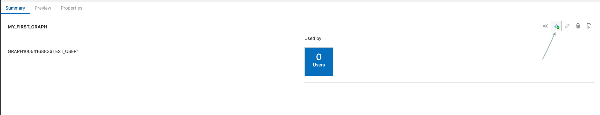
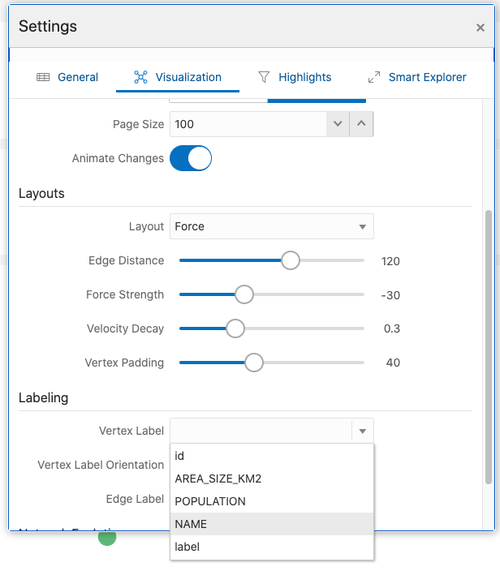

# Hello World : Créer, analyser et visualiser un graphique à partir de zéro

## Présentation

Au cours de cet atelier, vous allez découvrir Graph Studio et comment créer et analyser un graphique à partir de zéro très rapidement à l'aide d'une instance Autonomous Data Warehouse - sans serveur (ADW) ou Autonomous Transaction Processing - sans serveur (ATP).

**Remarque : bien que cet atelier utilise Autonomous Data Warehouse, les étapes sont identiques pour la création et la connexion à une base de données Autonomous Transaction Processing.**

Temps estimé : 10 minutes.

### Objectifs

Découvrez comment :

*   connexion à Autonomous Database à l'aide de **Graph Studio**
*   créer rapidement un graphique très simplement à partir de zéro à l'aide de PGQL
*   charger des graphiques dans la mémoire pour analyse
*   créer un bloc-notes simple
*   Ecrire et exécuter des paragraphes de bloc-notes Markdown, PGX Java et PGQL de base
*   visualiser des données de graphique

### Prérequis

*   L'exercice suivant nécessite un compte Autonomous Data Warehouse - Sans serveur ou Autonomous Transaction Processing - Sans serveur.

## Tâche 1 : connexion à votre instance Autonomous Database à l'aide de Graph Studio

1.  Si vous disposez de l'URL Graph Studio, passez à l'étape 3.
    
    Connectez-vous à la console OCI, choisissez l'instance Autonomous Database, puis cliquez sur l'onglet Configuration des outils dans le menu de la page de détails à gauche.  
    Localisez le lien Graph Studio et copiez-le et collez-le dans un nouvel onglet ou une nouvelle fenêtre du navigateur.
    
    
    
2.  Sinon, si Database Actions est toujours ouvert, cliquez sur la carte Graph Studio pour l'ouvrir dans une nouvelle page ou un nouvel onglet de votre navigateur.
    
    
    
3.  Entrez les informations d'identification du compte Autonomous Database ou l'utilisateur compatible Graph (par exemple, `GRAPHUSER`) dans l'écran de connexion.  
    N'utilisez **pas** `ADMIN`.
    
    
    
4.  Cliquez sur le bouton Se connecter.
    

## Tâche 2 : créer un graphique simple à l'aide de PGQL

1.  La capture d'écran suivante présente l'interface utilisateur de Graph Studio avec les icônes de menu ou de navigation sur la gauche. Ils accèdent respectivement aux pages Accueil, Modèles, Graphiques, Blocs-notes et Travaux.
    
    
    
2.  Cliquez sur l'icône de menu `Graphs` :
    
    
    
3.  Cliquez ensuite sur le bouton `</> Query` sur la page. Vous devriez voir une page intitulée **</> Query Playground**
    
    
    
4.  Copiez et collez le code DDL suivant dans la zone de texte d'entrée PGQL :
    
        <copy>
        DROP PROPERTY GRAPH my_first_graph ;
        
        CREATE PROPERTY GRAPH my_first_graph ;
        
        INSERT INTO my_first_graph
            VERTEX austin LABELS (City) PROPERTIES (austin.name = 'Austin', austin.population = 964254),
            VERTEX tokyo LABELS (City) PROPERTIES (tokyo.name = 'Tokyo', tokyo.population = 9273672),
            VERTEX zurich LABELS (City) PROPERTIES (zurich.name = 'Zurich', zurich.population = 402762),
            VERTEX europe LABELS (Continent) PROPERTIES (europe.name = 'Europe'),
            VERTEX US LABELS (Country) PROPERTIES (US.name = 'United States of America'),
            VERTEX texas LABELS (State) PROPERTIES (texas.name = 'Texas', texas.area_size_km2 = 695662),
            VERTEX japan LABELS (Country) PROPERTIES (japan.name = 'Japan', japan.area_size_km2 = 377975),
            EDGE austinCapital BETWEEN austin AND texas LABELS (capital_of),
            EDGE austinCountry BETWEEN austin AND US LABELS (located_in),
            EDGE texasCountry BETWEEN texas AND US LABELS (located_in),
            EDGE zurichContinent BETWEEN zurich AND europe LABELS (located_in),
            EDGE tokyoCapital BETWEEN tokyo AND japan LABELS (capital_of),
            EDGE tokyoCountry BETWEEN tokyo AND japan LABELS (located_in),
            EDGE zurichTokyo BETWEEN zurich AND tokyo LABELS (connecting_flight) PROPERTIES (zurichTokyo.distance_km = 9576),
            EDGE zurichAustin BETWEEN zurich AND austin LABELS (connecting_flight) PROPERTIES (zurichAustin.distance_km = 8674)  
        
        </copy>
        
    
    Cela créera un graphique très simple avec 7 sommets et 8 arêtes. Pour plus d'informations sur la syntaxe, reportez-vous à la [spécification PGQL](https://pgql-lang.org/spec/1.3/#inserting-vertices)
    
    5.  Cliquez sur le bouton Execute en haut à gauche.
        
        
        

## Tâche 3 : charger le graphique en mémoire

1.  Accédez à la page Graphiques :
    
    
    
2.  Cliquez sur `MY_FIRST_GRAPH` :
    
    
    
3.  Cliquez sur l'icône **Charger dans la mémoire** à droite de la section de détails :
    
    
    
    Dans la boîte de dialogue qui apparaît, cliquez sur **Oui**.
    
    
    
4.  Vous êtes redirigé vers la page Travaux. Attendez la fin du travail.
    
    
    

## Tâche 4 : créer votre premier bloc-notes

1.  Accédez à la page Blocs-notes :
    
    
    
2.  Cliquez sur le bouton **Créer** à droite.
    
3.  Nommez le bloc-notes **Learn/My First Notebook**, puis cliquez sur **Create**. Cela créera un dossier nommé `Learn` et la note `My First Notebook` qu'il contient.
    
    
    
4.  Chaque bloc-notes est organisé en un ensemble de **paragraphes**. Chaque paragraphe a une entrée (appelée _Code_) et une sortie (appelée **Résultat**). Dans Graph Studio, il existe 7 types de paragraphes :
    
    
    

Entrez le texte suivant dans le premier paragraphe.

    <copy>
    %md
    # My First Notebook
    
    This is my first paragraph
    </copy>
    

`%md` indique que l'entrée de paragraphe est un code de démarque.

1.  Exécutez le paragraphe :
    
    
    
    Le code Markdown sera affiché au format HTML :
    
    
    
    Les paragraphes de démarque sont utiles pour ajouter des explications à vos blocs-notes et les classer dans des chapitres. Vous pouvez intégrer des images et même des vidéos en utilisant la syntaxe Markdown ou HTML, essayez-le.
    

## Tâche 5 : analyser, interroger et visualiser le graphique

1.  Ajoutez un autre paragraphe au bloc-notes en positionnant le curseur au milieu du bas de la paragrahe et en cliquant sur le bouton **+** qui apparaît.
    
    
    
2.  Entrez ensuite le code suivant dans le nouveau paragraphe.
    
        <copy>
        %java-pgx
        var graph = session.getGraph("MY_FIRST_GRAPH", GraphSource.PG_VIEW)
        </copy>
        
3.  Exécutez ce paragraphe, vous verrez que nous avons référencé avec succès notre graphique que nous venons de créer à partir de zéro via les API Java PGX.
    
    
    

**Remarque : certains utilisateurs ont rencontré un problème lors de la copie et du collage du code `%md` et `%java-pgx` ci-dessus.** Si le message d'erreur `"Invalid Parameter. No interpreter with the name 'java-pgx' is currently registered to the server."` s'affiche, supprimez le texte ou le paragraphe, saisissez manuellement le même texte et réexécutez le paragraphe.  
La capture d'écran suivante présente le message d'erreur rencontré, mais pas tous.  


4.  Modifiez le paragraphe pour exécuter un algorithme de graphique. Par exemple :
    
        <copy>
        %java-pgx
        var graph = session.getGraph("MY_FIRST_GRAPH")
        analyst.countTriangles(graph, true)
        </copy>
        
5.  Exécutez à nouveau le paragraphe mis à jour. Une fois terminé, il affiche le résultat, c'est-à-dire que le graphique contient exactement un triangle.
    
    
    
6.  Ajoutez un paragraphe et saisissez le code suivant. Il s'agit d'un paragraphe PGQL car il commence par la ligne `%pgql-pgx`.
    
        <copy>
        %pgql-pgx
        select v, e from match (v)-[e]->() on MY_FIRST_GRAPH
        </copy>
        
    
    
    
7.  Exécutez ce paragraphe et les résultats sont affichés sous forme de graphique interactif.
    
    
    
8.  Cliquez avec le bouton droit de la souris sur l'un des sommets de l'écran pour afficher tous les détails de ce sommet.
    
    
    
9.  Cliquez sur l'icône Paramètres de la visualisation.
    
    
    
10.  Accédez à l'onglet **Visualisation** et sélectionnez **NAME** comme libellé à afficher en regard des sommets :
    

        
    
    You now see the name next to each vertex, which will help you better understand the visualization. There are lots of other options to help you make sense of the graph. Feel free to play around with the settings as you like.
    

11.  Ajoutez un autre paragraphe avec la requête suivante et exécutez-le.

    ```
    <copy>
    %pgql-pgx
    select c.NAME, c.POPULATION from match (c:City) on MY_FIRST_GRAPH order by c.POPULATION desc
    </copy>
    ```
    
    
    

12.  Remplacez la sortie par un graphique à secteurs.

       
    

Félicitations ! Vous avez créé, analysé et visualisé un graphique de toutes pièces à l'aide de Graph Studio. Nous espérons que ce petit exemple vous a permis de comprendre comment utiliser votre instance Autonomous Database en tant que base de données orientée graphe.

**Passez à l'exercice suivant** pour voir des exemples plus complexes de création et d'analyse de graphiques.

## Accusés de réception

*   **Auteur** - Jayant Sharma, Product Development
*   **Contributeurs** - JKorbi Schmid, Rahul Tasker, Développement de produits
*   **Dernière mise à jour par/date** - Jayant Sharma, juin 2023