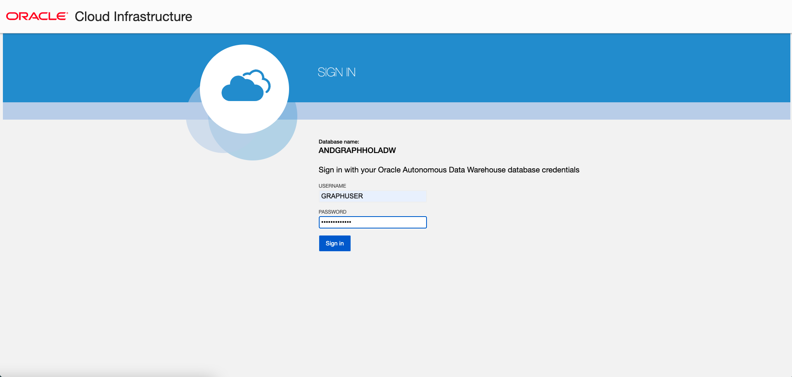
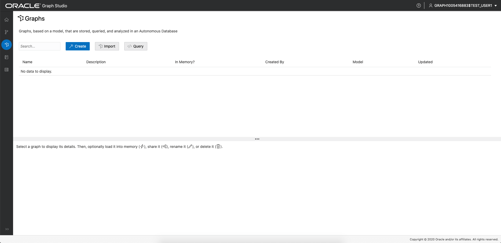
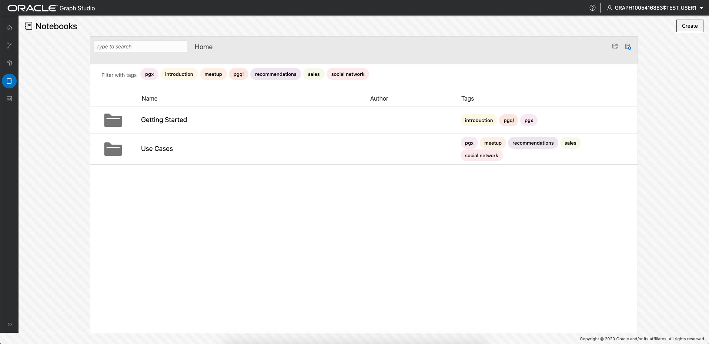
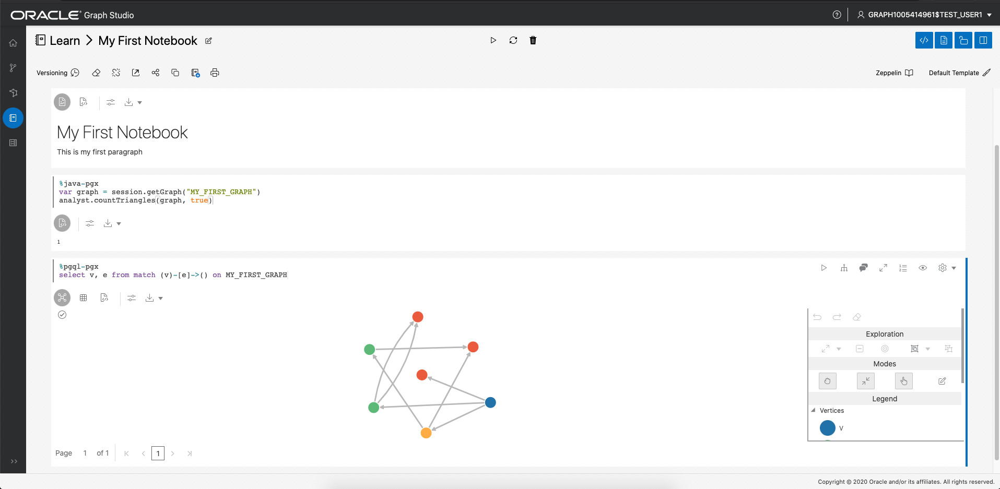

# Hello World: グラフを最初から作成、分析、ビジュアル化

## 概要

このラボでは、Graph Studioを確認し、Autonomous Data Warehouse - Serverless (ADW)またはAutonomous Transaction Processing - Serverless (ATP)インスタンスを使用して、グラフを最初から作成および分析する方法を学習します。

**ノート: この演習ではAutonomous Data Warehouseを使用しますが、ステップはAutonomous Transaction Processingデータベースの作成と接続と同じです。**

見積時間: 10分。

### 目標

学習方法

*   **Graph Studio**を使用したAutonomous Databaseへの接続
*   PGQLを使用して非常にシンプルなグラフを最初からすばやく作成
*   分析のためにグラフをメモリーにロード
*   単純なノートブックの作成
*   基本的なMarkdown、PGX JavaおよびPGQLノートブックの段落の記述と実行
*   グラフ・データの視覚化

### 前提条件

*   次のラボでは、Autonomous Data Warehouse - ServerlessアカウントまたはAutonomous Transaction Processing - Serverlessアカウントが必要です。

## タスク1: Graph Studioを使用したAutonomous Databaseへの接続

1.  Graph Studio URLがある場合は、ステップ3に進みます。
    
    OCIコンソールにログインし、Autonomous Databaseインスタンスを選択し、左側にある詳細ページ・メニューの「ツール構成」タブをクリックします。  
    「Graph Studio」リンクを見つけてコピーし、新しいブラウザ・タブまたはウィンドウに貼り付けます。
    
    
    
2.  または、データベース・アクションがまだ開いている場合は、Graph Studioカードをクリックして、ブラウザの新しいページまたはタブで開きます。
    
    
    
3.  Autonomous Databaseアカウント資格証明またはグラフ対応ユーザー(`GRAPHUSER`など)をログイン画面に入力します。  
    `ADMIN`を使用**しないでください**。
    
    
    
4.  次に、「Sign In」ボタンをクリックします。
    

## タスク2: PGQLを使用した単純なグラフの作成

1.  次のスクリーンショットは、左側にメニューまたはナビゲーション・アイコンが表示されたGraph Studioユーザー・インタフェースを示しています。それぞれ、「ホーム」、「モデル」、「グラフ」、「ノート」および「ジョブ」ページに移動します。
    
    
    
2.  `Graphs`メニュー・アイコンをクリックします。
    
    
    
3.  次に、ページの`</> Query`ボタンをクリックします。「**</> Query Playground**」というタイトルのページが表示されます。
    
    
    
4.  次のDDLコードをコピーしてPGQL入力テキスト領域に貼り付けます。
    
        <copy>
        DROP PROPERTY GRAPH my_first_graph ;
        
        CREATE PROPERTY GRAPH my_first_graph ;
        
        INSERT INTO my_first_graph
            VERTEX austin LABELS (City) PROPERTIES (austin.name = 'Austin', austin.population = 964254),
            VERTEX tokyo LABELS (City) PROPERTIES (tokyo.name = 'Tokyo', tokyo.population = 9273672),
            VERTEX zurich LABELS (City) PROPERTIES (zurich.name = 'Zurich', zurich.population = 402762),
            VERTEX europe LABELS (Continent) PROPERTIES (europe.name = 'Europe'),
            VERTEX US LABELS (Country) PROPERTIES (US.name = 'United States of America'),
            VERTEX texas LABELS (State) PROPERTIES (texas.name = 'Texas', texas.area_size_km2 = 695662),
            VERTEX japan LABELS (Country) PROPERTIES (japan.name = 'Japan', japan.area_size_km2 = 377975),
            EDGE austinCapital BETWEEN austin AND texas LABELS (capital_of),
            EDGE austinCountry BETWEEN austin AND US LABELS (located_in),
            EDGE texasCountry BETWEEN texas AND US LABELS (located_in),
            EDGE zurichContinent BETWEEN zurich AND europe LABELS (located_in),
            EDGE tokyoCapital BETWEEN tokyo AND japan LABELS (capital_of),
            EDGE tokyoCountry BETWEEN tokyo AND japan LABELS (located_in),
            EDGE zurichTokyo BETWEEN zurich AND tokyo LABELS (connecting_flight) PROPERTIES (zurichTokyo.distance_km = 9576),
            EDGE zurichAustin BETWEEN zurich AND austin LABELS (connecting_flight) PROPERTIES (zurichAustin.distance_km = 8674)  
        
        </copy>
        
    
    これにより、7つの頂点と8つのエッジを持つ非常に単純なグラフが作成されます。構文の詳細は、[PGQL仕様](https://pgql-lang.org/spec/1.3/#inserting-vertices)を参照してください
    
    5.  左上の「Execute」ボタンをクリックします。
        
        
        

## タスク3: メモリーへのグラフのロード

1.  「グラフ」ページにナビゲートします。
    
    
    
2.  `MY_FIRST_GRAPH`をクリックします。
    
    
    
3.  詳細セクションの右側にある**「メモリーにロード」**アイコンをクリックします。
    
    
    
    表示されるダイアログで**「はい」**をクリックします。
    
    
    
4.  「ジョブ」ページにリダイレクトされます。ジョブが完了するまで待ちます。
    
    
    

## タスク4: 最初のノートブックの作成

1.  「ノートブック」ページにナビゲートします。
    
    
    
2.  右側の**「作成」**ボタンをクリックします。
    
3.  ノートブックに**「学習/最初のノートブック」**という名前を付け、**「作成」**をクリックします。これにより、`Learn`という名前のフォルダと、その中にノート`My First Notebook`が作成されます。
    
    
    
4.  各ノートブックは、一連の**段落**に編成されます。各段落には、入力(_コード_と呼ばれる)と出力(**結果**と呼ばれる)があります。Graph Studioには、次の7種類の段落があります。
    
    
    

最初の段落に次のテキストを入力します。

    <copy>
    %md
    # My First Notebook
    
    This is my first paragraph
    </copy>
    

`%md`は、段落入力がMarkdownコードであることを示します。

1.  段落を実行します。
    
    
    
    HTMLとしてレンダリングされた値下げコードが表示されます。
    
    
    
    Markdownの段落は、ノートブックに説明を追加し、章に並べ替える場合に便利です。MarkdownまたはHTML構文を使用してイメージやビデオを埋め込むことができ、試してみてください。
    

## タスク5: グラフの分析、問合せおよびビジュアル化

1.  パラグラの下部中央にカーソルを置き、表示される**「+」**ボタンをクリックして、ノートブックに別の段落を追加します。
    
    
    
2.  次に、新しい段落に次のコードを入力します。
    
        <copy>
        %java-pgx
        var graph = session.getGraph("MY_FIRST_GRAPH", GraphSource.PG_VIEW)
        </copy>
        
3.  その段落を実行すると、PGX Java APIを介して最初から作成したグラフを正常に参照できます。
    
    
    

**ノート: 前述の`%md`および`%java-pgx`コードをコピーして貼り付けるときに問題が発生したユーザーもあります。**エラー・メッセージ`"Invalid Parameter. No interpreter with the name 'java-pgx' is currently registered to the server."`が表示された場合は、テキストまたは段落を削除し、同じテキストを手動で入力して、段落を再実行します。  
次のスクリーンショットは、発生したエラー・メッセージの一部(すべてではない)を示しています。  


4.  グラフ・アルゴリズムを実行するように段落を変更します。次に例を示します。
    
        <copy>
        %java-pgx
        var graph = session.getGraph("MY_FIRST_GRAPH")
        analyst.countTriangles(graph, true)
        </copy>
        
5.  更新した段落を再度実行します。完了すると、結果が表示されます。つまり、グラフには1つの三角形のみが含まれます。
    
    
    
6.  段落を追加し、次のコードを入力します。これは、`%PGQL-pgx`行で始まるPGQL段落になります。
    
        <copy>
        %pgql-pgx
        select v, e from match (v)-[e]->() on MY_FIRST_GRAPH
        </copy>
        
    
    
    
7.  その段落を実行すると、結果がインタラクティブなグラフとしてレンダリングされます。
    
    
    
8.  画面上の頂点のいずれかを右クリックして、その頂点のすべての詳細を表示します。
    
    
    
9.  ビジュアライゼーションの設定アイコンをクリックします。
    
    
    
10.  **「ビジュアライゼーション」**タブにナビゲートし、頂点の横にレンダリングするラベルとして**「名前」**を選択します。
    

        
    
    You now see the name next to each vertex, which will help you better understand the visualization. There are lots of other options to help you make sense of the graph. Feel free to play around with the settings as you like.
    

11.  次の問合せを使用して別の段落を追加し、実行します。

    ```
    <copy>
    %pgql-pgx
    select c.NAME, c.POPULATION from match (c:City) on MY_FIRST_GRAPH order by c.POPULATION desc
    </copy>
    ```
    
    
    

12.  出力を円グラフに変更します。

       
    

おめでとうございます!Graph Studioを使用して、グラフを最初から正常に作成、分析およびビジュアル化しました。この小さな例によって、Autonomous Databaseをグラフ・データベースとして使用する方法がわかります。

グラフを作成および分析する方法のより複雑な例を参照するには、**次の演習に進んでください**。

## 確認

*   **著者** - Jayant Sharma、製品開発
*   **貢献者** - JKorbi Schmid、Rahul Tasker、製品開発
*   **最終更新者/日付** - Jayant Sharma、2023年6月