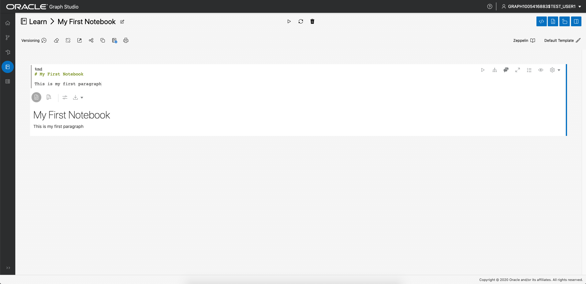
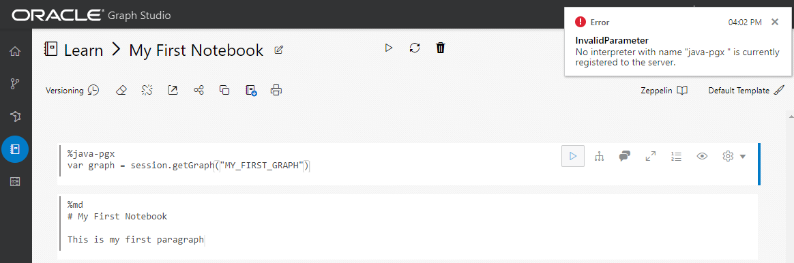

# Hello World: 처음부터 그래프 생성, 분석 및 시각화

## 소개

이 실습에서는 Graph Studio를 살펴보고 Autonomous Data Warehouse - Serverless(ADW) 또는 Autonomous Transaction Processing - Serverless(ATP) 인스턴스를 사용하여 그래프를 매우 빠르게 생성 및 분석하는 방법을 알아봅니다.

**주: 이 실습에서는 Autonomous Data Warehouse를 사용하지만 단계는 Autonomous Transaction Processing 데이터베이스를 생성하고 연결하는 것과 동일합니다.**

예상 시간: 10분

### 목표

방법 알아보기

*   **Graph Studio**를 사용해 Autonomous Database에 연결
*   PGQL을 사용하여 매우 단순한 그래프를 빠르게 생성
*   분석을 위해 메모리에 그래프 로드
*   간단한 노트북 생성
*   기본 Markdown, PGX Java 및 PGQL 노트북 단락 작성 및 실행
*   그래프 데이터 시각화

### 필요 조건

*   다음 랩에는 Autonomous Data Warehouse - Serverless 또는 Autonomous Transaction Processing - Serverless 계정이 필요합니다.

## 작업 1: Graph Studio를 사용하여 Autonomous Database에 접속

1.  Graph Studio URL이 있으면 3단계로 이동합니다.
    
    OCI 콘솔에 로그인하여 Autonomous Database 인스턴스를 선택한 후 왼쪽의 세부정보 페이지 메뉴에서 Tools Configuration 탭을 누릅니다.  
    Graph Studio 링크를 찾아 복사하여 새 브라우저 탭 또는 창에 붙여넣습니다.
    
    
    
2.  또는 Database Actions가 열려 있는 경우 Graph Studio 카드를 눌러 브라우저의 새 페이지 또는 탭에서 엽니다.
    
    
    
3.  Autonomous Database 계정 인증서 또는 그래프 지원 사용자(예: `GRAPHUSER`)를 로그인 화면에 입력합니다.  
    `ADMIN`를 사용하지 **마십시오**.
    
    
    
4.  그런 다음 "로그인" 단추를 누릅니다.
    

## 작업 2: PGQL을 사용하여 단순 그래프 생성

1.  다음 스크린샷은 왼쪽에 있는 메뉴 또는 탐색 아이콘이 있는 Graph Studio 사용자 인터페이스를 보여줍니다. 홈, 모델, 그래프, 노트북 및 작업 페이지로 각각 이동됩니다.
    
    
    
2.  `Graphs` 메뉴 아이콘을 누릅니다.
    
    
    
3.  그런 다음 페이지에서 `</> Query` 단추를 누릅니다. **</> 질의 놀이터**라는 제목의 페이지가 표시됩니다.
    
    
    
4.  다음 DDL 코드를 복사하여 PGQL 입력 텍스트 영역에 붙여넣습니다.
    
        <copy>
        DROP PROPERTY GRAPH my_first_graph ;
        
        CREATE PROPERTY GRAPH my_first_graph ;
        
        INSERT INTO my_first_graph
            VERTEX austin LABELS (City) PROPERTIES (austin.name = 'Austin', austin.population = 964254),
            VERTEX tokyo LABELS (City) PROPERTIES (tokyo.name = 'Tokyo', tokyo.population = 9273672),
            VERTEX zurich LABELS (City) PROPERTIES (zurich.name = 'Zurich', zurich.population = 402762),
            VERTEX europe LABELS (Continent) PROPERTIES (europe.name = 'Europe'),
            VERTEX US LABELS (Country) PROPERTIES (US.name = 'United States of America'),
            VERTEX texas LABELS (State) PROPERTIES (texas.name = 'Texas', texas.area_size_km2 = 695662),
            VERTEX japan LABELS (Country) PROPERTIES (japan.name = 'Japan', japan.area_size_km2 = 377975),
            EDGE austinCapital BETWEEN austin AND texas LABELS (capital_of),
            EDGE austinCountry BETWEEN austin AND US LABELS (located_in),
            EDGE texasCountry BETWEEN texas AND US LABELS (located_in),
            EDGE zurichContinent BETWEEN zurich AND europe LABELS (located_in),
            EDGE tokyoCapital BETWEEN tokyo AND japan LABELS (capital_of),
            EDGE tokyoCountry BETWEEN tokyo AND japan LABELS (located_in),
            EDGE zurichTokyo BETWEEN zurich AND tokyo LABELS (connecting_flight) PROPERTIES (zurichTokyo.distance_km = 9576),
            EDGE zurichAustin BETWEEN zurich AND austin LABELS (connecting_flight) PROPERTIES (zurichAustin.distance_km = 8674)  
        
        </copy>
        
    
    그러면 7개의 정점과 8개의 가장자리가 있는 매우 간단한 그래프가 생성됩니다. 구문에 대한 자세한 내용은 [PGQL 사양](https://pgql-lang.org/spec/1.3/#inserting-vertices)을 참조하십시오.
    
    5.  왼쪽 위에 있는 Execute 버튼을 누릅니다.
        
        
        

## 작업 3: 메모리로 그래프 로드

1.  Graphs 페이지로 이동합니다.
    
    
    
2.  `MY_FIRST_GRAPH`을 누릅니다.
    
    
    
3.  세부정보 섹션 오른쪽에 있는 **메모리로 로드** 아이콘을 누릅니다.
    
    
    
    표시되는 대화상자에서 **예**를 누릅니다.
    
    
    
4.  Jobs 페이지로 재지정됩니다. 작업이 완료될 때까지 기다립니다.
    
    
    

## 작업 4: 첫 번째 노트북 만들기

1.  Notebooks 페이지로 이동합니다.
    
    
    
2.  오른쪽에 있는 **Create(만들기)** 버튼을 누릅니다.
    
3.  노트북 이름을 **Learn/My First Notebook**으로 지정한 다음 **Create**를 누릅니다. 그러면 `Learn`이라는 폴더와 그 안에 `My First Notebook` 메모가 생성됩니다.
    
    
    
4.  각 노트북은 **단락** 집합으로 구성됩니다. 각 단락에는 입력(_코드_)과 출력(**결과**)이 있습니다. Graph Studio에는 7가지 유형의 단락이 있습니다.
    
    
    

첫번째 단락에 다음 텍스트를 입력합니다.

    <copy>
    %md
    # My First Notebook
    
    This is my first paragraph
    </copy>
    

`%md`은 단락 입력이 마크다운 코드임을 나타냅니다.

1.  단락을 실행합니다.
    
    
    
    HTML로 렌더링된 마크다운 코드가 표시됩니다.
    
    
    
    마크다운 단락은 노트북에 설명을 추가하고 장으로 정렬하는 데 유용합니다. Markdown 또는 HTML 구문을 사용하여 이미지와 비디오를 포함시킬 수 있습니다.
    

## 작업 5: 그래프 분석, 쿼리 및 시각화

1.  그래프의 아래쪽 가운데에 마우스를 갖다 대고 나타나는 **+** 버튼을 눌러 노트북에 다른 단락을 추가합니다.
    
    
    
2.  그런 다음 새 단락에 다음 코드를 입력합니다.
    
        <copy>
        %java-pgx
        var graph = session.getGraph("MY_FIRST_GRAPH", GraphSource.PG_VIEW)
        </copy>
        
3.  해당 단락을 실행하면 방금 PGX Java API를 통해 처음부터 생성한 그래프를 성공적으로 참조한 것을 확인할 수 있습니다.
    
    
    

**주: 일부 사용자는 위의 `%md` 및 `%java-pgx` 코드를 복사하여 붙여넣을 때 문제가 발생했습니다.** 오류 메시지 `"Invalid Parameter. No interpreter with the name 'java-pgx' is currently registered to the server."`가 표시되면 텍스트 또는 단락을 삭제하고 동일한 텍스트를 수동으로 입력한 후 단락을 다시 실행합니다.  
다음 스크린샷은 발생한 일부(전부는 아님) 오류 메시지를 보여줍니다.  


4.  단락을 수정하여 그래프 알고리즘을 실행합니다. 예를 들면 다음과 같습니다.
    
        <copy>
        %java-pgx
        var graph = session.getGraph("MY_FIRST_GRAPH")
        analyst.countTriangles(graph, true)
        </copy>
        
5.  업데이트된 단락을 다시 실행합니다. 완료되면 결과가 표시됩니다. 즉, 그래프에 정확히 하나의 삼각형이 포함됩니다.
    
    
    
6.  단락을 추가하고 다음 코드를 입력합니다. `%pgql-pgx` 행으로 시작하므로 PGQL 단락이 됩니다.
    
        <copy>
        %pgql-pgx
        select v, e from match (v)-[e]->() on MY_FIRST_GRAPH
        </copy>
        
    
    
    
7.  해당 단락을 실행하면 결과가 대화식 그래프로 렌더링됩니다.
    
    
    
8.  화면에서 정점 중 하나를 마우스 오른쪽 버튼으로 클릭하여 해당 정점의 모든 세부 정보를 확인합니다.
    
    
    
9.  시각화의 설정 아이콘을 누릅니다.
    
    
    
10.  **시각화** 탭으로 이동하고 정점 옆에 렌더링할 레이블로 **이름**을 선택합니다.
    

        
    
    You now see the name next to each vertex, which will help you better understand the visualization. There are lots of other options to help you make sense of the graph. Feel free to play around with the settings as you like.
    

11.  다음 query를 사용하여 다른 단락을 추가하고 실행합니다.

    ```
    <copy>
    %pgql-pgx
    select c.NAME, c.POPULATION from match (c:City) on MY_FIRST_GRAPH order by c.POPULATION desc
    </copy>
    ```
    
    
    

12.  출력을 원형 차트로 변경합니다.

       
    

축하합니다! Graph Studio를 사용하여 그래프를 처음부터 성공적으로 생성, 분석 및 시각화했습니다. 이 작은 사례를 통해 Autonomous Database를 그래프 데이터베이스로 사용할 수 있는 방법을 알게 되었기를 바랍니다.

그래프를 생성하고 분석하는 방법에 대한 보다 복잡한 예를 보려면 **다음 실습을 진행하십시오**.

## 확인

*   **작가** - Jayant Sharma, 제품 개발
*   **제공자** - JKorbi Schmid, Rahul Tasker, 제품 개발
*   **최종 업데이트 수행자/날짜** - Jayant Sharma, 2023년 6월