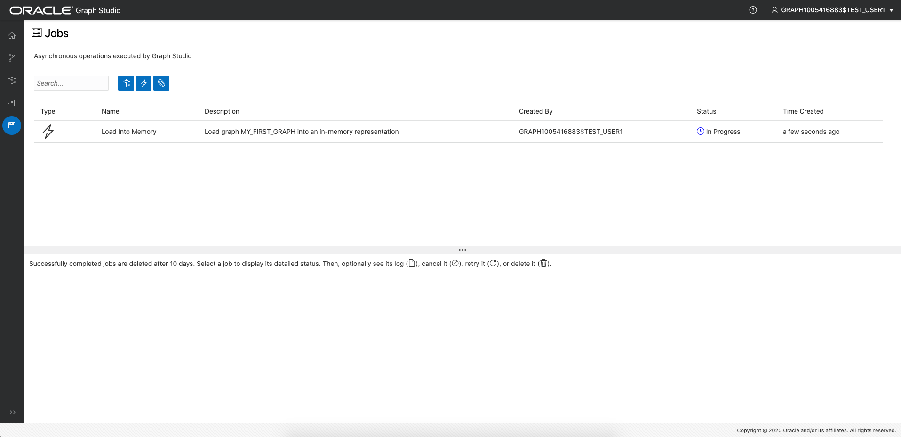

# Hello World: Crie, analise e visualize um gráfico do zero

## Introdução

Neste laboratório, você explorará o Graph Studio e aprenderá como criar e analisar um gráfico do zero muito rapidamente usando a instância Autonomous Data Warehouse - Serverless (ADW) ou Autonomous Transaction Processing - Serverless (ATP).

**Observação: enquanto este laboratório usa o Autonomous Data Warehouse, as etapas são idênticas para criar e estabelecer conexão com um banco de dados Autonomous Transaction Processing.**

Tempo Estimado: 10 minutos.

### Objetivos

Saiba como

*   estabelecer conexão com o seu Autonomous Database usando o **Graph Studio**
*   criar rapidamente um gráfico muito simples do zero usando PGQL
*   carregar gráficos na memória para análise
*   criar um notebook simples
*   gravar e executar parágrafos básicos de notebook Markdown, PGX Java e PGQL
*   visualizar dados de gráfico

### Pré-requisitos

*   O laboratório a seguir requer uma conta Autonomous Data Warehouse - Sem Servidor ou Autonomous Transaction Processing - Sem Servidor.

## Tarefa 1: Estabelecer conexão com o Autonomous Database usando o Graph Studio

1.  Se você tiver o URL do Graph Studio, vá para a etapa 3.
    
    Faça log-in na Console do OCI, escolha a instância do Autonomous Database e clique na guia Configuração de Ferramentas no menu da página de detalhes à esquerda.  
    Localize o link do Graph Studio e copie-o e cole-o em uma nova guia ou janela do browser.
    
    
    
2.  Como alternativa, se você ainda tiver o Database Actions aberto, clique no cartão Graph Studio para abrir em uma nova página ou guia no browser.
    
    
    
3.  Informe as credenciais da conta do Autonomous Database ou o usuário habilitado para Gráfico (por exemplo, `GRAPHUSER`) na tela de log-in.  
    **Não** use `ADMIN`.
    
    
    
4.  Em seguida, clique no botão "Sign In".
    

## Tarefa 2: Criar um Gráfico Simples usando PGQL

1.  A captura de tela a seguir mostra a interface do usuário do Graph Studio com o menu, ou ícones de navegação, à esquerda. Eles acessam as páginas Home, Modelos, Gráficos, Notebooks e Jobs, respectivamente.
    
    
    
2.  Clique no ícone de menu `Graphs`:
    
    
    
3.  Em seguida, clique no botão `</> Query` na página. Você deverá ver uma página intitulada **Plano de pesquisa do </>**
    
    
    
4.  Copie e cole o seguinte código DDL na área de texto de entrada PGQL:
    
        <copy>
        DROP PROPERTY GRAPH my_first_graph ;
        
        CREATE PROPERTY GRAPH my_first_graph ;
        
        INSERT INTO my_first_graph
            VERTEX austin LABELS (City) PROPERTIES (austin.name = 'Austin', austin.population = 964254),
            VERTEX tokyo LABELS (City) PROPERTIES (tokyo.name = 'Tokyo', tokyo.population = 9273672),
            VERTEX zurich LABELS (City) PROPERTIES (zurich.name = 'Zurich', zurich.population = 402762),
            VERTEX europe LABELS (Continent) PROPERTIES (europe.name = 'Europe'),
            VERTEX US LABELS (Country) PROPERTIES (US.name = 'United States of America'),
            VERTEX texas LABELS (State) PROPERTIES (texas.name = 'Texas', texas.area_size_km2 = 695662),
            VERTEX japan LABELS (Country) PROPERTIES (japan.name = 'Japan', japan.area_size_km2 = 377975),
            EDGE austinCapital BETWEEN austin AND texas LABELS (capital_of),
            EDGE austinCountry BETWEEN austin AND US LABELS (located_in),
            EDGE texasCountry BETWEEN texas AND US LABELS (located_in),
            EDGE zurichContinent BETWEEN zurich AND europe LABELS (located_in),
            EDGE tokyoCapital BETWEEN tokyo AND japan LABELS (capital_of),
            EDGE tokyoCountry BETWEEN tokyo AND japan LABELS (located_in),
            EDGE zurichTokyo BETWEEN zurich AND tokyo LABELS (connecting_flight) PROPERTIES (zurichTokyo.distance_km = 9576),
            EDGE zurichAustin BETWEEN zurich AND austin LABELS (connecting_flight) PROPERTIES (zurichAustin.distance_km = 8674)  
        
        </copy>
        
    
    Isso criará um gráfico muito simples com 7 vértices e 8 arestas. Para obter mais informações sobre a sintaxe, consulte a [especificação PGQL](https://pgql-lang.org/spec/1.3/#inserting-vertices)
    
    5.  Clique no botão Executar no canto superior esquerdo.
        
        
        

## Tarefa 3: Carregar o Gráfico na Memória

1.  Navegue até a página Gráficos:
    
    
    
2.  Clique em `MY_FIRST_GRAPH`:
    
    
    
3.  Clique no ícone **Carregar na memória** à direita da seção de detalhes:
    
    
    
    No diálogo resultante, clique em **Sim**.
    
    
    
4.  Você será redirecionado para a página Jobs. Aguarde a conclusão do job.
    
    
    

## Tarefa 4: Criar seu Primeiro Notebook

1.  Navegue até a página Notebooks:
    
    
    
2.  Clique no botão **Criar** à direita.
    
3.  Nomeie o notebook como **Aprender/Meu Primeiro Notebook** e clique em **Criar**. Isso criará uma pasta chamada `Learn` e a observação `My First Notebook` dentro dela.
    
    
    
4.  Cada notebook é organizado em um conjunto de **parágrafos**. Cada parágrafo tem uma entrada (chamada _Código_) e uma saída (chamada **Resultado**). No Graph Studio, existem 7 tipos de parágrafos:
    
    
    

Digite o texto a seguir no primeiro parágrafo.

    <copy>
    %md
    # My First Notebook
    
    This is my first paragraph
    </copy>
    

O `%md` indica que a entrada do parágrafo é o código de Markdown.

1.  Execute o parágrafo:
    
    
    
    Você verá o código de Markdown renderizado como HTML:
    
    
    
    Os parágrafos de markdown são úteis para adicionar explicações aos seus notebooks e ordená-los em capítulos. Você pode incorporar imagens e até vídeos usando a sintaxe Markdown ou HTML, experimente.
    

## Tarefa 5: Analisar, Consultar e Visualizar o Gráfico

1.  Adicione outro parágrafo ao notebook passando o mouse no meio da parte inferior da paragrah e clicando no botão **+** que aparece.
    
    
    
2.  Em seguida, insira o código a seguir no novo parágrafo.
    
        <copy>
        %java-pgx
        var graph = session.getGraph("MY_FIRST_GRAPH", GraphSource.PG_VIEW)
        </copy>
        
3.  Execute esse parágrafo, você verá que fizemos referência com sucesso ao nosso gráfico que acabamos de criar do zero por meio das APIs Java PGX.
    
    
    

**Observação: Alguns usuários encontraram um problema ao copiar e colar o código `%md` e `%java-pgx` acima.** Se você vir uma mensagem de erro `"Invalid Parameter. No interpreter with the name 'java-pgx' is currently registered to the server."`, exclua o texto ou o parágrafo e digite manualmente o mesmo texto e execute novamente o parágrafo.  
A captura de tela a seguir mostra a mensagem de erro que alguns, mas nem todos, encontraram.  


4.  Modifique o parágrafo para executar um algoritmo de gráfico. Por exemplo:
    
        <copy>
        %java-pgx
        var graph = session.getGraph("MY_FIRST_GRAPH")
        analyst.countTriangles(graph, true)
        </copy>
        
5.  Execute o parágrafo atualizado novamente. Após a conclusão, ele exibe o resultado, ou seja, o gráfico contém exatamente um triângulo.
    
    
    
6.  Adicione um parágrafo e insira o código a seguir. Este será um parágrafo PGQL desde que comece com a linha `%pgql-pgx`.
    
        <copy>
        %pgql-pgx
        select v, e from match (v)-[e]->() on MY_FIRST_GRAPH
        </copy>
        
    
    
    
7.  Execute esse parágrafo e os resultados serão renderizados como um gráfico interativo.
    
    
    
8.  Clique com o botão direito do mouse em um dos vértices na tela para ver todos os detalhes desse vértice.
    
    
    
9.  Clique no ícone de definições da visualização.
    
    
    
10.  Navegue até a guia **Visualização** e selecione **NOME** como o label a ser renderizado ao lado dos vértices:
    

        
    
    You now see the name next to each vertex, which will help you better understand the visualization. There are lots of other options to help you make sense of the graph. Feel free to play around with the settings as you like.
    

11.  Adicione outro parágrafo com a consulta a seguir e execute-o.

    ```
    <copy>
    %pgql-pgx
    select c.NAME, c.POPULATION from match (c:City) on MY_FIRST_GRAPH order by c.POPULATION desc
    </copy>
    ```
    
    
    

12.  Altere a saída para ser um gráfico de pizza.

       
    

Parabéns! Você criou, analisou e visualizou com sucesso um gráfico do zero usando o Graph Studio. Esperamos que este pequeno exemplo dê a você uma ideia de como usar seu Autonomous Database como banco de dados gráfico.

**Passe para o próximo laboratório** para ver exemplos mais complexos de como criar e analisar gráficos.

## Agradecimentos

*   **Autor** - Jayant Sharma, Desenvolvimento de Produtos
*   **Colaboradores** - JKorbi Schmid, Rahul Tasker, Desenvolvimento de produtos
*   **Última Atualização em/Data** - Jayant Sharma, junho de 2023