# Hello World：从头开始创建、分析和可视化图形

## 简介

在此实验室中，您将浏览 Graph Studio，并了解如何使用 Autonomous Data Warehouse - Serverless (ADW) 或 Autonomous Transaction Processing - Serverless (ATP) 实例快速创建和分析图形。

**注：虽然此实验室使用 Autonomous Data Warehouse，但创建和连接到 Autonomous Transaction Processing 数据库的步骤完全相同。**

预计时间：10 分钟。

### 目标

了解方法

*   使用 **Graph Studio** 连接到 Autonomous Database
*   使用 PGQL 快速从头开始创建非常简单的图形
*   将图形加载到内存中进行分析
*   创建一个简单的笔记本
*   编写和执行基本 Markdown、PGX Java 和 PGQL 记事本段落
*   可视化图形数据

### 先备条件

*   下面的练习需要一个 Autonomous Data Warehouse - 无服务器或自治事务处理 - 无服务器账户。

## 任务 1：使用 Graph Studio 连接到 Autonomous Database

1.  如果您有 Graph Studio URL，请继续执行步骤 3。
    
    登录到 OCI 控制台，选择 Autonomous Database 实例，然后单击左侧详细信息页菜单上的“Tools Configuration（工具配置）”选项卡。  
    找到 Graph Studio 链接并将其复制并粘贴到新的浏览器选项卡或窗口中。
    
    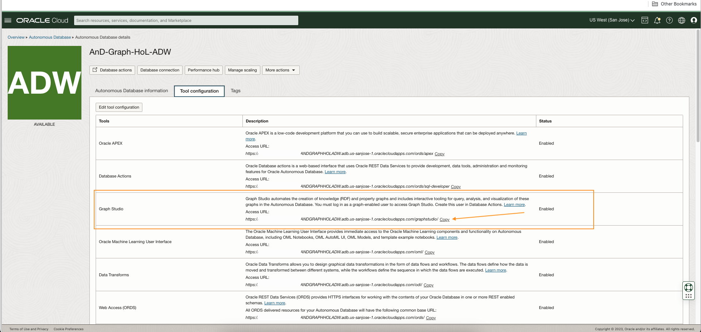
    
2.  或者，如果仍打开 Database Actions，请单击 Graph Studio 卡以在浏览器的新页面或选项卡中打开。
    
    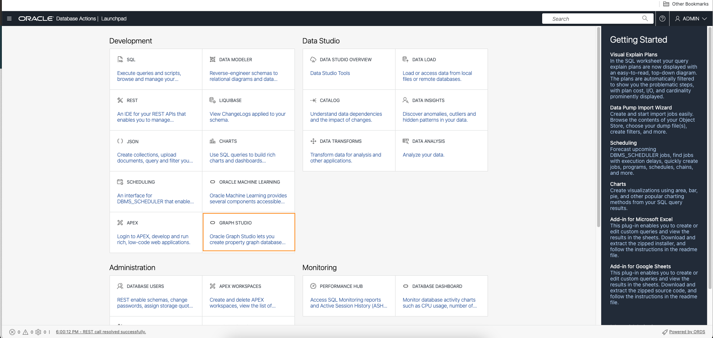
    
3.  在登录屏幕中输入 Autonomous Database 账户身份证明或支持图形的用户（例如 `GRAPHUSER`）。  
    请**不要**使用 `ADMIN`。
    
    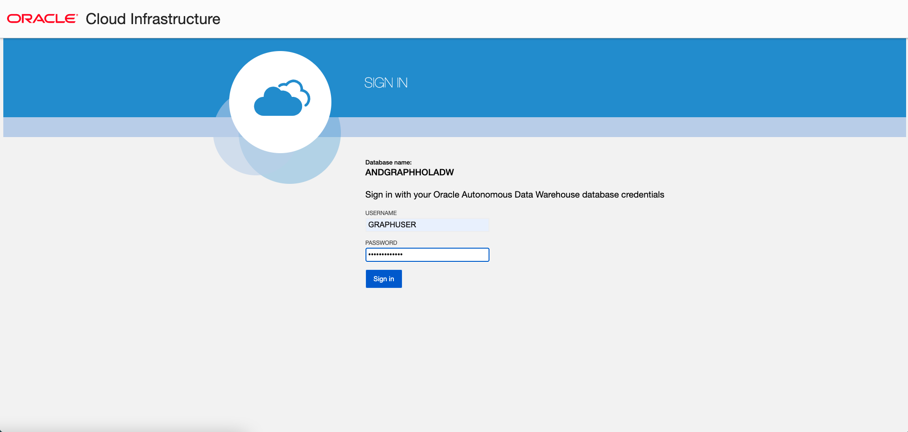
    
4.  然后，单击“登录”按钮。
    

## 任务 2：使用 PGQL 创建简单图形

1.  以下屏幕截图显示了具有菜单或导航图标的 Graph Studio 用户界面。它们分别导航到 "Home"（主页）、"Models"（模型）、"Graphs"（图形）、"Notebooks"（记事本）和 "Jobs"（作业）页面。
    
    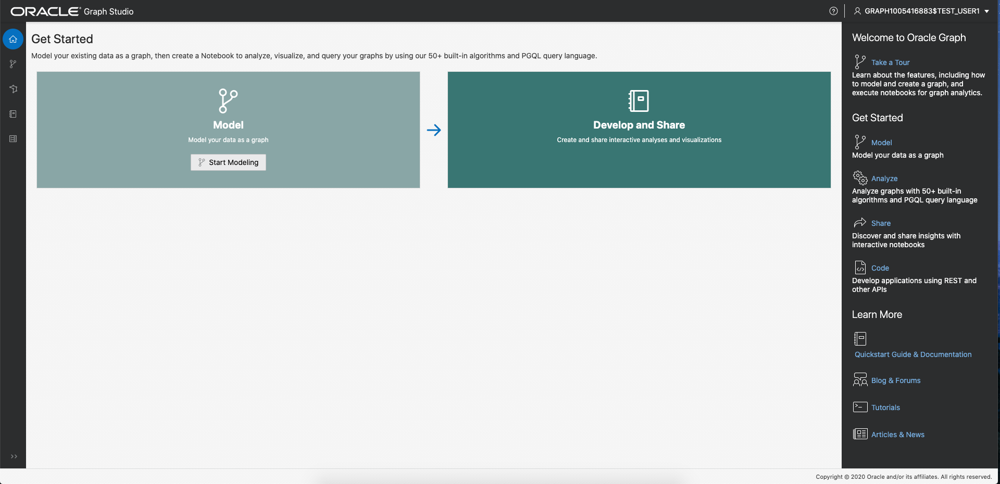
    
2.  单击 `Graphs` 菜单图标：
    
    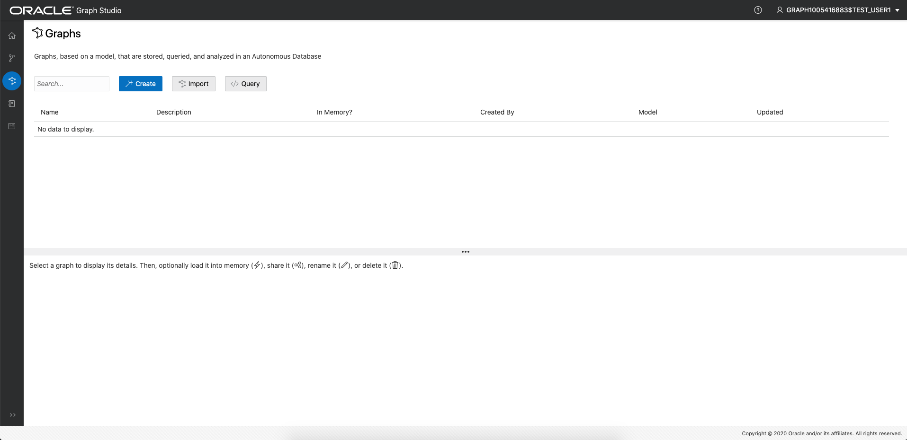
    
3.  接下来单击页面上的 `</> Query` 按钮。您应该会看到标题为 **</> Query Playground** 的页面
    
    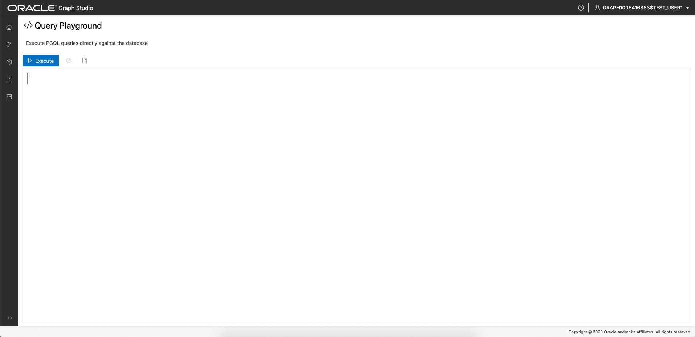
    
4.  将以下 DDL 代码复制并粘贴到 PGQL 输入文本区域：
    
        <copy>
        DROP PROPERTY GRAPH my_first_graph ;
        
        CREATE PROPERTY GRAPH my_first_graph ;
        
        INSERT INTO my_first_graph
            VERTEX austin LABELS (City) PROPERTIES (austin.name = 'Austin', austin.population = 964254),
            VERTEX tokyo LABELS (City) PROPERTIES (tokyo.name = 'Tokyo', tokyo.population = 9273672),
            VERTEX zurich LABELS (City) PROPERTIES (zurich.name = 'Zurich', zurich.population = 402762),
            VERTEX europe LABELS (Continent) PROPERTIES (europe.name = 'Europe'),
            VERTEX US LABELS (Country) PROPERTIES (US.name = 'United States of America'),
            VERTEX texas LABELS (State) PROPERTIES (texas.name = 'Texas', texas.area_size_km2 = 695662),
            VERTEX japan LABELS (Country) PROPERTIES (japan.name = 'Japan', japan.area_size_km2 = 377975),
            EDGE austinCapital BETWEEN austin AND texas LABELS (capital_of),
            EDGE austinCountry BETWEEN austin AND US LABELS (located_in),
            EDGE texasCountry BETWEEN texas AND US LABELS (located_in),
            EDGE zurichContinent BETWEEN zurich AND europe LABELS (located_in),
            EDGE tokyoCapital BETWEEN tokyo AND japan LABELS (capital_of),
            EDGE tokyoCountry BETWEEN tokyo AND japan LABELS (located_in),
            EDGE zurichTokyo BETWEEN zurich AND tokyo LABELS (connecting_flight) PROPERTIES (zurichTokyo.distance_km = 9576),
            EDGE zurichAustin BETWEEN zurich AND austin LABELS (connecting_flight) PROPERTIES (zurichAustin.distance_km = 8674)  
        
        </copy>
        
    
    这将创建一个具有 7 个顶点和 8 个边缘的非常简单的图形。有关语法的详细信息，请参阅 [PGQL 规范](https://pgql-lang.org/spec/1.3/#inserting-vertices)
    
    5.  单击左上角的“Execute（执行）”按钮。
        
        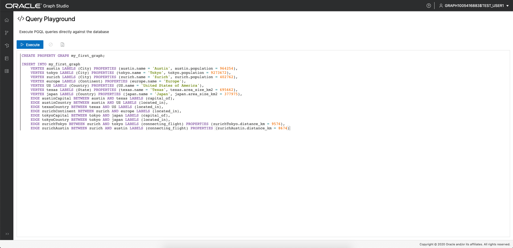
        

## 任务 3：将图形加载到内存中

1.  导航到“图形”页：
    
    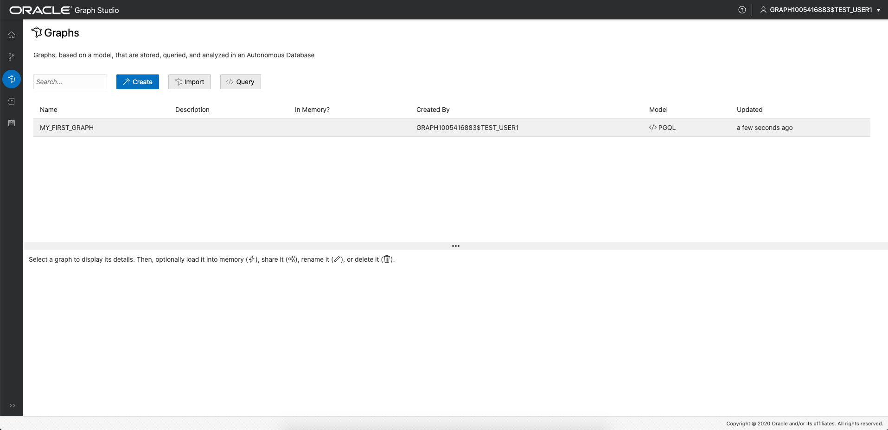
    
2.  单击 `MY_FIRST_GRAPH`：
    
    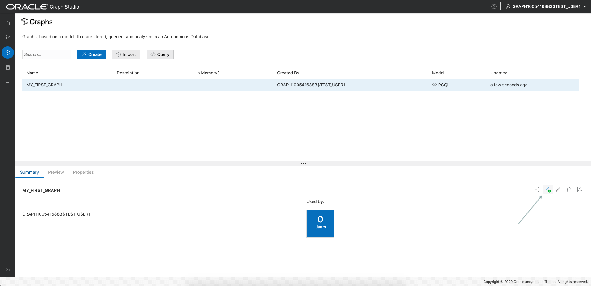
    
3.  单击详细信息部分右侧的**加载到内存中**图标：
    
    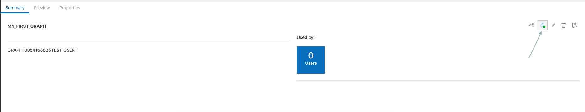
    
    在显示的对话框中，单击**是**。
    
    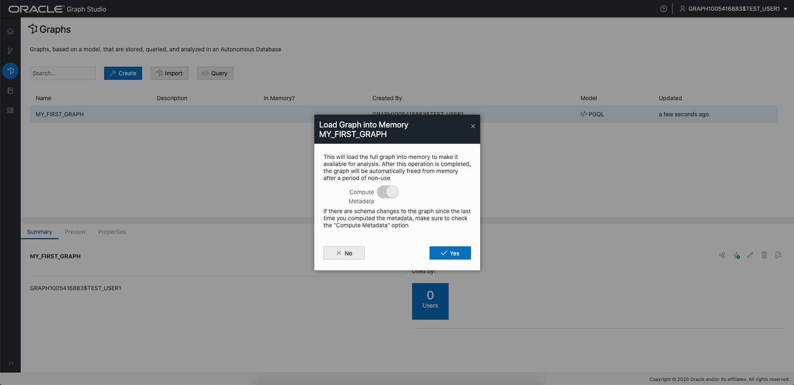
    
4.  您将重定向到“作业”页。等待作业完成。
    
    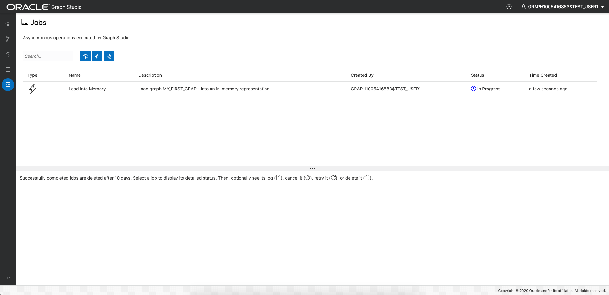
    

## 任务 4：创建您的第一个笔记本

1.  定位至“记事本”页：
    
    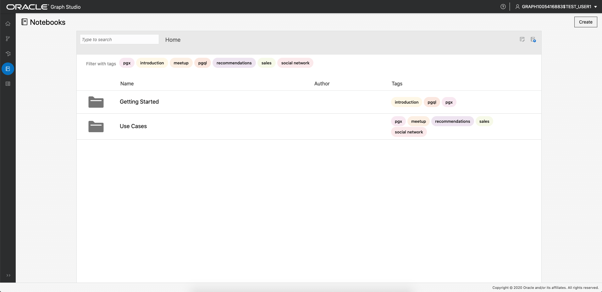
    
2.  单击右侧的**创建**按钮。
    
3.  将记事本命名为**学习/我的第一个记事本**，然后单击**创建**。这将创建一个名为 `Learn` 的文件夹，并在其中创建附注 `My First Notebook`。
    
    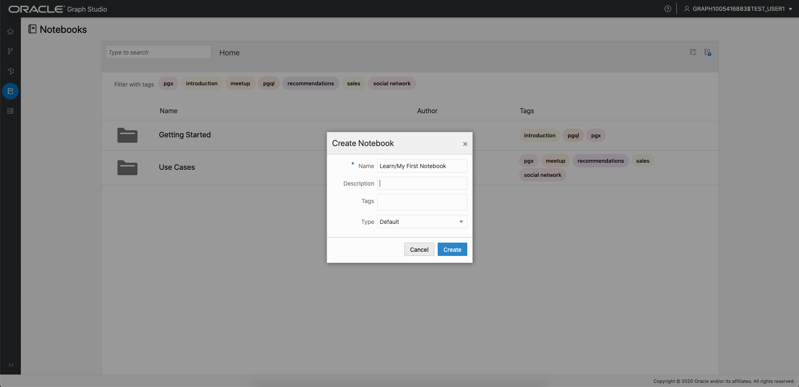
    
4.  每个记事本都组织成一组**段落**。每个段落都有一个输入（称为_代码_）和输出（称为**结果**）。在 Graph Studio 中，有 7 种类型的段落：
    
    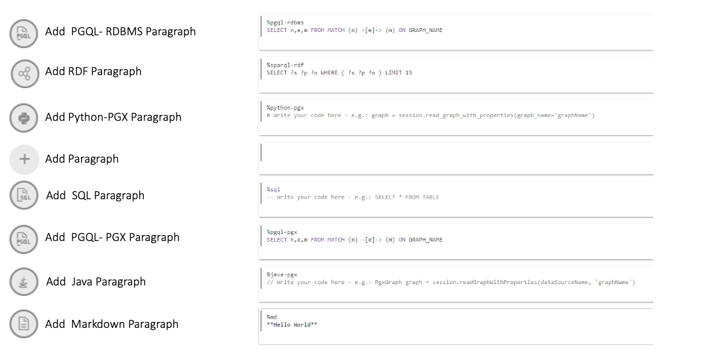
    

在第一段输入以下文本。

    <copy>
    %md
    # My First Notebook
    
    This is my first paragraph
    </copy>
    

`%md` 指示段落输入是 Markdown 代码。

1.  执行段落：
    
    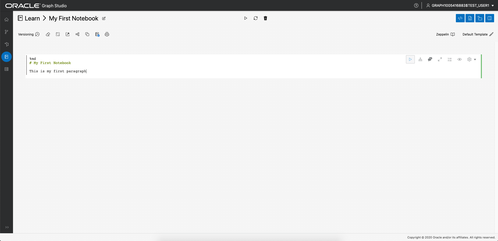
    
    您将看到 Markdown 代码呈现为 HTML：
    
    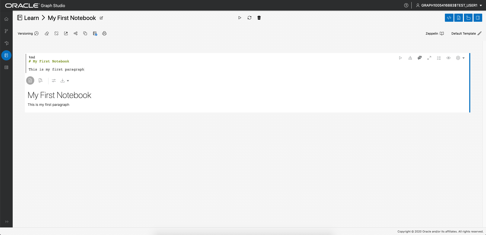
    
    Markdown 段落在笔记本上添加解释并将其排序到章节中非常有用。您可以使用 Markdown 或 HTML 语法嵌入图像甚至视频，尝试一下。
    

## 任务 5：分析、查询和可视化图形

1.  通过将鼠标悬停在 paragrah 底部的中间并单击出现的 **+** 按钮，向笔记本添加另一个段落。
    
    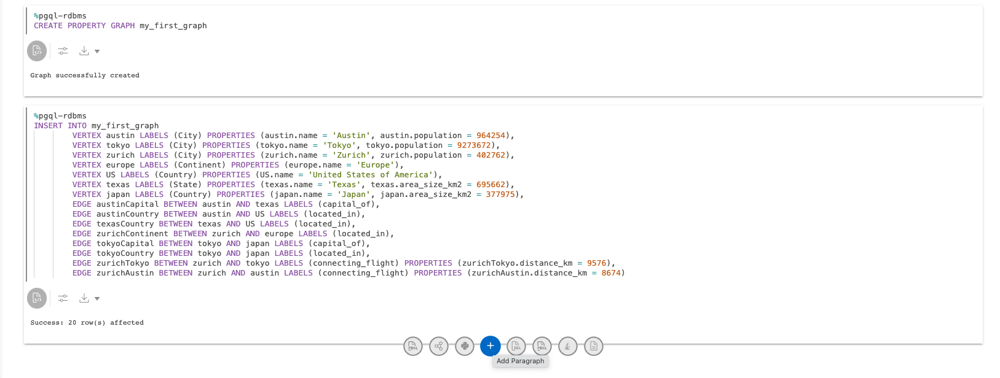
    
2.  然后在新段落中输入以下代码。
    
        <copy>
        %java-pgx
        var graph = session.getGraph("MY_FIRST_GRAPH", GraphSource.PG_VIEW)
        </copy>
        
3.  执行该段，您将看到我们成功引用了刚刚通过 PGX Java API 从头创建的图形。
    
    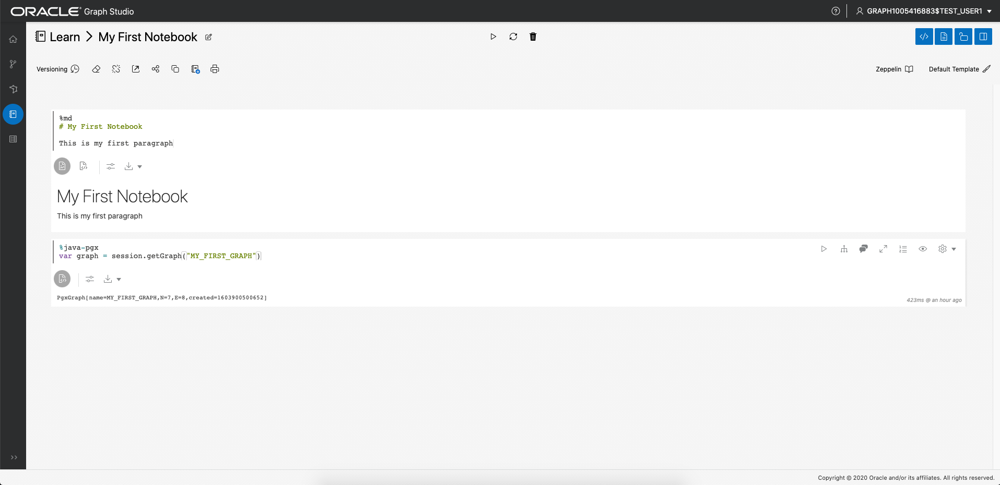
    

**注：有些用户在复制和粘贴上面的 `%md` 和 `%java-pgx` 代码时遇到问题。**如果看到错误消息 `"Invalid Parameter. No interpreter with the name 'java-pgx' is currently registered to the server."`，则删除文本或段落，然后手动输入相同的文本并重新执行段落。  
下面的屏幕截图显示了所遇到的错误消息，但并非全部。  
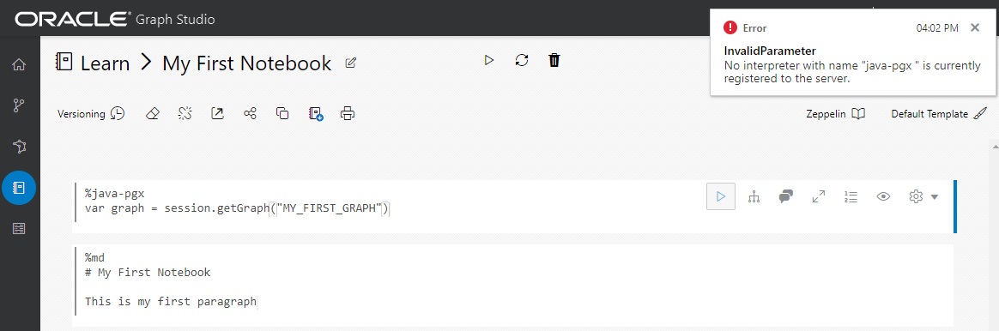

4.  修改段落以运行图形算法。例如：
    
        <copy>
        %java-pgx
        var graph = session.getGraph("MY_FIRST_GRAPH")
        analyst.countTriangles(graph, true)
        </copy>
        
5.  再次执行更新的段落。完成后，它会显示结果，即图形只包含一个三角形。
    
    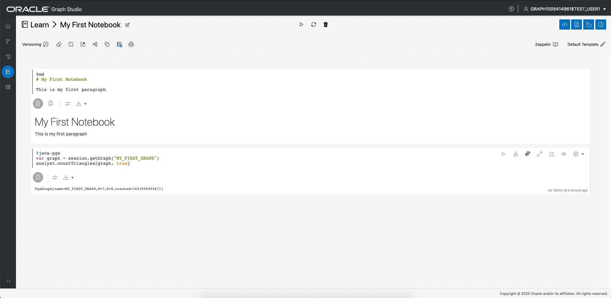
    
6.  添加段落并输入以下代码。这将是 PGQL 段落，因为它以 `%pgql-pgx` 行开头。
    
        <copy>
        %pgql-pgx
        select v, e from match (v)-[e]->() on MY_FIRST_GRAPH
        </copy>
        
    
    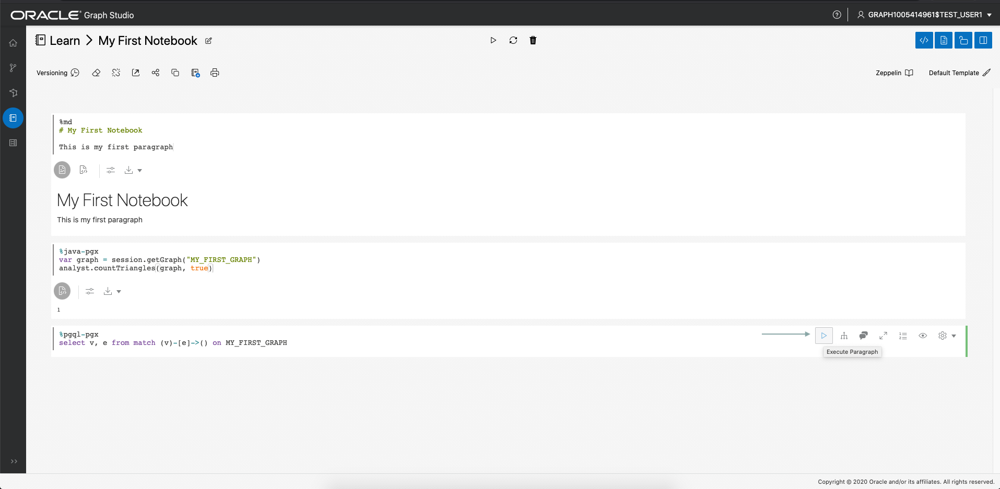
    
7.  执行该段落，结果将呈现为交互式图形。
    
    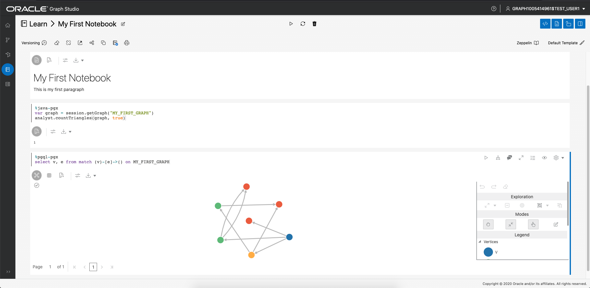
    
8.  右键单击屏幕上的一个顶点以查看该顶点的所有详细信息。
    
    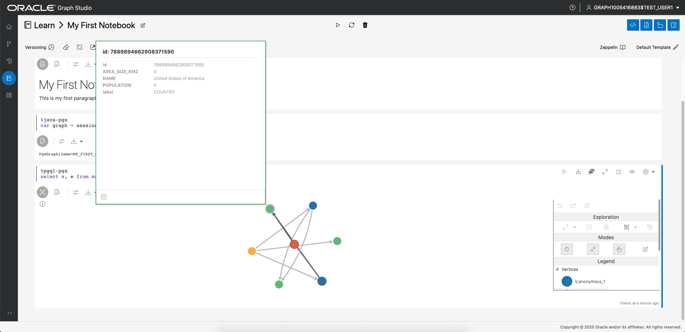
    
9.  单击可视化的设置图标。
    
    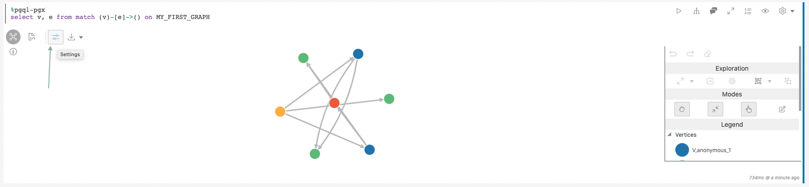
    
10.  导航到 **Visualization（可视化）**选项卡，然后选择 **NAME** 作为要在顶点旁边呈现的标签：
    

    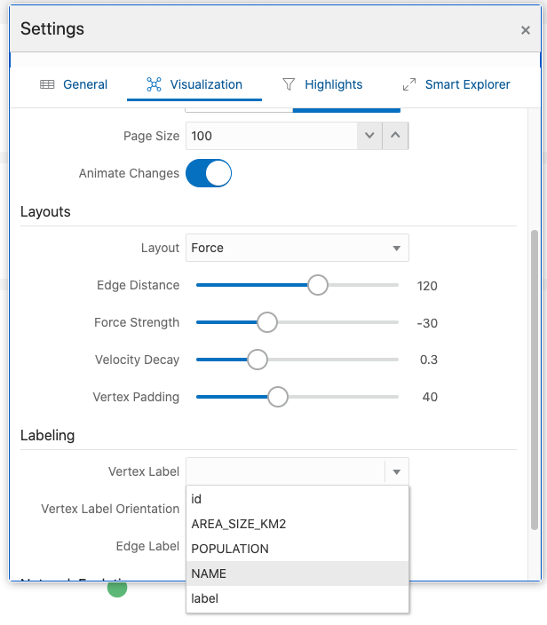    
    
    You now see the name next to each vertex, which will help you better understand the visualization. There are lots of other options to help you make sense of the graph. Feel free to play around with the settings as you like.
    

11.  使用以下查询添加另一个段落并执行它。

    ```
    <copy>
    %pgql-pgx
    select c.NAME, c.POPULATION from match (c:City) on MY_FIRST_GRAPH order by c.POPULATION desc
    </copy>
    ```
    
    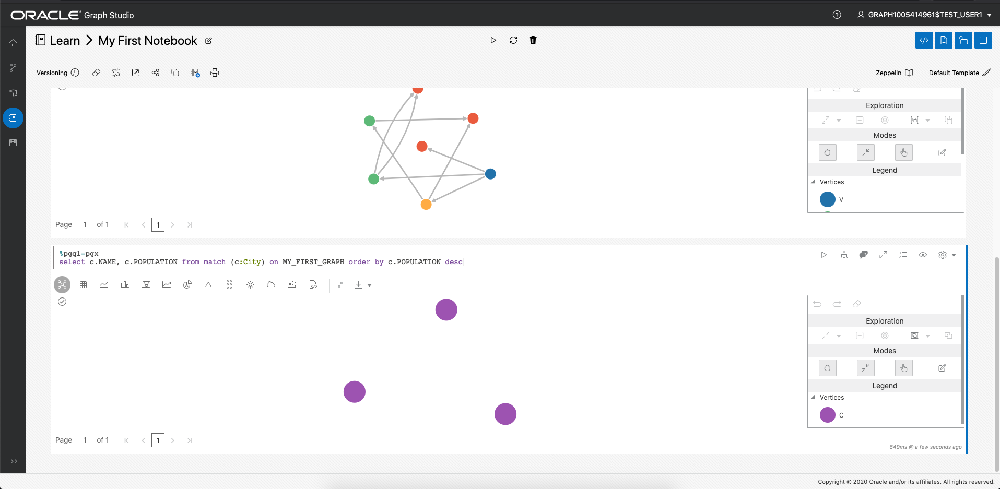
    

12.  将输出更改为饼图。

    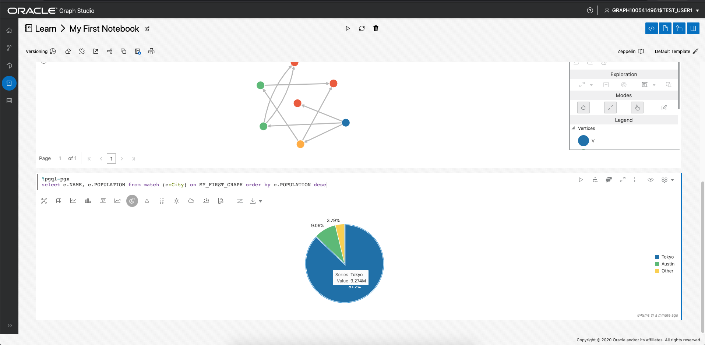   
    

恭喜！您已成功使用 Graph Studio 从头开始创建、分析和可视化图形。希望这个小示例能让您了解如何使用 Autonomous Database 作为图形数据库。

有关如何创建和分析图形的更复杂示例，请**转到下一个练习**。

## 确认

*   **作者** - Jayant Sharma ，产品开发
*   **贡献者** - JKorbi Schmid，Rahul Tasker，产品开发
*   **上次更新者/日期** - Jayant Sharma，2023 年 6 月