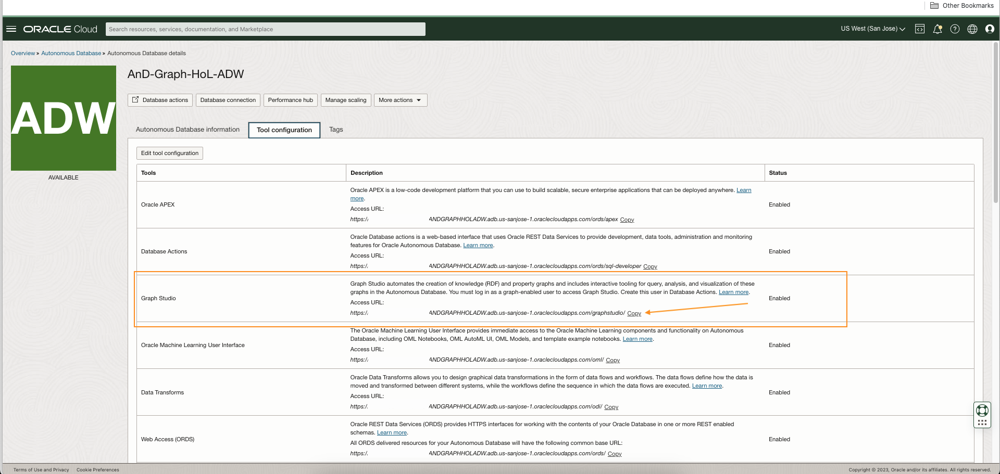
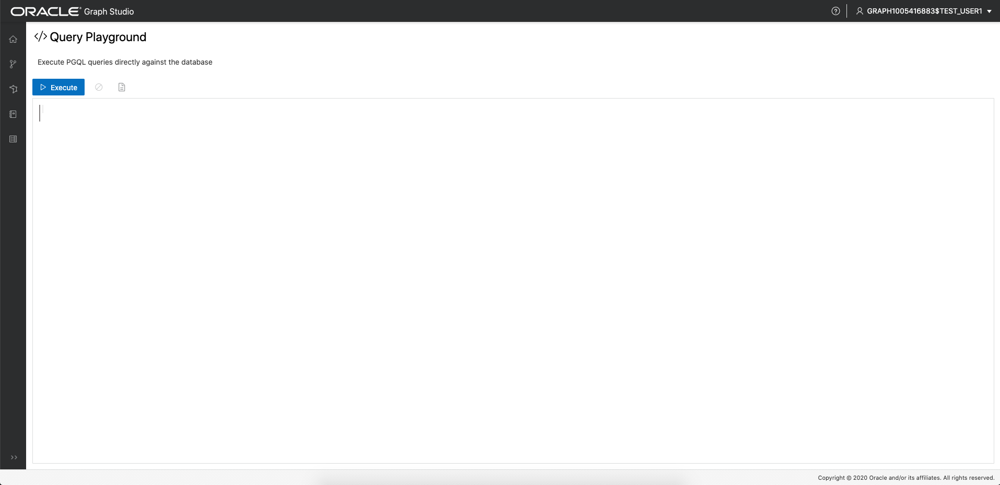
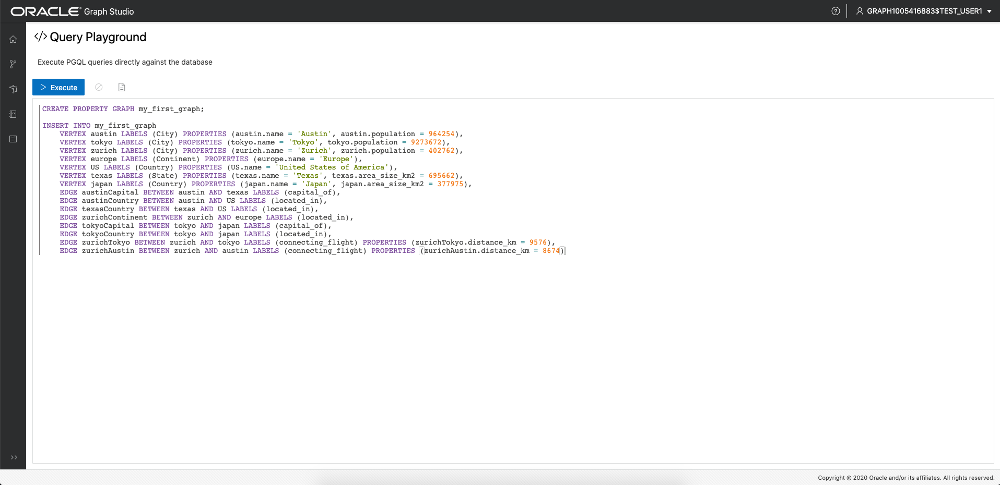
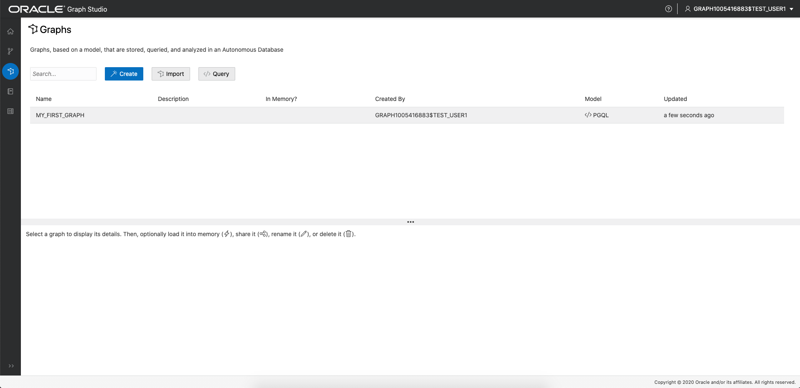
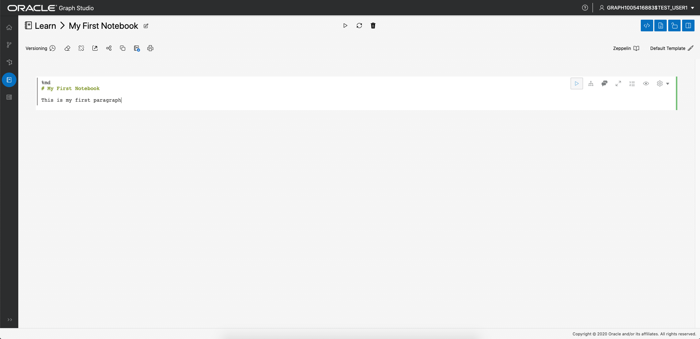
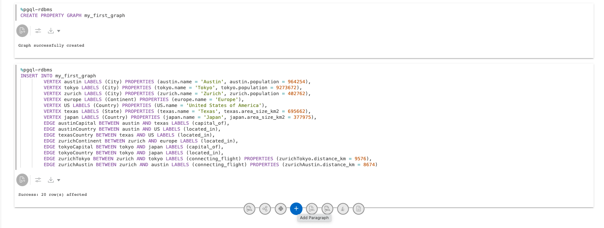
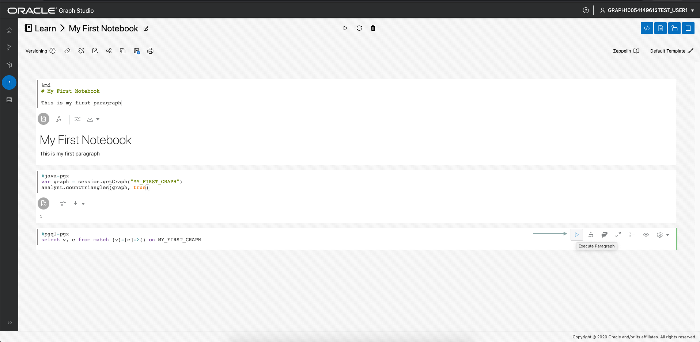

# Hello World：從頭開始建立、分析及視覺化圖表

## 簡介

在這個實驗室中，您將探索 Graph Studio，瞭解如何使用 Autonomous Data Warehouse - Serverless (ADW) 或 Autonomous Transaction Processing - Serverless (ATP) 執行處理，從頭建立和分析圖表。

**注意：這個實驗室使用 Autonomous Data Warehouse，但步驟在建立和連線至 Autonomous Transaction Processing 資料庫時完全相同。**

預估時間：10 分鐘。

### 目標

瞭解如何

*   使用 **Graph Studio** 連線至您的 Autonomous Database
*   使用 PGQL 從頭開始快速建立圖表
*   將圖表載入記憶體以進行分析
*   建立簡單記事本
*   撰寫及執行基本 Markdown、PGX Java 和 PGQL 筆記型電腦段落
*   視覺化圖形資料

### 先決條件

*   下列實驗室需要 Autonomous Data Warehouse - 無伺服器或 Autonomous Transaction Processing - 無伺服器帳戶。

## 作業 1：使用 Graph Studio 連線至您的 Autonomous Database

1.  如果您有 Graph Studio URL，請繼續進行步驟 3。
    
    登入 OCI 主控台，選擇 Autonomous Database 執行處理，然後按一下左側詳細資訊頁面功能表中的「工具組態」頁籤。  
    找出 Graph Studio 連結，然後將它複製並貼到新的瀏覽器頁籤或視窗中。
    
    
    
2.  或者，如果您仍然開啟「資料庫動作」，請按一下 Graph Studio 卡，在瀏覽器的新頁面或頁籤中開啟。
    
    
    
3.  在登入畫面中輸入 Autonomous Database 帳戶證明資料或啟用圖形的使用者 (例如 `GRAPHUSER`) .  
    請**不要**使用 `ADMIN`。
    
    
    
4.  然後按一下「登入」按鈕。
    

## 任務 2：使用 PGQL 建立簡單圖表

1.  下列螢幕擷取畫面顯示具有功能表的 Graph Studio 使用者介面，或是左側的瀏覽圖示。它們會分別瀏覽至「首頁」、「模型」、「圖形」、「筆記本」和「工作」頁面。
    
    
    
2.  按一下 `Graphs` 功能表圖示：
    
    
    
3.  接下來按一下頁面上的 `</> Query` 按鈕。您應該會看到標題為 **</> Query Playground** 的頁面
    
    
    
4.  將下列 DDL 程式碼複製並貼上至 PGQL 輸入文字區域：
    
        <copy>
        DROP PROPERTY GRAPH my_first_graph ;
        
        CREATE PROPERTY GRAPH my_first_graph ;
        
        INSERT INTO my_first_graph
            VERTEX austin LABELS (City) PROPERTIES (austin.name = 'Austin', austin.population = 964254),
            VERTEX tokyo LABELS (City) PROPERTIES (tokyo.name = 'Tokyo', tokyo.population = 9273672),
            VERTEX zurich LABELS (City) PROPERTIES (zurich.name = 'Zurich', zurich.population = 402762),
            VERTEX europe LABELS (Continent) PROPERTIES (europe.name = 'Europe'),
            VERTEX US LABELS (Country) PROPERTIES (US.name = 'United States of America'),
            VERTEX texas LABELS (State) PROPERTIES (texas.name = 'Texas', texas.area_size_km2 = 695662),
            VERTEX japan LABELS (Country) PROPERTIES (japan.name = 'Japan', japan.area_size_km2 = 377975),
            EDGE austinCapital BETWEEN austin AND texas LABELS (capital_of),
            EDGE austinCountry BETWEEN austin AND US LABELS (located_in),
            EDGE texasCountry BETWEEN texas AND US LABELS (located_in),
            EDGE zurichContinent BETWEEN zurich AND europe LABELS (located_in),
            EDGE tokyoCapital BETWEEN tokyo AND japan LABELS (capital_of),
            EDGE tokyoCountry BETWEEN tokyo AND japan LABELS (located_in),
            EDGE zurichTokyo BETWEEN zurich AND tokyo LABELS (connecting_flight) PROPERTIES (zurichTokyo.distance_km = 9576),
            EDGE zurichAustin BETWEEN zurich AND austin LABELS (connecting_flight) PROPERTIES (zurichAustin.distance_km = 8674)  
        
        </copy>
        
    
    這會建立一個包含 7 個頂點和 8 個邊緣的非常簡單圖表。如需有關語法的詳細資訊，請參閱 [PGQL 規格](https://pgql-lang.org/spec/1.3/#inserting-vertices)
    
    5.  按一下左上角的「執行 (Execute)」按鈕。
        
        
        

## 作業 3：將圖表載入記憶體

1.  瀏覽至「圖表」頁面：
    
    
    
2.  按一下 `MY_FIRST_GRAPH`：
    
    
    
3.  按一下詳細資訊區段右側的**載入記憶體**圖示：
    
    
    
    在結果對話方塊中，按一下**是**。
    
    
    
4.  您被重導至「工作 (Job)」頁面。等待工作完成。
    
    
    

## 任務 4：建立您的第一個記事本

1.  瀏覽至「記事本」頁面：
    
    
    
2.  按一下右邊的**建立 (Create)** 按鈕。
    
3.  將記事本命名為**學習 / 我的第一個記事本**，然後按一下**建立**。這會在其中建立名為 `Learn` 的資料夾和備註 `My First Notebook`。
    
    
    
4.  每個記事本都組織成一組**段落**。每個段落都有一個輸入 (稱為_代碼_ ) 和輸出 (稱為**結果** )。在 Graph Studio 中，有 7 種段落類型：
    
    
    

在第一段中輸入下列文字。

    <copy>
    %md
    # My First Notebook
    
    This is my first paragraph
    </copy>
    

`%md` 表示段落輸入為 Markdown 代碼。

1.  執行段落：
    
    
    
    您將會看到「減價」代碼轉譯為 HTML：
    
    
    
    標記段落有助於將說明新增至您的記事本，並將其排序到章節中。您可以使用 Markdown 或 HTML 語法嵌入圖片，甚至是影片，試試看。
    

## 作業 5：分析、查詢及視覺化圖表

1.  將游標停駐在 paragrah 底部的中間，然後按一下出現的 **+** 按鈕，將另一個段落新增至記事本。
    
    
    
2.  然後在新段落中輸入下列程式碼。
    
        <copy>
        %java-pgx
        var graph = session.getGraph("MY_FIRST_GRAPH", GraphSource.PG_VIEW)
        </copy>
        
3.  只要執行該段落，我們就會成功參照剛透過 PGX Java API 從頭開始建立的圖表。
    
    
    

**注意：部分使用者在複製並貼上上述 `%md` 和 `%java-pgx` 程式碼時發生問題。**如果您看到錯誤訊息 `"Invalid Parameter. No interpreter with the name 'java-pgx' is currently registered to the server."`，請刪除文字或段落，然後手動輸入相同文字並重新執行段落。  
下列螢幕擷取畫面顯示出一些 (但並非全部) 出現的錯誤訊息。  


4.  修改段落以執行圖形演算法。例如：
    
        <copy>
        %java-pgx
        var graph = session.getGraph("MY_FIRST_GRAPH")
        analyst.countTriangles(graph, true)
        </copy>
        
5.  再次執行更新的段落。完成時會顯示結果，即圖表只包含一個三角形。
    
    
    
6.  新增段落並輸入以下程式碼。這將會是 PGQL 段落，從第 `%pgql-pgx` 行開始。
    
        <copy>
        %pgql-pgx
        select v, e from match (v)-[e]->() on MY_FIRST_GRAPH
        </copy>
        
    
    
    
7.  執行該段落與結果會以互動式圖表呈現。
    
    
    
8.  在螢幕上的其中一個頂點上按一下滑鼠右鍵，即可查看該頂點的所有詳細資訊。
    
    
    
9.  按一下視覺化設定值圖示。
    
    
    
10.  瀏覽至**視覺化**頁籤，然後選取 **NAME** 作為要在頂點旁呈現的標籤：
    

        
    
    You now see the name next to each vertex, which will help you better understand the visualization. There are lots of other options to help you make sense of the graph. Feel free to play around with the settings as you like.
    

11.  以下列查詢新增另一個段落，然後執行它。

    ```
    <copy>
    %pgql-pgx
    select c.NAME, c.POPULATION from match (c:City) on MY_FIRST_GRAPH order by c.POPULATION desc
    </copy>
    ```
    
    
    

12.  將輸出變更為圓餅圖。

       
    

恭喜！您已使用 Graph Studio 順利從頭開始建立、分析圖表並進行視覺化。希望這個範例能讓您感覺到如何使用您的 Autonomous Database 作為圖形資料庫。

請**進入下一個實驗室**，查看更多有關如何建立和分析圖表的複雜範例。

## 確認

*   **作者** - Jayant Sharma，產品開發
*   **貢獻者** - JKorbi Schmid，Rahul Tasker，Product Development
*   **上次更新者 / 日期** - Jayant Sharma，2023 年 6 月