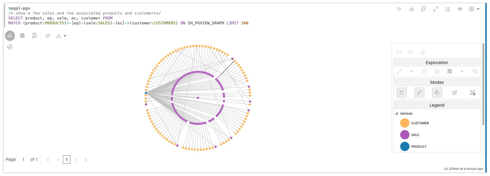
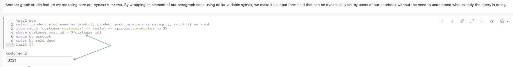
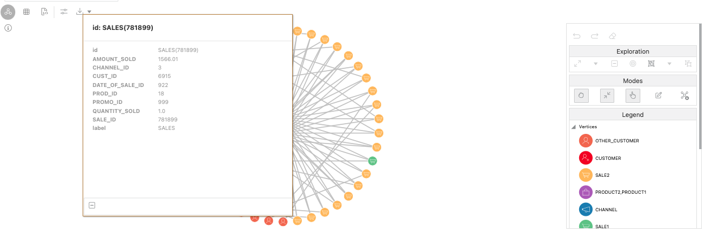
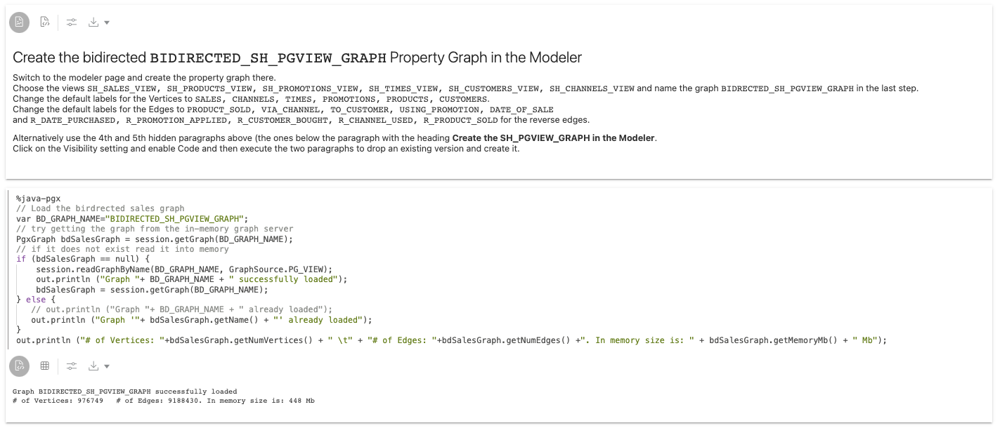

# Typisches Data Warehouse mit Diagrammalgorithmen in einem Notizbuch analysieren

## Einführung

In dieser Übung lernen Sie, wie Sie Diagrammalgorithmen und PGQL-Abfragen mit Notizbüchern direkt in der Graph Studio-Schnittstelle Ihrer Autonomous Data Warehouse - Shared Infrastructure-(ADW-) oder Autonomous Transaction Processing - Shared Infrastructure-(ATP-)Instanz ausführen.

Geschätzte Zeit: 20 Minuten.

### Ziele

*   Erfahren Sie, wie Sie Diagrammdaten für die Analyse in Notizbüchern vorbereiten
*   Erfahren Sie, wie Sie erläuternde Absätze mit der Markdown-Syntax erstellen
*   Erfahren Sie, wie Sie mit PGQL Absätze für Diagrammabfragen erstellen
*   Erfahren Sie, wie Sie Diagrammabfrageergebnisse visualisieren
*   Erfahren Sie, wie Sie Absätze für Ausführungsdiagrammalgorithmen mit den PGX-Java-APIs erstellen

### Voraussetzungen

*   Für die folgende Übung ist ein Autonomous Database-Account erforderlich.
    
*   In dieser Übung wird davon ausgegangen, dass Sie die vorherige Übung (2. Übung) abgeschlossen haben, in der das Diagramm **SH\_PGVIEW\_GRAPH** erstellt wurde.
    

## Aufgabe 1: Stellen Sie sicher, dass das SH-Diagramm in den Speicher geladen ist.

Bevor Diagramme in einem Notizbuch analysiert werden können, müssen wir sicherstellen, dass das Diagramm in den Speicher geladen wird. Navigieren Sie in der Graph Studio-Benutzeroberfläche zur Seite **Diagramme**, und prüfen Sie, ob das Diagramm **SH\_PGVIEW\_GRAPH** in den Speicher geladen wurde.

Wenn das Diagramm in den Speicher geladen wird (es heißt " im Speicher"), können Sie mit Schritt 2 fortfahren.

Wenn das Diagramm **nicht** in den Speicher geladen wird, wie im folgenden Screenshot, klicken Sie oben rechts im Detailabschnitt auf das Symbol **In Speicher laden** (Blitzschraube). Klicken Sie im daraufhin angezeigten Dialogfeld auf **Ja**.

Dadurch wird ein Job "In Speicher laden" für Sie erstellt. Warten Sie, bis dieser Job abgeschlossen ist:

## Aufgabe 2: Notizbuch zur Analyse der Vertriebshistorie klonen - Beispiel

1.  Klicken Sie links im Menü auf das Symbol **Notebooks**.
    
2.  Öffnen Sie den Ordner **Learn**:
    
    
    
3.  Klicken Sie auf das Notizbuch **Vertriebsanalyse**, um es zu öffnen.
    
    
    
4.  Das Notizbuch für die **Vertriebsanalyse** ist ein **integriertes** Notizbuch. Sie können **integrierte** Notizbücher nach dem Autor identifizieren, der als `<<system-user>>` angezeigt wird. Integrierte Notizbücher werden von allen Benutzern gemeinsam verwendet und sind daher schreibgeschützt und gesperrt. Um das Notizbuch auszuführen, müssen Sie zuerst eine private Kopie erstellen und dann die Sperre aufheben. Klicken Sie oben im Notizbuch auf die Schaltfläche **Klonen**.
    
    
    
5.  Geben Sie im daraufhin angezeigten Dialogfeld dem geklonten Notizbuch einen eindeutigen Namen, damit Sie es später wieder leicht finden können. Ordnerstrukturen können mit dem Symbol `/` ausgedrückt werden. Klicken Sie dann auf _Erstellen_.
    
    
    
6.  Klicken Sie oben rechts im geklonten Notizbuch auf die Schaltfläche **Entsperren**.
    
    
    
    Das Notizbuch kann jetzt ausgeführt werden.
    

## Aufgabe 3: Grundlegende Notizbuchfunktionen kennenlernen

Jedes Notizbuch ist in einer Gruppe von **Absätzen** organisiert. Jeder Absatz enthält eine Eingabe (**Code**) und eine Ausgabe (**Ergebnis**). In Graph Studio gibt es 3 Absätze:

*   Markdown-Absätze beginnen mit `%md`
*   PGQL-Absätze beginnen mit `%PGQL-px`
*   PGX Java-Absätze beginnen mit `%java-pgx`

Im Notizbuch "Vertriebsanalyse" finden Sie Beispiele für jeden dieser Typen. Das Notizbuch ist so konzipiert, dass es mit dem Diagramm funktioniert, das in der vorherigen Übung erstellt wurde. Sie müssen also keinen Code ändern, damit die Absätze ausgeführt werden. Sie können feststellen, dass es einige versteckte Absätze am Anfang dieses Notizbuchs gibt. Diese verborgenen Absätze durchlaufen den SQL-Code, den wir zuvor in dieser Übung durchlaufen haben. Konzentrieren Sie sich in dieser Übung nur auf die sichtbaren Absätze.

1.  Um den ersten Absatz auszuführen, klicken Sie oben rechts im Absatz auf das Symbol **Ausführen**.
    
    
    
2.  Der zweite Absatz veranschaulicht, wie Diagramme, die in den Speicher geladen werden, in `%java-pgx` Absätzen referenziert werden. Sie referenzieren sie einfach mit der API `session.getGraph("SH")`.  
    Klicken Sie auf das Symbol **"Run"**, um den Befehl auszuführen. Dies muss ausgeführt werden, damit der Rest des Notizbuchs funktioniert.
    
    
    
3.  Die nächsten drei Absätze zeigen, wie Sie die Liste der Scheitel- und Kantenbezeichnungen abfragen.
    
    
    
4.  Der nächste Absatz zeigt die Kanten, die SALES mit den anderen Scheiteln verbinden.
    
    
    
5.  Der nächste Absatz zeigt das Ergebnis der Abfrage nach zwei spezifischen Vertriebs-IDs (4744 und 4538). Sie können mit der rechten Maustaste auf eine der Verticies klicken, um weitere Informationen zu diesen beiden Verkäufen zu erhalten.
    
    
    
6.  Der nächste Absatz zeigt die Beziehung zwischen Produkten, Verkäufen und Kunden. Sie können mit der rechten Maustaste auf eine der Ecklinien und Kanten klicken, um weitere Informationen zu erhalten.
    
    
    
7.  Die nächsten beiden Absätze veranschaulichen eine typische Data Warehouse-Abfrage, die jedoch in PGQL anstelle von SQL ausgedrückt wird. In PGQL-Abfragen referenzieren Sie mit der Syntax `MATCH ... ON <graphName>`, welches Diagramm abgefragt werden soll. Beachten Sie, dass `%PGQL-pgx`\-Absätze standardmäßig ein tabellarisches Format zurückgeben, sodass Sie keine Konvertierung durchführen müssen, um das Ergebnis von PGQL-Abfragen als Diagramme zu visualisieren.
    
    
    
8.  Beachten Sie die Verwendung von **dynamischen Formularen** in diesem ersten Absatz von `%pgql-px`. Wenn Sie die Formularsyntax verwenden, wie in diesem Absatz in der Abfrage dargestellt, gerendert das Notizbuch automatisch ein Eingabefeld und verwendet den Wert, den Sie beim Ausführen der Abfrage im Eingabefeld angeben.
    
    
    
    Wenn Sie diese Funktion mit der Möglichkeit kombinieren, den Abschnitt **Code** des Absatzes auszublenden, können Sie Notizbücher in Zero-Code-Anwendungen umwandeln, die Benutzer mit verschiedenen Parametern ohne Programmierkenntnisse ausführen können. Neben Texteingabe gibt es auch Unterstützung für Dropdown und andere Arten von Formularen. Die vollständige Referenz finden Sie im Benutzerhandbuch für autonome Diagramme.
    
9.  Der nächste Absatz zeigt, wie Sie Ergebnisse mithilfe von Diagrammen visualisieren können. Sie werden feststellen, dass Sie nur ein Diagramm sehen, aber keinen Code. In den Notizbüchern können Sie die Eingabe für einen Absatz ausblenden. Dies ist nützlich, um Berichte zu generieren. Um den Code anzuzeigen, klicken Sie auf das Augensymbol oben rechts im Absatz, und aktivieren Sie das Kontrollkästchen **Code**.
    
    
    
        Any paragraph which produces tabular results can be visualized using charts. To produce a tabular result, make sure the output encodes each row separated by \n (newline) and column separated by \t (tab) with first row as header row.
        That is what this paragraph is doing to visualize the distribution of vertex types in our graph using a pie chart.
        
10.  Klicken Sie auf die Diagrammtypen, um verschiedene Diagrammvisualisierungen und deren Konfigurationsoptionen zu untersuchen.
    
    
    

## Aufgabe 4: Wiedergabe mit Diagrammvisualisierung

1.  Führen Sie diesen Absatz aus, der ein Beispiel für die Visualisierung von PGQL-Abfragen als Diagramm zeigt:
    
    
    
    Jede nicht komplexe PGQL-Abfrage kann auch als Diagramm anstelle einer Tabelle oder eines Diagramms wiedergegeben werden. Ausnahmen sind Abfragen, die keine einzelnen Entitys zurückgeben, wie Abfragen, die `GROUP BY` oder andere Aggregationen enthalten. Klicken Sie auf die Schaltfläche **Einstellungen**, um alle Diagrammvisualisierungsoptionen zu prüfen. Sie können auswählen, welche Eigenschaften neben einem Scheitel oder einer Kante gerendert werden sollen, welches Diagrammlayout verwendet werden soll und vieles mehr. Versuchen Sie, einige Einstellungen zu ändern, um den Effekt zu sehen.
    
2.  Öffnen Sie in den Einstellungen der Diagrammvisualisierung die Registerkarte **Hervorhebungen**.
    
    
    
    Durch die Verwendung von **Hervorhebungen** können Sie bestimmte Elemente in Ihrem Diagramm hervorheben, indem Sie ihnen basierend auf bestimmten Bedingungen eine andere Farbe, ein anderes Symbol, eine andere Größe usw. geben als andere. Wie Sie sehen können, haben wir hier ein paar Highlights hinzugefügt, um verschiedene Arten von Scheiteln basierend auf einer Labelbedingung unterschiedlich darzustellen. Versuchen Sie, ein eigenes Hightlight zu erstellen oder ein vorhandenes zu bearbeiten, um zu sehen, wie es sich auf die Ausgabe auswirkt, indem Sie auf die Schaltflächen **Neue Hervorhebung** und **Hervorhebung bearbeiten** klicken.
    
3.  Schließen Sie den Einstellungsdialog erneut, und klicken Sie mit der rechten Maustaste auf einen der Scheitelpunkte. Es werden alle zugehörigen Eigenschaften dieses Scheitels angezeigt. Die Eigenschaften, die Teil der Projektion der ursprünglichen PGQL-Abfrage sind, werden fett dargestellt:
    
    
    

## Aufgabe 5: Mit Graph Exploration spielen

Mit dem Diagrammvisualisierungsfeature können Sie das Diagramm visuell direkt in der Visualisierungsleinwand **explorieren**.

1.  Klicken Sie auf einen der Scheitelpunkte im gerenderten Diagramm.
    
    
    
    Sie werden feststellen, dass die Symbolleiste für die Diagrammbearbeitung auf der rechten Seite aktiviert wird.
    
    
    
2.  Klicken Sie auf die Aktion **Einblenden**.
    
    
    
    Expand zeigt Ihnen alle Nachbarn des ausgewählten Scheitels, bis zu 2 Hopfen. Sie können die Anzahl der Hops im Dialogfeld für die Diagrammvisualisierungseinstellungen verringern oder erhöhen.
    
    
    
3.  Die Symbolleiste zur Diagrammbearbeitung bietet eine praktische Option **Rückgängig machen**, um die vorherige Bearbeitung rückgängig zu machen. Klicken Sie darauf, um die erweiterten Scheitelpunkte erneut zu entfernen.
    
    
    
4.  Wählen Sie erneut einen Scheitel aus, und klicken Sie diesmal auf **Fokus**. Der Fokus entspricht **Einblenden**, entfernt jedoch alle anderen Elemente auf der Leinwand.
    
    
    
    
    
5.  Versuchen Sie als Nächstes, mehrere Scheitelpunkte in einer Gruppe zu gruppieren. Halten Sie dazu die Maus gedrückt, und ziehen Sie die Maus über die Leinwand, um eine Gruppe von Scheiteln auszuwählen. Klicken Sie dann auf die Schaltfläche **Gruppe**.
    
    
    
    Sie können beliebig viele Gruppen erstellen. Auf diese Weise können Sie laute Elemente in einer einzigen sichtbaren Gruppe gruppieren, ohne sie tatsächlich vom Bildschirm zu löschen. Die kleine Zahl neben einer Gruppe gibt an, wie viele Elemente in dieser Gruppe vorhanden sind.
    
    
    
6.  Um die Gruppierung der Elemente später erneut aufzuheben, klicken Sie auf die Gruppe und dann auf das Symbol **Gruppierung aufheben**.
    
    
    
7.  Sie können auch einzelne Elemente aus der Visualisierung löschen. Klicken Sie auf einen Scheitel und dann auf die Aktion **Löschen**.
    
    
    
    Sie können auch eine Gruppe von Elementen löschen. Wählen Sie einfach alle Scheitel und Kanten aus, die Sie durch Klicken und Ziehen auf der Leinwand ablegen möchten, und klicken Sie dann auf das Symbol **Löschen**.
    
    
    
8.  Absatzergebnisse können in einen Vollbildmodus erweitert werden, um Ihnen mehr Platz für die Diagrammbearbeitung zu bieten. Klicken Sie auf die Schaltfläche **Einblenden** oben rechts im Absatz, um in den Vollbildmodus zu wechseln.
    
    
    
    
    
    Klicken Sie erneut auf die gleiche Schaltfläche, um zum normalen Bildschirm zurückzukehren.
    
9.  Um zum ursprünglichen Status der Visualisierung zurückzukehren, klicken Sie in der Bearbeitungssymbolleiste auf das Symbol **Zurücksetzen**. Dadurch werden alle temporären Änderungen rückgängig gemacht, die wir am Ergebnis vorgenommen haben.
    
    
    

## Aufgabe 6: Wichtige Produkte und Empfehlungen mit Diagrammalgorithmen suchen

Das Beispielnotizbuch enthält zwei Absätze, in denen dargestellt wird, wie Sie mit Diagrammalgorithmen neue Einblicke in Ihre Daten gewinnen können.

1.  Blättern Sie nach unten zum Absatz **Die wichtigsten Produkte suchen**, und machen Sie sich mit der Beschreibung des Preisabschriftverfahrens vertraut.
    
2.  Befolgen Sie die Anweisungen im nächsten Absatz, um ein BIDIRECTED\_SH\_PGVIEW\_GRAPH-Eigenschaftsdiagramm mit dem Modeler zu erstellen, und führen Sie den nächsten Absatz aus, um es in den Speicher zu laden.
    
    
    
3.  Im nächsten Absatz führen wir den Graphalgorithmus durch Aufrufen der entsprechenden PGX API aus. Das Ergebnis des Algorithmus wird in einer neuen Scheitel-Eigenschaft gespeichert, die wir `centrality` nennen. Im folgenden Absatz fragen wir diese neu berechnete Eigenschaft ab und ordnen das Ergebnis nach Zentralitätswert an. Dieses Beispiel zeigt, wie Sie Algorithmen und PGQL-Abfragen kombinieren können, um Elemente in Ihrem Diagramm schnell einzustufen.
    
    
    
    Fahren Sie fort und führen Sie diese Absätze selbst aus.
    
4.  Die nächsten Absätze zeigen, wie Sie den integrierten Algorithmus **Personalisierte PageRank** nutzen können, um einem bestimmten Kunden Produkte zu empfehlen. Machen Sie sich mit der Funktionsweise des Algorithmus vertraut, indem Sie die Markdown-Beschreibung lesen. Wir führen den Algorithmus erneut über einen einfachen PGX API Aufruf aus und fragen dann das Ergebnis mit PGQL ab. Dieses Mal verwenden wir zwei Abfragen. Die erste zeigt Ihnen die Produkte, die der Kunde bereits gekauft hat. Die zweite Abfrage zeigt die Produkte, die als möglicher Kauf empfohlen werden.
    
    
    

**Herzlichen Glückwunsch!** Sie haben die Übung erfolgreich abgeschlossen.

## Danksagungen

*   **Autor** - Jayant Sharma, Produktmanagement
*   **Mitwirkende** - Korbi Schmid, Rahul Tasker, Produktentwicklung
*   **Zuletzt aktualisiert am/um** - Jayant Sharma, Juni 2023