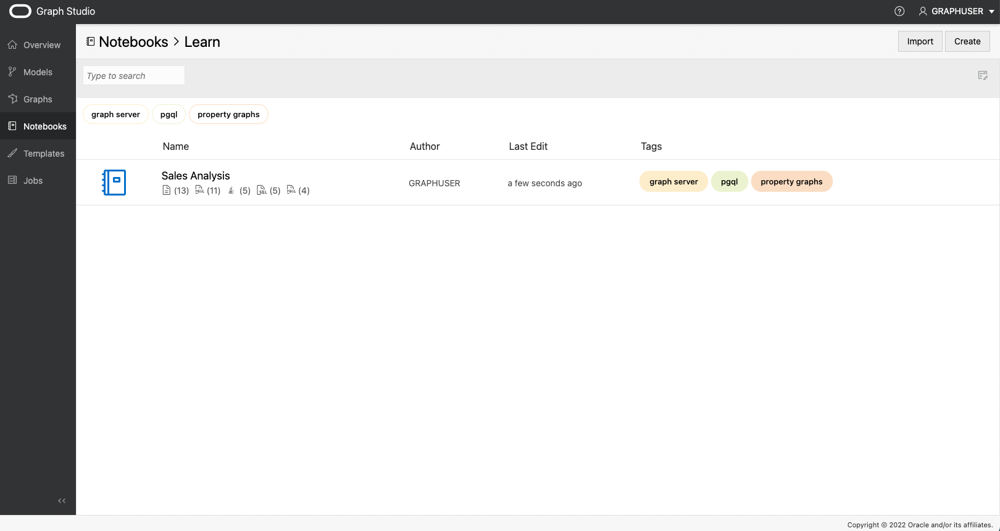
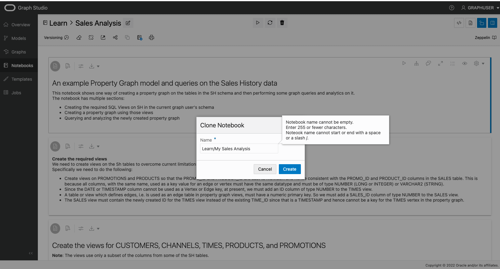
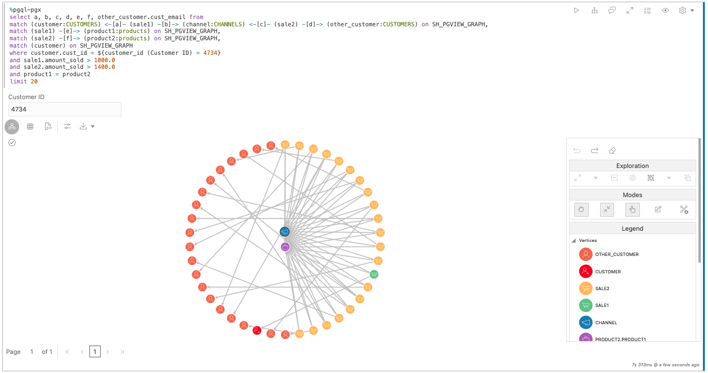
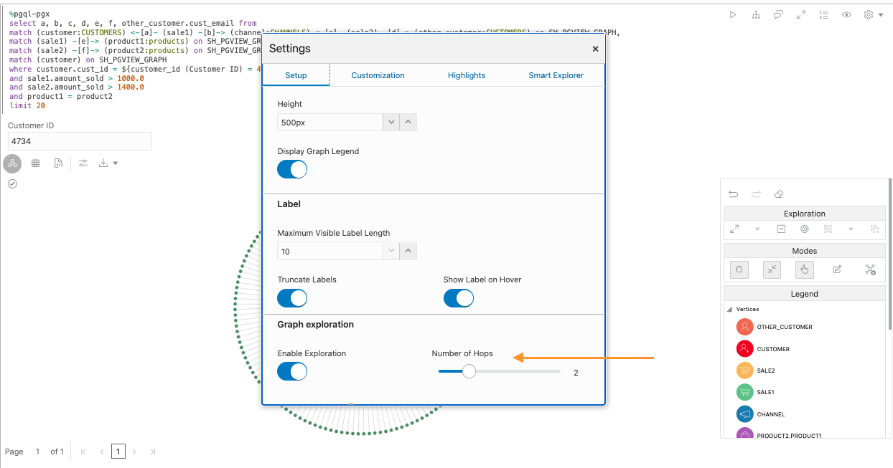
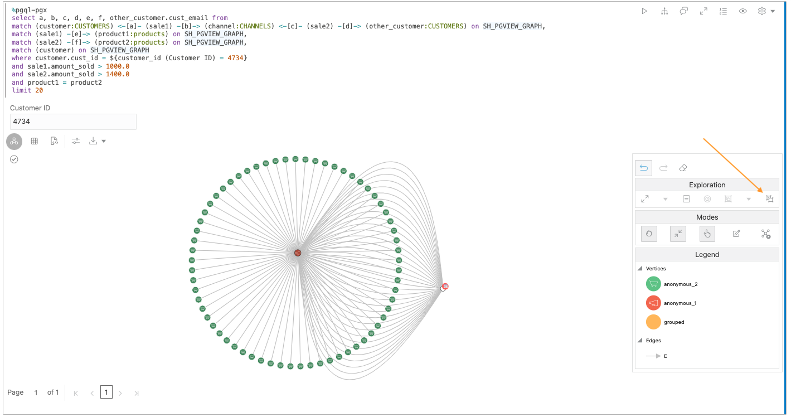

# Análisis de un almacén de datos típico con algoritmos de gráficos en un bloc de notas

## Introducción

En este laboratorio, aprenderá a ejecutar algoritmos de gráficos y consultas PGQL mediante blocs de notas directamente en la interfaz de Graph Studio de la instancia de Autonomous Data Warehouse - Shared Infrastructure (ADW) o Autonomous Transaction Processing - Shared Infrastructure (ATP).

Tiempo estimado: 20 minutos.

### Objetivos

*   Aprenda a preparar datos de gráficos para analizarlos en blocs de notas
*   Aprenda a crear una ejecución de párrafos explicativos con la sintaxis de Markdown
*   Aprender a crear párrafos de consulta de gráfico de ejecución con PGQL
*   Descubra cómo visualizar los resultados de las consultas de gráficos
*   Descubra cómo crear párrafos de algoritmo de ejecución de gráficos mediante las API de Java de PGX

### Requisitos

*   En la siguiente práctica se necesita una cuenta de Autonomous Database.
    
*   En esta práctica de laboratorio se asume que ha completado la práctica de laboratorio anterior (laboratorio 2) en la que hemos creado el gráfico **SH\_PGVIEW\_GRAPH**.
    

## Tarea 1: Asegúrese de que el gráfico SH está cargado en la memoria.

Antes de que los gráficos se puedan analizar en un bloc de notas, debemos asegurarnos de que el gráfico se carga en la memoria. En la interfaz de usuario de Graph Studio, vaya a la página **Gráficos** y verifique si el gráfico **SH\_PGVIEW\_GRAPH** está cargado en la memoria o no.

Si el gráfico se carga en la memoria (dice " en la memoria"), puede continuar con el PASO 2.

Si el gráfico **no** está cargado en la memoria, como en la siguiente captura de pantalla, haga clic en el icono **Cargar en memoria** (perno de iluminación) en la parte superior derecha de la sección de detalles. En el cuadro de diálogo resultante, haga clic en **Sí**.

Esto creará un trabajo "Cargar en memoria" para usted. Espere a que termine este trabajo:

## Tarea 2: clonación del bloc de notas de ejemplo de análisis del historial de ventas

1.  Haga clic en el icono de los **Notebooks** en el menú de la izquierda.
    
2.  Abra la carpeta **Aprender**:
    
    
    
3.  Haga clic en el bloc de notas **Análisis de ventas** para abrirlo.
    
    
    
4.  El bloc de notas de **Análisis de ventas** es un bloc de notas **incorporado**. Puede identificar los blocs de notas **incorporados** por el autor que se muestra como `<<system-user>>`. Los blocs de notas incorporados se comparten entre todos los usuarios y, por lo tanto, son de solo lectura y están bloqueados. Para ejecutar el bloc de notas, primero debemos crear una copia privada y, a continuación, desbloquearla. En la parte superior del bloc de notas, haga clic en el botón **Clonar**.
    
    
    
5.  En el cuadro de diálogo resultante, asigne al bloc de notas clonado un nombre único para que pueda encontrarlo más tarde de nuevo fácilmente. Las estructuras de carpetas se pueden expresar mediante el símbolo `/`. A continuación, haga clic en _Crear_.
    
    
    
6.  Haga clic en el botón **Desbloquear** en la parte superior derecha del bloc de notas clonado.
    
    
    
    El bloc de notas ya está listo para ejecutarse.
    

## Tarea 3: Exploración de las funciones básicas del bloc de notas

Cada bloc de notas se organiza en un juego de **párrafos**. Cada párrafo tiene una entrada (denominada **Código**) y una salida (denominada **Resultado**). En Graph Studio, hay 3 tipos de párrafos:

*   Los párrafos de rebaja comienzan con `%md`
*   Los párrafos de PGQL comienzan con `%pgql-px`
*   Los párrafos de Java de PGX comienzan con `%java-pgx`

En el bloc de notas Sales Analysis, puede encontrar ejemplos de cada uno de esos tipos. El bloc de notas está diseñado para trabajar con el gráfico creado en la práctica anterior, por lo que no tiene que modificar ningún código para que se ejecuten los párrafos. Puede notar que hay algunos párrafos ocultos al principio de este cuaderno. Estos párrafos ocultos se ejecutan a través del código SQL que revisamos anteriormente en este laboratorio. En este laboratorio, solo hay que centrarse en los párrafos visibles.

1.  Para ejecutar el primer párrafo, haga clic en el icono **Ejecutar** en la parte superior derecha del párrafo.
    
    
    
2.  El segundo párrafo ilustra cómo hacer referencia a los gráficos cargados en la memoria en los párrafos `%java-pgx`. Simplemente haga referencia a ellos mediante la API `session.getGraph("SH")`.  
    Haga clic en el icono **Ejecutar** para ejecutarlo. Se debe ejecutar para que el resto del bloc de notas funcione.
    
    
    
3.  Los siguientes tres párrafos ilustran cómo consultar la lista de etiquetas de vértice y borde.
    
    
    
4.  El siguiente párrafo muestra los bordes que conectan SALES con los otros vértices.
    
    
    
5.  El siguiente párrafo muestra el resultado de la consulta de dos ID de ventas específicos (4744 y 4538). Puede hacer clic derecho en cualquiera de las verticias para obtener más información sobre estas dos ventas.
    
    
    
6.  El siguiente párrafo muestra la relación entre productos, ventas y clientes. Puede hacer clic con el botón derecho en cualquiera de las verticias y bordes para obtener más información.
    
    
    
7.  Los dos párrafos siguientes ilustran una consulta de almacén de datos típica, pero expresada en PGQL en lugar de SQL. En las consultas PGQL, hace referencia al gráfico que desea consultar mediante la sintaxis `MATCH ... ON <graphName>`. Observe que los párrafos `%pgql-pgx` devuelven formato tabular por defecto, por lo que no tiene que realizar ninguna conversión para visualizar el resultado de las consultas PGQL como gráficos.
    
    
    
8.  Observe el uso de **formularios dinámicos** en este primer párrafo `%pgql-px`. Si utiliza la sintaxis del formulario como se muestra en ese párrafo dentro de la consulta, el bloc de notas representará automáticamente un campo de entrada y utilizará el valor que especifique en el campo de entrada al ejecutar la consulta.
    
    
    
    Si combina esta función con la capacidad de ocultar la sección **Código** del párrafo, puede convertir los blocs de notas en aplicaciones sin código que los usuarios pueden ejecutar con varios parámetros sin ningún conocimiento de programación. Además de la entrada de texto, también hay soporte para listas desplegables y otros tipos de formularios. Consulte la guía del usuario de Autonomous Graph para obtener la referencia completa.
    
9.  En el siguiente párrafo se muestra cómo visualizar los resultados mediante gráficos. Observará que solo ve un gráfico, pero no código. En los blocs de notas, puede ocultar la entrada de un párrafo. Esto resulta útil para generar informes. Para mostrar el código, haga clic en el icono de ojo en la parte superior derecha del párrafo y marque la casilla **Código**.
    
    
    
        Any paragraph which produces tabular results can be visualized using charts. To produce a tabular result, make sure the output encodes each row separated by \n (newline) and column separated by \t (tab) with first row as header row.
        That is what this paragraph is doing to visualize the distribution of vertex types in our graph using a pie chart.
        
10.  Haga clic en los tipos de gráficos para explorar diferentes visualizaciones de gráficos y sus opciones de configuración.
    
    
    

## Tarea 4: Reproducir con visualización de gráficos

1.  Ejecute este párrafo que muestra un ejemplo de cómo visualizar consultas PGQL como un gráfico:
    
    
    
    Cualquier consulta PGQL no compleja también se puede representar como un gráfico en lugar de una tabla o gráfico. Las excepciones son las consultas que no devuelven entidades singulares, como las consultas que contienen `GROUP BY` u otras agregaciones. Haga clic en el botón **Configuración** para explorar todas las opciones de visualización de gráficos. Puede elegir qué propiedades representar junto a un vértice o borde, qué diseño de gráfico utilizar y mucho más. Intente cambiar algunos ajustes para ver el efecto.
    
2.  En la configuración de visualización de gráficos, abra el separador **Aspectos destacados**.
    
    
    
    Al utilizar **Aspectos destacados**, puede enfatizar determinados elementos del gráfico dándoles un color, icono, tamaño, etc. diferente a otros en función de determinadas condiciones. Como puede ver, aquí agregamos algunos aspectos destacados para representar diferentes tipos de vértices de manera diferente según una condición de etiqueta. Intente crear su propio resaltado o editar uno existente para ver cómo afecta a la salida haciendo clic en los botones **Nuevo resaltado** y **Editar resaltado**, respectivamente.
    
3.  Vuelva a cerrar el cuadro de diálogo de configuración y haga clic con el botón derecho en uno de los vértices. Mostrará todas las propiedades asociadas de ese vértice. Las propiedades que forman parte de la proyección de la consulta PGQL original se muestran en negrita:
    
    
    

## Tarea 5: Jugar con exploración de gráficos

La función de visualización de gráficos permite **explorar** el gráfico visualmente directamente en el lienzo de visualización.

1.  Haga clic en uno de los vértices del gráfico representado.
    
    
    
    Observará que la barra de herramientas de manipulación de gráficos del lado derecho está activada.
    
    
    
2.  Haga clic en la acción **Ampliar**.
    
    
    
    Expandir le mostrará todos los vecinos del vértice seleccionado, hasta 2 saltos. Puede reducir o aumentar el número de saltos en el cuadro de diálogo de configuración de visualización de gráficos.
    
    
    
3.  La barra de herramientas de manipulación de gráficos proporciona una conveniente opción **Deshacer** para revertir la manipulación anterior. Haga clic en él para eliminar de nuevo los vértices expandidos.
    
    
    
4.  Seleccione un vértice de nuevo, esta vez haga clic en **Enfoque**. El enfoque es como **Ampliar**, pero eliminará todos los demás elementos del lienzo.
    
    
    
    
    
5.  A continuación, intente agrupar varios vértices en un grupo. Para ello, mantenga pulsado el mouse y arrástrelo sobre el lienzo para seleccionar un grupo de vértices. A continuación, haga clic en el botón **Grupo**.
    
    
    
    Puede crear tantos grupos como desee. De esta manera, puede agrupar elementos ruidosos en un solo grupo visible sin soltarlos realmente de la pantalla. El pequeño número al lado de un grupo indica cuántos elementos hay en ese grupo.
    
    
    
6.  Para volver a agrupar los elementos más tarde, haga clic en el grupo y, a continuación, haga clic en el icono **Desagrupar**.
    
    
    
7.  También puede borrar elementos individuales de la visualización. Haga clic en un vértice y, a continuación, haga clic en la acción **Borrar**.
    
    
    
    También puede borrar un grupo de elementos. Solo tiene que seleccionar todos los vértices y bordes que desea soltar haciendo clic y arrastrar sobre el lienzo y, a continuación, hacer clic en el icono **Borrar**.
    
    
    
8.  Los resultados de párrafo se pueden ampliar a una pantalla completa para darle más espacio para la manipulación de gráficos. Haga clic en el botón **Ampliar** en la parte superior derecha del párrafo para acceder al modo de pantalla completa.
    
    
    
    
    
    Vuelva a hacer clic en el mismo botón para volver a la pantalla normal.
    
9.  Por último, para volver al estado inicial de la visualización, haga clic en el icono **Restablecer** de la barra de herramientas de manipulación. Esto revertirá todos los cambios temporales que hemos realizado en el resultado.
    
    
    

## Tarea 6: Búsqueda de los productos y recomendaciones más importantes mediante algoritmos de gráficos

El bloc de notas de ejemplo contiene dos párrafos que ilustran cómo puede utilizar algoritmos de gráficos para obtener nuevos conocimientos sobre los datos.

1.  Desplácese hasta el párrafo **Buscar los productos más importantes** y familiarícese con el funcionamiento del algoritmo leyendo la descripción de Markdown.
    
2.  Siga las instrucciones del siguiente párrafo para crear un gráfico de propiedades BIDIRECTED\_SH\_PGVIEW\_GRAPH con Modeler y ejecute el siguiente párrafo para cargarlo en la memoria.
    
    
    
3.  En el siguiente párrafo, ejecutamos el algoritmo de grafos invocando la API PGX correspondiente. El resultado del algoritmo se almacena en una nueva propiedad de vértice que llamamos `centrality`. En el párrafo siguiente, consultamos esa propiedad recién calculada y ordenamos el resultado por valor de centralidad. En este ejemplo se muestra cómo puede combinar algoritmos y consultas PGQL para clasificar rápidamente los elementos del gráfico.
    
    
    
    Sigue adelante y ejecuta esos párrafos tú mismo.
    
4.  En los siguientes párrafos se muestra cómo puede aprovechar el algoritmo **Personalizado PageRank** incorporado para recomendar productos a un cliente concreto. Familiarícese con el funcionamiento del algoritmo leyendo la descripción de Markdown. Una vez más ejecutamos el algoritmo a través de una sencilla llamada a la API de PGX y, a continuación, consultamos el resultado mediante PGQL. Esta vez utilizamos dos consultas. La primera muestra los productos que el cliente ya compró. La segunda consulta muestra los productos recomendados como una posible compra.
    
    
    

**Felicidades.** La práctica de laboratorio se ha realizado correctamente.

## Reconocimientos

*   **Autor**: Jayant Sharma, gestión de productos
*   **Contribuyentes**: Korbi Schmid, Rahul Tasker, Desarrollo de productos
*   **Última actualización por/fecha**: Jayant Sharma, junio de 2023