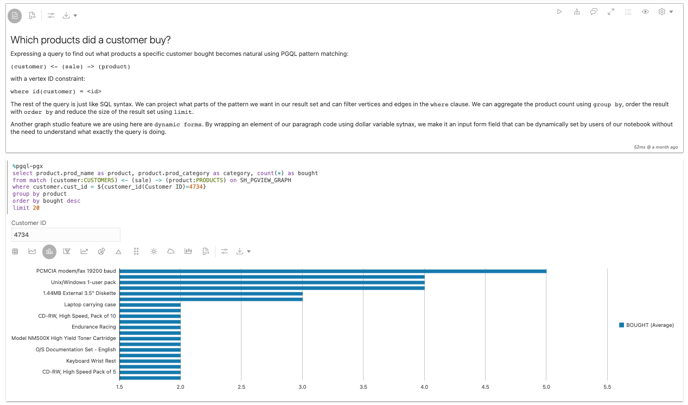
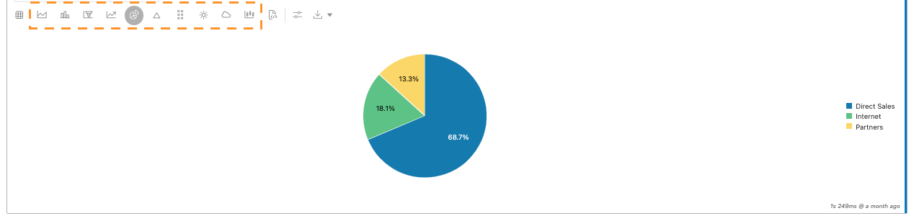
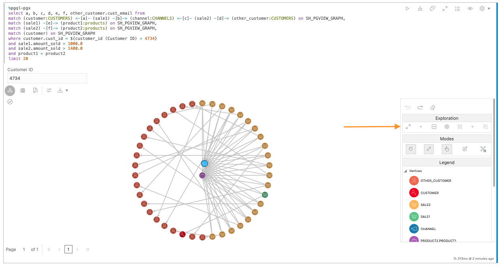
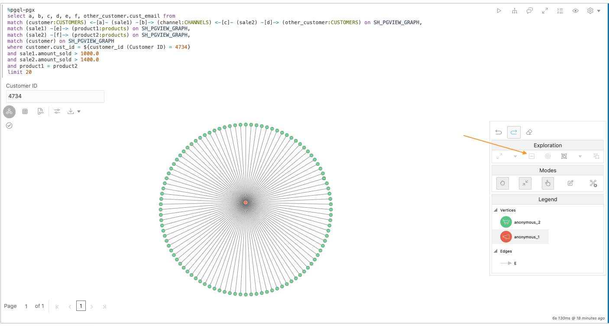

# Analyser un entrepôt de données standard à l'aide d'algorithmes de graphique dans un bloc-notes

## Présentation

Au cours de cet atelier, vous allez apprendre à exécuter des algorithmes de graphique et des requêtes PGQL à l'aide de blocs-notes directement dans l'interface Graph Studio de votre instance Autonomous Data Warehouse - Shared Infrastructure (ADW) ou Autonomous Transaction Processing - Shared Infrastructure (ATP).

Temps estimé : 20 minutes.

### Objectifs

*   Apprendre à préparer les données de graphique à analyser dans des blocs-notes
*   Apprendre à créer des paragraphes explicatifs d'exécution à l'aide de la syntaxe Markdown
*   Apprendre à créer des paragraphes de requête de graphique d'exécution à l'aide de PGQL
*   Apprendre à visualiser les résultats des requêtes de graphique
*   Apprendre à créer des paragraphes d'algorithme de graphique d'exécution à l'aide des API Java PGX

### Prérequis

*   L'exercice suivant nécessite un compte Autonomous Database.
    
*   Cet exercice suppose que vous avez terminé l'exercice précédent (exercice 2) au cours duquel nous avons créé le graphique **SH\_PGVIEW\_GRAPH**.
    

## Tâche 1 : assurez-vous que le graphique SH est chargé en mémoire.

Avant de pouvoir analyser des graphiques dans un bloc-notes, nous devons nous assurer que le graphique est chargé en mémoire. Dans l'interface utilisateur de Graph Studio, accédez à la page **Graphes** et vérifiez si le graphique **SH\_PGVIEW\_GRAPH** est chargé ou non en mémoire.

Si le graphique est chargé en mémoire (il indique " en mémoire"), vous pouvez passer à l'étape 2.

Si le graphique n'est **pas** chargé dans la mémoire, comme dans la capture d'écran suivante, cliquez sur l'icône **Charger dans la mémoire** (éclair) en haut à droite de la section des détails. Dans la boîte de dialogue qui apparaît, cliquez sur **Oui**.

Cela créera un travail de chargement en mémoire pour vous. Attendez la fin de ce travail :

## Tâche 2 : cloner le bloc-notes d'analyse de l'historique des ventes

1.  Cliquez sur l'icône **Blocs-notes** dans le menu de gauche.
    
2.  Ouvrez le dossier **Learn** :
    
    
    
3.  Cliquez sur le bloc-notes **Analyse des ventes** pour l'ouvrir.
    
    
    
4.  Le bloc-notes **Analyse des ventes** est un bloc-notes **intégré**. Vous pouvez identifier les blocs-notes **intégrés** par l'auteur affiché sous la forme `<<system-user>>`. Les blocs-notes intégrés sont partagés entre tous les utilisateurs et sont donc en lecture seule et verrouillés. Pour exécuter le bloc-notes, nous devons d'abord créer une copie privée, puis la déverrouiller. En haut du bloc-notes, cliquez sur le bouton **Cloner**.
    
    
    
5.  Dans la boîte de dialogue qui s'affiche, attribuez un nom unique au bloc-notes cloné afin que vous puissiez le retrouver facilement ultérieurement. Les structures de dossier peuvent être exprimées à l'aide du symbole `/`. Cliquez ensuite sur _Créer_.
    
    
    
6.  Cliquez sur le bouton **Déverrouiller** en haut à droite du bloc-notes cloné.
    
    
    
    Le bloc-notes est maintenant prêt à être exécuté.
    

## Tâche 3 : Explorer les fonctionnalités de base d'un bloc-notes

Chaque bloc-notes est organisé en un ensemble de **paragraphes**. Chaque paragraphe a une entrée (appelée **Code**) et une sortie (appelée **Résultat**). Dans Graph Studio, il existe 3 types de paragraphes :

*   Les paragraphes de démarque commencent par `%md`
*   Les paragraphes PGQL commencent par `%pgql-px`
*   Les paragraphes Java PGX commencent par `%java-pgx`

Dans le bloc-notes Sales Analysis, vous trouverez des exemples pour chacun de ces types. Le bloc-notes est conçu pour fonctionner avec le graphique créé au cours de l'exercice précédent. Vous n'avez donc pas besoin de modifier le code pour exécuter les paragraphes. Vous remarquerez peut-être qu'il y a des paragraphes cachés au début de ce bloc-notes. Ces paragraphes masqués utilisent le code SQL que nous avons exécuté précédemment dans cet exercice. Pour cet exercice, concentrez-vous uniquement sur les paragraphes visibles.

1.  Pour exécuter le premier paragraphe, cliquez sur l'icône **Exécuter** en haut à droite du paragraphe.
    
    
    
2.  Le deuxième paragraphe montre comment faire référence aux graphiques chargés en mémoire dans les paragraphes `%java-pgx`. Il vous suffit de les référencer à l'aide de l'API `session.getGraph("SH")`.  
    Cliquez sur l'icône **Exécuter** pour l'exécuter. Cette opération doit être exécutée pour que le reste du bloc-notes fonctionne.
    
    
    
3.  Les trois paragraphes suivants illustrent comment interroger la liste des libellés de sommet et d'arête.
    
    
    
4.  Le paragraphe suivant présente les arêtes reliant SALES aux autres sommets.
    
    
    
5.  Le paragraphe suivant présente le résultat de la recherche de deux ID de vente spécifiques (4744 et 4538). Vous pouvez cliquer avec le bouton droit de la souris sur l'une des verticies pour obtenir plus d'informations sur ces deux ventes.
    
    
    
6.  Le paragraphe suivant présente la relation entre les produits, les ventes et les clients. Vous pouvez faire un clic droit sur l'une des verticies et des arêtes pour obtenir plus d'informations.
    
    
    
7.  Les deux paragraphes suivants illustrent une requête standard de data warehouse, mais exprimée en PGQL au lieu de SQL. Dans les requêtes PGQL, vous référencez le graphique à interroger à l'aide de la syntaxe `MATCH ... ON <graphName>`. Par défaut, les paragraphes `%pgql-pgx` renvoient un format tabulaire. Vous n'avez donc pas à effectuer de conversion pour visualiser le résultat des requêtes PGQL sous forme de graphiques.
    
    
    
8.  Notez l'utilisation des **formulaires dynamiques** dans ce premier paragraphe `%pgql-px`. Si vous utilisez la syntaxe de formulaire comme indiqué dans ce paragraphe de la requête, le bloc-notes affiche automatiquement un champ d'entrée et utilise la valeur que vous indiquez dans le champ d'entrée lors de l'exécution de la requête.
    
    
    
    Si vous combinez cette fonctionnalité avec la possibilité de masquer la section **Code** du paragraphe, vous pouvez transformer les blocs-notes en applications sans code que les utilisateurs peuvent exécuter avec divers paramètres sans aucune connaissance en programmation. Outre la saisie de texte, il est également pris en charge pour les listes déroulantes et d'autres types de formulaires. Consultez le guide de l'utilisateur Autonomous Graph pour obtenir la référence complète.
    
9.  Le paragraphe suivant illustre la façon dont vous pouvez visualiser les résultats à l'aide de graphiques. Vous remarquerez que vous ne voyez qu'un graphique, mais pas de code. Dans les blocs-notes, vous pouvez masquer l'entrée d'un paragraphe. Cela est utile pour générer des rapports. Pour afficher le code, cliquez sur l'icône en forme d'oeil en haut à droite du paragraphe et cochez la case **Code**.
    
    
    
        Any paragraph which produces tabular results can be visualized using charts. To produce a tabular result, make sure the output encodes each row separated by \n (newline) and column separated by \t (tab) with first row as header row.
        That is what this paragraph is doing to visualize the distribution of vertex types in our graph using a pie chart.
        
10.  Cliquez sur les types de graphique pour explorer les différentes visualisations de graphique et leurs options de configuration.
    
    
    

## Tâche 4 : jouer avec la visualisation de graphique

1.  Exécutez ce paragraphe qui montre un exemple de visualisation des requêtes PGQL sous forme de graphique :
    
    
    
    Toute requête PGQL non complexe peut également être affichée sous forme de graphique au lieu d'un tableau ou d'un graphique. Les exceptions à cette règle sont les requêtes qui ne renvoient pas d'entités singulières telles que les requêtes contenant `GROUP BY` ou d'autres agrégations. Cliquez sur le bouton **Paramètres** pour explorer toutes les options de visualisation de graphique. Vous pouvez choisir les propriétés à afficher en regard d'un sommet ou d'une arête, la disposition du graphique à utiliser et bien plus encore. Essayez de modifier quelques paramètres pour voir l'effet.
    
2.  Dans les paramètres de visualisation de graphique, ouvrez l'onglet **Mises en évidence**.
    
    
    
    En utilisant les **éléments principaux**, vous pouvez mettre en évidence certains éléments de votre graphique en leur donnant une couleur, une icône, une taille, etc. différentes de celles des autres éléments en fonction de certaines conditions. Comme vous pouvez le voir, nous avons ajouté quelques points forts pour afficher différents types de sommets différemment en fonction d'une condition de libellé. Essayez de créer votre propre mise en surbrillance ou de modifier une mise en surbrillance existante pour voir son impact sur la sortie, en cliquant respectivement sur les boutons **Nouvelle mise en surbrillance** et **Modifier la mise en surbrillance**.
    
3.  Fermez à nouveau la boîte de dialogue des paramètres et effectuez un clic droit sur l'un des sommets. Elle affiche toutes les propriétés associées à ce sommet. Les propriétés faisant partie de la projection de la requête PGQL d'origine sont affichées en gras :
    
    
    

## Tâche 5 : jouer avec l'exploration de graphes

La fonctionnalité de visualisation de graphique vous permet d'**explorer** plus en détail le graphique directement dans le canevas de visualisation.

1.  Cliquez sur l'un des sommets du graphique affiché.
    
    
    
    Vous remarquerez que la barre d'outils de manipulation de graphique à droite est activée.
    
    
    
2.  Cliquez sur l'action **Développer**.
    
    
    
    Expand vous montrera tous les voisins du sommet sélectionné, jusqu'à 2 sauts. Vous pouvez diminuer ou augmenter le nombre de sauts dans la boîte de dialogue des paramètres de visualisation de graphique.
    
    
    
3.  La barre d'outils de manipulation de graphique fournit une option **Annuler** pratique pour inverser la manipulation précédente. Cliquez dessus pour supprimer à nouveau les sommets développés.
    
    
    
4.  Sélectionnez à nouveau un sommet, cliquez cette fois sur **Focus**. Le focus est comme **Développer**, mais il enlève tous les autres éléments du canevas.
    
    
    
    
    
5.  Ensuite, essayez de regrouper plusieurs sommets en un seul groupe. Pour cela, maintenez la souris enfoncée et faites glisser le curseur sur le canevas pour sélectionner un groupe de sommets. Cliquez ensuite sur le bouton **Groupe**.
    
    
    
    Vous pouvez créer autant de groupes que vous le souhaitez. De cette façon, vous pouvez regrouper des éléments bruyants en un seul groupe visible sans réellement les laisser tomber de l'écran. Le petit nombre à côté d'un groupe vous indique le nombre d'éléments qu'il contient.
    
    
    
6.  Pour dissocier les éléments ultérieurement, cliquez sur le groupe, puis sur l'icône **Dissocier**.
    
    
    
7.  Vous pouvez également supprimer des éléments individuels de la visualisation. Cliquez sur un sommet, puis sur l'action **Supprimer**.
    
    
    
    Vous pouvez également supprimer un groupe d'éléments. Sélectionnez simplement tous les sommets et arêtes que vous souhaitez déposer par clic et faites glisser sur le canevas, puis cliquez sur l'icône **Déposer**.
    
    
    
8.  Les résultats de paragraphe peuvent être développés en plein écran pour vous donner plus d'espace pour la manipulation de graphique. Cliquez sur le bouton **Développer** en haut à droite du paragraphe pour passer en mode plein écran.
    
    
    
    
    
    Cliquez à nouveau sur le même bouton pour revenir à l'écran normal.
    
9.  Enfin, pour revenir à l'état initial de la visualisation, cliquez sur l'icône **Réinitialiser** dans la barre d'outils de manipulation. Cela rétablira toutes les modifications temporaires que nous avons apportées au résultat.
    
    
    

## Tâche 6 : recherche des produits et recommandations les plus importants à l'aide d'algorithmes de graphe

L'exemple de bloc-notes contient deux paragraphes illustrant comment utiliser des algorithmes de graphique pour obtenir de nouvelles informations sur vos données.

1.  Faites défiler la page jusqu'au paragraphe **Rechercher les produits les plus importants** et familiarisez-vous avec le fonctionnement de l'algorithme en lisant la description Markdown.
    
2.  Suivez les instructions du paragraphe suivant pour créer un graphique de propriétés BIDIRECTED\_SH\_PGVIEW\_GRAPH à l'aide de Modeler, puis exécutez le paragraphe suivant pour le charger en mémoire.
    
    
    
3.  Dans le paragraphe suivant, nous exécutons l'algorithme de graphique en appelant l'API PGX correspondante. Le résultat de l'algorithme est stocké dans une nouvelle propriété de sommet que nous appelons `centrality`. Dans le paragraphe ci-dessous, nous interrogeons cette propriété nouvellement calculée et classons le résultat par valeur de centralité. Cet exemple vous montre comment combiner des algorithmes et des requêtes PGQL pour classer rapidement des éléments dans votre graphique.
    
    
    
    Allez-y et exécutez vous-même ces paragraphes.
    
4.  Les paragraphes suivants illustrent comment tirer parti de l'algorithme **Personnalisé PageRank** intégré pour recommander des produits à un client particulier. Familiarisez-vous avec le fonctionnement de l'algorithme en lisant la description Markdown. Nous exécutons à nouveau l'algorithme via un appel d'API PGX facile, puis nous interrogeons le résultat à l'aide de PGQL. Cette fois, nous utilisons deux requêtes. La première montre les produits que le client a déjà achetés. La deuxième requête affiche les produits recommandés en tant qu'achat possible.
    
    
    

**Félicitations !** Vous avez terminé l'exercice.

## Accusés de réception

*   **Auteur** - Jayant Sharma, Product Management
*   **Contributeurs** - Korbi Schmid, Rahul Tasker, Développement de produits
*   **Dernière mise à jour par/date** - Jayant Sharma, juin 2023