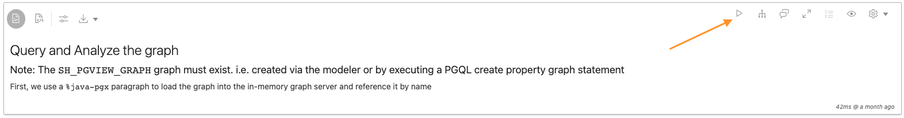
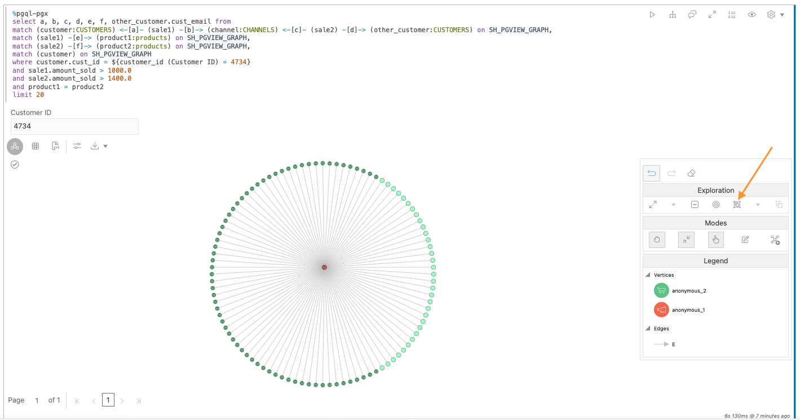
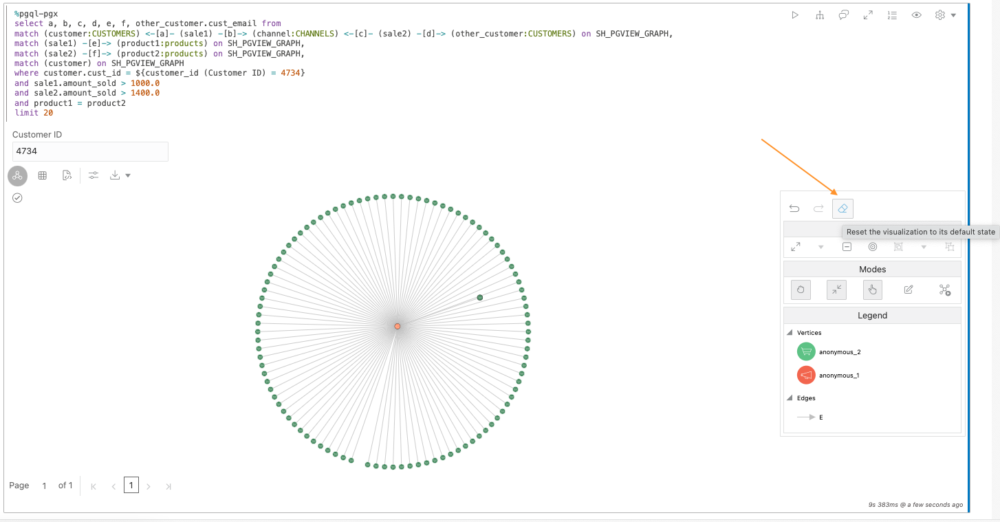

# ノートブックでのグラフ・アルゴリズムを使用した一般的なデータ・ウェアハウスの分析

## 概要

このラボでは、Autonomous Data Warehouse - Shared Infrastructure (ADW)またはAutonomous Transaction Processing - Shared Infrastructure (ATP)インスタンスのGraph Studioインタフェースで、ノートブックを使用してグラフ・アルゴリズムおよびPGQL問合せを直接実行する方法を学習します。

見積時間: 20分。

### 目標

*   ノートブックで分析するグラフ・データを準備する方法を学習します
*   Markdown構文を使用して実行説明段落を作成する方法を学習します
*   PGQLを使用してグラフ問合せ実行段落を作成する方法を学習します
*   グラフ問合せ結果をビジュアル化する方法を学習します
*   PGX Java APIを使用してグラフ実行アルゴリズムの段落を作成する方法を学習します

### 前提条件

*   次の演習では、Autonomous Databaseアカウントが必要です。
    
*   この演習では、**SH\_PGVIEW\_GRAPH**グラフを作成した前の演習(Lab 2)を完了していることを前提としています。
    

## タスク1: SHグラフがメモリーにロードされていることを確認します。

ノートブックでグラフを分析する前に、グラフがメモリーにロードされていることを確認する必要があります。Graph Studioユーザー・インタフェースで、**「グラフ」**ページに移動し、**SH\_PGVIEW\_GRAPH**グラフがメモリーにロードされているかどうかを確認します。

グラフがメモリーにロードされている場合(メモリーにと示されている場合)、ステップ2に進むことができます。

グラフがメモリーにロード**されない**場合は、次のスクリーンショットのように、詳細セクションの右上にある**「メモリーにロード」**(稲妻)アイコンをクリックします。表示されたダイアログで、**「はい」**をクリックします。

これにより、「メモリーにロード」ジョブが作成されます。このジョブが終了するまで待機します。

## タスク2: 営業履歴分析例ノートブックのクローニング

1.  左側のメニューで**「ノートブック」**アイコンをクリックします。
    
2.  **「学習」**フォルダを開きます:
    
    
    
3.  **「販売分析」**ノートブックをクリックして開きます。
    
    
    
4.  **販売分析**ノートブックは**組込み**ノートブックです。**組込み**ノートブックは、`<<system-user>>`として表示される作成者が識別できます。組込みノートブックはすべてのユーザー間で共有されるため、読取り専用でロックされます。ノートブックを実行するには、まずプライベート・コピーを作成してからロック解除する必要があります。ノートブックの上部で、**「クローン」**ボタンをクリックします。
    
    
    
5.  表示されるダイアログで、クローニングされたノートブックに一意の名前を付けて、後で簡単に見つけることができます。フォルダ構造は、`/`記号を使用して表すことができます。次に、_「作成」_をクリックします。
    
    
    
6.  クローニングされたノートブックの右上にある**「ロック解除」**ボタンをクリックします。
    
    
    
    ノートブックを実行する準備ができました。
    

## タスク3: 基本的なノートブック機能の確認

各ノートブックは、一連の**段落**に編成されます。各段落には、入力(**コード**と呼ばれる)と出力(**結果**と呼ばれる)があります。Graph Studioには、次の3つのタイプの段落があります。

*   値下げ段落は`%md`で始まります
*   PGQL段落は`%PGQL-px`で始まります
*   PGX Java段落は`%java-pgx`で始まります

「販売分析」ノートブックには、これらの各タイプの例があります。ノートブックは、前の演習で作成したグラフと連携するように設計されているため、段落を実行するためにコードを変更する必要はありません。このノートブックの開始時に、いくつかの非表示の段落があることがわかります。これらの非表示の段落は、この演習の前半で実行したSQLコードを介して実行されます。この演習では、表示されている段落のみに焦点を当てます。

1.  最初の段落を実行するには、段落の右上にある**「実行」**アイコンをクリックします。
    
    
    
2.  2番目の段落は、`%java-pgx`段落でメモリーにロードされたグラフを参照する方法を示しています。これらを参照するには、`session.getGraph("SH")` APIを使用します。  
    **「実行」**アイコンをクリックして実行します。これは、残りのノートブックが機能するために実行する必要があります。
    
    
    
3.  次の3つの段落は、頂点およびエッジ・ラベルのリストを問い合せる方法を示しています。
    
    
    
4.  次の段落は、SALESを他の頂点に接続するエッジを示しています。
    
    
    
5.  次の段落は、2つの特定の販売ID(4744および4538)を問い合せた結果を示しています。いずれかの頂点を右クリックして、これら2つの販売に関する詳細情報を取得できます。
    
    
    
6.  次の段落は、製品、販売および顧客の関係を示しています。頂点とエッジのいずれかを右クリックすると、詳細情報を取得できます。
    
    
    
7.  次の2つの段落は、一般的なデータ・ウェアハウス問合せを示していますが、SQLではなくPGQLで表されています。PGQL問合せでは、`MATCH ... ON <graphName>`構文を使用して問合せ対象のグラフを参照します。`%PGQL-pgx`段落はデフォルトで表形式書式を返すため、PGQL問合せの結果をチャートとして視覚化するために変換を行う必要はありません。
    
    
    
8.  この最初の`%pgql-px`段落で**動的フォーム**を使用することに注意してください。問合せ内のその段落に示されているフォーム構文を使用する場合、ノートブックは入力フィールドを自動的にレンダリングし、問合せの実行時に入力フィールドに指定した値を使用します。
    
    
    
    この機能と段落の**「コード」**セクションを非表示にする機能を組み合せると、プログラミングの知識がなくても、ノートブックを様々なパラメータで実行できるゼロコード・アプリケーションに変換できます。テキスト入力とは別に、ドロップダウンやその他のタイプのフォームもサポートされています。完全なリファレンスについては、Autonomous Graphユーザーズ・ガイドを参照してください。
    
9.  次の段落は、チャートを使用して結果を視覚化する方法を示しています。チャートのみが表示されますが、コードは表示されません。ノートブックでは、段落の入力を非表示にできます。これは、レポートの生成に役立ちます。コードを表示するには、段落の右上にある目アイコンをクリックし、**「コード」**ボックスにチェックマークを入れます。
    
    
    
        Any paragraph which produces tabular results can be visualized using charts. To produce a tabular result, make sure the output encodes each row separated by \n (newline) and column separated by \t (tab) with first row as header row.
        That is what this paragraph is doing to visualize the distribution of vertex types in our graph using a pie chart.
        
10.  チャート・タイプをクリックして、様々なチャート・ビジュアライゼーションとその構成オプションを確認します。
    
    
    

## タスク4: グラフ・ビジュアライゼーションでの再生

1.  PGQL問合せをグラフとしてビジュアル化する方法の例を示す次の段落を実行します:
    
    
    
    非複合PGQL問合せは、表またはチャートのかわりにグラフとしてレンダリングすることもできます。この例外は、`GROUP BY`などの集計を含む問合せなどの単一のエンティティを返さない問合せです。**「設定」**ボタンをクリックして、すべてのグラフ視覚化オプションを確認します。頂点またはエッジの横にレンダリングするプロパティ、使用するグラフ・レイアウトなどを選択できます。効果を確認するために、いくつかの設定を変更してみてください。
    
2.  グラフ視覚化設定で、**「ハイライト」**タブを開きます。
    
    
    
    **「ハイライト」**を使用すると、特定の条件に基づいて他の要素とは異なる色、アイコン、サイズなどを与えることで、グラフ内の特定の要素を強調できます。ご覧のとおり、ここでは、ラベル条件に基づいて異なる種類の頂点をレンダリングするためのハイライトをいくつか追加しました。**「新規ハイライト」**ボタンと**「ハイライトの編集」**ボタンをそれぞれクリックして、独自のハイライトを作成するか、既存のハイライトを編集して出力にどのように影響するかを確認します。
    
3.  設定ダイアログを再度閉じて、いずれかの頂点を右クリックします。その頂点に関連するすべてのプロパティが表示されます。元のPGQL問合せの投影の一部であるプロパティは太字で示されます。
    
    
    

## タスク5: グラフ探索による再生

グラフ視覚化機能を使用すると、視覚化キャンバスでグラフをさらに視覚的に**探索**できます。

1.  レンダリングされたグラフの頂点のいずれかをクリックします。
    
    
    
    右側のグラフ操作ツールバーが有効になります。
    
    
    
2.  **「展開」**処理をクリックします。
    
    
    
    \[展開\]を選択すると、選択した頂点のすべてのネイバーが最大2ホップで表示されます。グラフ・ビジュアライゼーション設定ダイアログでホップ数を減らすか増やすことができます。
    
    
    
3.  グラフ操作ツールバーには、前の操作を元に戻す便利な**「元に戻す」**オプションがあります。クリックすると、展開された頂点が再度削除されます。
    
    
    
4.  頂点を再度選択します。今度は**「フォーカス」**をクリックします。フォーカスは**「展開」**に似ていますが、キャンバス上の他のすべての要素が削除されます。
    
    
    
    
    
5.  次に、複数の頂点を1つのグループにまとめてみます。その場合は、マウスを下にしてキャンバス上にドラッグし、頂点のグループを選択します。次に、**「グループ」**ボタンをクリックします。
    
    
    
    グループは必要な数だけ作成できます。これにより、ノイズのある要素を画面から実際に削除することなく、1つの表示可能なグループにグループ化できます。グループの横の小さな数字は、そのグループ内の要素の数を示します。
    
    
    
6.  後で要素をグループ化解除するには、グループをクリックし、**「グループ解除」**アイコンをクリックします。
    
    
    
7.  ビジュアライゼーションから個々の要素を削除することもできます。頂点をクリックし、**「削除」**アクションをクリックします。
    
    
    
    エレメントのグループを削除することもできます。ドロップするすべての頂点とエッジをクリックしてキャンバスにドラッグし、**「ドロップ」**アイコンをクリックします。
    
    
    
8.  段落の結果を全画面に展開して、グラフ操作用の領域を増やすことができます。段落の右上にある**「展開」**ボタンをクリックして、全画面モードに入ります。
    
    
    
    
    
    同じボタンをもう一度クリックすると、通常の画面に戻ります。
    
9.  最後に、ビジュアライゼーションの初期状態に戻るには、操作ツールバーの**「リセット」**アイコンをクリックします。これにより、結果に加えたすべての一時的な変更が元に戻されます。
    
    
    

## タスク6: グラフ・アルゴリズムを使用した最も重要な製品および推奨事項の検索

ノートブックの例には、グラフ・アルゴリズムを使用してデータに関する新しいインサイトを取得する方法を示す2つの段落が含まれています。

1.  **「最も重要な製品の検索」**の段落までスクロール・ダウンし、値下げの説明を読んでアルゴリズムの動作を理解します。
    
2.  次の段落の手順に従って、モデラーを使用してBIDIRECTED\_SH\_PGVIEW\_GRAPHプロパティ・グラフを作成し、次の段落を実行してメモリーにロードします。
    
    
    
3.  次の段落では、対応するPGX APIを起動してグラフ・アルゴリズムを実行します。アルゴリズムの結果は、`centrality`をコールする新しい頂点プロパティに格納されます。次の段落では、新しく計算されたプロパティーを照会し、結果を中央値で順序付けします。この例では、アルゴリズムとPGQL問合せを組み合せて、グラフ内の要素を迅速にランク付けする方法を示します。
    
    
    
    続けて、その段落を自分で実行してください。
    
4.  次のいくつかの段落は、組込みの**パーソナライズPageRank**アルゴリズムを利用して、製品を特定の顧客に推奨する方法を示しています。値下げの説明を読んで、アルゴリズムの動作を理解します。また、簡単なPGX API呼出しを介してアルゴリズムを実行し、PGQLを使用して結果を問い合せます。今回は2つの問合せを使用します。1つ目は、顧客が購入した製品を示します。2つ目の問合せは、購入可能な製品として推奨されている製品を示しています。
    
    
    

**おめでとうございます!**ラボを正常に完了しました。

## 確認

*   **著者** - 製品管理、Jayant Sharma
*   **貢献者** - 製品開発、Rahul Tasker、Korbi Schmid
*   **最終更新者/日付** - Jayant Sharma、2023年6月