# 노트북에서 그래프 알고리즘을 사용하여 일반적인 데이터 웨어하우스 분석

## 소개

이 실습에서는 Autonomous Data Warehouse - Shared Infrastructure(ADW) 또는 Autonomous Transaction Processing - Shared Infrastructure(ATP) 인스턴스의 Graph Studio 인터페이스에서 직접 노트북을 사용하여 그래프 알고리즘 및 PGQL 쿼리를 실행하는 방법을 알아봅니다.

예상 시간: 20분

### 목표

*   노트북에서 분석할 그래프 데이터를 준비하는 방법 알아보기
*   마크다운 구문을 사용하여 실행 설명 단락을 만드는 방법 알아보기
*   PGQL을 사용하여 실행 그래프 질의 단락을 생성하는 방법 알아보기
*   그래프 쿼리 결과를 시각화하는 방법 알아보기
*   PGX Java API를 사용하여 그래프 알고리즘 단락을 생성하는 방법 학습

### 필요 조건

*   다음 실습에서는 Autonomous Database 계정이 필요합니다.
    
*   이 실습에서는 **SH\_PGVIEW\_GRAPH** 그래프를 만든 이전 실습(Lab 2)을 완료했다고 가정합니다.
    

## 작업 1: SH 그래프가 Memory로 로드되었는지 확인합니다.

그래프를 노트북에서 분석하려면 먼저 그래프가 메모리에 로드되었는지 확인해야 합니다. Graph Studio 사용자 인터페이스에서 **그래프** 페이지로 이동하여 **SH\_PGVIEW\_GRAPH** 그래프가 메모리에 로드되었는지 여부를 확인합니다.

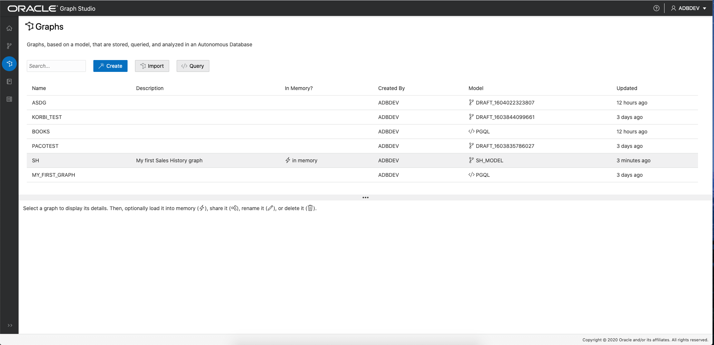

그래프가 메모리에 로드되면(메모리에 "" 표시) 2단계로 진행할 수 있습니다.

다음 스크린샷과 같이 그래프가 메모리에 로드되지 **않은** 경우 세부 정보 섹션의 오른쪽 위에 있는 **Load into memory**(lightning bolt) 아이콘을 누릅니다. 표시되는 대화상자에서 **예**를 누릅니다.

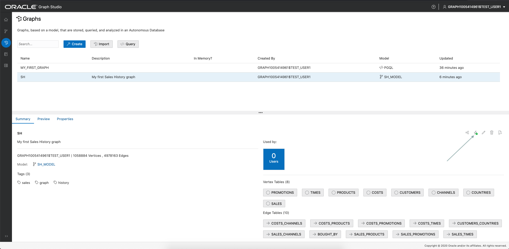

그러면 "메모리로 로드" 작업이 생성됩니다. 이 작업이 완료될 때까지 기다립니다.

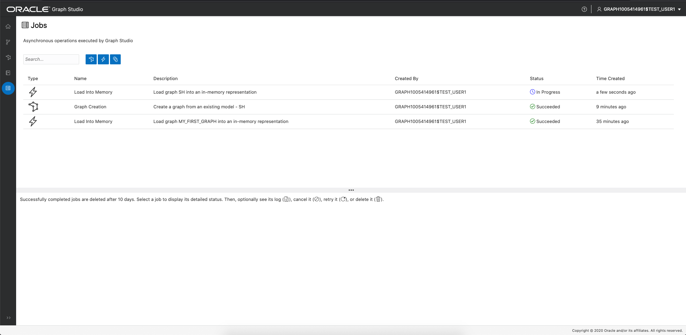

## 작업 2: 판매 내역 분석 예제 노트북 복제

1.  왼쪽에 있는 메뉴에서 **노트북** 아이콘을 누릅니다.
    
2.  **Learn** 폴더를 엽니다.
    
    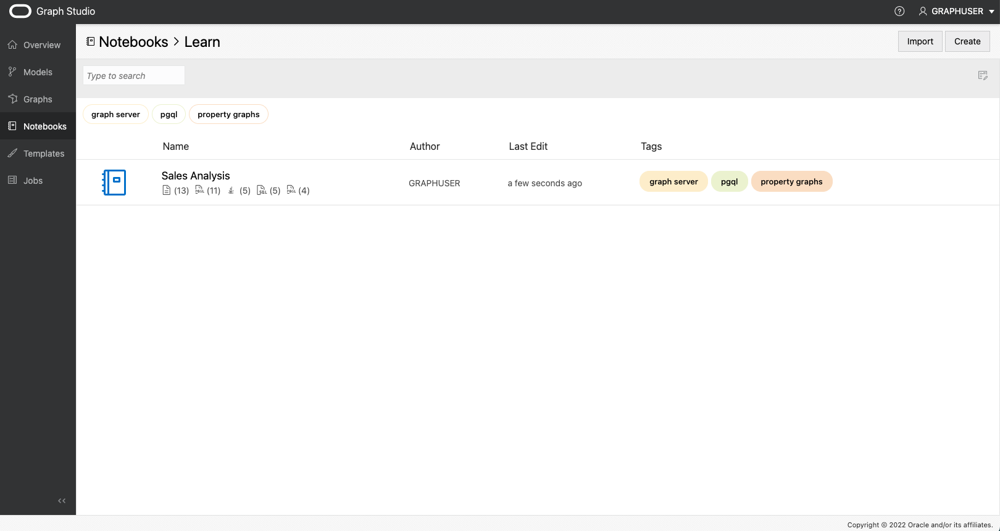
    
3.  **판매 분석** 노트북을 눌러 엽니다.
    
    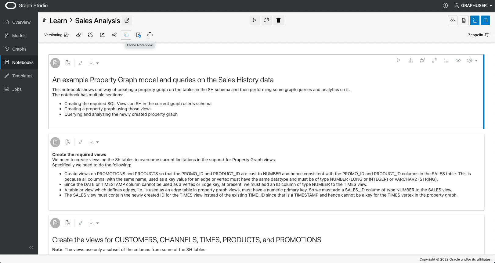
    
4.  **Sales Analysis** 노트북은 **기본 제공** 노트북입니다. 작성자가 `<<system-user>>`로 표시하는 **내장** 노트북을 식별할 수 있습니다. 내장 노트북은 모든 사용자 간에 공유되므로 읽기 전용이며 잠겨 있습니다. 노트북을 실행하려면 먼저 전용 복제본을 만든 다음 잠금 해제해야 합니다. 노트북 상단에서 **복제** 버튼을 누릅니다.
    
    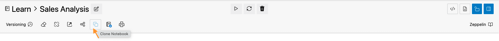
    
5.  결과 대화상자에서 복제된 노트북에 고유한 이름을 지정하면 나중에 쉽게 찾을 수 있습니다. 폴더 구조는 `/` 기호를 사용하여 표현할 수 있습니다. 그런 다음 _생성_을 누릅니다.
    
    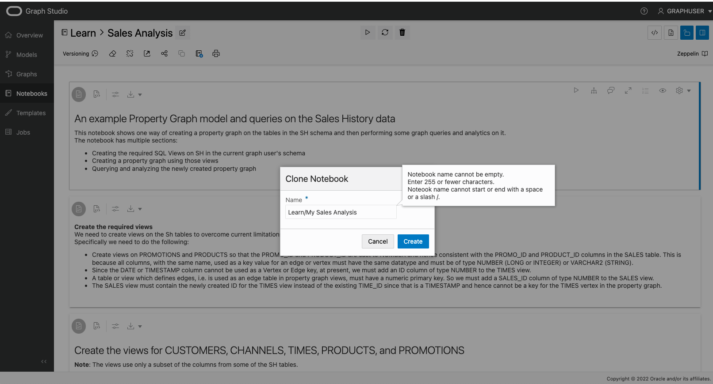
    
6.  복제된 노트북의 오른쪽 위에 있는 **Unlock** 버튼을 누릅니다.
    
    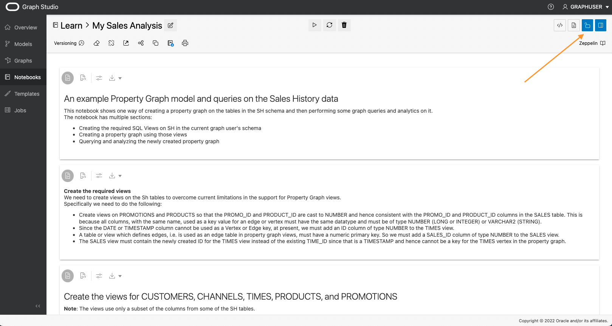
    
    이제 노트북을 실행할 준비가 되었습니다.
    

## 작업 3: 기본 노트북 기능 살펴보기

각 노트북은 **단락** 집합으로 구성됩니다. 각 단락에는 입력(**코드**)과 출력(**결과**)이 있습니다. Graph Studio에는 다음 세 가지 유형의 단락이 있습니다.

*   마크다운 단락은 `%md`로 시작합니다.
*   PGQL 단락은 `%pgql-px`로 시작합니다.
*   PGX Java 단락은 `%java-pgx`로 시작합니다.

Sales Analysis 노트북에서는 이러한 각 유형의 예제를 찾을 수 있습니다. 이 노트북은 이전 연습에서 생성한 그래프와 연동되도록 설계되었으므로 단락을 실행하기 위해 코드를 수정할 필요가 없습니다. 이 노트북의 시작 부분에 숨겨진 단락이 있음을 알 수 있습니다. 이러한 숨겨진 단락은 이 연습의 앞부분에서 실행한 SQL 코드를 통해 실행됩니다. 이 실습에서는 보이는 단락에만 집중합니다.

1.  첫번째 단락을 실행하려면 단락 오른쪽 위에 있는 **Run** 아이콘을 누릅니다.
    
    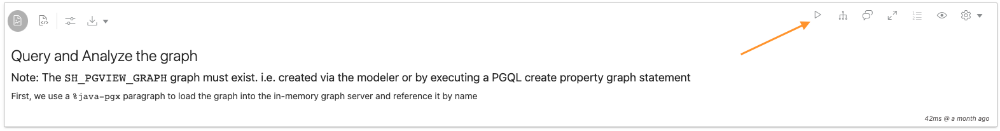
    
2.  두번째 단락은 `%java-pgx` 단락에서 메모리에 로드된 그래프를 참조하는 방법을 보여줍니다. `session.getGraph("SH")` API를 사용하여 참조하기만 하면 됩니다.  
    **실행** 아이콘을 눌러 실행합니다. 나머지 노트북이 작동하려면 이 명령을 실행해야 합니다.
    
    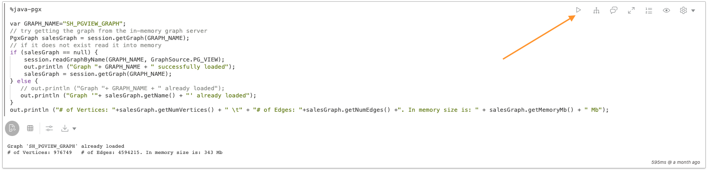
    
3.  다음 세 단락에서는 정점 및 모서리 레이블 목록을 조회하는 방법을 보여 줍니다.
    
    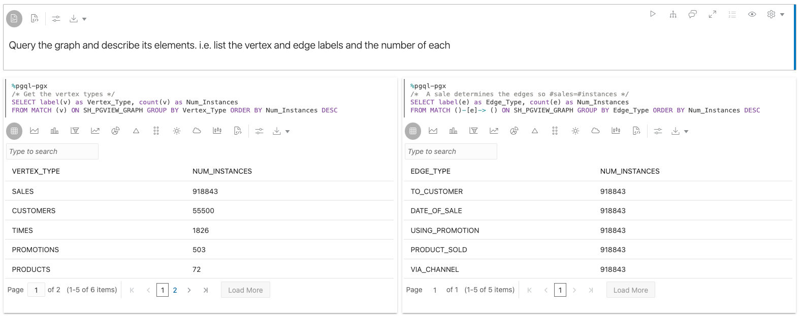
    
4.  다음 단락에서는 SALES를 다른 정점에 연결하는 가장자리를 보여 줍니다.
    
    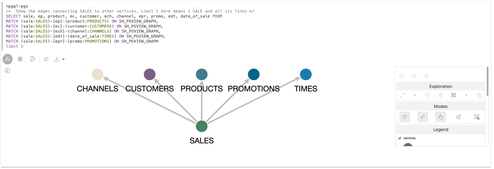
    
5.  다음 단락에서는 두 개의 특정 판매 ID(4744 및 4538)에 대한 질의 결과를 보여 줍니다. 이 두 판매에 대한 자세한 정보를 얻으려면 동사를 마우스 오른쪽 버튼으로 클릭할 수 있습니다.
    
    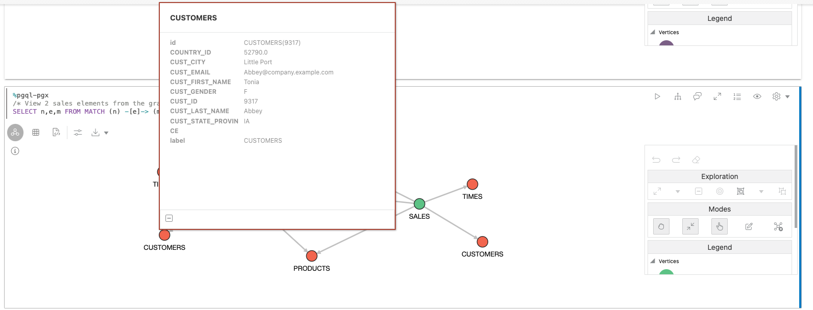
    
6.  다음 단락에서는 제품, 판매 및 고객 간의 관계를 보여 줍니다. 자세한 내용을 보려면 동사와 가장자리를 마우스 오른쪽 단추로 누르십시오.
    
    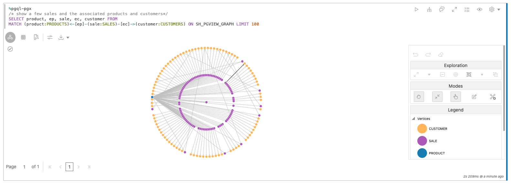
    
7.  다음 두 단락은 일반적인 데이터 웨어하우스 쿼리를 보여주지만 SQL 대신 PGQL로 표현됩니다. PGQL 질의에서 `MATCH ... ON <graphName>` 구문을 사용하여 질의할 그래프를 참조합니다. `%PGQL-pgx` 단락은 기본적으로 표 형식 형식을 반환하므로 PGQL 질의 결과를 차트로 시각화하기 위해 변환을 수행할 필요가 없습니다.
    
    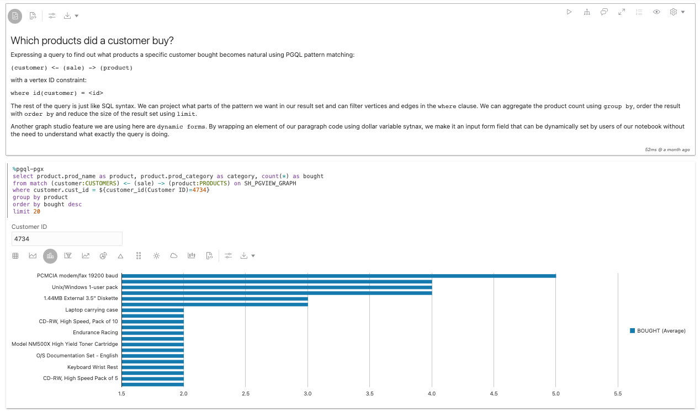
    
8.  첫 번째 `%pgql-px` 단락에서 **동적 양식**을 사용합니다. 질의 내부의 해당 단락에 표시된 폼 구문을 사용하면 노트북이 자동으로 입력 필드를 렌더링하고 질의를 실행할 때 입력 필드에 지정한 값을 사용합니다.
    
    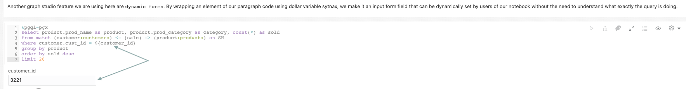
    
    이 기능을 단락의 **코드** 섹션을 숨기는 기능과 결합하면 프로그래밍 지식 없이도 사용자가 다양한 매개변수로 실행할 수 있는 제로 코드 응용 프로그램으로 노트북을 전환할 수 있습니다. 텍스트 입력 외에도 드롭다운 및 기타 양식 유형을 지원합니다. 전체 참조는 Autonomous Graph User's Guide를 참조하십시오.
    
9.  다음 단락에서는 차트를 사용하여 결과를 시각화하는 방법을 보여 줍니다. 차트만 표시되지만 코드는 표시되지 않습니다. 노트북에서 단락의 입력을 숨길 수 있습니다. 이는 보고서를 생성하는 데 유용합니다. 코드를 표시하려면 단락 오른쪽 위에 있는 눈 아이콘을 누르고 **코드** 상자를 선택합니다.
    
    
    
        Any paragraph which produces tabular results can be visualized using charts. To produce a tabular result, make sure the output encodes each row separated by \n (newline) and column separated by \t (tab) with first row as header row.
        That is what this paragraph is doing to visualize the distribution of vertex types in our graph using a pie chart.
        
10.  차트 유형을 눌러 다양한 차트 시각화 및 해당 구성 옵션을 살펴봅니다.
    
    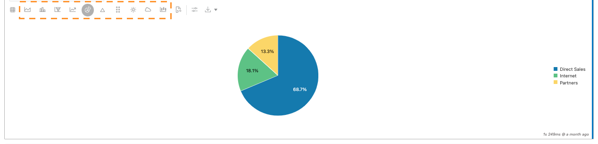
    

## 작업 4: 그래프 시각화로 재생

1.  PGQL 질의를 그래프로 시각화하는 방법의 예를 보여주는 이 단락을 실행합니다.
    
    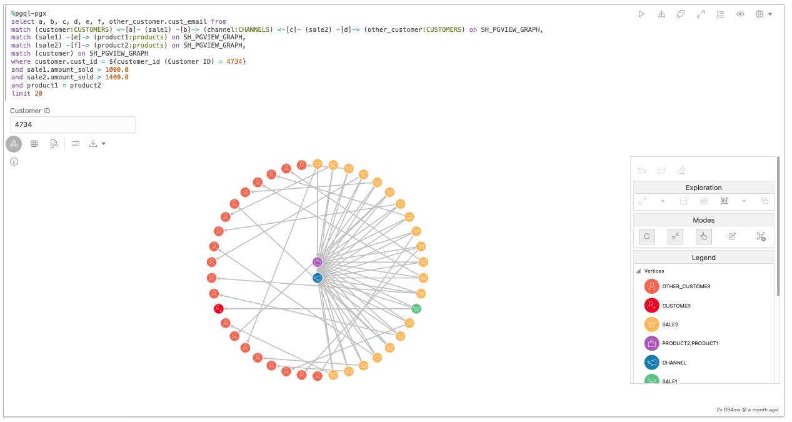
    
    비복합 PGQL 질의는 테이블이나 차트 대신 그래프로 렌더링할 수도 있습니다. 이에 대한 예외는 `GROUP BY` 또는 기타 집계를 포함하는 질의와 같은 단일 엔티티를 반환하지 않는 질의입니다. **설정** 단추를 눌러 모든 그래프 시각화 옵션을 탐색합니다. 정점 또는 모서리 옆에 렌더링할 속성, 사용할 그래프 레이아웃 등을 선택할 수 있습니다. 효과를 보려면 몇 가지 설정을 변경해 보십시오.
    
2.  그래프 시각화 설정에서 **하이라이트** 탭을 엽니다.
    
    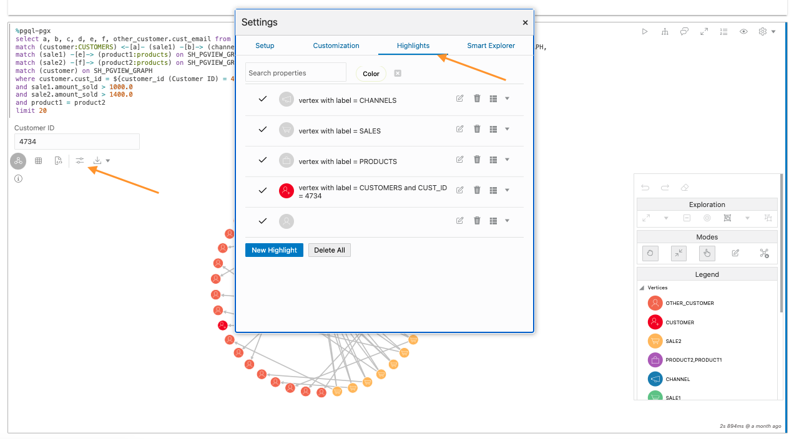
    
    **하이라이트**를 사용하면 특정 조건에 따라 다른 요소와 다른 색상, 아이콘, 크기 등을 제공하여 그래프에서 특정 요소를 강조할 수 있습니다. 보시다시피 여기에 몇 가지 강조 표시를 추가하여 레이블 조건에 따라 다른 유형의 정점을 다르게 렌더링했습니다. **새 강조 표시** 및 **강조 표시 편집** 단추를 각각 눌러 고유한 강조 표시를 생성하거나 기존 강조 표시를 편집하여 출력에 미치는 영향을 확인합니다.
    
3.  설정 대화상자를 다시 닫고 정점 중 하나를 마우스 오른쪽 버튼으로 클릭합니다. 그러면 해당 정점의 연관된 모든 특성이 표시됩니다. 원래 PGQL 질의의 예상에 속하는 속성은 굵게 표시됩니다.
    
    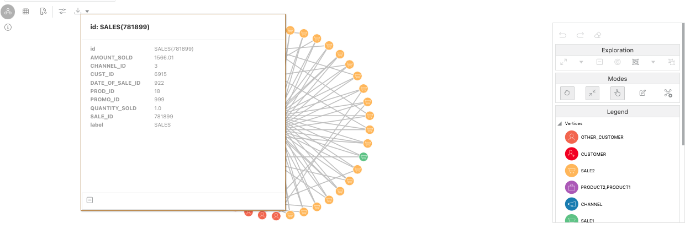
    

## 작업 5: 그래프 탐색으로 재생

그래프 시각화 기능을 사용하면 시각화 캔버스에서 직접 그래프를 추가로 **탐색**할 수 있습니다.

1.  렌더링된 그래프에서 정점 중 하나를 클릭합니다.
    
    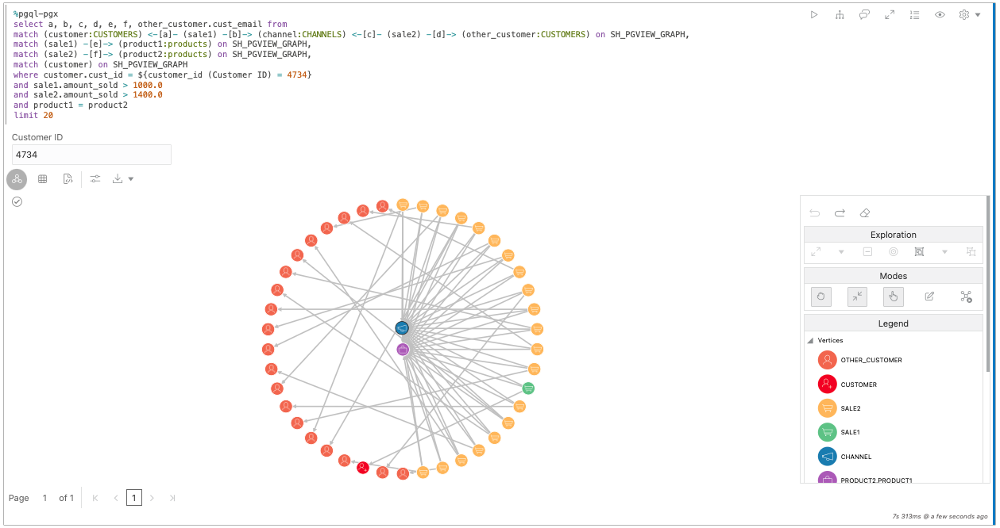
    
    오른쪽의 그래프 조작 도구 모음이 활성화됩니다.
    
    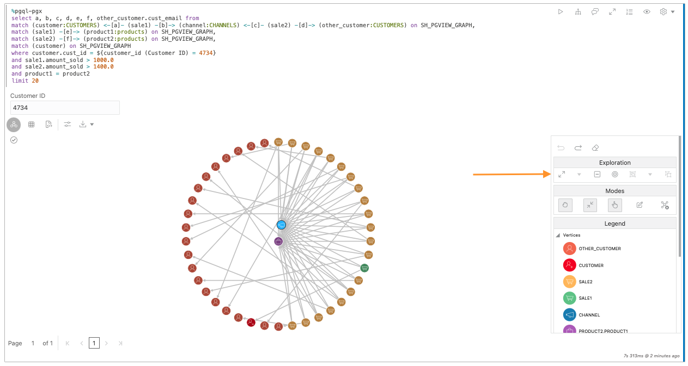
    
2.  **확장** 작업을 누릅니다.
    
    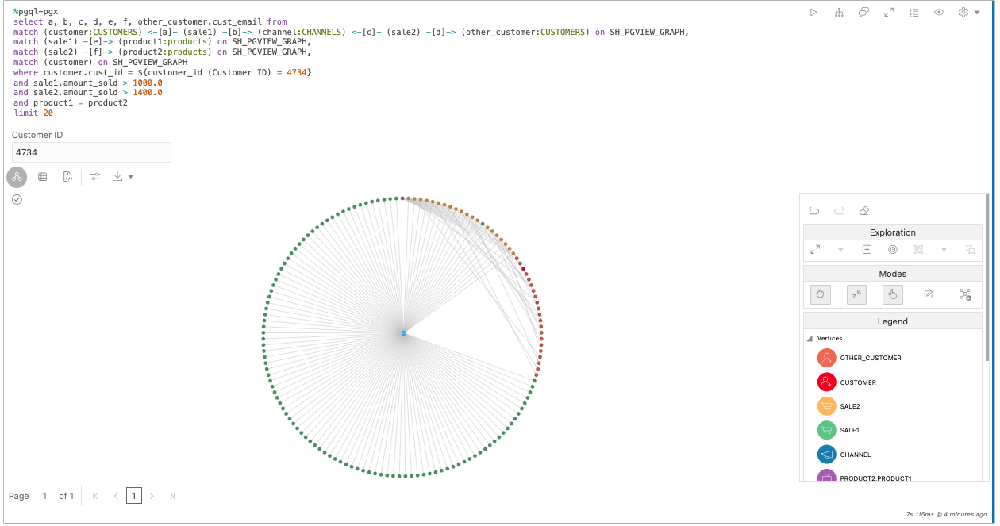
    
    확장하면 선택한 정점의 모든 이웃이 최대 2개의 홉으로 표시됩니다. 그래프 시각화 설정 대화상자에서 홉 수를 줄이거나 늘릴 수 있습니다.
    
    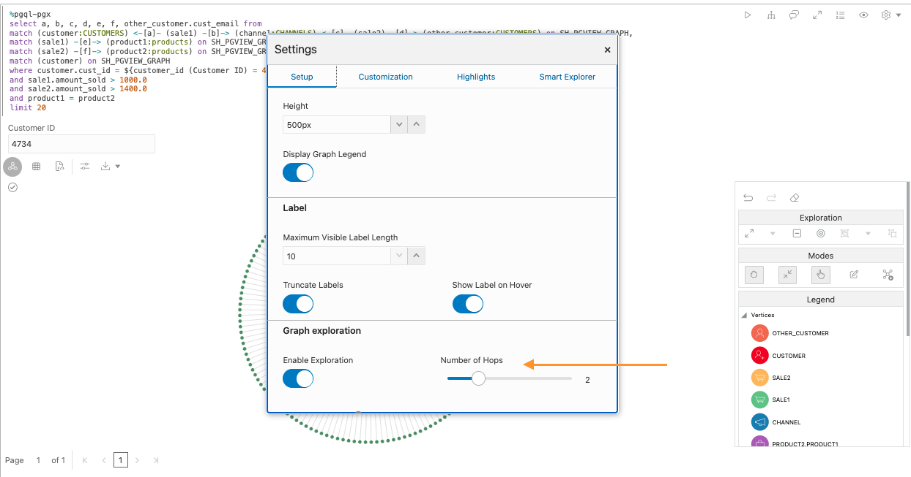
    
3.  그래프 조작 도구 모음은 이전 조작을 되돌리는 편리한 **실행 취소** 옵션을 제공합니다. 확장된 정점을 다시 제거하려면 클릭합니다.
    
    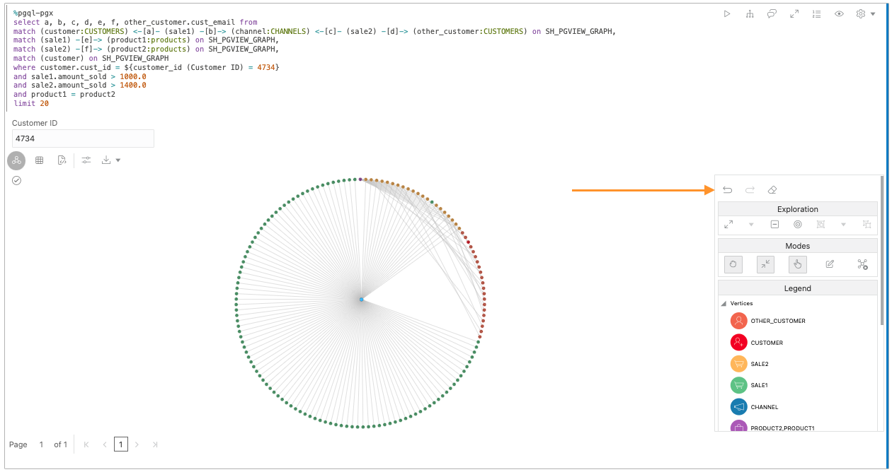
    
4.  정점을 다시 선택합니다. 이번에는 **포커스**를 누릅니다. 포커스는 **확장**과 비슷하지만 캔버스의 다른 모든 요소가 제거됩니다.
    
    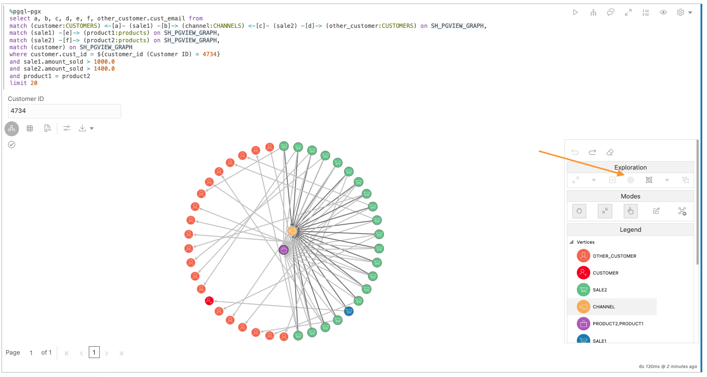
    
    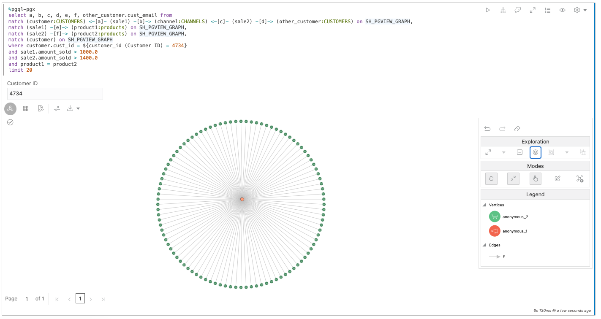
    
5.  그런 다음 여러 정점을 한 그룹으로 그룹화해 봅니다. 이를 위해 마우스를 아래로 누르고 캔버스 위로 끌어 정점 그룹을 선택합니다. 그런 다음 **그룹** 버튼을 누릅니다.
    
    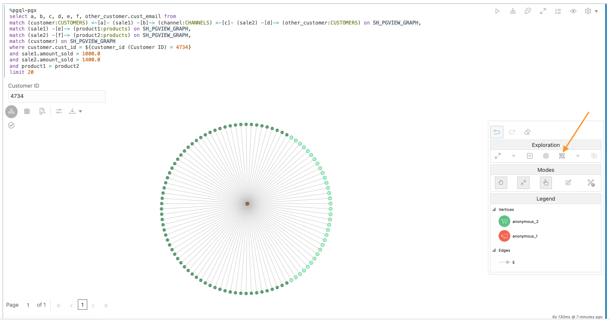
    
    원하는 만큼 그룹을 생성할 수 있습니다. 이렇게 하면 노이즈 요소를 화면에서 실제로 삭제하지 않고도 하나의 가시적 그룹으로 그룹화할 수 있습니다. 그룹 옆의 작은 숫자는 해당 그룹에 몇 개의 요소가 있는지 알려줍니다.
    
    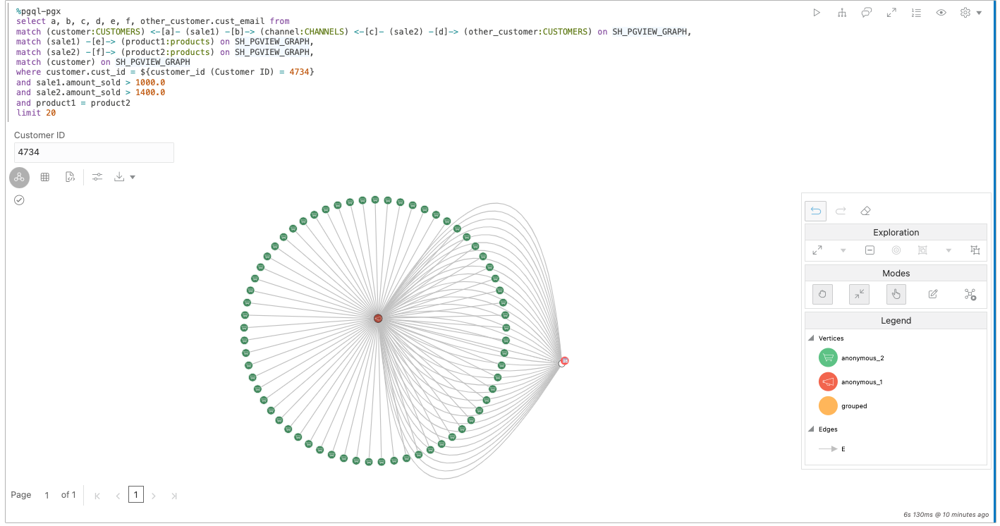
    
6.  나중에 요소의 그룹화를 다시 해제하려면 그룹을 누른 다음 **그룹 해제** 아이콘을 누릅니다.
    
    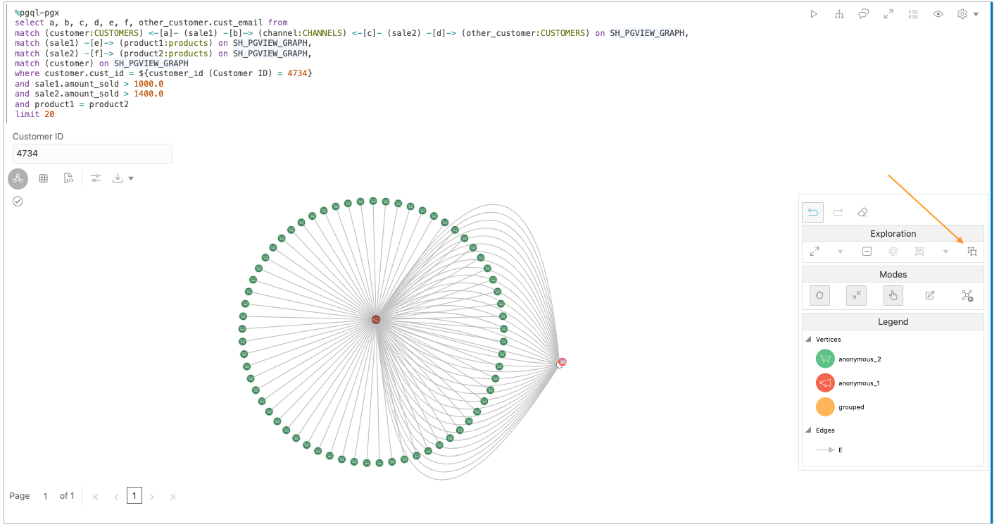
    
7.  시각화에서 개별 요소를 삭제할 수도 있습니다. 정점을 누른 다음 **삭제** 작업을 누릅니다.
    
    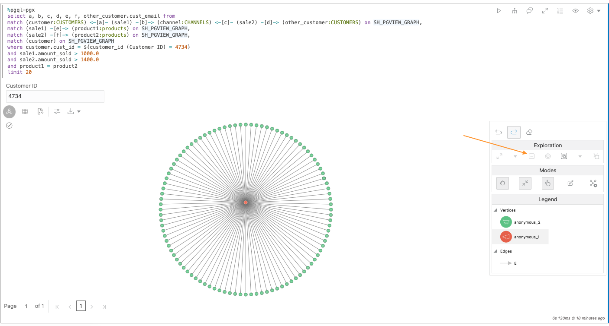
    
    요소 그룹을 삭제할 수도 있습니다. 캔버스를 누르고 끌어 놓을 모든 정점과 가장자리를 선택한 다음 **삭제** 아이콘을 누르면 됩니다.
    
    
    
8.  단락 결과를 전체 화면으로 확장하여 그래프 조작을 위한 공간을 늘릴 수 있습니다. 단락 오른쪽 위에 있는 **확장** 버튼을 눌러 전체 화면 모드로 전환합니다.
    
    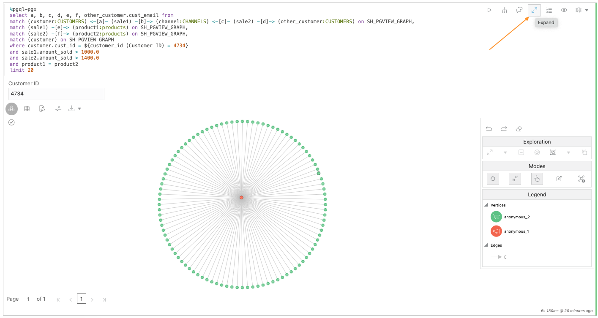
    
    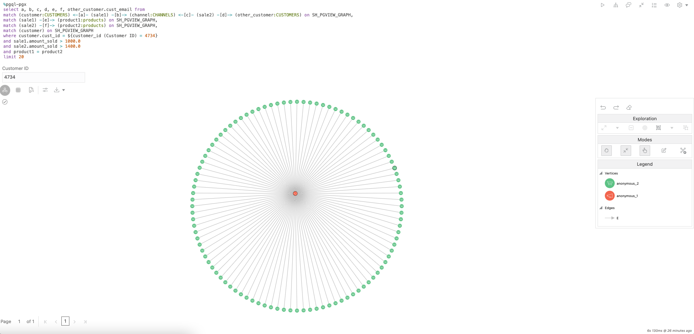
    
    동일한 버튼을 다시 클릭하여 일반 화면으로 돌아갑니다.
    
9.  마지막으로 시각화의 초기 상태로 돌아가려면 조작 도구 모음에서 **재설정** 아이콘을 누릅니다. 이렇게 하면 결과에 대한 모든 임시 변경 사항이 복원됩니다.
    
    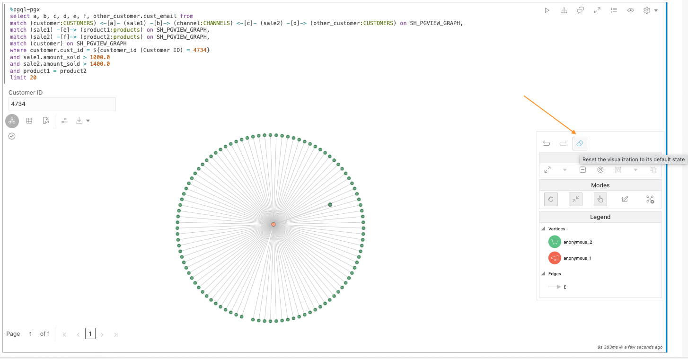
    

## 작업 6: 그래프 알고리즘을 사용하여 가장 중요한 제품 및 권장 사항 찾기

예제 노트북에는 그래프 알고리즘을 사용하여 데이터에 대한 새로운 통찰력을 얻는 방법을 설명하는 두 단락이 포함되어 있습니다.

1.  아래로 스크롤하여 **가장 중요한 제품 찾기** 단락을 찾고 마크다운 설명을 읽어 알고리즘의 작동 방식을 숙지합니다.
    
2.  다음 단락의 지침에 따라 Modeler를 사용하여 BIDIRECTED\_SH\_PGVIEW\_GRAPH 속성 그래프를 생성하고 다음 단락을 실행하여 메모리로 로드합니다.
    
    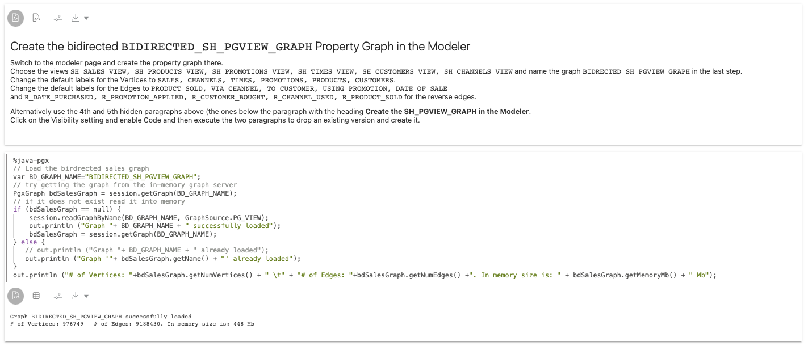
    
3.  다음 단락에서는 해당 PGX API를 호출하여 그래프 알고리즘을 실행합니다. 알고리즘의 결과는 `centrality`이라는 새 정점 속성에 저장됩니다. 아래 단락에서는 새로 계산된 속성을 질의하고 결과를 중앙값으로 정렬합니다. 이 예에서는 알고리즘과 PGQL 쿼리를 결합하여 그래프에서 요소의 순위를 빠르게 지정하는 방법을 보여줍니다.
    
    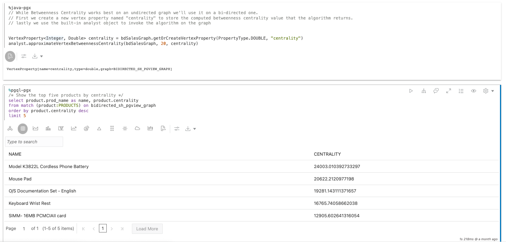
    
    앞으로 가서 그 부분을 직접 실행하십시오.
    
4.  다음 몇 단락에서는 기본 제공 **개인설정 PageRank** 알고리즘을 활용하여 특정 고객에게 제품을 추천하는 방법을 보여 줍니다. 마크다운 설명을 읽어 알고리즘의 작동 방식을 숙지합니다. 우리는 다시 쉬운 PGX API 호출을 통해 알고리즘을 실행 한 다음 PGQL을 사용하여 결과를 쿼리합니다. 이번에는 두 개의 쿼리를 사용합니다. 첫번째 예제는 고객이 이미 구입한 제품을 보여줍니다. 두번째 query는 가능한 구매로 권장되는 제품을 보여줍니다.
    
    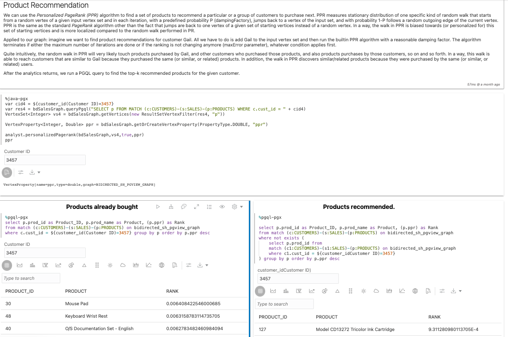
    

**축하합니다!** 실습을 성공적으로 완료했습니다.

## 확인

*   **작성자** - Jayant Sharma, 제품 관리
*   **기여자** - Korbi Schmid, Rahul Tasker, 제품 개발
*   **최종 업데이트 수행자/날짜** - Jayant Sharma, 2023년 6월