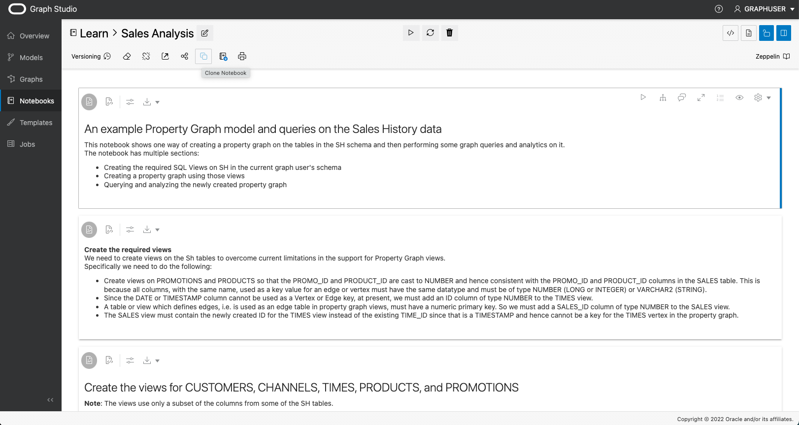
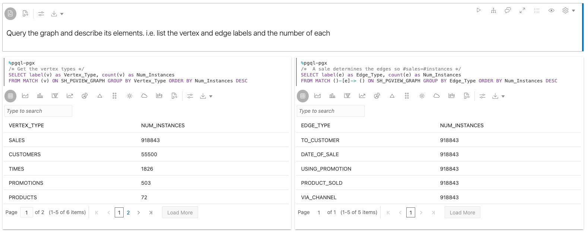
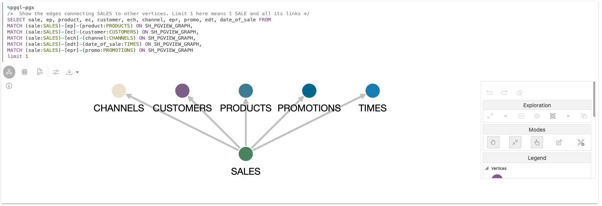
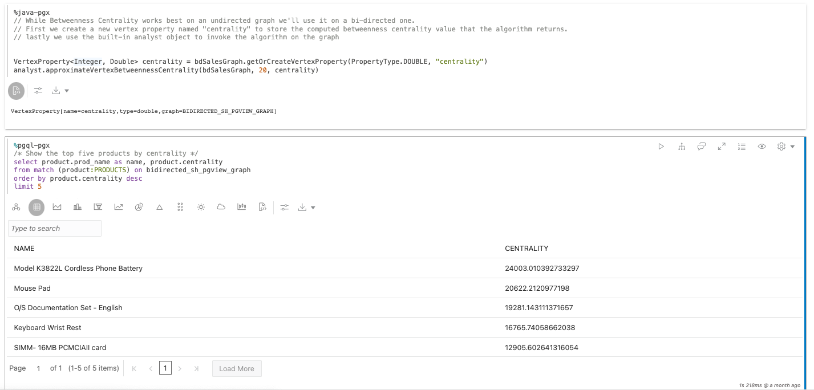

# Analisar um Data Warehouse Típico com Algoritmos de Gráfico em um Notebook

## Introdução

Neste laboratório, você aprenderá a executar algoritmos de gráfico e consultas PGQL usando notebooks diretamente na interface do Graph Studio da sua instância do Autonomous Data Warehouse - Shared Infrastructure (ADW) ou do Autonomous Transaction Processing - Shared Infrastructure (ATP).

Tempo Estimado: 20 minutos.

### Objetivos

*   Saiba como preparar dados gráficos a serem analisados em notebooks
*   Saiba como criar parágrafos explicativos de execução usando a sintaxe Markdown
*   Aprender a criar parágrafos de consulta de gráfico de execução usando PGQL
*   Saiba como visualizar os resultados da consulta de gráfico
*   Saiba como criar parágrafos de algoritmo de gráfico de execução usando as APIs Java PGX

### Pré-requisitos

*   O laboratório a seguir requer uma conta do Autonomous Database.
    
*   Este laboratório pressupõe que você tenha concluído o laboratório anterior (Laboratório 2) no qual criamos o gráfico **SH\_PGVIEW\_GRAPH**.
    

## Tarefa 1: Certifique-se de que o Gráfico SH esteja Carregado na Memória.

Para que os gráficos possam ser analisados em um notebook, precisamos garantir que o gráfico seja carregado na memória. Na interface do usuário do Graph Studio, navegue até a página **Gráficos**, verifique se o gráfico **SH\_PGVIEW\_GRAPH** foi carregado na memória ou não.

Se o gráfico for carregado na memória (ele diz " na memória"), então você pode prosseguir para o PASSO 2.

Se o gráfico **não** for carregado na memória, como na captura de tela a seguir, clique no ícone **Carregar na memória** (parafuso de raio) no canto superior direito da seção de detalhes. Na caixa de diálogo resultante, clique em **Sim**.

Isso criará um job "Carregar na Memória" para você. Aguarde a conclusão deste job:

## Tarefa 2: Clonar o Notebook de Exemplo de Análise do Histórico de Vendas

1.  Clique no ícone **Notebooks** no menu à esquerda.
    
2.  Abra a pasta **Learn**:
    
    
    
3.  Clique no notebook **Análise de Vendas** para abri-lo.
    
    
    
4.  O notebook **Análise de Vendas** é um notebook **integrado**. Você pode identificar notebooks **integrados** pelo autor que está sendo mostrado como `<<system-user>>`. Os notebooks integrados são compartilhados entre todos os usuários e, portanto, são somente leitura e bloqueados. Para executar o notebook, precisamos criar uma cópia privada primeiro e, em seguida, desbloqueá-la. Na parte superior do notebook, clique no botão **Clonar**.
    
    
    
5.  Na caixa de diálogo resultante, dê ao notebook clonado um nome exclusivo para que você possa encontrá-lo mais tarde facilmente. As estruturas de pastas podem ser expressas usando o símbolo `/`. Em seguida, clique em _Criar_.
    
    
    
6.  Clique no botão **Desbloquear** no canto superior direito do notebook clonado.
    
    
    
    O notebook agora está pronto para ser executado.
    

## Tarefa 3: Explorar os Recursos Básicos do Notebook

Cada notebook é organizado em um conjunto de **parágrafos**. Cada parágrafo tem uma entrada (chamada **Código**) e uma saída (chamada **Resultado**). No Graph Studio, há 3 tipos de parágrafos:

*   Os parágrafos de markdown começam com `%md`
*   Os parágrafos PGQL começam com `%pgql-px`
*   Os parágrafos Java PGX começam com `%java-pgx`

No bloco de anotações Análise de Vendas, você pode encontrar exemplos de cada um desses tipos. O notebook foi projetado para funcionar com o gráfico criado no laboratório anterior; portanto, você não precisa modificar nenhum código para executar os parágrafos. Você pode notar que há alguns parágrafos ocultos no início deste caderno. Esses parágrafos ocultos são executados pelo código SQL que executamos anteriormente neste laboratório. Para este laboratório, concentre-se apenas nos parágrafos visíveis.

1.  Para executar o primeiro parágrafo, clique no ícone **Executar** no canto superior direito do parágrafo.
    
    
    
2.  O segundo parágrafo ilustra como fazer referência a gráficos carregados na memória nos parágrafos `%java-pgx`. Você simplesmente faz referência a eles usando a API `session.getGraph("SH")`.  
    Clique no ícone **Executar** para executá-lo. Isso deve ser executado para que o restante do notebook funcione.
    
    
    
3.  Os próximos três parágrafos ilustram como consultar a lista de rótulos de vértice e borda.
    
    
    
4.  O próximo parágrafo mostra as bordas que conectam VENDAS aos outros vértices.
    
    
    
5.  O próximo parágrafo mostra o resultado da consulta de dois IDs de vendas específicos (4744 e 4538). Você pode clicar com o botão direito em qualquer um dos vértices para obter mais informações sobre essas duas vendas.
    
    
    
6.  O próximo parágrafo mostra o relacionamento entre produtos, vendas e clientes. Você pode clicar com o botão direito em qualquer um dos vértices e bordas para obter mais informações.
    
    
    
7.  Os próximos dois parágrafos ilustram uma consulta típica de data warehouse, mas expressa em PGQL em vez de SQL. Nas consultas PGQL, você faz referência a qual gráfico consultar usando a sintaxe `MATCH ... ON <graphName>`. Observe que os parágrafos `%pgql-pgx` retornam o formato tabular por padrão, portanto, você não precisa fazer nenhuma conversão para visualizar o resultado das consultas PGQL como gráficos.
    
    
    
8.  Observe o uso de **formulários dinâmicos** neste primeiro parágrafo `%pgql-px`. Se você usar a sintaxe de formulário conforme mostrado nesse parágrafo dentro da consulta, o notebook renderizará automaticamente um campo de entrada e usará o valor especificado no campo de entrada ao executar a consulta.
    
    
    
    Se você combinar esse recurso com a capacidade de ocultar a seção **Código** do parágrafo, poderá transformar notebooks em aplicativos de código zero que os usuários podem executar com vários parâmetros sem qualquer conhecimento de programação. Além da entrada de texto, também há suporte para dropdown e outros tipos de formulários. Verifique o guia do Usuário do Autonomous Graph para obter a referência completa.
    
9.  O próximo parágrafo ilustra como você pode visualizar resultados usando gráficos. Você notará que só vê um gráfico, mas nenhum código. Nos notebooks, você pode ocultar a entrada de um parágrafo. Isso é útil para gerar relatórios. Para mostrar o código, clique no ícone de olho no canto superior direito do parágrafo e marque a caixa **Código**.
    
    
    
        Any paragraph which produces tabular results can be visualized using charts. To produce a tabular result, make sure the output encodes each row separated by \n (newline) and column separated by \t (tab) with first row as header row.
        That is what this paragraph is doing to visualize the distribution of vertex types in our graph using a pie chart.
        
10.  Clique nos tipos de gráfico para explorar diferentes visualizações de gráfico e suas opções de configuração.
    
    
    

## Tarefa 4: Reproduzir com Visualização de Gráfico

1.  Execute este parágrafo que mostra um exemplo de como visualizar consultas PGQL como um gráfico:
    
    
    
    Qualquer consulta PGQL não complexa também pode ser renderizada como um gráfico em vez de uma tabela ou gráfico. Exceções a isso são consultas que não retornam entidades singulares, como consultas que contêm `GROUP BY` ou outras agregações. Clique no botão **Definições** para explorar todas as opções de visualização de gráfico. Você pode escolher quais propriedades renderizar ao lado de um vértice ou borda, qual layout de gráfico usar e muito mais. Tente alterar algumas configurações para ver o efeito.
    
2.  Nas definições de visualização de gráfico, abra a guia **Destaques**.
    
    
    
    Ao usar **Destaques**, você pode enfatizar determinados elementos em seu gráfico, dando a eles uma cor, um ícone, um tamanho diferente do que outros com base em determinadas condições. Como você pode ver, aqui adicionamos alguns destaques para renderizar diferentes tipos de vértices de forma diferente com base em uma condição de rótulo. Tente criar seu próprio destaque ou editar um existente para ver como ele afeta a saída, clicando nos botões **Novo Destaque** e **Editar Destaque**, respectivamente.
    
3.  Feche a caixa de diálogo de configurações novamente e clique com o botão direito em um dos vértices. Ele mostrará todas as propriedades associadas desse vértice. As propriedades que fazem parte da projeção da consulta PGQL original são mostradas em negrito:
    
    
    

## Tarefa 5: Jogar com Exploração de Gráficos

O recurso de visualização de gráfico permite **explorar** o gráfico visualmente diretamente na tela de visualização.

1.  Clique em um dos vértices no gráfico renderizado.
    
    
    
    Você notará que a barra de ferramentas de manipulação de gráficos no lado direito é ativada.
    
    
    
2.  Clique na ação **Expandir**.
    
    
    
    Expandir mostrará todos os vizinhos do vértice selecionado, até 2 saltos. Você pode diminuir ou aumentar o número de saltos na caixa de diálogo de definições de visualização de gráfico.
    
    
    
3.  A barra de ferramentas de manipulação de gráfico fornece uma opção **Desfazer** conveniente para reverter a manipulação anterior. Clique nele para remover os vértices expandidos novamente.
    
    
    
4.  Selecione um vértice novamente. Desta vez, clique em **Foco**. O foco é como **Expandir**, mas removerá todos os outros elementos na tela.
    
    
    
    
    
5.  Em seguida, tente agrupar vários vértices em um grupo. Para isso, mantenha o mouse pressionado e arraste sobre a tela para selecionar um grupo de vértices. Em seguida, clique no botão **Grupo**.
    
    
    
    Você pode criar quantos grupos desejar. Dessa forma, você pode agrupar elementos ruidosos em um único grupo visível sem realmente soltá-los da tela. O pequeno número ao lado de um grupo informa quantos elementos estão nesse grupo.
    
    
    
6.  Para desagrupar os elementos novamente mais tarde, clique no grupo e, em seguida, clique no ícone **Desagrupar**.
    
    
    
7.  Você também pode eliminar elementos individuais da visualização. Clique em um vértice e, em seguida, clique na ação **Eliminar**.
    
    
    
    Também é possível cancelar um grupo de elementos. Basta selecionar todos os vértices e bordas que deseja soltar clicando e arrastando na tela e, em seguida, clique no ícone **Soltar**.
    
    
    
8.  Os resultados do parágrafo podem ser expandidos em tela cheia para dar mais espaço para manipulação de gráficos. Clique no botão **Expandir** no canto superior direito do parágrafo para entrar no modo de tela cheia.
    
    
    
    
    
    Clique no mesmo botão novamente para voltar à tela normal.
    
9.  Por fim, para voltar ao nosso estado inicial da visualização, clique no ícone **Redefinir** na barra de ferramentas de manipulação. Isso reverterá todas as alterações temporárias feitas no resultado.
    
    
    

## Tarefa 6: Localizar os Produtos e Recomendações Mais Importantes usando Algoritmos de Gráfico

O notebook de exemplo contém dois parágrafos que ilustram como você pode usar algoritmos de gráfico para obter novos insights sobre seus dados.

1.  Role para baixo até o parágrafo **Localizar os produtos mais importantes** e familiarize-se com o funcionamento do algoritmo lendo a descrição de Markdown.
    
2.  Siga as instruções no próximo parágrafo para criar um Gráfico de Propriedades BIDIRECTED\_SH\_PGVIEW\_GRAPH usando o Modelador e execute o próximo parágrafo para carregá-lo na memória.
    
    
    
3.  No próximo parágrafo, executamos o algoritmo gráfico chamando a API PGX correspondente. O resultado do algoritmo é armazenado em uma nova propriedade de vértice que chamamos de `centrality`. No parágrafo abaixo, consultamos essa propriedade recém-calculada e ordenamos o resultado por valor de centralidade. Este exemplo mostra como você pode combinar algoritmos e consultas PGQL para classificar rapidamente elementos em seu gráfico.
    
    
    
    Vá em frente e execute esses parágrafos você mesmo.
    
4.  Os próximos parágrafos ilustram como você pode aproveitar o algoritmo **Personalizado PageRank** incorporado para recomendar produtos a um cliente específico. Familiarize-se com o funcionamento do algoritmo lendo a descrição do Markdown. Executamos novamente o algoritmo por meio de uma chamada de API PGX fácil e, em seguida, consultamos o resultado usando PGQL. Desta vez usamos duas consultas. A primeira mostra os produtos que o cliente já comprou. A segunda consulta mostra os produtos recomendados como uma possível compra.
    
    
    

**Parabéns!** Você concluiu o laboratório com sucesso.

## Agradecimentos

*   **Autor** - Jayant Sharma, Gerenciamento de Produtos
*   **Colaboradores** - Korbi Schmid, Rahul Tasker, Desenvolvimento de Produtos
*   **Última Atualização em/Data** - Jayant Sharma, junho de 2023