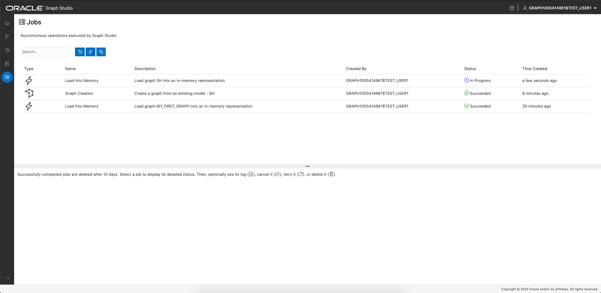
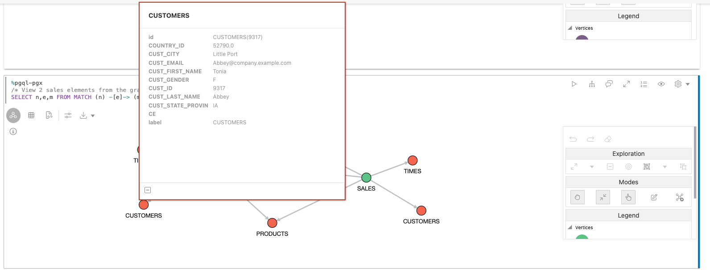
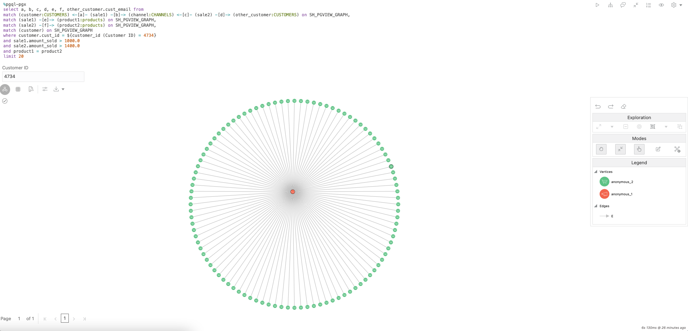

# 使用记事本中的图形算法分析典型的数据仓库

## 简介

在本练习中，您将学习如何使用笔记本直接在 Autonomous Data Warehouse - Shared Infrastructure (ADW) 或 Autonomous Transaction Processing - Shared Infrastructure (ATP) 实例的 Graph Studio 界面中运行图形算法和 PGQL 查询。

预计时间：20 分钟。

### 目标

*   了解如何准备要在笔记本中分析的图形数据
*   了解如何使用 Markdown 语法创建运行解释性段落
*   了解如何使用 PGQL 创建运行图形查询段落
*   了解如何可视化图形查询结果
*   了解如何使用 PGX Java API 创建运行图形算法段落

### 先备条件

*   下面的练习需要一个 Autonomous Database 账户。
    
*   此实验室假设您已经完成了之前创建 **SH\_PGVIEW\_GRAPH** 图形的实验室 (Lab 2)。
    

## 任务 1：确保将 SH 图形加载到内存中。

在笔记本中分析图形之前，我们需要确保将图形加载到内存中。在 Graph Studio 用户界面中，导航到 **Graphs（图形）**页面，验证 **SH\_PGVIEW\_GRAPH** 图形是否已装入内存中。

如果图形加载到内存中（表示 " in memory"），则可以继续执行步骤 2。

如果图形**未**加载到内存中，如以下屏幕截图中所示，请单击详细信息部分右上角的**加载到内存中**（闪电螺栓）图标。在生成的对话框中，单击**是**。

这将为您创建一个“加载到内存”作业。等待此作业完成：

## 任务 2：克隆销售历史记录分析示例记事本

1.  单击左侧菜单中的**记事本**图标。
    
2.  打开**学习**文件夹：
    
    
    
3.  单击**销售分析**记事本将其打开。
    
    
    
4.  **销售分析**记事本是**内置**记事本。您可以按显示为 `<<system-user>>` 的作者标识**内置**记事本。内置笔记本在所有用户之间共享，因此为只读和锁定。要执行笔记本，我们需要先创建一个私有副本，然后解锁它。在笔记本的顶部，单击**克隆**按钮。
    
    
    
5.  在生成的对话框中，为克隆的记事本指定唯一的名称，以便稍后可以轻松找到它。文件夹结构可以使用 `/` 符号表示。然后单击_创建_。
    
    
    
6.  单击克隆的记事本右上角的**取消锁定**按钮。
    
    
    
    笔记本现在已准备好执行。
    

## 任务 3：浏览基本记事本功能

每个记事本都组织成一组**段落**。每个段落都有一个输入（称为**代码**）和输出（称为**结果**）。在 Graph Studio 中，有 3 种类型的段落：

*   Markdown 段落以 `%md` 开头
*   PGQL 段落以 `%pgql-px` 开头
*   PGX Java 段落以 `%java-pgx` 开头

在“销售分析”记事本中，您可以找到每种类型的示例。笔记本设计用于处理在上一个实验室中创建的图形，因此您不必修改任何代码即可执行段落。您可能会注意到，此笔记本的开头有一些隐藏的段落。这些隐藏的段落通过我们之前在本实验室中运行的 SQL 代码运行。对于此实验室，仅关注可见段落。

1.  要执行第一个段落，请单击段落右上角的**运行**图标。
    
    
    
2.  第二段说明如何在 `%java-pgx` 段落中引用加载到内存中的图形。您只需使用 `session.getGraph("SH")` API 即可引用它们。  
    单击**运行**图标以执行它。这必须运行才能使笔记本的其余部分正常工作。
    
    
    
3.  接下来的三段说明了如何查询顶点和边缘标签列表。
    
    
    
4.  下一段显示了将 SALES 连接到其他顶点的边。
    
    
    
5.  下一段显示了查询两个特定销售标识（4744 和 4538）的结果。您可以右键单击任何顶点以获取有关这两个销售的更多信息。
    
    
    
6.  下一段显示了产品、销售和客户之间的关系。您可以右键单击任何顶点和边缘以获得更多信息。
    
    
    
7.  接下来的两段说明了典型的数据仓库查询，但用 PGQL 而不是 SQL 来表示。在 PGQL 查询中，使用 `MATCH ... ON <graphName>` 语法引用要查询的图形。请注意，`%pgql-pgx` 段落默认返回表格格式，因此无需进行任何转换即可将 PGQL 查询的结果可视化为图表。
    
    
    
8.  请注意，在第一个 `%pgql-px` 段中使用**动态表单**。如果在查询中使用该段落中所示的表单语法，则记事本将在执行查询时自动呈现输入字段并使用您在输入字段中指定的值。
    
    
    
    如果将此功能与隐藏段落的**代码**部分的功能相结合，则可以将记事本转换为零代码应用程序，用户可以使用各种参数执行这些应用程序，而无需任何编程知识。除了文本输入，还支持下拉列表和其他类型的表单。有关完整参考信息，请查看自治图形用户指南。
    
9.  下一段说明了如何使用图表可视化结果。您会注意到，您只看到图表，但没有代码。在笔记本中，您可以隐藏段落的输入。这对于生成报告很有用。要显示代码，请单击段落右上方的眼睛图标，然后勾选**代码**框。
    
    
    
        Any paragraph which produces tabular results can be visualized using charts. To produce a tabular result, make sure the output encodes each row separated by \n (newline) and column separated by \t (tab) with first row as header row.
        That is what this paragraph is doing to visualize the distribution of vertex types in our graph using a pie chart.
        
10.  单击图表类型可浏览不同的图表可视化及其配置选项。
    
    
    

## 任务 4：使用图形可视化

1.  运行此段落，其中显示了如何将 PGQL 查询可视化为图形的示例：
    
    
    
    任何非复杂的 PGQL 查询也可以呈现为图形，而不是表或图表。例外情况是不会返回单数实体的查询，例如包含 `GROUP BY` 或其他聚合的查询。单击**设置**按钮可浏览所有图形可视化选项。您可以选择顶点或边缘旁边要呈现的属性、要使用的图形布局等等。尝试更改一些设置以查看效果。
    
2.  在图形可视化设置中，打开**突出显示**选项卡。
    
    
    
    通过使用**突出显示**，您可以根据特定条件为图形中的某些元素提供不同于其他元素的颜色、图标、大小等。如您所见，这里我们添加了一些亮点，以根据标签条件以不同的方式呈现不同类型的顶点。通过分别单击**新建突出显示**和**编辑突出显示**按钮，尝试创建您自己的突出显示或编辑现有突出显示，以查看其如何影响输出。
    
3.  再次关闭设置对话框，然后右键单击其中一个顶点。它将显示该顶点的所有关联属性。作为原始 PGQL 查询投影一部分的属性以粗体显示：
    
    
    

## 任务 5：使用图形研究

图形可视化功能允许您直接在可视化画布中以可视方式进一步**浏览**图形。

1.  单击呈现图形中的一个顶点。
    
    
    
    您会注意到右侧的图形处理工具栏已启用。
    
    
    
2.  单击**展开**操作。
    
    
    
    展开将显示所选顶点的所有邻居，最多 2 个跃点。您可以在图形可视化设置对话框中减少或增加跃点数。
    
    
    
3.  图形处理工具栏提供了一个方便的**撤消**选项来反转以前的处理。单击它可再次删除展开的顶点。
    
    
    
4.  再次选择顶点，这次单击**焦点**。焦点类似于**展开**，但它将删除画布上的所有其他元素。
    
    
    
    
    
5.  接下来，尝试将多个顶点分组为一个组。为此，请向下按住鼠标并在画布上拖动以选择一组顶点。然后单击**组**按钮。
    
    
    
    您可以根据需要创建任意数量的组。这样，您可以将嘈杂元素分组到单个可见组中，而无需实际将其从屏幕中删除。组旁边的小数字告诉您该组中有多少个元素。
    
    
    
6.  要稍后再次取消元素分组，请单击该组，然后单击**取消分组**图标。
    
    
    
7.  您还可以从可视化中删除各个元素。单击顶点，然后单击**删除**操作。
    
    
    
    还可以删除一组元素。只需单击并拖动画布来选择要放置的所有顶点和边缘，然后单击**放置**图标。
    
    
    
8.  段落结果可以扩展到全屏，为您提供更多的图形处理空间。单击段落右上角的**展开**按钮可进入全屏模式。
    
    
    
    
    
    再次单击同一按钮以返回到正常屏幕。
    
9.  最后，要返回到可视化初始状态，请单击操作工具栏中的**重置**图标。这将恢复我们对结果所做的所有临时更改。
    
    
    

## 任务 6：使用图形算法查找最重要的产品和建议

示例笔记本包含两段，说明如何使用图形算法获取对数据的新洞察。

1.  向下滚动到**查找最重要的产品**段落，阅读 Markdown 说明，了解算法的工作原理。
    
2.  按照下一段中的说明使用 Modeler 创建 BIDIRECTED\_SH\_PGVIEW\_GRAPH 属性图，然后运行下一段以将其加载到内存中。
    
    
    
3.  在下一段中，我们通过调用相应的 PGX API 来运行图形算法。算法的结果存储在称为 `centrality` 的新顶点属性中。在下面的段落中，我们查询新计算的属性并按中心值对结果进行排序。此示例说明如何组合算法和 PGQL 查询以快速对图形中的元素进行排名。
    
    
    
    继续，自己运行这些段落。
    
4.  接下来的几段说明了如何利用内置的**个性化 PageRank** 算法向特定客户推荐产品。阅读 Markdown 说明，了解算法的工作原理。我们再次通过简单的 PGX API 调用运行算法，然后使用 PGQL 查询结果。这次我们使用两个查询。第一个是向您展示客户已经购买的产品。第二个查询显示作为可能的购买建议的产品。
    
    
    

**恭喜！** 您已成功完成实验室。

## 确认

*   **作者** - 产品管理 Jayant Sharma
*   **贡献者** - 产品开发 Rahul Tasker Korbi Schmid
*   **上次更新者/日期** - Jayant Sharma，2023 年 6 月