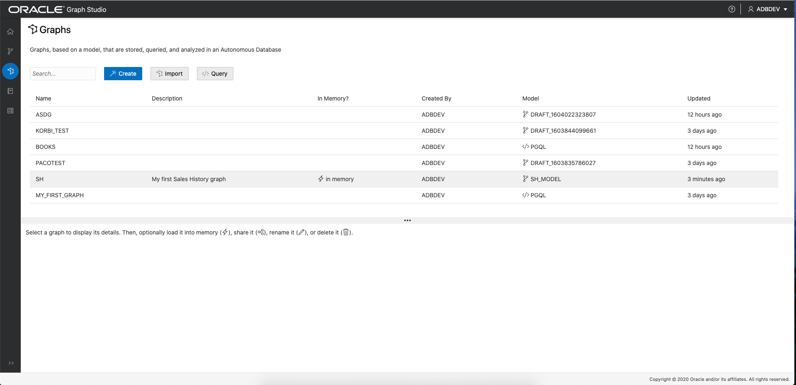
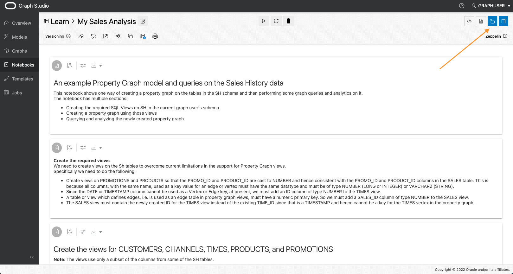
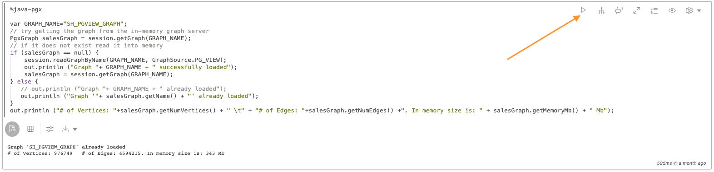
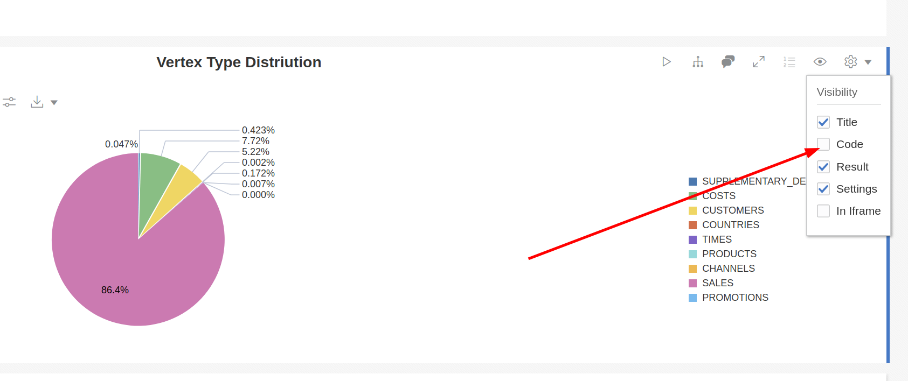
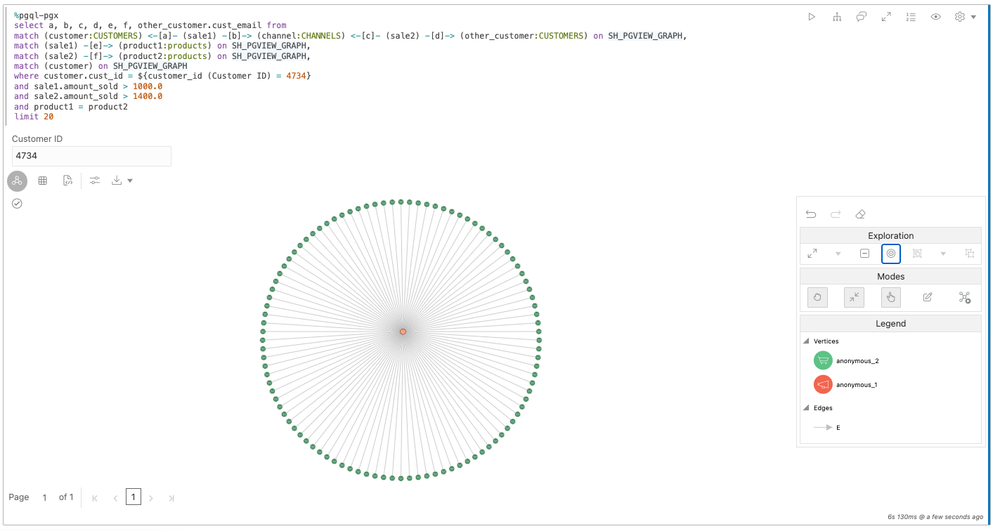
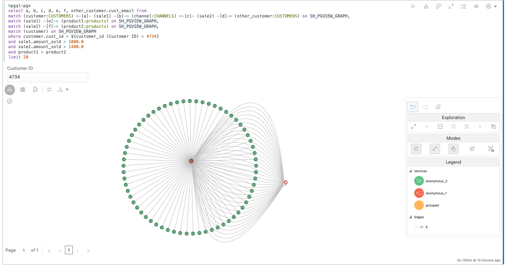
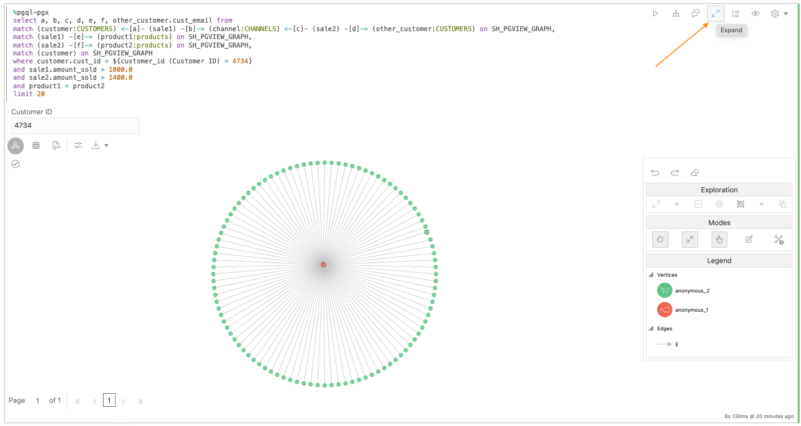

# 分析記事本中含有圖表演算法的典型資料倉儲

## 簡介

在此實驗室中，您將瞭解如何使用記事本直接在 Autonomous Data Warehouse - Shared Infrastructure (ADW) 或 Autonomous Transaction Processing - Shared Infrastructure (ATP) 執行處理的 Graph Studio 介面中執行圖表演算法和 PGQL 查詢。

預估時間：20 分鐘。

### 目標

*   瞭解如何準備要在記事本中分析的圖表資料
*   瞭解如何使用 Markdown 語法建立執行說明段落
*   瞭解如何使用 PGQL 建立執行圖表查詢段落
*   瞭解如何將圖表查詢結果視覺化
*   瞭解如何使用 PGX Java API 建立執行圖表演算法段落

### 先決條件

*   以下實驗室需要 Autonomous Database 帳戶。
    
*   本實驗室假設您已經完成上一個實驗室 (實驗室 2)，在其中建立 **SH\_PGVIEW\_GRAPH** 圖表。
    

## 作業 1：確定將 SH 圖形載入記憶體中。

在記事本中分析圖表之前，必須先確定圖表已載入記憶體中。在 Graph Studio 使用者介面中，瀏覽至**圖形**頁面，確認 **SH\_PGVIEW\_GRAPH** 圖表是否已載入記憶體。

如果圖表已載入至記憶體 (記憶體中為 )，則您可以繼續執行 STEP 2。

如果圖表**未**載入記憶體，如下列螢幕擷取畫面所示，請按一下詳細資料區段右上角的**載入記憶體** (淺螺栓) 圖示。在產生的對話方塊中，按一下**是**。

這會為您建立「載入記憶體」工作。等待此工作完成：

## 任務 2：複製銷售歷史記錄分析範例記事本

1.  按一下左側功能表中的**記事本**圖示。
    
2.  開啟**學習**資料夾：
    
    
    
3.  按一下**銷售分析**記事本以開啟它。
    
    
    
4.  **銷售分析**記事本是**內建**記事本。您可以由顯示為 `<<system-user>>` 的作者識別**內建**記事本。內建記事本會在所有使用者之間共用，因此會是唯讀和鎖定狀態。若要執行記事本，必須先建立專用複本，然後將它解除鎖定。在記事本頂端，按一下**複製**按鈕。
    
    
    
5.  在產生的對話方塊中，為複製的記事本提供唯一的名稱，以便之後可以輕鬆地找到它。資料夾結構可以使用 `/` 符號來表示。然後按一下_建立 (Create)_ 。
    
    
    
6.  按一下複製記事本右上方的**解除鎖定**按鈕。
    
    
    
    此筆記型電腦已可供執行。
    

## 作業 3：探索基本記事本功能

每個記事本都組織成一組**段落**。每個段落都有一個輸入 (稱為**代碼** ) 和輸出 (稱為**結果** )。在 Graph Studio 中，有三種段落類型：

*   減價段落開頭為 `%md`
*   PGQL 段落開頭為 `%pgql-px`
*   PGX Java 段落開頭為 `%java-pgx`

在「銷售分析」記事本中，您可以找到每一種類型的範例。此筆記型電腦是設計來搭配上一個實驗室中建立的圖表使用，因此您不需要修改任何程式碼即可執行段落。您可能會注意到此筆記型電腦的開頭有一些隱藏段落。這些隱藏段落會透過本實驗中稍早執行過的 SQL 程式碼來執行。在此實驗室中，只著重於可見的段落。

1.  若要執行第一個段落，請按一下段落右上方的**執行**圖示。
    
    
    
2.  第二個段落說明如何參照載入 `%java-pgx` 段落中記憶體的圖表。您只要使用 `session.getGraph("SH")` API 即可參考這些 API。  
    按一下**執行 (Run)** 圖示即可執行。這必須執行，其餘的筆記型電腦才能運作。
    
    
    
3.  接下來三個段落說明如何查詢頂點和邊緣標籤清單。
    
    
    
4.  下一段顯示將 SALES 連線至其他頂點的邊緣。
    
    
    
5.  下一段顯示查詢兩個特定銷售 ID (4744 和 4538) 的結果。您可以對任何驗證按一下滑鼠右鍵，以取得有關這兩項銷售的詳細資訊。
    
    
    
6.  下一段顯示產品、銷售及客戶之間的關係。您可以在任何驗證和邊緣按一下滑鼠右鍵以取得更多資訊。
    
    
    
7.  接下來的兩個段落說明一般資料倉儲查詢，但以 PGQL 而非 SQL 表示。在 PGQL 查詢中，您可以使用 `MATCH ... ON <graphName>` 語法參照要查詢的圖表。請注意，`%pgql-pgx` 段落預設會傳回表格式格式，因此您不需要進行任何轉換，即可將 PGQL 查詢的結果視覺化為圖表。
    
    
    
8.  請注意，在此前 `%pgql-px` 段落中使用**動態表單**。如果您使用查詢中該段落所示的表單語法，記事本會自動轉譯輸入欄位，並在執行查詢時使用您在輸入欄位中指定的值。
    
    
    
    如果將此功能與隱藏段落的**程式碼**區段的功能結合，您可以將記事本轉換為零程式碼應用程式，讓使用者無需任何程式設計知識即可使用各種參數執行。除了文字輸入之外，也支援下拉式清單和其他類型的表單。請查看自治式圖表使用者指南以瞭解完整參照。
    
9.  下一段落說明如何使用圖表來視覺化結果。您只會看到圖表，不會看到任何程式碼。在記事本中，您可以隱藏段落的輸入。這對於產生報告相當有用。若要顯示程式碼，請按一下段落右上方的眼睛圖示，然後勾選**程式碼**方塊。
    
    
    
        Any paragraph which produces tabular results can be visualized using charts. To produce a tabular result, make sure the output encodes each row separated by \n (newline) and column separated by \t (tab) with first row as header row.
        That is what this paragraph is doing to visualize the distribution of vertex types in our graph using a pie chart.
        
10.  按一下圖表類型即可瀏覽不同的圖表視覺化及其組態選項。
    
    
    

## 工作 4：使用圖表視覺化播放

1.  執行此段落，顯示如何將 PGQL 查詢視覺化為圖形的範例：
    
    
    
    任何非複雜的 PGQL 查詢也可以轉譯為圖表，而非表格或圖表。例外情況是不會傳回單一實體的查詢，例如包含 `GROUP BY` 或其他彙總的查詢。按一下**設定值**按鈕即可瀏覽所有圖表視覺化選項。您可以選擇要在頂點或邊緣旁呈現的特性、要使用的圖表版面配置等等。試著變更一些設定以檢視效果 。
    
2.  在圖表視覺化設定值中，開啟**重點**頁籤。
    
    
    
    透過使用**重點**，您可以根據特定條件，為圖形中的某些元素提供不同的顏色、圖示、大小等。如您所見，我們新增了一些高亮度，以便根據標示條件以不同方式呈現不同類型的頂點。請分別按一下**新反白顯示**和**編輯反白顯示**按鈕，嘗試建立自己的反白或編輯現有的反白顯示，以查看它如何影響輸出。
    
3.  再關閉設定對話方塊，並在其中一個頂點上按一下滑鼠右鍵。它會顯示該頂點的所有關聯特性。屬於原始 PGQL 查詢預測的屬性會以粗體顯示：
    
    
    

## 工作 5：使用圖表探索功能進行播放

圖形視覺化功能可讓您進一步**探索**視覺化畫面中直接顯示的圖形。

1.  按一下彩現圖形中的其中一個頂點。
    
    
    
    您會注意到右側的圖表操控工具列已啟用。
    
    
    
2.  按一下**展開**動作。
    
    
    
    展開後會顯示所選頂點的所有鄰居，最多可達 2 個躍點。您可以在圖形視覺化設定值對話方塊中減少或增加躍點數目。
    
    
    
3.  圖形操控工具列提供方便的**還原**選項，以回轉先前的操控。按一下該按鈕以再次移除展開的頂點。
    
    
    
4.  再次選取頂點，這次按一下**焦點**。焦點就像**展開**，但會移除工作區上的所有其他元素。
    
    
    
    
    
5.  接著，嘗試將數個頂點組成一個群組。為此，按住滑鼠並拖曳畫布以選取頂點群組。然後按一下**群組**按鈕。
    
    
    
    您可以視需要建立多個群組。這樣一來，您就可以將雜訊元素群組成單一的可見群組，而不需要實際將它們從畫面中刪除。群組旁的小數字告訴您該群組有多少元素。
    
    
    
6.  若要稍後重新群組元素，請按一下群組，然後按一下**取消群組**圖示。
    
    
    
7.  您也可以從視覺化中刪除個別元素。按一下頂點，然後按一下**刪除**動作。
    
    
    
    您也可以刪除一組元素。只要按一下並拖曳畫面，即可選取您要放置的所有頂點和邊緣，然後按一下**刪除**圖示。
    
    
    
8.  段落結果可以展開至完整畫面，讓您有更多空間可以進行圖形處理。按一下段落右上方的**展開**按鈕，以進入全螢幕模式。
    
    
    
    
    
    再按一次相同的按鈕即可回到一般畫面。
    
9.  最後，若要返回我們最初的視覺化狀態，請按一下操控工具列中的**重設**圖示。這將會回復我們對結果所做的所有暫時變更。
    
    
    

## 工作 6：使用圖表演算法尋找最重要的產品與建議

筆記本範例包含兩個段落，說明如何使用圖形演算法來取得資料的新洞察分析。

1.  向下捲動至**尋找最重要的產品**段落，並閱讀 Markdown 描述來熟悉演算法的運作方式。
    
2.  依照下一段中的指示，使用 Modeler 建立 BIDIRECTED\_SH\_PGVIEW\_GRAPH Property Graph，然後執行下一段將它載入記憶體中。
    
    
    
3.  在下一段，我們藉由呼叫相應的 PGX API 來執行圖形演算法。演算法的結果儲存在我們呼叫 `centrality` 的新頂點特性中。在以下段落中，我們查詢新計算的性質，並依中心值排序結果。此範例顯示如何結合演算法與 PGQL 查詢，以快速排列圖表中的元素等級。
    
    
    
    繼續執行這些段落。
    
4.  接下來的幾段說明如何利用內建的**個人化 PageRank** 演算法，將產品推薦給特定客戶。閱讀 Markdown 說明，熟悉演算法的運作方式。我們會再次透過簡易的 PGX API 呼叫來執行演算法，然後使用 PGQL 查詢結果。這次我們使用兩個查詢。第一個顯示客戶已購買的產品。第二個查詢會顯示建議購買的產品。
    
    
    

**恭喜！** 已順利完成實驗室。

## 確認

*   **作者** - 產品管理 Jayant Sharma
*   **貢獻者** - Korbi Schmid、Rahul Tasker、產品開發
*   **上次更新者 / 日期** - Jayant Sharma，2023 年 6 月