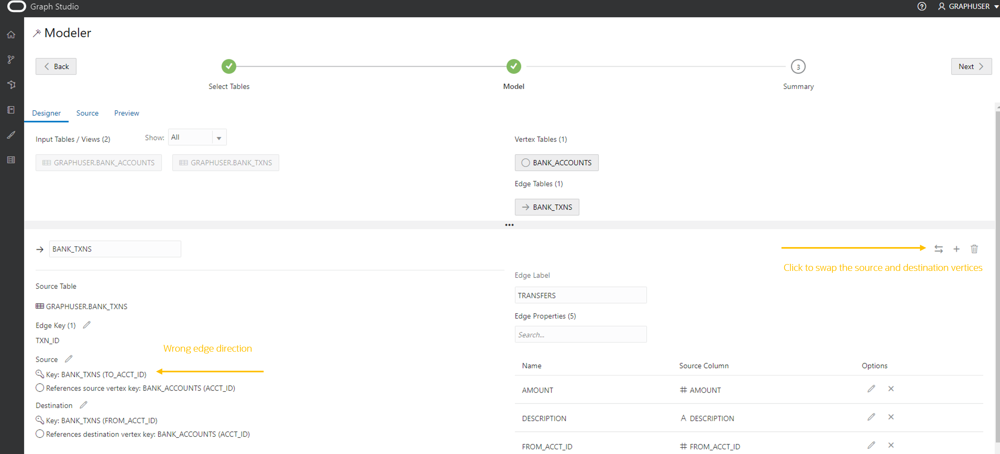

# Diagramm erstellen

## Einführung

In dieser Übung erstellen Sie ein Diagramm aus den Tabellen `bank_accounts` und `bank_txns` mit Graph Studio und der Anweisung CREATE PROPERTY GRAPH.

Geschätzte Zeit: 15 Minuten.

Sehen Sie sich das Video unten an, um einen schnellen Durchgang des Labors zu erhalten. [Eigenschaftsdiagramm in Graph Studio erstellen](videohub:1_cz3cwg3h)

### Ziele

Vorgehensweise

*   Verwenden Sie GRAPH Studio und PGQL DDL (also CREATE PROPERTY GRAPH-Anweisung), um ein Diagramm aus vorhandenen Tabellen oder Ansichten zu modellieren und zu erstellen.

### Voraussetzungen

*   Für die folgende Übung ist ein Account "Autonomous Database - Shared Infrastructure" erforderlich.
*   Und dass der Graph-fähige Benutzer (`GRAPHUSER`) vorhanden ist. Das heißt, es ist ein Datenbankbenutzer mit den richtigen Rollen und Berechtigungen vorhanden.

## Aufgabe 1: Erstellen eines Diagramms mit Konten und Transaktionen aus den entsprechenden Tabellen

1.  Klicken Sie auf das Symbol **Diagramm**, um zum Erstellen des Diagramms zu navigieren.  
    Klicken Sie dann auf **Erstellen**.  
    
    
2.  Wählen Sie dann die Tabellen `BANK_ACCOUNTS` und `BANK_TXNS` aus.  
    
    
3.  Verschieben Sie sie nach rechts, d.h. klicken Sie auf das erste Symbol im Shuttle-Steuerelement.
    

4.  Klicken Sie auf **Weiter**, um ein vorgeschlagenes Modell abzurufen. Wir werden dieses Modell bearbeiten und aktualisieren, um eine Kante und ein Scheitel-Label hinzuzufügen.
    
    Das vorgeschlagene Modell hat `BANK_ACCOUNTS` als Scheiteltabelle, da für `BANK_TXNS` Fremdschlüssel-Constraints angegeben sind, die es referenzieren.
    
    `BANK_TXNS` ist eine empfohlene Edge-Tabelle.
    

5.  Ändern wir nun die Standardbeschriftungen Vertex und Edge.
    
    Klicken Sie auf die Scheiteltabelle `BANK_ACCOUNTS`. Ändern Sie das Scheitellabel in **ACCOUNTS**. Klicken Sie dann auf das Bestätigungslabel außerhalb des Eingabefelds, und speichern Sie das Update.
    
    
    
    Klicken Sie auf die Edge-Tabelle `BANK_TXNS`, und benennen Sie das Edge-Label von `BANK_TXNS` in **TRANSFERS** um.  
    Klicken Sie anschließend auf das Bestätigungslabel außerhalb des Eingabefelds, und speichern Sie die Aktualisierung.
    
    
    
    Dies ist **wichtig**, da wir diese Edge-Labels in der nächsten Übung dieses Workshops bei der Abfrage des Diagramms verwenden werden.
    
6.  Da es sich um gerichtete Kanten handelt, wird am besten überprüft, ob die Richtung korrekt ist.  
    In dieser Instanz möchten wir **bestätigen**, dass die Richtung von `from_acct_id` zu `to_acct_id` liegt.
    
    > **Hinweis:** Die Informationen `Source Vertex` und `Destination Vertex` auf der linken Seite.
    
    
    
    **Beachten Sie**, dass die Richtung falsch ist. Der Quellschlüssel lautet `to_acct_id` und nicht `from_acct_id`.
    
    Klicken Sie auf das Symbol für die Swap-Kante rechts, um die Quell- und Zielscheitel zu tauschen und somit die Kantenrichtung umzukehren.
    
    > **Hinweis:** Die `Source Vertex` ist jetzt die richtige, d.h. die `FROM_ACCT_ID`.
    
    
    
7.  Klicken Sie auf die Registerkarte **Quelle**, um zu prüfen, ob die Kantenrichtung und damit die generierte CREATE PROPERTY GRAPH-Anweisung korrekt ist.
    
    
    

8.  Klicken Sie auf **Weiter** und dann auf **Diagramm erstellen**, um zum nächsten Schritt im Ablauf zu gelangen.
    
    Geben Sie `bank_graph` als Diagrammnamen ein.  
    Dieser Diagrammname wird in der nächsten Übung verwendet.  
    Geben Sie keinen anderen Namen ein, da die Abfragen und Code-Snippets in der nächsten Übung nicht erfolgreich verlaufen.
    
    Geben Sie einen Modellnamen (z.B. `bank_graph_model`) und weitere optionale Informationen ein, und klicken Sie auf "Erstellen". 
    
9.  Graph Studio Modeler speichert jetzt die Metadaten und startet einen Job zum Erstellen des Diagramms.  
    Auf der Seite "Jobs" wird der Status dieses Jobs angezeigt.
    
    
    
    Anschließend können Sie das Diagramm in einem Notizbuch interaktiv abfragen und visualisieren, nachdem es in den Speicher geladen wurde.
    

Damit endet diese Übung. **Jetzt können Sie mit der nächsten Übung fortfahren.**

## Danksagungen

*   **Autor** - Jayant Sharma, Produktmanagement
*   **Mitwirkende** - Jayant Sharma, Produktmanagement
*   **Zuletzt aktualisiert am/um** - Ramu Murakami Gutierrez, Produktmanagement, Juni 2022