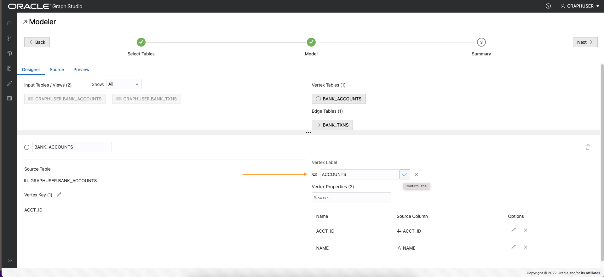

# Créer un graphe

## Présentation

Dans cet exercice, vous allez créer un graphique à partir des tables `bank_accounts` et `bank_txns` à l'aide de Graph Studio et de l'instruction CREATE PROPERTY GRAPH.

Temps estimé : 15 minutes.

Regardez la vidéo ci-dessous pour une présentation rapide du laboratoire. [Créer un graphique de propriétés dans Graph Studio](videohub:1_cz3cwg3h)

### Objectifs

Découvrez comment :

*   Utiliser Graph Studio et PGQL DDL (instruction CREATE PROPERTY GRAPH) pour modéliser et créer un graphique à partir de tables ou de vues existantes.

### Prérequis

*   L'exercice suivant nécessite un compte Autonomous Database - Infrastructure partagée.
*   Et que l'utilisateur compatible Graph (`GRAPHUSER`) existe. En d'autres termes, il existe un utilisateur de base de données doté des rôles et privilèges appropriés.

## Tâche 1 : créer un graphique des comptes et des transactions à partir des tableaux correspondants

1.  Cliquez sur l'icône **Graphique** pour accéder à la création du graphique.  
    Cliquez ensuite sur **Créer**.  
    
    
2.  Sélectionnez ensuite les tables `BANK_ACCOUNTS` et `BANK_TXNS`.  
    
    
3.  Déplacez-les vers la droite, c'est-à-dire cliquez sur la première icône de la commande de navette.
    

4.  Cliquez sur **Suivant** pour obtenir un modèle suggéré. Nous allons modifier et mettre à jour ce modèle pour ajouter un bord et un libellé de sommet.
    
    Le modèle suggéré a `BANK_ACCOUNTS` comme table de sommet car des contraintes de clé étrangère sont spécifiées sur `BANK_TXNS` qui le référencent.
    
    `BANK_TXNS` est un tableau d'arêtes suggéré.
    

5.  Nous allons maintenant modifier les libellés Vertex et Edge par défaut.
    
    Cliquez sur la table de sommets `BANK_ACCOUNTS`. Remplacez le libellé de sommet par **ACCOUNTS**. Cliquez ensuite en dehors de la zone de saisie sur le libellé de confirmation et enregistrez la mise à jour.
    
    
    
    Cliquez sur la table d'arêtes `BANK_TXNS` et renommez le libellé d'arête `BANK_TXNS` en **TRANSFERS**.  
    Cliquez ensuite en dehors de la zone de saisie sur le libellé de confirmation et enregistrez la mise à jour.
    
    
    
    Cela est **important** car nous allons utiliser ces libellés d'arête dans l'exercice suivant de cet atelier lors de l'interrogation du graphique.
    
6.  Comme il s'agit d'arêtes dirigées, il est recommandé de vérifier que la direction est correcte.  
    Dans ce cas, nous voulons **confirmer** que le sens va de `from_acct_id` à `to_acct_id`.
    
    > **Remarque :** informations `Source Vertex` et `Destination Vertex` sur la gauche.
    
    
    
    **Notez** que la direction est incorrecte. La clé source est `to_acct_id` au lieu de ce que nous voulons, à savoir `from_acct_id`.
    
    Cliquez sur l'icône d'arête de swap à droite pour permuter les sommets source et de destination et inverser la direction d'arête.
    
    > **Remarque :** `Source Vertex` est désormais le bon, à savoir `FROM_ACCT_ID`.
    
    
    
7.  Cliquez sur l'onglet **Source** pour vérifier que la direction d'arête, et donc l'instruction CREATE PROPERTY GRAPH générée, est correcte.
    
    
    

8.  Cliquez sur **Suivant**, puis sur **Créer un graphique** pour passer à l'étape suivante du flux.
    
    Entrez `bank_graph` comme nom de graphique.  
    Ce nom de graphique est utilisé au cours de l'exercice suivant.  
    N'entrez pas un nom différent car les requêtes et les fragments de code de l'exercice suivant échoueront.
    
    Entrez un nom de modèle (par exemple, `bank_graph_model`) et d'autres informations facultatives, puis cliquez sur Create. 
    
9.  Graph Studio Modeler va maintenant enregistrer les métadonnées et démarrer un travail pour créer le graphique.  
    La page Travaux affiche le statut de ce travail.
    
    
    
    Vous pouvez ensuite interroger et visualiser le graphique de manière interactive dans un bloc-notes après son chargement en mémoire.
    

Ceci conclut ce laboratoire. **Vous pouvez maintenant passer à l'exercice suivant.**

## Accusés de réception

*   **Auteur** - Jayant Sharma, Product Management
*   **Contributeurs** - Jayant Sharma, Product Management
*   **Dernière mise à jour par/date** - Ramu Murakami Gutierrez, Product Management, juin 2022