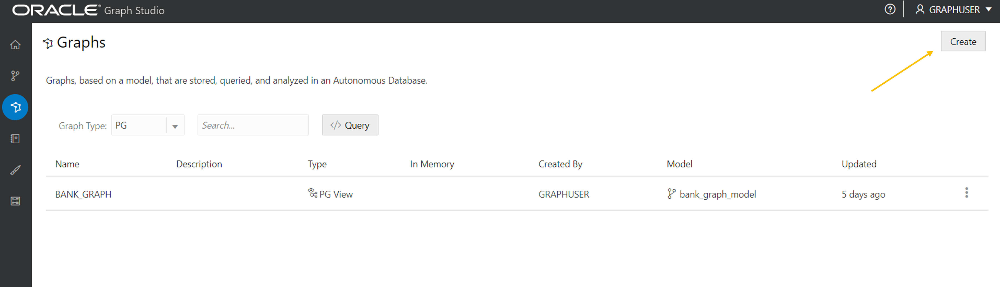
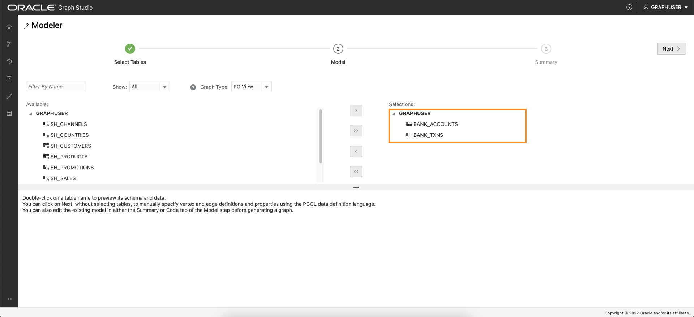
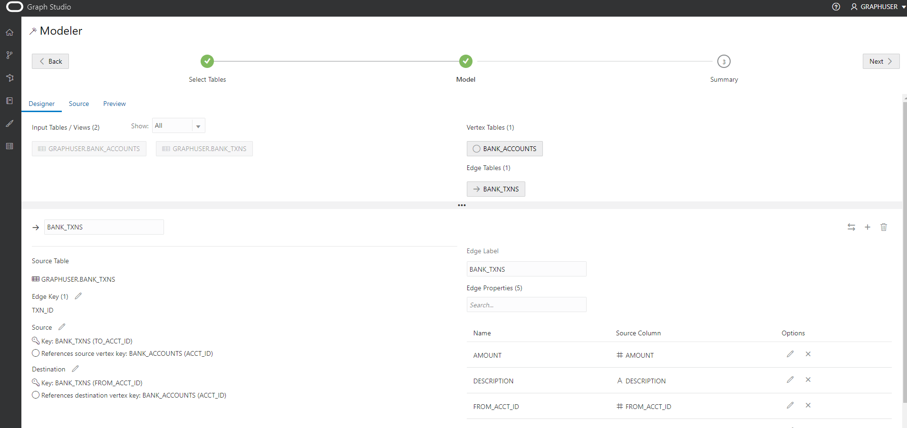
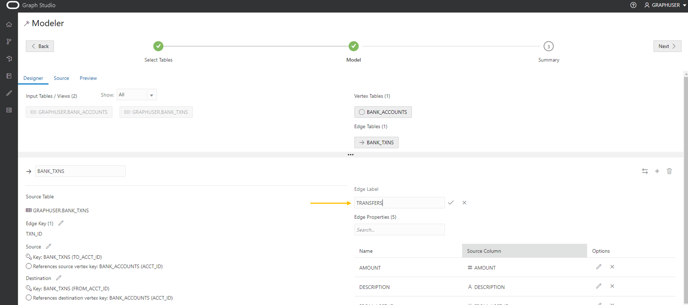
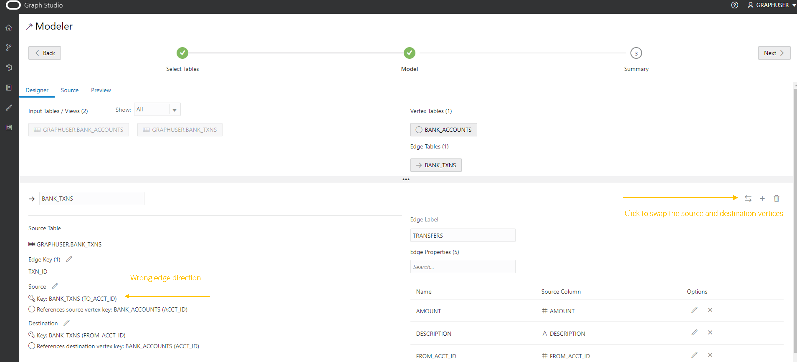
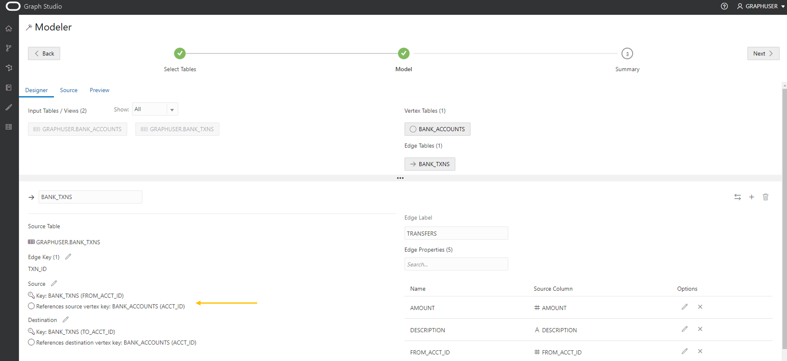
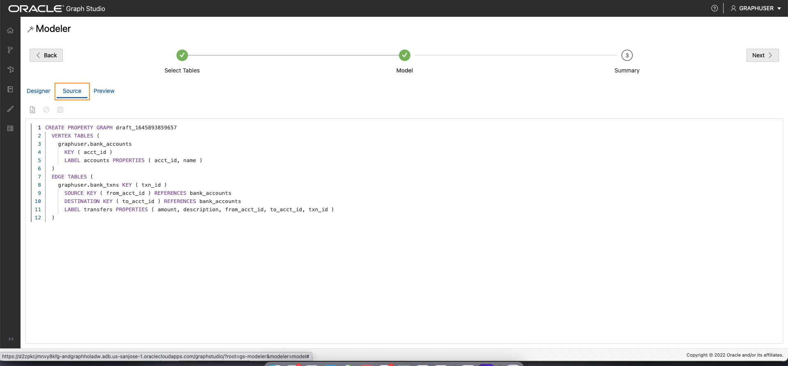
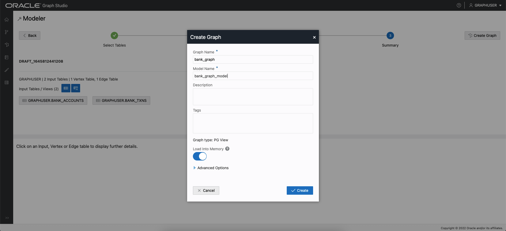

# グラフを作成します

## 概要

この演習では、GRAPH StudioとCREATE PROPERTY GRAPH文を使用して、`bank_accounts`表および`bank_txns`表からグラフを作成します。

見積時間: 15分。

ラボのクイック・ウォークスルーについては、次のビデオをご覧ください。[Graph Studioでのプロパティ・グラフの作成](videohub:1_cz3cwg3h)

### 目標

次の方法を学習します

*   既存の表またはビューからグラフをモデル化および作成するには、GRAPH StudioおよびPGQL DDL (つまり、CREATE PROPERTY GRAPH文)を使用します。

### 前提条件

*   次の演習では、Autonomous Database - 共有インフラストラクチャ・アカウントが必要です。
*   グラフ対応ユーザー(`GRAPHUSER`)が存在すること。つまり、正しいロールおよび権限を持つデータベース・ユーザーが存在します。

## タスク1: 対応する表からの勘定科目とトランザクションのグラフの作成

1.  **「グラフ」**アイコンをクリックして移動し、グラフを作成します。  
    次に、**「作成」**をクリックします。  
    
    
2.  次に、`BANK_ACCOUNTS`表および`BANK_TXNS`表を選択します。  
    
    
3.  それらを右に移動します。つまり、シャトル・コントロールの最初のアイコンをクリックします。
    

4.  **「次へ」**をクリックして、推奨されるモデルを取得します。このモデルを編集および更新して、エッジと頂点ラベルを追加します。
    
    推奨モデルには頂点表として`BANK_ACCOUNTS`があります。これは、参照する外部キー制約が`BANK_TXNS`に指定されているためです。
    
    また、`BANK_TXNS`は推奨されるエッジ表です。
    

5.  次に、デフォルトの頂点ラベルとエッジ ラベルを変更します。
    
    `BANK_ACCOUNTS`頂点表をクリックします。「頂点ラベル」を**「ACCOUNTS」**に変更します。次に、確認ラベルの入力ボックスの外側をクリックして、更新を保存します。
    
    
    
    `BANK_TXNS`エッジ表をクリックし、エッジ・ラベルの名前を`BANK_TXNS`から**TRANSFERS**に変更します。  
    次に、確認ラベルの入力ボックスの外側をクリックし、更新を保存します。
    
    
    
    このワークショップの次の演習で、グラフの問合せ時にこれらのエッジ・ラベルを使用するため、これは**重要**です。
    
6.  これらは方向エッジであるため、方向が正しいことを確認するのがベストプラクティスです。  
    この場合、方向が`from_acct_id`から`to_acct_id`であることを確認します。
    
    > **ノート:**左側の`Source Vertex`および`Destination Vertex`情報。
    
    
    
    方向が間違っていることを**通知**します。ソース・キーは、必要なものではなく`to_acct_id`です(`from_acct_id`)。
    
    右側にあるスワップ エッジ アイコンをクリックして、ソース頂点と宛先頂点を入れ替えてエッジ方向を反転させます。
    
    > **ノート:** `Source Vertex`が正しいもの(`FROM_ACCT_ID`)になりました。
    
    
    
7.  **「ソース」**タブをクリックして、エッジ方向、つまり生成されたCREATE PROPERTY GRAPH文が正しいことを確認します。
    
    
    

8.  **次**、**「グラフの作成」**の順にクリックして、フローの次のステップに移動します。
    
    グラフ名として`bank_graph`と入力します。  
    このグラフ名は、次の演習全体で使用されます。  
    次の演習の問合せおよびコード・スニペットは失敗するため、別の名前を入力しないでください。
    
    モデル名(`bank_graph_model`など)およびその他のオプション情報を入力し、「作成」をクリックします。 
    
9.  Graph Studioモデラーは、メタデータを保存し、グラフを作成するジョブを開始します。  
    「ジョブ」ページには、このジョブのステータスが表示されます。
    
    
    
    ノートブック内のグラフをメモリーにロードした後、対話形式で問合せおよびビジュアル化できます。
    

これで、このラボは終了です。**次の演習に進むことができます。**

## 確認

*   **著者** - 製品管理、Jayant Sharma
*   **貢献者** - 製品管理、Jayant Sharma
*   **最終更新者/日付** - 製品管理、Murakami Gutierrez Ramu、2022年6月