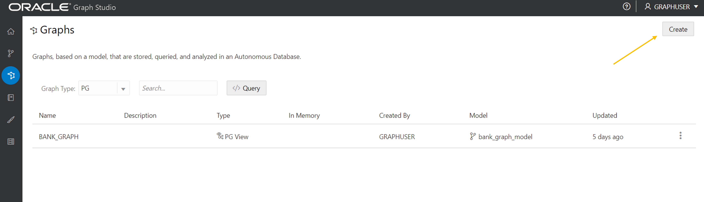
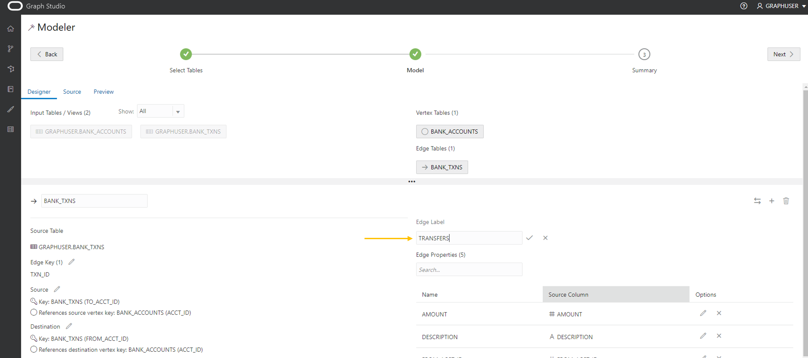

# 그래프 생성

## 소개

이 실습에서는 Graph Studio 및 CREATE PROPERTY GRAPH 문을 사용하여 `bank_accounts` 및 `bank_txns` 테이블에서 그래프를 생성합니다.

예상 시간: 15분

실습 과정을 간단히 살펴보려면 아래 비디오를 시청하십시오. [Graph Studio에서 속성 그래프 생성](videohub:1_cz3cwg3h)

### 목표

방법 알아보기

*   Graph Studio 및 PGQL DDL(즉, CREATE PROPERTY GRAPH 문)을 사용하여 기존 테이블 또는 뷰에서 그래프 모델링 및 생성

### 필요 조건

*   다음 실습에서는 Autonomous Database - Shared Infrastructure 계정이 필요합니다.
*   그래프 사용 사용자(`GRAPHUSER`)가 있습니다. 즉, 올바른 롤과 권한을 가진 데이터베이스 유저가 있습니다.

## 작업 1: 해당 테이블에서 계정 및 트랜잭션 그래프 생성

1.  **그래프** 아이콘을 눌러 그래프를 생성합니다.  
    그런 다음 **생성**을 누릅니다.  
    
    
2.  그런 다음 `BANK_ACCOUNTS` 및 `BANK_TXNS` 테이블을 선택합니다.  
    
    
3.  오른쪽으로 이동합니다. 즉, 셔틀 컨트롤의 첫 번째 아이콘을 누릅니다.
    

4.  **다음**을 눌러 제안된 모델을 가져옵니다. 이 모델을 편집하고 업데이트하여 모서리와 정점 레이블을 추가합니다.
    
    `BANK_TXNS`에 외래 키 제약 조건이 지정되어 있고 이를 참조하는 외래 키 제약 조건이 있으므로 권장 모델에는 `BANK_ACCOUNTS`가 정점 테이블로 사용됩니다.
    
    그리고 `BANK_TXNS`는 권장되는 모서리 테이블입니다.
    

5.  이제 기본 정점 및 모서리 레이블을 변경하겠습니다.
    
    `BANK_ACCOUNTS` 정점 테이블을 누릅니다. Vertex Label을 **ACCOUNTS**로 변경합니다. 그런 다음 확인 레이블의 입력 상자 외부를 누르고 업데이트를 저장합니다.
    
    
    
    `BANK_TXNS` 모서리 테이블을 누르고 모서리 레이블의 이름을 `BANK_TXNS`에서 **TRANSFERS**로 바꿉니다.  
    그런 다음 확인 레이블의 입력 상자 바깥쪽을 누르고 업데이트를 저장합니다.
    
    
    
    그래프를 질의할 때 이 워크샵의 다음 실습에서 이러한 에지 레이블을 사용할 것이므로 **중요**합니다.
    
6.  모서리가 지시되므로 가장 좋은 방법은 방향이 올바른지 확인하는 것입니다.  
    이 경우 방향이 `from_acct_id`에서 `to_acct_id` 사이인지 **확인**하려고 합니다.
    
    > **주:** 왼쪽에 있는 `Source Vertex` 및 `Destination Vertex` 정보입니다.
    
    
    
    방향이 잘못되었음을 **알립니다**. 소스 키는 원하는 키 대신 `to_acct_id`(`from_acct_id`)입니다.
    
    오른쪽의 스왑 모서리 아이콘을 클릭하여 소스 및 대상 정점을 스왑한 다음 모서리 방향을 반대로 합니다.
    
    > **주:** 이제 `Source Vertex`가 올바른 `FROM_ACCT_ID`입니다.
    
    
    
7.  **소스** 탭을 눌러 모서리 방향과 생성된 CREATE PROPERTY GRAPH 문이 올바른지 확인합니다.
    
    
    

8.  **다음**, **그래프 생성** 순으로 눌러 플로우의 다음 단계로 이동합니다.
    
    그래프 이름으로 `bank_graph`을 입력합니다.  
    이 그래프 이름은 다음 실습 전체에서 사용됩니다.  
    다른 이름을 입력하지 마십시오. 그러면 다음 연습의 query와 코드 조각이 실패합니다.
    
    모델 이름(예: `bank_graph_model`) 및 기타 선택적 정보를 입력한 다음 생성을 누릅니다. 
    
9.  이제 Graph Studio 모델러가 메타데이터를 저장하고 그래프를 생성하는 작업을 시작합니다.  
    \[작업\] 페이지에는 이 작업의 상태가 표시됩니다.
    
    
    
    그런 다음 메모장에 그래프가 로드된 후 대화식으로 쿼리하고 시각화할 수 있습니다.
    

이 연습을 마칩니다. **이제 다음 실습을 진행할 수 있습니다.**

## 확인

*   **작성자** - Jayant Sharma, 제품 관리
*   **제공자** - Jayant Sharma, 제품 관리
*   **최종 업데이트 기한/일자** - Ramu Murakami Gutierrez, 제품 관리, 2022년 6월