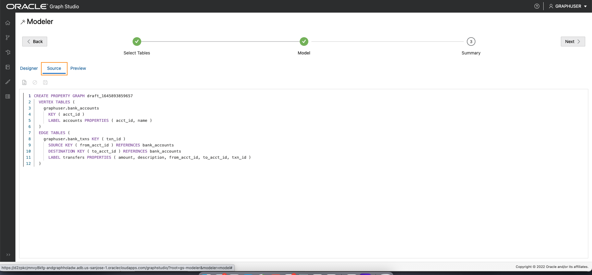

# Criar um gráfico

## Introdução

Neste laboratório, você criará um gráfico das tabelas `bank_accounts` e `bank_txns` usando o Graph Studio e a instrução CREATE PROPERTY GRAPH.

Tempo Estimado: 15 minutos.

Assista ao vídeo abaixo para uma rápida apresentação do laboratório. [Criar um gráfico de propriedades no Graph Studio](videohub:1_cz3cwg3h)

### Objetivos

Saiba como

*   usar o Graph Studio e o PGQL DDL (ou seja, a instrução CREATE PROPERTY GRAPH) para modelar e criar um gráfico com base em tabelas ou views existentes.

### Pré-requisitos

*   O laboratório a seguir requer uma conta do Autonomous Database - Shared Infrastructure.
*   E que o usuário habilitado para Gráfico (`GRAPHUSER`) existe. Ou seja, existe um usuário de banco de dados com as atribuições e os privilégios corretos.

## Tarefa 1: Criar um gráfico de contas e transações a partir das tabelas correspondentes

1.  Clique no ícone **Gráfico** para navegar até criar seu gráfico.  
    Em seguida, clique em **Criar**.  
    
    
2.  Em seguida, selecione as tabelas `BANK_ACCOUNTS` e `BANK_TXNS`.  
    
    
3.  Mova-os para a direita, ou seja, clique no primeiro ícone no controle de transporte.
    

4.  Clique em **Próximo** para obter um modelo sugerido. Editaremos e atualizaremos este modelo para adicionar uma borda e um rótulo de vértice.
    
    O modelo sugerido tem `BANK_ACCOUNTS` como uma tabela de vértices, pois há restrições de chave estrangeira especificadas em `BANK_TXNS` que fazem referência a ele.
    
    E `BANK_TXNS` é uma tabela de borda sugerida.
    

5.  Agora vamos alterar os rótulos Vertex e Edge padrão.
    
    Clique na tabela de vértices `BANK_ACCOUNTS`. Altere o Rótulo Vertex para **ACCOUNTS**. Em seguida, clique fora da caixa de entrada no rótulo de confirmação e salve a atualização.
    
    
    
    Clique na tabela de borda `BANK_TXNS` e renomeie o Label de Borda de `BANK_TXNS` para **TRANSFERS**.  
    Em seguida, clique fora da caixa de entrada no rótulo de confirmação e salve a atualização.
    
    
    
    Isso é **importante** porque usaremos esses rótulos de borda no próximo laboratório deste workshop ao consultar o gráfico.
    
6.  Como essas são bordas direcionadas, uma boa prática é verificar se a direção está correta.  
    Nesta instância, queremos **confirmar** que a direção é de `from_acct_id` a `to_acct_id`.
    
    > **Observação:** As informações `Source Vertex` e `Destination Vertex` à esquerda.
    
    
    
    **Observe** que a direção está errada. A Chave de Origem é `to_acct_id`, em vez do que queremos, que é `from_acct_id`.
    
    Clique no ícone da borda de permuta à direita para permutar os vértices de origem e destino e, portanto, inverter a direção da borda.
    
    > **Observação:** O `Source Vertex` agora é o correto, ou seja, o `FROM_ACCT_ID`.
    
    
    
7.  Clique na guia **Origem** para verificar se a direção da borda e, portanto, a instrução CREATE PROPERTY GRAPH gerada está correta.
    
    
    

8.  Clique em **Próximo** e, em seguida, clique em **Criar Gráfico** para passar para a próxima etapa do fluxo.
    
    Informe `bank_graph` como o nome do gráfico.  
    Esse nome de gráfico é usado no próximo laboratório.  
    Não informe outro nome porque as consultas e os trechos de código no próximo laboratório falharão.
    
    Informe um nome de modelo (por exemplo, `bank_graph_model`) e outras informações opcionais e clique em Criar. 
    
9.  O modelador do Graph Studio agora salvará os metadados e iniciará um job para criar o gráfico.  
    A página Jobs mostra o status desse job.
    
    
    
    Em seguida, você pode consultar e visualizar interativamente o gráfico em um notebook após ele ser carregado na memória.
    

Isso conclui este laboratório. **Agora você pode prosseguir para o próximo laboratório.**

## Agradecimentos

*   **Autor** - Jayant Sharma, Gerenciamento de Produtos
*   **Colaboradores** - Jayant Sharma, Gerenciamento de Produtos
*   **Última Atualização em/Data** - Ramu Murakami Gutierrez, Gerenciamento de Produtos, junho de 2022