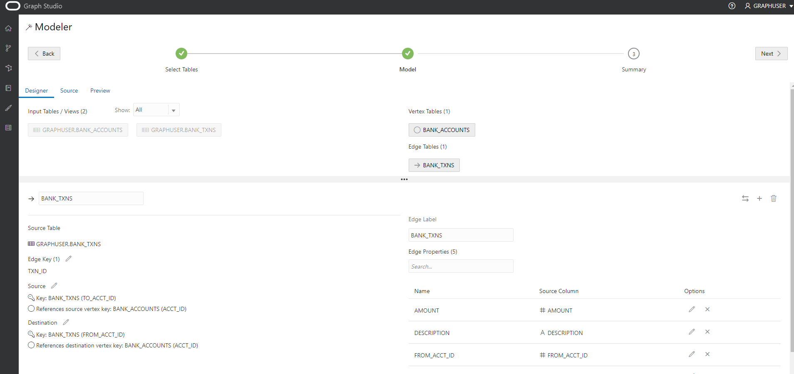
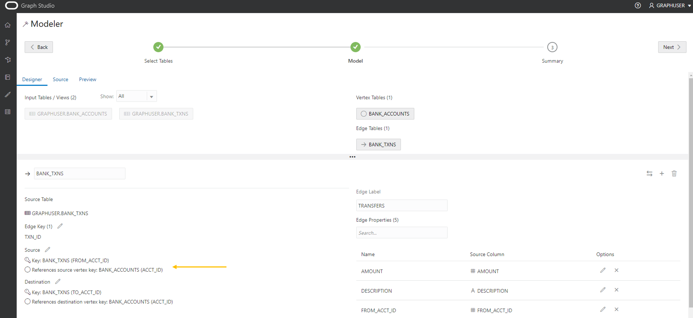

# 创建图形

## 简介

在本练习中，您将使用 Graph Studio 和 CREATE PROPERTY GRAPH 语句从 `bank_accounts` 和 `bank_txns` 表创建图形。

预计时间：15 分钟。

观看下面的视频，快速浏览实验室。[在 Graph Studio 中创建属性图形](videohub:1_cz3cwg3h)

### 目标

了解方法

*   使用 Graph Studio 和 PGQL DDL（即 CREATE PROPERTY GRAPH 语句）基于现有表或视图建模和创建图形。

### 先备条件

*   下面的练习需要一个 Autonomous Database - Shared Infrastructure 账户。
*   存在启用图形的用户 (`GRAPHUSER`)。也就是说，存在具有正确角色和权限的数据库用户。

## 任务 1：根据相应的表创建帐户和事务处理的图形

1.  单击**图形**图标以导航以创建图形。  
    然后单击**创建**。  
    
    
2.  然后选择 `BANK_ACCOUNTS` 和 `BANK_TXNS` 表。  
    
    
3.  将它们移到右侧，即单击往返控件上的第一个图标。
    

4.  单击**下一步**以获得建议的模型。我们将编辑和更新此模型以添加边缘和顶点标签。
    
    建议的模型将 `BANK_ACCOUNTS` 作为顶点表，因为在 `BANK_TXNS` 上指定了引用它的外键约束条件。
    
    `BANK_TXNS` 是建议的边缘表。
    

5.  现在，让我们更改默认的 Vertex 和 Edge 标签。
    
    单击 `BANK_ACCOUNTS` 顶点表。将 Vertex 标签更改为 **ACCOUNTS** 。然后单击确认标签上的输入框外部并保存更新。
    
    
    
    单击 `BANK_TXNS` 边缘表，并将边缘标签从 `BANK_TXNS` 重命名为 **TRANSFERS** 。  
    然后单击确认标签上的输入框外部并保存更新。
    
    
    
    这**非常重要**，因为在查询图形时，我们将在本研讨会的下一个练习中使用这些边缘标签。
    
6.  由于这些是定向边缘，因此最佳做法是验证方向是否正确。  
    在此实例中，我们希望**确认**方向是从 `from_acct_id` 到 `to_acct_id`。
    
    > **注：**左侧的 `Source Vertex` 和 `Destination Vertex` 信息。
    
    
    
    **注意**方向错误。源密钥是 `to_acct_id`，而不是我们想要的，即 `from_acct_id`。
    
    单击右侧的交换边缘图标可交换源顶点和目标顶点，从而反转边缘方向。
    
    > **注：**`Source Vertex` 现在是正确的，即 `FROM_ACCT_ID`。
    
    
    
7.  单击**源**选项卡以验证边缘方向以及生成的 CREATE PROPERTY GRAPH 语句是否正确。
    
    
    

8.  单击**下一步**，然后单击**创建图形**以继续执行流的下一步。
    
    输入 `bank_graph` 作为图形名称。  
    该图形名称在下一个练习中使用。  
    请勿输入其他名称，因为下一个练习中的查询和代码片段将失败。
    
    输入模型名称（例如 `bank_graph_model`）和其他可选信息，然后单击“创建”。 
    
9.  Graph Studio 建模器现在将保存元数据并启动作业以创建图形。  
    “作业”页显示此作业的状态。
    
    
    
    然后，您可以在将图形加载到内存中之后，以交互方式查询和可视化该图形。
    

这个实验室结束了。**现在，您可以继续下一个练习。**

## 确认

*   **作者** - 产品管理 Jayant Sharma
*   **贡献者** - 产品管理 Jayant Sharma
*   **上次更新者/日期** - Ramu Murakami Gutierrez，产品管理，2022 年 6 月