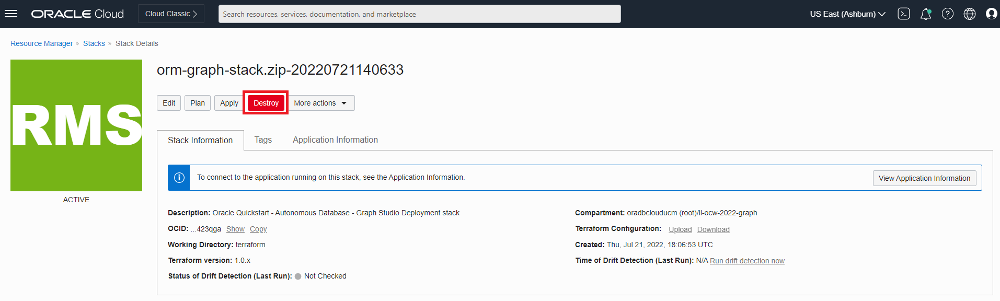

# Bereinigen

## Einführung

In dieser Übung zerstören Sie die vom Stack erstellte Umgebung.

Geschätzte Zeit: 5 Minuten.

Sehen Sie sich das Video unten an, um einen schnellen Durchgang des Labors zu erhalten. [Kamerafahrt](videohub:1_cnecear0)

### Ziele

Vorgehensweise

*   Vom Stack erstellten Job zerstören
*   Stack löschen

## Aufgabe 1: Vom Stack erstellten Job endgültig löschen

1.  Klicken Sie oben links auf das Navigationsmenü, um Navigationsoptionen anzuzeigen. Wählen Sie **Development Services** aus, und klicken Sie auf **Stack**.

2.  Klicken Sie auf Ihren Stack, und klicken Sie auf **Zerstören**, um die beim Ausführen des Stacks erstellten Ressourcen zu löschen.

Klicken Sie im Popup-Fenster auf **Zerstören**. Sie gelangen zu einer Seite mit Jobdetails mit einem Anfangsstatus in Orange. Das Symbol wird grün, sobald der Job erfolgreich abgeschlossen wurde.

## Aufgabe 2: Stack löschen

1.  Wenn der Job erfolgreich ausgeführt wurde, wird das Stackimage grün. Klicken Sie auf **Stackdetails**.

2.  Klicken Sie auf **Weitere Aktionen** und **Stack löschen**. Wählen Sie dann **Löschen** aus, um den Stack endgültig zu löschen.

Danach wird die autonome Datenbank mit dem Diagrammbenutzer und den Datasets gelöscht.

Damit endet diese Übung. Vielen Dank!

## Danksagungen

*   **Autor** - Ramu Murakami Gutierrez, Produktmanagement
*   **Mitwirkende** - Ramu Murakami Gutierrez, Produktmanagement
*   **Zuletzt aktualisiert am/um** - Ramu Murakami Gutierrez, Produktmanagement, Juli 2022