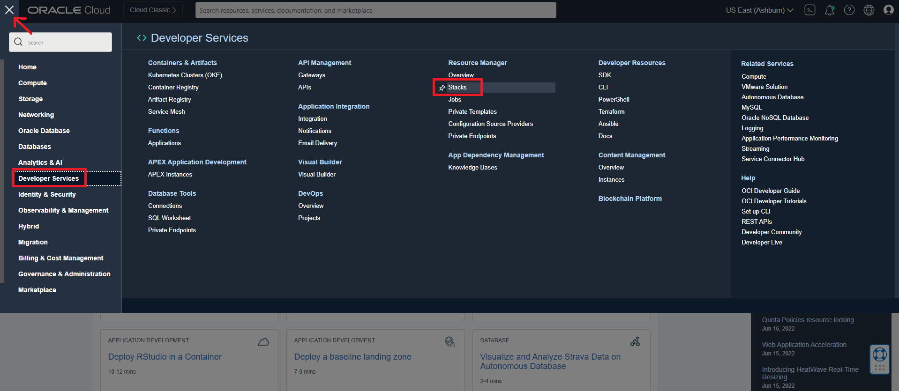
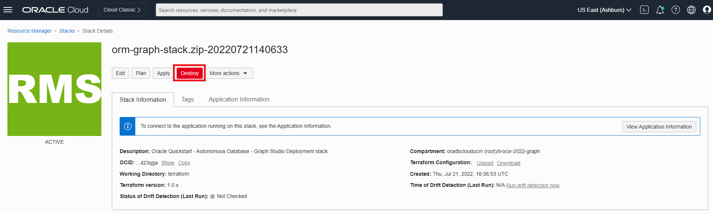
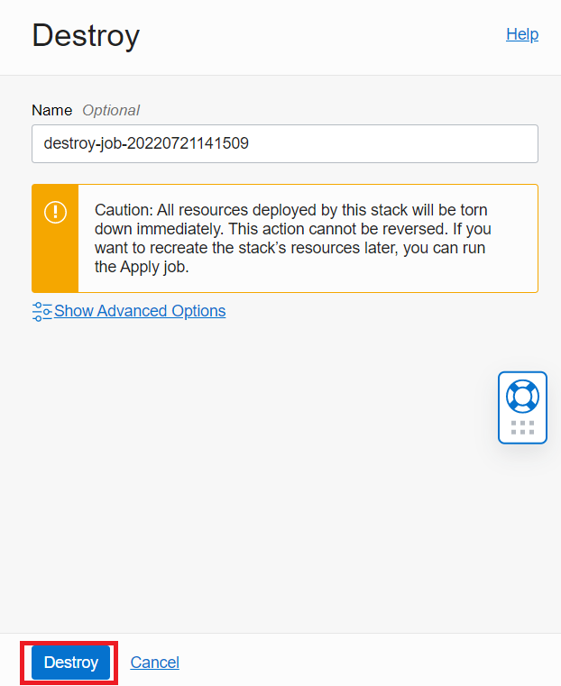
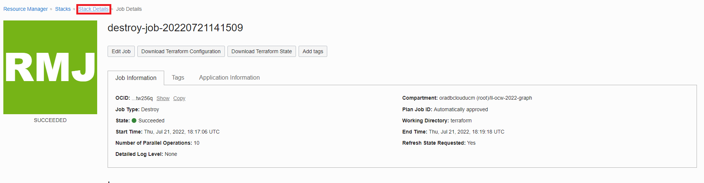
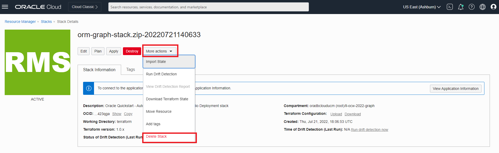

# Nettoyage

## Présentation

Dans cet exercice, vous allez détruire l'environnement créé par la pile.

Durée estimée : 5 minutes.

Regardez la vidéo ci-dessous pour une présentation rapide du laboratoire. [Procédure pas à pas](videohub:1_cnecear0)

### Objectifs

Découvrez comment :

*   Détruire le travail créé par la pile
*   Supprimer la pile

## Tâche 1 : détruire le travail créé par la pile

1.  Cliquez sur le menu de navigation en haut à gauche pour afficher les choix de navigation. Sélectionnez **Services de développement**, puis cliquez sur **Pile**.

2.  Cliquez sur votre pile, puis sur **Détruire** pour détruire les ressources créées lors de l'exécution de la pile.

Cliquez sur **Détruire** dans la fenêtre contextuelle. Vous serez redirigé vers une page Détails du travail avec un statut initial affiché en orange. L'icône devient verte une fois le travail terminé.

## Tâche 2 : supprimer une pile

1.  Une fois le travail terminé, l'image de pile devient verte. Cliquez sur **Détails de la pile**.

2.  Cliquez sur **Actions supplémentaires**, puis sur **Supprimer la pile**. Sélectionnez ensuite **Supprimer** pour supprimer définitivement la pile.

Après cela, votre base de données autonome contenant l'utilisateur du graphique et les jeux de données seront supprimés.

Ceci conclut ce laboratoire. Merci !

## Accusés de réception

*   **Auteur** - Ramu Murakami Gutierrez, Gestion de produits
*   **Contributeurs** - Ramu Murakami Gutierrez, Gestion des produits
*   **Dernière mise à jour par/date** - Ramu Murakami Gutierrez, Product Management, juillet 2022