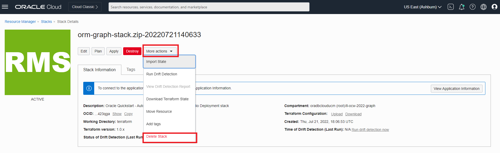

# クリーンアップ

## 概要

この演習では、スタックによって作成された環境を破棄します。

見積時間: 5分。

ラボのクイック・ウォークスルーについては、次のビデオをご覧ください。[ウォークスルー](videohub:1_cnecear0)

### 目標

学習方法

*   スタックによって作成されたジョブを破棄します
*   スタックの削除

## タスク1: スタックによって作成されたジョブの破棄

1.  左上のナビゲーション・メニューをクリックして、ナビゲーションの選択肢を表示します。**「開発サービス」**を選択し、**「スタック」**をクリックします。

2.  スタックをクリックし、**「破棄」**をクリックして、スタックの実行時に作成されたリソースを破棄します。

ポップアップ・ウィンドウで**「破棄」**をクリックします。「ジョブ詳細」ページが表示され、初期ステータスがオレンジ色で表示されます。ジョブが正常に完了すると、アイコンは緑色になります。

## タスク2: スタックの削除

1.  ジョブが成功すると、スタック・イメージは緑色になります。**「スタックの詳細」**をクリックします。

2.  **「他のアクション」**および**「スタックの削除」**をクリックします。次に、**「削除」**を選択して、スタックを完全に削除します。

この後、グラフ・ユーザーおよびデータセットを含む自律型データベースが削除されます。

これで、このラボは終了です。ありがとうございます!

## 確認

*   **著者** - 製品管理、Ramu Murakami Gutierrez氏
*   **貢献者** - 製品管理、Ramu Murakami Gutierrez
*   **最終更新者/日付** - 製品管理、Murakami Gutierrez Ramu、2022年7月