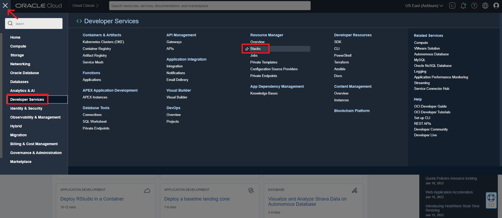
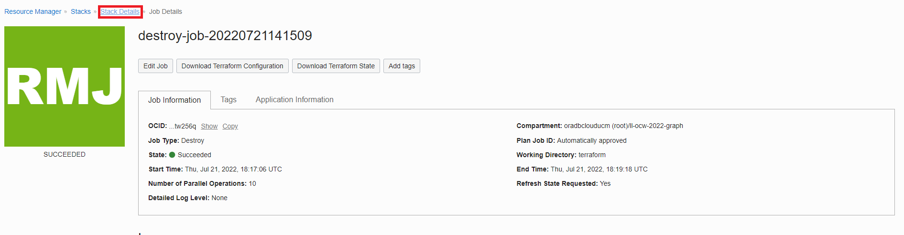

# 정리

## 소개

이 실습에서는 스택에 의해 생성된 환경을 삭제합니다.

예상 시간: 5분

실습 과정을 간단히 살펴보려면 아래 비디오를 시청하십시오. [연습](videohub:1_cnecear0)

### 목표

방법 알아보기

*   스택에 의해 생성된 작업을 삭제합니다.
*   스택 삭제

## 작업 1: 스택에 의해 생성된 작업 삭제

1.  왼쪽 위에 있는 탐색 메뉴를 눌러 탐색 선택을 표시합니다. **Development Services**를 선택한 다음 **Stack**을 누릅니다.

2.  스택을 누르고 **삭제**를 눌러 스택을 실행할 때 생성된 리소스를 삭제합니다.

팝업 창에서 **삭제**를 누릅니다. 초기 상태가 주황색으로 표시된 Job Details 페이지로 이동합니다. 작업이 성공적으로 완료되면 아이콘이 녹색으로 표시됩니다.

## 작업 2: 스택 삭제

1.  작업이 성공하면 스택 이미지가 녹색으로 바뀝니다. **Stack Details**를 누릅니다.

2.  **추가 작업** 및 **스택 삭제**를 누릅니다. 그런 다음 **삭제**를 선택하여 스택을 영구적으로 삭제합니다.

그러면 그래프 사용자 및 데이터 집합이 포함된 자율운영 데이터베이스가 삭제됩니다.

이 연습을 마칩니다. 감사합니다!

## 확인

*   **작성자** - Ramu Murakami Gutierrez, 제품 관리
*   **기여자** - Ramu Murakami Gutierrez, 제품 관리
*   **최종 업데이트 기한/일자** - Ramu Murakami Gutierrez, 제품 관리, 2022년 7월