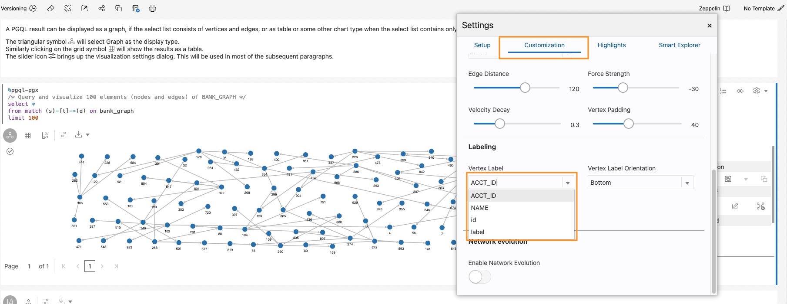

# Graph Studio: PGQLおよびPythonを使用したグラフの問合せ、ビジュアル化および分析

## 概要

この演習では、ノートブックのPGQL段落で新しく作成したグラフ(`bank_graph`)を問い合せます。

見積時間: 30分。

ラボのクイック・ウォークスルーについては、次のビデオをご覧ください。

[](youtube:XnE1yw2k5IU)

### 目標

次の方法を学習します

*   ノートブックをインポートします
*   ノートブックの作成および段落の追加
*   Graph StudioノートブックとPGQLおよびPython段落を使用して、グラフを問い合せ、分析およびビジュアル化します。

### 前提条件

*   このワークショップの以前のラボ。つまり、グラフ・ユーザーが存在し、Graph Studioにログインしています。

## **タスク1:**ノートブックのインポート

次の手順では、各ノートブックの段落を作成し、それを実行し、必要に応じてデフォルトのビジュアライゼーション設定を変更する方法を示します。  
最初にサンプル・ノートブックを**インポート**してから、タスク2の各ステップに関連する段落を実行します。

1.  この[リンク](https://objectstorage.us-ashburn-1.oraclecloud.com/p/2qn9I8UPte_UUOSzGqXrfHw7dSEtzth0eaDxRAI_hfg1KIUJVC1c-S422hMHUTJE/n/c4u04/b/livelabsfiles/o/labfiles/BANK_GRAPH.dsnb)を使用してエクスポートされたノートブックをダウンロードします
    
2.  **「ノートブック」**メニュー・アイコンをクリックし、右上の**「インポート」**ノートブック・アイコンをクリックします。
    


3.  ダウンロードしたファイルをドラッグするか、正しいフォルダに移動して、アップロード対象として選択します。  
    
    
4.  **「インポート」**をクリックします。 
    
5.  インポートしたら、Graph Studioで開きます。
    


次の**タスク2**の説明に従って、段落を順番に実行し、ビジュアライゼーション設定を試すことができます。

## **タスク2:** Graph Studioでのノートブックの作成および段落の追加(ノートブックをインポートしていない場合はオプション)

1.  **「ノートブック」**ページに移動し、**「作成」**ボタンをクリックします。


2.  ノートブック名を入力します。オプションで、摘要とタグを入力できます。**「Create」**をクリックします。


3.  段落を追加するには、既存の段落の上部または下部にカーソルを置きます。


通訳者は7人。各オプションは、カスタマイズ可能なサンプル構文を使用して段落を作成します。


この演習では、**「段落の追加」**インタプリタを選択します。

## **タスク3:** `BANK_GRAPH`のロードと問合せを行い、結果を視覚化します。

> **ノート:** _次の各ステップの説明を読んだ後、関連する段落を実行します_。コンピュート環境がまだ準備できておらず、コードを実行できない場合は、バックグラウンド・タスクが進行中であることを示す青い線が段落の下部に移動します。  
> 

1.  まず、グラフ・アルゴリズムを実行するため、グラフがまだロードされていない場合は、インメモリー・グラフ・サーバーにロードします。

組込みセッション・オブジェクトを使用してデータベースからメモリーにグラフを読み取り、ロードされたグラフへのハンドルであるPgXGraphオブジェクトを作成する最初の**%python-pgx**段落を実行します。

この段落のコードは、次のとおりです。

    ```
    <copy>%python-pgx
    
    GRAPH_NAME="BANK_GRAPH"
    # try getting the graph from the in-memory graph server
    graph = session.get_graph(GRAPH_NAME);
    # if it does not exist read it into memory
    if (graph == None) :
        session.read_graph_by_name(GRAPH_NAME, "pg_view")
        print("Graph "+ GRAPH_NAME + " successfully loaded")
        graph = session.get_graph(GRAPH_NAME)
    else :
        print("Graph '"+ GRAPH_NAME + "' already loaded")</copy>
    ```
    


2.  次に、問合せを行う段落を実行し、グラフの100要素を表示します。
    
        <copy>%pgql-pgx
        /* Query and visualize 100 elements (nodes and edges) of BANK_GRAPH */
        select *
        from match (s)-[t]->(d) on bank_graph
        limit 100</copy>
        

前述のPGQL問合せは、グラフの最初の100要素をフェッチして表示します。  
MATCH句は、グラフ・パターンを指定します。

*   `(s)`はソース・ノードです。
*   `[t]`はエッジです
*   `->`は、エッジ方向(つまり、ソース`s`から宛先`d`)を示します。
*   `(d)`は宛先ノードです

**LIMIT**句は、クエリーが返す要素の最大数を指定します。

言語の構文と機能の詳細は、[PGQLサイト](https://pgql-lang.org)および仕様を参照してください。  
「Getting Started」ノートブック・フォルダには、PGQLに関するチュートリアルもあります。

3.  結果には、ビジュアライゼーション・コンポーネントのいくつかの機能が使用されます。`acct_id`プロパティはノード(または頂点)ラベルに使用され、グラフは選択したグラフ・レイアウト・アルゴリズムを使用してレンダリングされます。
    
    > **ノート:** _次のステップを実行する必要はありません。使用するステップの概要を示します。自由にビジュアライゼーションを試して変更してください。_
    

ビジュアライゼーションのカスタマイズに必要なステップ:

ビジュアライゼーションの`settings`アイコンをクリックします。

 (ビジュアライゼーションパネルの上部にある左から4番目のアイコン)。


この`Settings`ダイアログで、**「カスタマイズ」**タブをクリックします。次に下にスクロールし、`Labeling`、`Vertex Label`ドロップダウン・リストから`ACCT_ID`を選択します(ビジュアライゼーションごとにこれを実行します)。



右上にある**「X」**をクリックして、「設定」ダイアログを終了します。結果のビジュアライゼーションは、次のスクリーンショットのようになります。

> **ノート:**スクリーンショットに表示される色とレイアウトは、結果の色と異なる場合があります。


ビジュアライゼーション設定を再度開き、**「カスタマイズ」**タブをクリックして、「レイアウト」ドロップダウン・リストから別のレイアウト(**「集中」**)を選択します。「設定」ダイアログを終了します。


4.  これは、問合せでのバインド・パラメータの使用を示しています。勘定科目ID値は実行時に入力されます。アカウントIDとして**534**を入力し、段落を実行します。
    
        <copy>%pgql-pgx
        /* Check if there are any circular payment chains of between 1 and 5 hops starting from the user-supplied account # */
        SELECT v,e,v2
        FROM MATCH ANY (a)-[:TRANSFERS]->{1,5}(b) ON bank_graph ONE ROW PER STEP (v,e,v2)
        WHERE a.acct_id=${account_id} AND id(a) = id(b)</copy>
        


5.  次に、PGQLを使用して、転送数の観点から上位10のアカウントを検索します。  
    PGQLには、ノードの受信エッジおよび送信エッジの数を返す組込み関数`IN_DEGREE`および`OUT_DEGREE`があります。そのため、この問合せで使用できます。

次の問合せを使用して段落を実行します。

    ```
    <copy>%pgql-pgx
    /* List 10 accounts with the most number of transactions (that is, incoming + outgoing edges) */
    SELECT a.acct_id, (in_degree(a) + out_degree(a)) AS num_transactions
    FROM MATCH (a) ON bank_graph
    ORDER BY num_transactions DESC
    LIMIT 10</copy>
    ```
    

ビューを表に変更します。


リストでは、アカウント **934**および **387**が高いことがわかります。

6.  ここで、アカウント **934**で開始および終了する **circular**転送があるかどうかを確認します。まず、**\[:TRANSFERS\]->{4}**として指定された**ホップ数が4**です。**ONE ROW PER STEP**を使用すると、円内のすべての頂点を表示できます。

次の問合せを実行します。

    ```
    <copy>%pgql-pgx
    /* Check if there are any circular payment chains of length 4 from acct 934 */
    SELECT v,e,v2
    FROM MATCH ALL (a)-[:TRANSFERS]->{4}(b) ON bank_graph ONE ROW PER STEP (v,e,v2)
    WHERE a.acct_id=934 AND id(a) = id(b)
    LIMIT 100</copy>
    ```
    

> **ノート:** _次のステップを実行する必要はありません。使用するステップの概要を示します。自由にビジュアライゼーションを試して変更してください。_

ビジュアライゼーションのカスタマイズに必要なステップ:  
この`Settings`ダイアログで、**「ハイライト」**タブをクリックします。


条件として**ACCT\_ID = 934**、視覚効果として**size = 3.4X**および**color = red**の新しいハイライトを追加します。右上にある**「X」**をクリックして、「設定」ダイアログを終了します。


円をドラッグしてビジュアライゼーションを配置します。


ここで、`/:TRANSFERS{4}/`は[到達性パス式](https://pgql-lang.org/spec/1.3/#reachability)です。パスが存在するかどうかのみをテストします。  
`:TRANSFERS`は、パス内のすべてのエッジにラベル`TRANSFERS`が必要であることを指定します。  
`{4}`はパス長を正確に3ホップで指定します。

**3**ホップの長さは、アカウント **934**で開始および終了しています。

7.  前述の問合せを変更して、**5**ホップを選択した場合の円の数を確認できます。  
    次の問合せを実行します。
    
        <copy>%pgql-pgx
        /* Check if there are any circular payment chains of length 5 from acct 934 */
        SELECT v,e,v2
        FROM MATCH ALL (a)-[:TRANSFERS]->{5}(b) ON bank_graph ONE ROW PER STEP (v,e,v2)
        WHERE a.acct_id=934 AND id(a) = id(b)
        LIMIT 100</copy>
        


**934**で開始および終了する循環支払チェーンの数によって、そのアカウントが疑わしいように見えます。

8.  別のアルゴリズムである**PageRank**グラフ・アルゴリズムを使用して調査を続けます。**%python-pgx**段落では、pythonコードスニペットを実行できます。Python APIを使用して、**PageRank**アルゴリズムを実行します。次のコード・スニペットは、インメモリー・グラフ・サーバーにロードされたBANK\_GRAPHへのハンドルを含むPgxGraphオブジェクトを作成します。次に、組込みの**アナリスト**pythonオブジェクトを使用してPageRankアルゴリズムを実行します。**session**および**analyst**オブジェクトは、インメモリー・グラフ・サーバーがインスタンス化され、ノートブックが開かれるときに作成されます。

次のコード・スニペットを含む段落を実行します。

    ```
    <copy>%python-pgx
    graph = session.get_graph("BANK_GRAPH")
    analyst.pagerank(graph);</copy>
    ```
    


9.  次に、**PageRank**の値が大きいアカウントを検索するために、PageRank値を降順にリストします。  
    PageRankの値が大きい場合は、アカウントが「重要」であることを示します。BANK\_GRAPHのコンテキストでは、多数の転送がそのアカウントを通過したことを意味し、**または**そのアカウントは、多数の転送が流れているアカウントに接続されています。
    
        <copy>%pgql-pgx
        /* List accounts in descending order of pagerank values*/
        SELECT a.acct_id, a.pagerank as pageRank
        FROM MATCH (a) ON bank_graph
        ORDER BY PageRank DESC
        LIMIT 10</copy>
        

ビューを表に変更します。


10.  **934**が上位5にあります。このメトリックは、多数のトランザクションが**934**を流れることも示します。**387**がリストの最上部に表示されます。ここで、計算されたPageRank値を使用して、PGQL問合せの結果をビジュアル化します。ハイライトを使用して、PageRank値が大きいアカウントと円が大きく、赤が色で表示されます。次の問合せを使用して段落を実行し、アカウント#934から始まる6ホップ支払チェーンを検索します。
    
        <copy>%pgql-pgx
        /* Add highlights to symbolize account nodes by PageRank values. This shows that 934 and highlights accounts with high PageRank values that are connected to 934.
        Choose the hierarchical view. */
        SELECT v,e,v2
        FROM MATCH ANY (n)-[:Transfers]->{6}(m) ON bank_graph ONE ROW PER STEP (v,e,v2)
        WHERE n.acct_id = 934
        LIMIT 100</copy>
        

> **ノート:** _次のステップを実行する必要はありません。使用するステップの概要を示します。自由にビジュアライゼーションを試して変更してください。_

ビジュアライゼーションのカスタマイズに必要なステップ:

グラフ視覚化レイアウトを**「階層」**に変更します。


条件として**pagerank >= 0.0035**、視覚効果として**size = 3X**、**color = red**を使用して新しいハイライトを追加し、「作成」をクリックします。右上にある**「X」**をクリックして、「設定」ダイアログを終了します。


> **ノート:**スクリーンショットに表示される色とレイアウトは、結果の色と異なる場合があります。


11.  次に、アカウントの**PageRank**値を、それらのアカウントを通過する**トランザクション数**(前述)と比較します。ビューを表に変更します。
    
        <copy>%pgql-pgx
        /* List accounts in descending order of pagerank values*/
        SELECT a.acct_id, a.pagerank as pageRank
        FROM MATCH (a) ON bank_graph
        ORDER BY PageRank DESC
        LIMIT 5</copy>
        

PageRank値を含む表を表示します。

    ```
    <copy>%pgql-pgx
    /* List 10 accounts with the most number of transactions (that is, incoming + outgoing edges) */
    SELECT a.acct_id, (in_degree(a) + out_degree(a)) as num_transactions
    FROM MATCH (a) ON bank_graph
    ORDER BY num_transactions DESC
    LIMIT 5</copy>
    ```
    

トランザクション数の表を表示します。

**PageRank**はキャッシュ・フロー・トランザクションのより複雑なメジャーであるため、リストは同一ではありません。


すでに疑わしいと思われる**934**は上位5位、**387**は上位です。

12.  **934**と **387**の間に存在するパスを調べてみましょう。これらの経路の他のアカウントも調査する必要があります。
    
        <copy>%pgql-pgx
        /* Check the shortest path between account 934 and account 387 */
        SELECT v,e,v2
        FROM MATCH SHORTEST (a)-[:TRANSFERS]->+(b) ON bank_graph ONE ROW PER STEP (v,e,v2)
        WHERE a.acct_id=934 AND b.acct_id=387</copy>
        


13.  ホップ数の昇順でパスを配置する場合、これらは**上位3**および**上位5**のパスです。
    
        <copy>%pgql-pgx
        /* Find the top 3 shortest paths between account 934 and account 387 */
        SELECT v,e,v2
        FROM MATCH TOP 3 SHORTEST (a)-[:TRANSFERS]->+ (b) ON bank_graph ONE ROW PER STEP (v,e,v2)
        WHERE a.acct_id=934 AND b.acct_id=387</copy>
        


    ```
    <copy>%pgql-pgx
    /* Find the top 5 shortest path between account 934 and account 387 */
    SELECT v,e,v2
    FROM MATCH TOP 5 shortest (a)-[:TRANSFERS]->+ (b) ON bank_graph ONE ROW PER STEP (v,e,v2)
    WHERE a.acct_id=934 AND b.acct_id=387</copy>
    ```
    


詐欺部門は、**934**と**387**が違法行為に関与している可能性があることも確認しました。場合によっては、アカウント **934**または **387**からお金を受け取ったアカウントもスキームの一部であり、それらからお金を受け取ったアカウントもその一部である可能性があります。アカウントの「クローザー」は、リスクが**934**または**387**高くなります。

14.  頂点のコレクションに対して**PageRank**値**relative**を計算する_パーソナライズPageRankアルゴリズム_を使用します。この場合、**934**および**387**です。またPython APIを使います。コード・スニペットは、以前に取得したBANK\_GRAPHへのハンドルを含むPgxGraphオブジェクト**graph**を使用します。組込みのアナリストpythonオブジェクトを使用して、**パーソナライズPageRankアルゴリズム**・アルゴリズムを起動します。
    
        <copy>%python-pgx
        
        vertices = graph.create_vertex_set()
        vertices.add_all([graph.get_vertex("BANK_ACCOUNTS(934)"),graph.get_vertex("BANK_ACCOUNTS(387)")])
        
        analyst.personalized_pagerank(graph, vertices)</copy>
        


    ```
    <copy>%pgql-pgx
    SELECT a.acct_id, a.personalized_pagerank as risk FROM MATCH (a) ON bank_graph
    ORDER BY risk DESC</copy>
    ```
    

ビューを表に変更します。


**934**と **387**は自然に高いパーソナライズランク値を持ち、リストの次のアカウントは **406**です。

15.  アカウント**406**の直近の隣人を確認します。問合せを行う段落を実行し、アカウント**406**とそのネイバーを表示します。
    
        <copy>%pgql-pgx
        /* show the transactions for acct id 406 */
        SELECT *
        FROM MATCH (v1)-[e1]->(a)-[e2]->(v2) ON bank_graph
        WHERE a.acct_id=406</copy>
        
    
    > **ノート:** _次のステップを実行する必要はありません。使用するステップの概要を示します。自由にビジュアライゼーションを試して変更してください。_
    

ビジュアライゼーションのカスタマイズに必要なステップ:

グラフ視覚化レイアウトを**「グリッド」**に変更します。


> **ノート:**スクリーンショットに表示される色とレイアウトは、結果の色と異なる場合があります。


16.  別のアルゴリズムである**`ShortestPathHopDist()`**分析アルゴリズムを使用して、アカウント**934**に近接しているため、どのアカウントが不正なアクティビティに関与している可能性があるかを計算できます。**`ShortestPathHopDist()`**は、**934**とグラフ内の他のすべてのアカウントの間の最小ホップ数を計算します。アカウントを遠ざけるホップ数が多いほど、**934**からのホップ数が高くなるため、リスクは低くなります。またPython APIを使います。コード・スニペットは、以前に取得したBANK\_GRAPHへのハンドルを含むPgxGraphオブジェクトを使用します。組込みのアナリストpythonオブジェクトを使用して**`ShortestPathHopDist()`**アルゴリズムを起動します。最初にアカウント**934**に対応する頂点オブジェクトを取得し、アルゴリズムを実行します。

次のコード・スニペットを含む段落を実行します。

    ```
    <copy>%python-pgx
    vertex = graph.get_vertex("BANK_ACCOUNTS(934)")
    
    analyst.shortest_path_hop_distance(graph, vertex)</copy>
    ```
    


17.  ホップ数でグループ化し、降順にランク付けできます。
    
        <copy>%pgql-pgx
        SELECT count(a.acct_id), a.hop_dist_distance as hops FROM MATCH (a) ON BANK_GRAPH
        GROUP BY hops
        ORDER BY hops</copy>
        

ビューを表に変更します。


18.  **934**からのホップ距離が2以下であるアカウントをリストできます。
    
        <copy>%pgql-pgx
        SELECT a.acct_id, a.hop_dist_distance as hops FROM MATCH (a) ON BANK_GRAPH
        WHERE hops <=2
        ORDER BY hops</copy>
        

ビューを表に変更します。

        	  
    

これで、このラボは終了です。

## 確認

*   **著者** - 製品管理、Jayant Sharma
*   **コントリビュータ** - Rahul Tasker、Jayant Sharma、製品管理
*   **最終更新者/日付** - 製品管理、Murakami Gutierrez Ramu、2022年7月