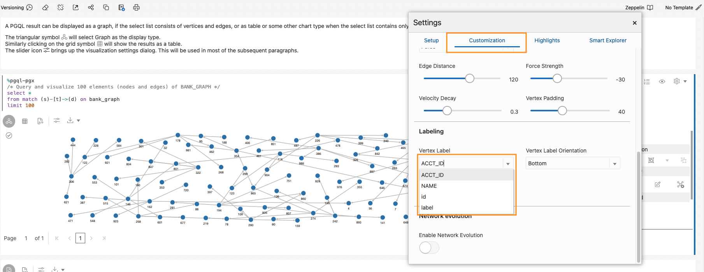
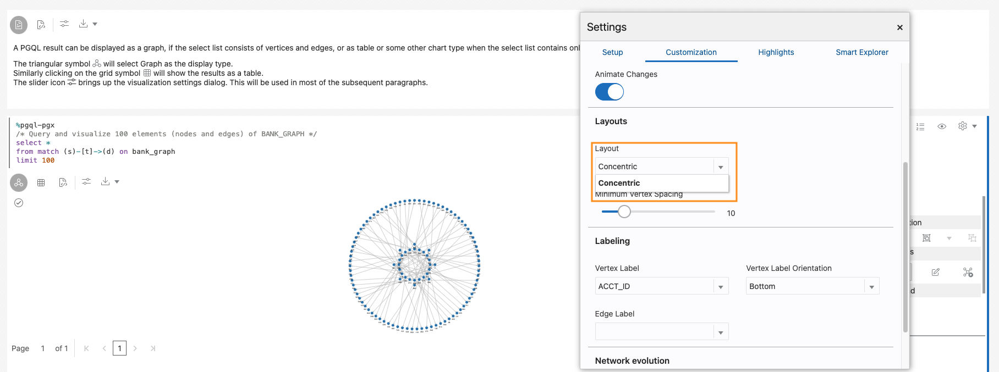

# Graph Studio: PGQL 및 Python을 사용하여 그래프 쿼리, 시각화 및 분석

## 소개

이 실습에서는 노트북의 PGQL 단락에서 새로 생성된 그래프(`bank_graph`)를 질의합니다.

예상 시간: 30분

실습 과정을 빠르게 살펴보려면 아래 비디오를 시청하십시오.

[](youtube:XnE1yw2k5IU)

### 목표

방법 알아보기

*   노트북 임포트
*   노트북 만들기 및 단락 추가
*   Graph Studio 노트북, PGQL 및 Python 단락을 사용하여 그래프 쿼리, 분석 및 시각화

### 필요 조건

*   이 워크샵의 이전 연습 즉, 그래프 사용자가 존재하며 Graph Studio에 로그인했습니다.

## **작업 1:** 노트북 가져오기

아래 지침은 각 노트북 단락을 만들고, 실행하고, 필요에 따라 기본 시각화 설정을 변경하는 방법을 보여줍니다.  
먼저 샘플 노트북을 **가져오고** 작업 2의 각 단계에 대한 관련 단락을 실행합니다.

1.  이 [링크](https://objectstorage.us-ashburn-1.oraclecloud.com/p/2qn9I8UPte_UUOSzGqXrfHw7dSEtzth0eaDxRAI_hfg1KIUJVC1c-S422hMHUTJE/n/c4u04/b/livelabsfiles/o/labfiles/BANK_GRAPH.dsnb)를 사용하여 익스포트된 노트북을 다운로드합니다.
    
2.  **노트북** 메뉴 아이콘을 누른 다음 오른쪽 위에 있는 **임포트** 노트북 아이콘을 누릅니다.
    


3.  다운로드한 파일을 끌어오거나 올바른 폴더로 이동하여 업로드할 파일을 선택합니다.  
    
    
4.  **임포트**를 누릅니다. 
    
5.  가져온 후에는 Graph Studio에서 열어야 합니다.
    


단락을 순서대로 실행하고 아래의 **작업 2**에 설명된 대로 시각화 설정을 실험할 수 있습니다.

## **작업 2:** Graph Studio에서 노트북 생성 및 단락 추가(노트를 임포트하지 않은 경우 선택 사항)

1.  **메모장** 페이지로 이동하여 **생성** 단추를 누릅니다.


2.  노트북 이름을 입력합니다. 선택적으로 설명 및 태그를 입력할 수 있습니다. **생성**을 누릅니다.


3.  단락을 추가하려면 기존 단락의 맨 위 또는 맨 아래를 가리킵니다.


7개의 인터프리터가 있습니다. 각 옵션은 사용자 정의할 수 있는 샘플 구문이 포함된 단락을 만듭니다.


이 실습에서는  **Add Paragraph** 인터프리터를 선택합니다.

## **작업 3:** `BANK_GRAPH` 로드 및 질의와 결과 시각화

> **주:** _아래 각 단계의 설명을 읽은 후 관련 단락을 실행하십시오_. 컴퓨트 환경이 아직 준비되지 않았으며 코드를 실행할 수 없는 경우 백그라운드 작업이 진행 중임을 나타내는 파란색 선이 단락 아래쪽으로 이동합니다.  
> 

1.  먼저 일부 그래프 알고리즘을 실행하므로 그래프가 아직 로드되지 않은 경우 인메모리 그래프 서버에 그래프를 로드합니다.

내장 세션 객체를 사용하여 그래프를 데이터베이스의 메모리로 읽고 로드된 그래프에 대한 핸들인 PgXGraph 객체를 생성하는 첫번째 **%python-pgx** 단락을 실행합니다.

이 단락의 코드 조각은 다음과 같습니다.

    ```
    <copy>%python-pgx
    
    GRAPH_NAME="BANK_GRAPH"
    # try getting the graph from the in-memory graph server
    graph = session.get_graph(GRAPH_NAME);
    # if it does not exist read it into memory
    if (graph == None) :
        session.read_graph_by_name(GRAPH_NAME, "pg_view")
        print("Graph "+ GRAPH_NAME + " successfully loaded")
        graph = session.get_graph(GRAPH_NAME)
    else :
        print("Graph '"+ GRAPH_NAME + "' already loaded")</copy>
    ```
    


2.  이어서 그래프에서 100개의 요소를 query하고 표시하는 단락을 실행합니다.
    
        <copy>%pgql-pgx
        /* Query and visualize 100 elements (nodes and edges) of BANK_GRAPH */
        select *
        from match (s)-[t]->(d) on bank_graph
        limit 100</copy>
        

위의 PGQL 질의는 그래프의 처음 100개 요소를 인출하여 표시합니다.  
MATCH 절은 그래프 패턴을 지정합니다.

*   `(s)`는 소스 노드입니다.
*   `[t]`는 에지입니다.
*   `->`는 모서리 방향을 나타냅니다. 즉, 소스 `s`에서 대상 `d`로 이동합니다.
*   `(d)`는 대상 노드입니다.

**LIMIT** 절은 질의가 반환해야 하는 최대 요소를 지정합니다.

언어의 구문 및 기능에 대한 자세한 내용은 [PGQL 사이트](https://pgql-lang.org) 및 사양을 참조하십시오.  
시작하기 노트북 폴더에는 PGQL에 대한 자습서도 있습니다.

3.  결과에는 시각화 구성요소의 일부 기능이 사용됩니다. `acct_id` 등록정보는 노드(또는 정점) 레이블에 사용되며 그래프는 선택한 그래프 레이아웃 알고리즘을 사용하여 렌더링됩니다.
    
    > **주:** _다음 단계는 실행할 필요가 없습니다. 사용된 단계를 간략히 설명합니다. 시각화를 실험하고 수정할 수 있습니다._
    

시각화 사용자정의에 필요한 단계:

시각화 `settings` 아이콘을 누릅니다.

 시각화 패널의 맨 위에 있는 왼쪽의 네번째 아이콘입니다.


이 `Settings` 대화상자에서 **사용자정의** 탭을 누릅니다. 그런 다음 아래로 스크롤하여 `Labeling`, `Vertex Label` 드롭다운 목록에서 `ACCT_ID`을 선택합니다(모든 시각화에 대해 이 작업을 수행합니다).



오른쪽 위에 있는 **X**를 눌러 \[설정\] 대화상자를 종료합니다. 결과 시각화는 아래 스크린샷과 유사해야 합니다.

> **주:** 스크린샷에 표시되는 색상 및 레이아웃은 결과의 색상 및 레이아웃과 다를 수 있습니다.


이제 시각화 설정을 다시 열고 **사용자정의** 탭을 누른 다음 레이아웃 드롭다운 목록에서 다른 레이아웃(**동심**)을 선택합니다. Settings(설정) 대화 상자를 종료합니다.



4.  Query에서 바인드 파라미터를 사용하는 방법을 보여줍니다. 계정 ID 값은 런타임 시 입력됩니다. 계정 ID로 **534**를 입력하고 단락을 실행합니다.
    
        <copy>%pgql-pgx
        /* Check if there are any circular payment chains of between 1 and 5 hops starting from the user-supplied account # */
        SELECT v,e,v2
        FROM MATCH ANY (a)-[:TRANSFERS]->{1,5}(b) ON bank_graph ONE ROW PER STEP (v,e,v2)
        WHERE a.acct_id=${account_id} AND id(a) = id(b)</copy>
        


5.  다음으로 PGQL을 사용하여 전송 수 측면에서 상위 10개 계정을 찾겠습니다.  
    PGQL에는 노드의 수신 및 송신 모서리 수를 반환하는 내장 함수 `IN_DEGREE` 및 `OUT_DEGREE`이 있습니다. 따라서 이 쿼리에 사용할 수 있습니다.

다음 질의를 사용하여 단락을 실행합니다.

    ```
    <copy>%pgql-pgx
    /* List 10 accounts with the most number of transactions (that is, incoming + outgoing edges) */
    SELECT a.acct_id, (in_degree(a) + out_degree(a)) AS num_transactions
    FROM MATCH (a) ON bank_graph
    ORDER BY num_transactions DESC
    LIMIT 10</copy>
    ```
    

뷰를 table로 변경합니다.


**934** 및 **387** 계정이 목록에 표시됩니다.

6.  이제 계정 **934**에서 시작되고 종료되는 **순환** 전송이 있는지 확인합니다. **\[:TRANSFERS\]->{4}**로 지정된 **4개와 동일한 홉 수**로 시작합니다. **단계당 한 행**을 사용하면 원의 모든 정점을 볼 수 있습니다.

다음 query를 실행합니다.

    ```
    <copy>%pgql-pgx
    /* Check if there are any circular payment chains of length 4 from acct 934 */
    SELECT v,e,v2
    FROM MATCH ALL (a)-[:TRANSFERS]->{4}(b) ON bank_graph ONE ROW PER STEP (v,e,v2)
    WHERE a.acct_id=934 AND id(a) = id(b)
    LIMIT 100</copy>
    ```
    

> **주:** _다음 단계는 실행할 필요가 없습니다. 사용된 단계를 간략히 설명합니다. 시각화를 실험하고 수정할 수 있습니다._

시각화 사용자정의에 필요한 단계:  
이 `Settings` 대화상자에서 **하이라이트** 탭을 누릅니다.


**ACCT\_ID = 934** 조건, **size = 3.4X** 및 **color = red**를 시각 효과로 사용하여 새 강조 표시를 추가합니다. 오른쪽 위에 있는 **X**를 눌러 \[설정\] 대화상자를 종료합니다.


원을 끌어 시각화를 정렬합니다.


여기서 `/:TRANSFERS{4}/`는 [접근성 경로 표현식](https://pgql-lang.org/spec/1.3/#reachability)입니다. 경로 존재 여부만 테스트합니다.  
`:TRANSFERS`는 경로의 모든 가장자리에 `TRANSFERS` 레이블이 있어야 함을 지정합니다.  
`{4}`는 정확히 3개의 홉의 경로 길이를 지정합니다.

계정 **934**에서 시작되고 끝나는 원 길이가 **3**입니다.

7.  **5**개의 홉을 선택할 경우 위 질의를 변경하여 원 수를 확인할 수 있습니다.  
    다음 쿼리를 실행합니다.
    
        <copy>%pgql-pgx
        /* Check if there are any circular payment chains of length 5 from acct 934 */
        SELECT v,e,v2
        FROM MATCH ALL (a)-[:TRANSFERS]->{5}(b) ON bank_graph ONE ROW PER STEP (v,e,v2)
        WHERE a.acct_id=934 AND id(a) = id(b)
        LIMIT 100</copy>
        


**934**로 시작하고 끝나는 순환 지불 체인의 수는 해당 계정을 의심스럽게 만듭니다.

8.  다른 알고리즘인 **PageRank** 그래프 알고리즘을 사용하여 조사를 계속할 수 있습니다. **%python-pgx** 단락을 사용하면 python 코드 조각을 실행할 수 있습니다. Python API를 사용하여 **PageRank** 알고리즘을 실행합니다. 아래의 코드 조각은 인메모리 그래프 서버에 로드된 BANK\_GRAPH에 대한 핸들을 포함하는 PgxGraph 객체를 생성합니다. 그런 다음 내장 **analyst** python 객체를 사용하여 PageRank 알고리즘을 실행합니다. **session** 및 **analyst** 객체는 인메모리 그래프 서버를 인스턴스화하고 노트북을 열 때 만들어집니다.

다음 코드 조각을 포함하는 단락을 실행합니다.

    ```
    <copy>%python-pgx
    graph = session.get_graph("BANK_GRAPH")
    analyst.pagerank(graph);</copy>
    ```
    


9.  이제 **PageRank** 값이 높은 계정을 찾기 위해 PageRank 값을 내림차순으로 나열합니다.  
    높은 PageRank 값은 계정이 '중요'임을 나타냅니다. 즉, BANK\_GRAPH 컨텍스트에서 많은 수의 전송이 해당 계정을 통해 전송되었음을 의미합니다. **또는** 계정이 해당 계정을 통해 전송 수가 많은 계정에 연결되어 있습니다.
    
        <copy>%pgql-pgx
        /* List accounts in descending order of pagerank values*/
        SELECT a.acct_id, a.pagerank as pageRank
        FROM MATCH (a) ON bank_graph
        ORDER BY PageRank DESC
        LIMIT 10</copy>
        

뷰를 table로 변경합니다.


10.  **934**가 상위 5에 있습니다. 이 측정항목은 **934**를 통과하는 많은 수의 트랜잭션을 나타냅니다. **387**은 목록 맨 위에 있습니다. 이제 계산된 PageRank 값을 사용하여 PGQL 질의 결과를 시각화해 보겠습니다. 강조 표시를 사용하여 PageRank 값이 높은 계정을 더 큰 원과 빨간색으로 표시합니다. 다음 질의를 사용하여 단락을 실행합니다. 이 질의는 계정 #934부터 시작하는 6홉 지불 체인을 찾습니다.
    
        <copy>%pgql-pgx
        /* Add highlights to symbolize account nodes by PageRank values. This shows that 934 and highlights accounts with high PageRank values that are connected to 934.
        Choose the hierarchical view. */
        SELECT v,e,v2
        FROM MATCH ANY (n)-[:Transfers]->{6}(m) ON bank_graph ONE ROW PER STEP (v,e,v2)
        WHERE n.acct_id = 934
        LIMIT 100</copy>
        

> **주:** _다음 단계는 실행할 필요가 없습니다. 사용된 단계를 간략히 설명합니다. 시각화를 실험하고 수정할 수 있습니다._

시각화 사용자정의에 필요한 단계:

그래프 시각화 레이아웃을 **계층**으로 변경합니다.


**pagerank >= 0.0035**를 조건으로, **size = 3X**를 시각 효과로, **color = red**로 사용하여 새 강조 표시를 추가한 다음 Create를 누릅니다. 오른쪽 위에 있는 **X**를 눌러 \[설정\] 대화상자를 종료합니다.


> **주:** 스크린샷에 표시되는 색상 및 레이아웃은 결과의 색상 및 레이아웃과 다를 수 있습니다.


11.  이제 계정의 **PageRank** 값을 해당 계정을 통해 이동하는 **트랜잭션 수**와 비교해 보겠습니다(이전에 살펴본 내용). 뷰를 테이블로 변경합니다.
    
        <copy>%pgql-pgx
        /* List accounts in descending order of pagerank values*/
        SELECT a.acct_id, a.pagerank as pageRank
        FROM MATCH (a) ON bank_graph
        ORDER BY PageRank DESC
        LIMIT 5</copy>
        

PageRank 값이 있는 테이블을 표시합니다.

    ```
    <copy>%pgql-pgx
    /* List 10 accounts with the most number of transactions (that is, incoming + outgoing edges) */
    SELECT a.acct_id, (in_degree(a) + out_degree(a)) as num_transactions
    FROM MATCH (a) ON bank_graph
    ORDER BY num_transactions DESC
    LIMIT 5</copy>
    ```
    

트랜잭션 수가 포함된 테이블을 표시합니다.

**PageRank**는 현금 흐름 트랜잭션의 보다 복잡한 측정 단위이므로 목록이 동일하지 않습니다.


이미 의심스러운 **934**가 상위 5에 있고 **387**이 상위에 있습니다.

12.  **934**와 **387** 사이의 경로를 살펴보겠습니다. 이러한 경로의 다른 계정도 조사해야 할 수 있습니다.
    
        <copy>%pgql-pgx
        /* Check the shortest path between account 934 and account 387 */
        SELECT v,e,v2
        FROM MATCH SHORTEST (a)-[:TRANSFERS]->+(b) ON bank_graph ONE ROW PER STEP (v,e,v2)
        WHERE a.acct_id=934 AND b.acct_id=387</copy>
        


13.  경로를 홉 수별로 오름차순으로 정렬하면 **상위 3** 및 **상위 5** 경로가 됩니다.
    
        <copy>%pgql-pgx
        /* Find the top 3 shortest paths between account 934 and account 387 */
        SELECT v,e,v2
        FROM MATCH TOP 3 SHORTEST (a)-[:TRANSFERS]->+ (b) ON bank_graph ONE ROW PER STEP (v,e,v2)
        WHERE a.acct_id=934 AND b.acct_id=387</copy>
        


    ```
    <copy>%pgql-pgx
    /* Find the top 5 shortest path between account 934 and account 387 */
    SELECT v,e,v2
    FROM MATCH TOP 5 shortest (a)-[:TRANSFERS]->+ (b) ON bank_graph ONE ROW PER STEP (v,e,v2)
    WHERE a.acct_id=934 AND b.acct_id=387</copy>
    ```
    


사기 부서는 이제 **934**와 **387**이 불법 활동에 관여했을 수도 있음을 확인했습니다. **934** 또는 **387** 계정에서 돈을 받은 계정도 체계의 일부였으며, 이 계정에서 돈을 받은 계정도 마찬가지일 수 있습니다. 계정의 "닫기"는 위험이 더 높은 **934** 또는 **387**입니다.

14.  정점 모음(이 경우 **934** 및 **387**)에 대해 _PageRank_ 값을 **상대**로 계산하는 **개인화된 PageRank 알고리즘**을 사용합니다. 우리는 다시 Python API를 사용합니다. 코드 조각은 이전에 얻은 BANK\_GRAPH에 대한 핸들이 포함된 PgxGraph 객체 **graph**를 사용합니다. 내장 분석 python 객체를 사용하여 **Personalized PageRank algorithm** 알고리즘을 호출합니다.
    
        <copy>%python-pgx
        
        vertices = graph.create_vertex_set()
        vertices.add_all([graph.get_vertex("BANK_ACCOUNTS(934)"),graph.get_vertex("BANK_ACCOUNTS(387)")])
        
        analyst.personalized_pagerank(graph, vertices)</copy>
        


    ```
    <copy>%pgql-pgx
    SELECT a.acct_id, a.personalized_pagerank as risk FROM MATCH (a) ON bank_graph
    ORDER BY risk DESC</copy>
    ```
    

뷰를 table로 변경합니다.


**934** 및 **387**은 기본적으로 높은 개인설정 순위 값을 가지며 목록의 다음 계정은 **406**입니다.

15.  계정 **406**의 인접 이웃을 살펴보겠습니다. 계정 **406** 및 해당 이웃을 질의하고 표시하는 단락을 실행합니다.
    
        <copy>%pgql-pgx
        /* show the transactions for acct id 406 */
        SELECT *
        FROM MATCH (v1)-[e1]->(a)-[e2]->(v2) ON bank_graph
        WHERE a.acct_id=406</copy>
        
    
    > **주:** _다음 단계는 실행할 필요가 없습니다. 사용된 단계를 간략히 설명합니다. 시각화를 실험하고 수정할 수 있습니다._
    

시각화 사용자정의에 필요한 단계:

그래프 시각화 레이아웃을 **그리드**로 변경합니다.


> **주:** 스크린샷에 표시되는 색상 및 레이아웃은 결과의 색상 및 레이아웃과 다를 수 있습니다.


16.  다른 알고리즘인 **`ShortestPathHopDist()`** 분석 알고리즘을 사용하여 계정 **934**에 근접하기 때문에 잘못된 작업에 관여할 수 있는 계정을 계산할 수 있습니다. **`ShortestPathHopDist()`**는 **934**와 그래프에 있는 다른 모든 계정 사이의 최소 홉 수를 계산합니다. 계정이 멀리 있는 홉 수가 많을수록 **934**에서 멀어지므로 위험이 낮아집니다. 우리는 다시 Python API를 사용합니다. 코드 조각은 핸들이 포함된 PgxGraph 객체를 이전에 찾은 BANK\_GRAPH에 사용합니다. 내장 분석 python 객체를 사용하여 **`ShortestPathHopDist()`** 알고리즘을 호출합니다. 먼저 계정 **934**에 해당하는 정점 객체를 가져온 다음 알고리즘을 실행합니다.

다음 코드 조각을 포함하는 단락을 실행합니다.

    ```
    <copy>%python-pgx
    vertex = graph.get_vertex("BANK_ACCOUNTS(934)")
    
    analyst.shortest_path_hop_distance(graph, vertex)</copy>
    ```
    


17.  홉 수를 그룹화하여 내림차순으로 정렬할 수 있습니다.
    
        <copy>%pgql-pgx
        SELECT count(a.acct_id), a.hop_dist_distance as hops FROM MATCH (a) ON BANK_GRAPH
        GROUP BY hops
        ORDER BY hops</copy>
        

뷰를 table로 변경합니다.


18.  **934**에서 홉 거리가 2보다 작거나 같은 계정을 나열할 수 있습니다.
    
        <copy>%pgql-pgx
        SELECT a.acct_id, a.hop_dist_distance as hops FROM MATCH (a) ON BANK_GRAPH
        WHERE hops <=2
        ORDER BY hops</copy>
        

뷰를 table로 변경합니다.

        	  
    

이 연습을 마칩니다.

## 확인

*   **작성자** - Jayant Sharma, 제품 관리
*   **공헌자** - Rahul Tasker, Jayant Sharma, 제품 관리
*   **최종 업데이트 기한/일자** - Ramu Murakami Gutierrez, 제품 관리, 2022년 7월