# Graph Studio: Consulte, visualize e analise um gráfico usando PGQL e Python

## Introdução

Neste laboratório, você consultará o gráfico recém-criado (ou seja, `bank_graph`) nos parágrafos PGQL de um notebook.

Tempo Estimado: 30 minutos.

Assista ao vídeo abaixo para uma rápida caminhada pelo laboratório.

[](youtube:XnE1yw2k5IU)

### Objetivos

Saiba como

*   Importar um bloco de notas
*   Criar um notebook e adicionar parágrafos
*   usar notebooks do Graph Studio e parágrafos PGQL e Python para consultar, analisar e visualizar um gráfico.

### Pré-requisitos

*   Laboratórios anteriores deste workshop. Ou seja, o usuário do gráfico existe e você fez log-in no Graph Studio.

## **Tarefa 1:** Importar o notebook

As instruções a seguir mostram como criar cada parágrafo de notebook, executá-lo e alterar as definições de visualização padrão conforme necessário.  
Primeiro **importe** o notebook de amostra e, em seguida, execute o parágrafo relevante para cada etapa da tarefa 2.

1.  Faça download do notebook exportado usando este [link](https://objectstorage.us-ashburn-1.oraclecloud.com/p/2qn9I8UPte_UUOSzGqXrfHw7dSEtzth0eaDxRAI_hfg1KIUJVC1c-S422hMHUTJE/n/c4u04/b/livelabsfiles/o/labfiles/BANK_GRAPH.dsnb)
    
2.  Clique no ícone de menu **Notebooks** e, em seguida, no ícone de notebook **Importar** no canto superior direito.
    

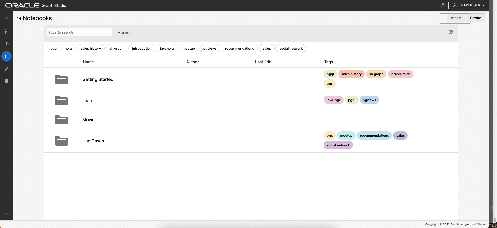

3.  Arraste o arquivo baixado ou navegue até a pasta correta e selecione-o para upload.  
    
    
4.  Clique em **Importar**. 
    
5.  Uma vez importado, ele deve ser aberto no Graph Studio.
    

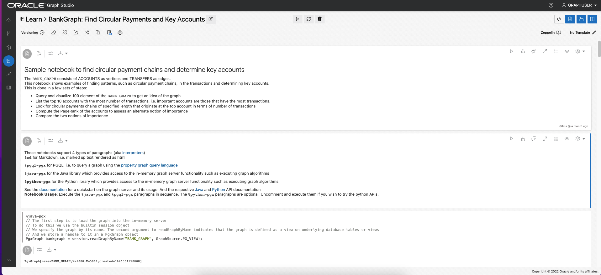

Você pode executar os parágrafos em sequência e experimentar as definições de visualizações conforme descrito na **Tarefa 2** abaixo.

## **Tarefa 2:** Criar um Notebook no Graph Studio e Adicionar um Parágrafo (OPTIONAL se você não tiver importado o notebook)

1.  Vá para a página **Notebooks** e clique no botão **Criar**.

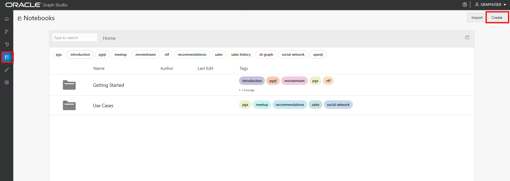

2.  Informe o Nome do notebook. Opcionalmente, você pode informar Descrição e Tags. Clique em **Criar**.

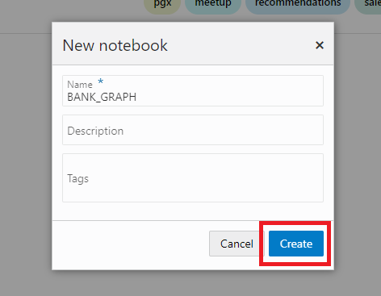

3.  Para adicionar um parágrafo, passe o mouse sobre a parte superior ou inferior de um parágrafo existente.


Existem 7 intérpretes diferentes. Cada opção cria um parágrafo com uma sintaxe de amostra que pode ser personalizada.


Neste laboratório, selecionaremos o interpretador  **Adicionar Parágrafo**.

## **Tarefa 3:** Carregar e Consultar o `BANK_GRAPH` e visualizar os resultados

> **Observação:** _Execute o parágrafo relevante após ler a descrição em cada uma das etapas abaixo_. Se o ambiente de computação ainda não estiver pronto e o código não puder ser executado, você verá uma linha azul se movendo pela parte inferior do parágrafo para indicar que uma tarefa em segundo plano está em andamento.  
> 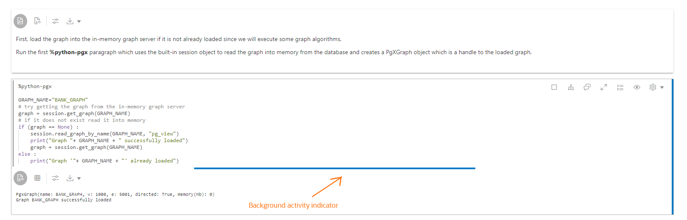

1.  Primeiro, carregue o gráfico no servidor gráfico na memória se ele ainda não estiver carregado, pois executaremos alguns algoritmos de gráfico.

Execute o primeiro parágrafo **%python-pgx** que usa o objeto de sessão incorporado para ler o gráfico na memória do banco de dados e cria um objeto PgXGraph que é um identificador para o gráfico carregado.

O trecho de código nesse parágrafo é:

    ```
    <copy>%python-pgx
    
    GRAPH_NAME="BANK_GRAPH"
    # try getting the graph from the in-memory graph server
    graph = session.get_graph(GRAPH_NAME);
    # if it does not exist read it into memory
    if (graph == None) :
        session.read_graph_by_name(GRAPH_NAME, "pg_view")
        print("Graph "+ GRAPH_NAME + " successfully loaded")
        graph = session.get_graph(GRAPH_NAME)
    else :
        print("Graph '"+ GRAPH_NAME + "' already loaded")</copy>
    ```
    


2.  Em seguida, execute o parágrafo que consulta e exibe 100 elementos do gráfico.
    
        <copy>%pgql-pgx
        /* Query and visualize 100 elements (nodes and edges) of BANK_GRAPH */
        select *
        from match (s)-[t]->(d) on bank_graph
        limit 100</copy>
        

A consulta PGQL acima extrai os primeiros 100 elementos do gráfico e os exibe.  
A cláusula MATCH especifica um padrão de gráfico.

*   `(s)` é o nó de origem
*   `[t]` é uma borda
*   `->` indica a direção da borda, ou seja, da origem `s` a um destino `d`
*   `(d)` é o nó de destino

A cláusula **LIMIT** especifica o máximo de elementos que a consulta deve retornar.

Consulte o [site do PGQL](https://pgql-lang.org) e a especificação para obter mais detalhes sobre a sintaxe e os recursos do idioma.  
A pasta de notebook Conceitos Básicos também tem um tutorial sobre PGQL.

3.  O resultado utiliza alguns recursos do componente de visualização. A propriedade `acct_id` é usada para os rótulos de nó (ou vértice) e o gráfico é renderizado usando um algoritmo de layout de gráfico selecionado.
    
    > **Observação:** _Você não precisa executar as etapas a seguir. Eles apenas descrevem as etapas usadas. Sinta-se livre para experimentar e modificar as visualizações._
    

Etapas necessárias para personalizar a visualização:

Clique no ícone de visualização `settings`

 (o quarto ícone da esquerda na parte superior do painel de visualização).

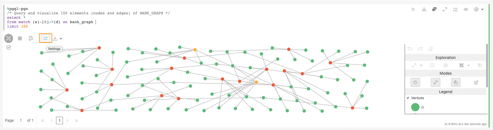

Nessa caixa de diálogo `Settings`, clique na guia **Personalização**. Em seguida, role para baixo e escolha `ACCT_ID` na lista suspensa `Labeling`, `Vertex Label` (fazemos isso para cada visualização).


Clique no **X** no canto superior direito para sair da caixa de diálogo Definições. A visualização resultante deve ser semelhante à captura de tela abaixo.

> **Observação:** as cores e o layout mostrados nas capturas de tela podem ser diferentes daqueles nos resultados.


Agora abra as definições de visualização novamente, clique na guia **Personalização** e escolha outro layout (**Concentrado**) na lista drop-down Layout. Saia da caixa de diálogo Definições.


4.  Isso mostra o uso de parâmetros de bind em uma consulta. O valor do id da conta é informado no runtime. Informe **534** como o id da conta e execute o parágrafo.
    
        <copy>%pgql-pgx
        /* Check if there are any circular payment chains of between 1 and 5 hops starting from the user-supplied account # */
        SELECT v,e,v2
        FROM MATCH ANY (a)-[:TRANSFERS]->{1,5}(b) ON bank_graph ONE ROW PER STEP (v,e,v2)
        WHERE a.acct_id=${account_id} AND id(a) = id(b)</copy>
        

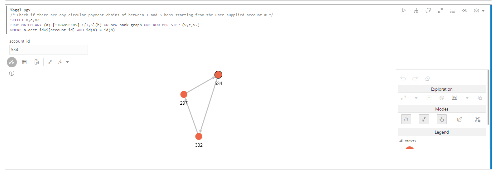

5.  Em seguida, vamos usar o PGQL para encontrar as 10 principais contas em termos de número de transferências.  
    O PGQL tem funções incorporadas `IN_DEGREE` e `OUT_DEGREE`, que retornam o número de bordas de entrada e saída de um nó. Então, podemos usá-los nesta consulta.

Execute o parágrafo com a seguinte consulta.

    ```
    <copy>%pgql-pgx
    /* List 10 accounts with the most number of transactions (that is, incoming + outgoing edges) */
    SELECT a.acct_id, (in_degree(a) + out_degree(a)) AS num_transactions
    FROM MATCH (a) ON bank_graph
    ORDER BY num_transactions DESC
    LIMIT 10</copy>
    ```
    

Altere a view para tabela.

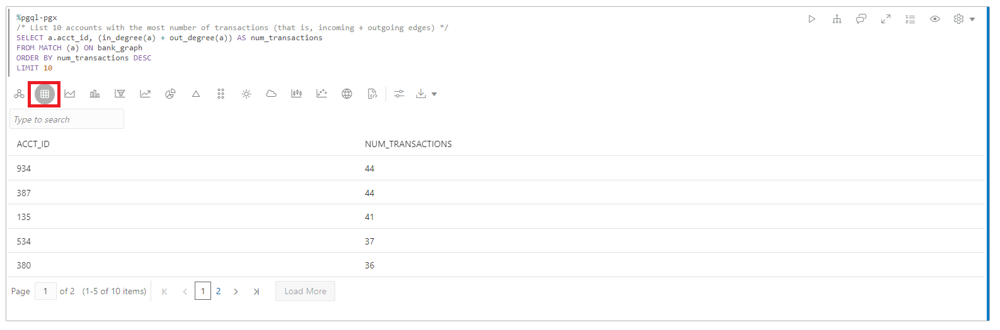

Vemos que as contas **934** e **387** estão no topo da lista.

6.  Agora verifique se há transferências **circulares** originadas e encerradas na conta **934**. Começamos com o **número de hops igual a 4**, conforme especificado como **\[:TRANSFERS\]->{4}**. **UMA LINHA POR PASSO** nos permite ver todos os vértices nos círculos.

Execute a consulta a seguir.

    ```
    <copy>%pgql-pgx
    /* Check if there are any circular payment chains of length 4 from acct 934 */
    SELECT v,e,v2
    FROM MATCH ALL (a)-[:TRANSFERS]->{4}(b) ON bank_graph ONE ROW PER STEP (v,e,v2)
    WHERE a.acct_id=934 AND id(a) = id(b)
    LIMIT 100</copy>
    ```
    

> **Observação:** _Você não precisa executar as etapas a seguir. Eles apenas descrevem as etapas usadas. Sinta-se livre para experimentar e modificar as visualizações._

Etapas necessárias para personalizar a visualização:  
Nesta caixa de diálogo `Settings`, clique na guia **Destaques**.


Adicione um novo destaque com **ACCT\_ID = 934** como condição, **size = 3.4X** e **color = red** como efeito visual. Clique no **X** no canto superior direito para sair da caixa de diálogo Definições.


arraste os círculos para organizar a visualização.


Aqui, `/:TRANSFERS{4}/` é uma [expressão de caminho de acessibilidade](https://pgql-lang.org/spec/1.3/#reachability). Ele só testa a existência do caminho.  
`:TRANSFERS` especifica que todas as bordas no caminho devem ter o label `TRANSFERS`.  
Enquanto `{4}` especifica um comprimento de caminho de exatamente 3 pulos.

Vemos que há círculos com **3** pulos de comprimento que começam e terminam na conta **934**.

7.  Podemos alterar a consulta acima para verificar qual é o número de círculos se escolhermos **5** hops.  
    Execute a consulta a seguir.
    
        <copy>%pgql-pgx
        /* Check if there are any circular payment chains of length 5 from acct 934 */
        SELECT v,e,v2
        FROM MATCH ALL (a)-[:TRANSFERS]->{5}(b) ON bank_graph ONE ROW PER STEP (v,e,v2)
        WHERE a.acct_id=934 AND id(a) = id(b)
        LIMIT 100</copy>
        


O número de cadeias de pagamento circulares que começam e terminam em **934** faz com que essa conta pareça suspeita.

8.  Vamos continuar nossa investigação usando outro algoritmo, o algoritmo de gráfico **PageRank**. Um parágrafo **%python-pgx** permite executar trechos de código python. Usaremos a API Python para executar o algoritmo **PageRank**. O trecho de código abaixo cria um objeto PgxGraph contendo um identificador para o BANK\_GRAPH carregado no servidor de gráficos na memória. Em seguida, ele executa o algoritmo PageRank usando o objeto python **analyst** incorporado. Os objetos **sessão** e **analista** são criados quando o servidor gráfico na memória é instanciado e quando um notebook é aberto.

Execute o parágrafo que contém o trecho de código a seguir.

    ```
    <copy>%python-pgx
    graph = session.get_graph("BANK_GRAPH")
    analyst.pagerank(graph);</copy>
    ```
    


9.  Agora vamos listar os valores PageRank em ordem decrescente para localizar as contas com altos valores **PageRank**.  
    Um valor alto de PageRank indica que essa conta é 'importante', o que no contexto de BANK\_GRAPH significa que um número alto de transferências passou por essa conta, **ou** a conta está conectada a contas que têm um número alto de transferências que passam por elas.
    
        <copy>%pgql-pgx
        /* List accounts in descending order of pagerank values*/
        SELECT a.acct_id, a.pagerank as pageRank
        FROM MATCH (a) ON bank_graph
        ORDER BY PageRank DESC
        LIMIT 10</copy>
        

Altere a view para tabela.


10.  Vemos que **934** está no top 5. Essa métrica também indica que um grande número de transações flui por **934**. **387** está na parte superior da lista. Agora vamos usar o valor PageRank calculado na visualização do resultado de uma consulta PGQL. Usamos destaques para exibir as contas com um valor PageRank alto com círculos maiores e cores vermelhas. Execute o parágrafo com a seguinte consulta, que localiza as cadeias de pagamento de 6 saltos a partir da conta no 934.
    
        <copy>%pgql-pgx
        /* Add highlights to symbolize account nodes by PageRank values. This shows that 934 and highlights accounts with high PageRank values that are connected to 934.
        Choose the hierarchical view. */
        SELECT v,e,v2
        FROM MATCH ANY (n)-[:Transfers]->{6}(m) ON bank_graph ONE ROW PER STEP (v,e,v2)
        WHERE n.acct_id = 934
        LIMIT 100</copy>
        

> **Observação:** _Você não precisa executar as etapas a seguir. Eles apenas descrevem as etapas usadas. Sinta-se livre para experimentar e modificar as visualizações._

Etapas necessárias para personalizar a visualização:

Altere o layout da visualização de gráfico para **Hierárquico**.


Adicione um novo destaque com **pagerank >= 0.0035** como condição, **size = 3X** como efeito visual e **color = red**, depois clique em Create. Clique no **X** no canto superior direito para sair da caixa de diálogo Definições.

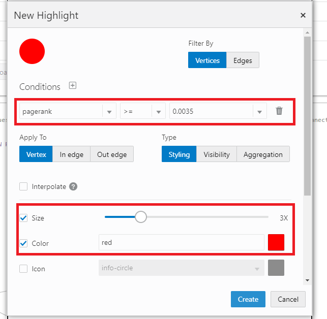

> **Observação:** as cores e o layout mostrados nas capturas de tela podem ser diferentes daqueles nos resultados.


11.  Agora vamos comparar os valores de **PageRank** das contas com o **número de transações** que passam por essas contas (que analisamos anteriormente). Altere a exibição para tabela.
    
        <copy>%pgql-pgx
        /* List accounts in descending order of pagerank values*/
        SELECT a.acct_id, a.pagerank as pageRank
        FROM MATCH (a) ON bank_graph
        ORDER BY PageRank DESC
        LIMIT 5</copy>
        

Para exibir uma tabela com os valores PageRank.

    ```
    <copy>%pgql-pgx
    /* List 10 accounts with the most number of transactions (that is, incoming + outgoing edges) */
    SELECT a.acct_id, (in_degree(a) + out_degree(a)) as num_transactions
    FROM MATCH (a) ON bank_graph
    ORDER BY num_transactions DESC
    LIMIT 5</copy>
    ```
    

Para exibir uma tabela com o número de transações.

As listas não são idênticas porque **PageRank** é uma medida mais complexa de transações de fluxo de caixa.

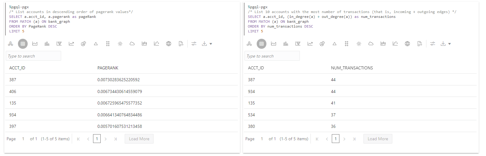

**934,** que já achamos suspeito, está no top 5, e **387** está no topo.

12.  Vamos examinar os caminhos que existem entre **934** e **387**. Outras contas nesses caminhos podem ter que ser investigadas também.
    
        <copy>%pgql-pgx
        /* Check the shortest path between account 934 and account 387 */
        SELECT v,e,v2
        FROM MATCH SHORTEST (a)-[:TRANSFERS]->+(b) ON bank_graph ONE ROW PER STEP (v,e,v2)
        WHERE a.acct_id=934 AND b.acct_id=387</copy>
        

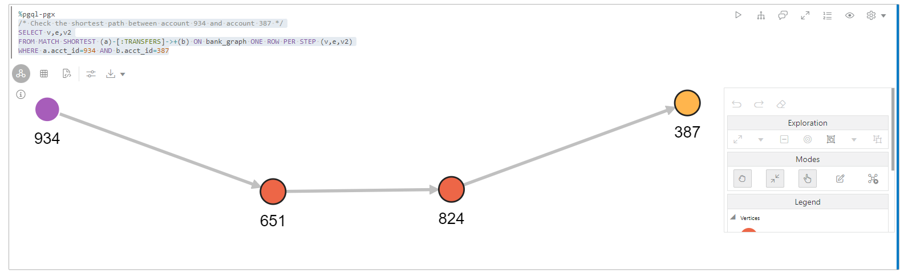

13.  Se você organizar os caminhos em ordem crescente por número de hops, esses serão os caminhos **3 principais** e **5 principais**.
    
        <copy>%pgql-pgx
        /* Find the top 3 shortest paths between account 934 and account 387 */
        SELECT v,e,v2
        FROM MATCH TOP 3 SHORTEST (a)-[:TRANSFERS]->+ (b) ON bank_graph ONE ROW PER STEP (v,e,v2)
        WHERE a.acct_id=934 AND b.acct_id=387</copy>
        


    ```
    <copy>%pgql-pgx
    /* Find the top 5 shortest path between account 934 and account 387 */
    SELECT v,e,v2
    FROM MATCH TOP 5 shortest (a)-[:TRANSFERS]->+ (b) ON bank_graph ONE ROW PER STEP (v,e,v2)
    WHERE a.acct_id=934 AND b.acct_id=387</copy>
    ```
    


O departamento de fraude também confirmou que **934** e **387** podem estar envolvidos em atividades ilegais. É provável que contas que receberam dinheiro da conta **934** ou **387** também façam parte do esquema, e também talvez as contas que receberam dinheiro delas também. Quanto mais próxima for uma conta, maior será o risco em **934** ou **387**.

14.  Usamos o **algoritmo PageRank Personalizado**, que calcula os valores **PageRank** _relativos_ a uma coleção de vértices, que nesse caso é **934** e **387**. Usamos a API Python novamente. O trecho de código usa o **gráfico** do objeto PgxGraph que contém um identificador para o BANK\_GRAPH que obtivemos anteriormente. Ele chama o algoritmo **Algoritmo PageRank Personalizado** com o objeto python do analista incorporado.
    
        <copy>%python-pgx
        
        vertices = graph.create_vertex_set()
        vertices.add_all([graph.get_vertex("BANK_ACCOUNTS(934)"),graph.get_vertex("BANK_ACCOUNTS(387)")])
        
        analyst.personalized_pagerank(graph, vertices)</copy>
        

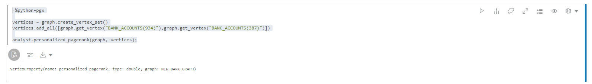

    ```
    <copy>%pgql-pgx
    SELECT a.acct_id, a.personalized_pagerank as risk FROM MATCH (a) ON bank_graph
    ORDER BY risk DESC</copy>
    ```
    

Altere a view para tabela.


**934** e **387** naturalmente têm um valor de classificação personalizado alto, a próxima conta na lista é **406**.

15.  Vejamos os vizinhos imediatos da conta **406**. Execute o parágrafo que consulta e exibe a conta **406** e seus vizinhos.
    
        <copy>%pgql-pgx
        /* show the transactions for acct id 406 */
        SELECT *
        FROM MATCH (v1)-[e1]->(a)-[e2]->(v2) ON bank_graph
        WHERE a.acct_id=406</copy>
        
    
    > **Observação:** _Você não precisa executar as etapas a seguir. Eles apenas descrevem as etapas usadas. Sinta-se livre para experimentar e modificar as visualizações._
    

Etapas necessárias para personalizar a visualização:

Altere o layout da visualização do gráfico para **Grade**.


> **Observação:** as cores e o layout mostrados nas capturas de tela podem ser diferentes daqueles nos resultados.


16.  Podemos usar outro algoritmo, o algoritmo de análise **`ShortestPathHopDist()`**, para calcular quais contas podem estar envolvidas em atividades ilegais por causa de sua proximidade com a conta **934**. **`ShortestPathHopDist()`** calcula o número mínimo de saltos entre **934** e todas as outras contas no gráfico. Quanto maior o número de pulos, mais distante será uma conta de **934** e, portanto, menor será o risco. Usamos a API Python novamente. O trecho de código usa o objeto PgxGraph que contém um identificador para o BANK\_GRAPH que obtivemos anteriormente. Ele chama o algoritmo **`ShortestPathHopDist()`** com o objeto python do analista incorporado. Primeiro, ele obtém o objeto de vértice correspondente à conta **934** e, em seguida, executa o algoritmo.

Execute o parágrafo que contém o trecho de código a seguir.

    ```
    <copy>%python-pgx
    vertex = graph.get_vertex("BANK_ACCOUNTS(934)")
    
    analyst.shortest_path_hop_distance(graph, vertex)</copy>
    ```
    


17.  Podemos agrupar pelo número de saltos e classificá-los em ordem decrescente.
    
        <copy>%pgql-pgx
        SELECT count(a.acct_id), a.hop_dist_distance as hops FROM MATCH (a) ON BANK_GRAPH
        GROUP BY hops
        ORDER BY hops</copy>
        

Altere a view para tabela.

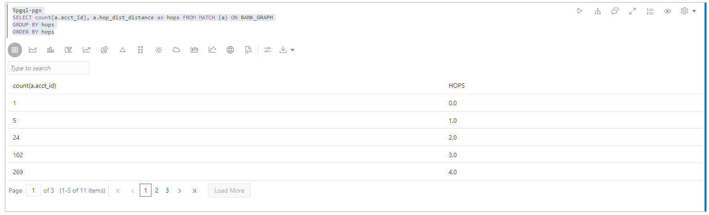

18.  Podemos listar as contas que têm uma distância de salto <=2 de **934**.
    
        <copy>%pgql-pgx
        SELECT a.acct_id, a.hop_dist_distance as hops FROM MATCH (a) ON BANK_GRAPH
        WHERE hops <=2
        ORDER BY hops</copy>
        

Altere a view para tabela.

        	  
    

Isso conclui este laboratório.

## Agradecimentos

*   **Autor** - Jayant Sharma, Gerenciamento de Produtos
*   **Colaboradores** - Rahul Tasker, Jayant Sharma, Gerenciamento de Produtos
*   **Última Atualização em/Data** - Ramu Murakami Gutierrez, Gerenciamento de Produtos, julho de 2022