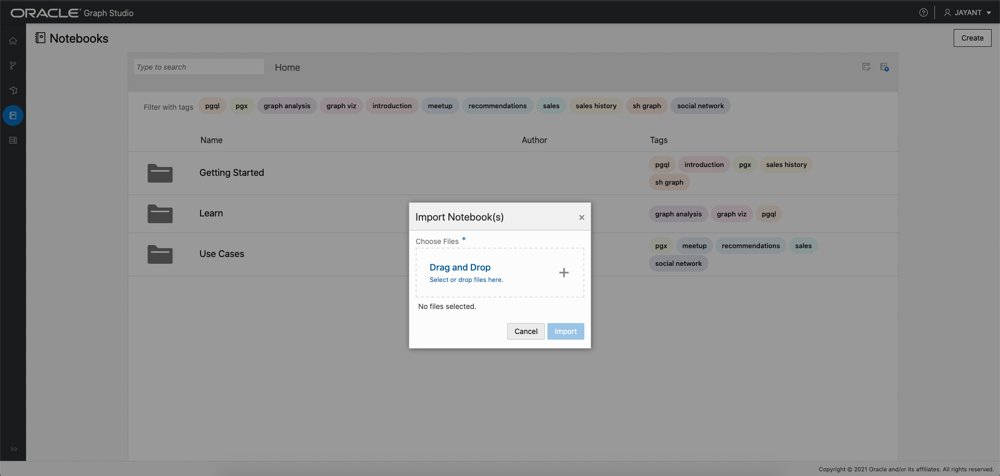
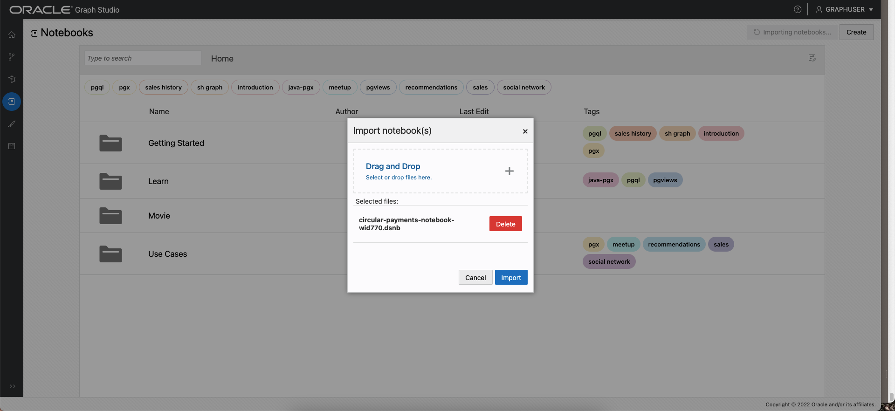
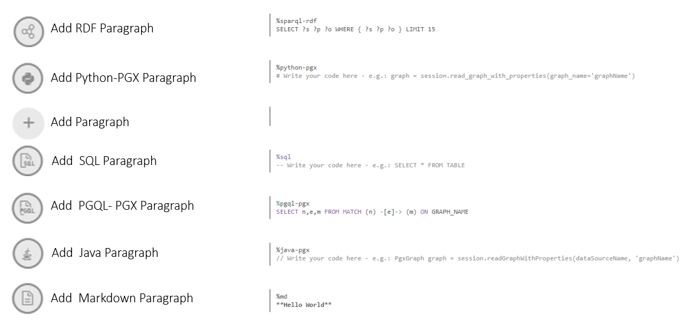
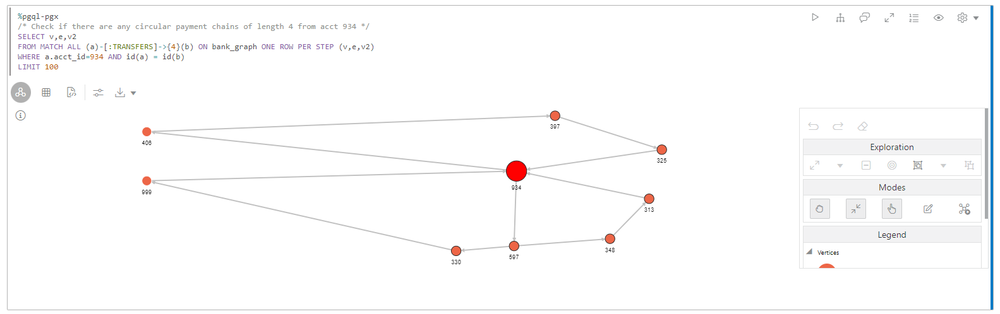
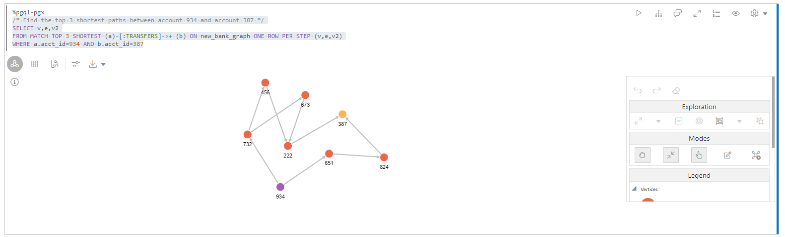

# Graph Studio：使用 PGQL 和 Python 查询、可视化和分析图形

## 简介

在此实验室中，您将查询笔记本的 PGQL 段落中新创建的图形（即 `bank_graph`）。

估计时间：30 分钟。

观看下面的视频，快速浏览实验室。

[](youtube:XnE1yw2k5IU)

### 目标

了解方法

*   导入笔记本
*   创建记事本并添加段落
*   使用 Graph Studio 笔记本、PGQL 和 Python 段落查询、分析和可视化图形。

### 先备条件

*   此研讨会的早期实验室。也就是说，图形用户存在，您已登录到 Graph Studio。

## **任务 1：**导入记事本

下面的说明将说明如何创建每个笔记本段落，执行它，并根据需要更改默认可视化设置。  
首先**导入**示例笔记本，然后针对任务 2 中的每个步骤执行相关段落。

1.  使用此[链接](https://objectstorage.us-ashburn-1.oraclecloud.com/p/2qn9I8UPte_UUOSzGqXrfHw7dSEtzth0eaDxRAI_hfg1KIUJVC1c-S422hMHUTJE/n/c4u04/b/livelabsfiles/o/labfiles/BANK_GRAPH.dsnb)下载导出的记事本
    
2.  单击**记事本**菜单图标，然后单击右上方的**导入**记事本图标。
    


3.  拖动下载的文件或导航到正确的文件夹，然后选择要上载的文件。  
    
    
4.  单击**导入**。 
    
5.  导入后，它应该在 Graph Studio 中打开。
    


您可以按顺序执行段落并使用可视化设置进行实验，如下面的**任务 2** 中所述。

## **任务 2：**在 Graph Studio 中创建记事本并添加段落（如果尚未导入记事本，则为可选）

1.  转到**记事本**页，然后单击**创建**按钮。


2.  输入记事本名称。（可选）您可以输入“说明”和“标记”。单击**创建**。


3.  要添加段落，请将鼠标悬停在现有段落的顶部或底部。


有 7 个不同的口译员。每个选项都使用可定制的示例语法创建一个段落。



在本练习中，我们将选择  **Add Paragraph** 解释器。

## **任务 3：**加载和查询 `BANK_GRAPH` 并可视化结果

> **注：**_阅读以下每个步骤中的说明后执行相关段落_。如果计算环境尚未就绪，并且无法执行代码，则会看到一行蓝色线穿过段落的底部，以指示正在执行后台任务。  
> 

1.  首先，如果尚未加载图形，请将图形加载到内存中图形服务器中，因为我们将执行一些图形算法。

运行第一个 **%python-pgx** 段落，该段使用内置会话对象将图形从数据库读取到内存中，并创建一个 PgXGraph 对象，该对象是已加载图形的句柄。

该段落中的代码段为：

    ```
    <copy>%python-pgx
    
    GRAPH_NAME="BANK_GRAPH"
    # try getting the graph from the in-memory graph server
    graph = session.get_graph(GRAPH_NAME);
    # if it does not exist read it into memory
    if (graph == None) :
        session.read_graph_by_name(GRAPH_NAME, "pg_view")
        print("Graph "+ GRAPH_NAME + " successfully loaded")
        graph = session.get_graph(GRAPH_NAME)
    else :
        print("Graph '"+ GRAPH_NAME + "' already loaded")</copy>
    ```
    


2.  接下来，执行查询并显示图形的 100 个元素的段落。
    
        <copy>%pgql-pgx
        /* Query and visualize 100 elements (nodes and edges) of BANK_GRAPH */
        select *
        from match (s)-[t]->(d) on bank_graph
        limit 100</copy>
        

上面的 PGQL 查询获取图形的前 100 个元素并显示它们。  
MATCH 子句指定图形模式。

*   `(s)` 是源节点
*   `[t]` 是边缘
*   `->` 指示边缘方向，即从源 `s` 到目标 `d`
*   `(d)` 是目标节点

**LIMIT** 子句指定查询应返回的最大元素。

有关该语言的语法和功能的更多详细信息，请参阅 [PGQL 站点](https://pgql-lang.org)和规范。  
“入门”笔记本文件夹还提供了有关 PGQL 的教程。

3.  结果利用了可视化组件的一些功能。`acct_id` 属性用于节点（或顶点）标签，并使用选定的图形布局算法呈现图形。
    
    > **注：**_您不需要执行以下步骤。它们只是概述了使用的步骤。可以随意试验和修改可视化。_
    

定制可视化所需的步骤：

单击可视化 `settings` 图标

 （可视化面板顶部左侧的第四个图标）。


在此 `Settings` 对话框中，单击**定制**选项卡。然后向下滚动并从 `Labeling` 的 `Vertex Label` 下拉列表中选择 `ACCT_ID`（我们针对每个可视化执行此操作）。


单击右上角的 **X** 退出 "Settings"（设置）对话框。生成的可视化应类似于下面的屏幕截图。

> **注：**屏幕截图中显示的颜色和布局可能与结果中的颜色和布局不同。


现在再次打开可视化设置，单击**自定义**选项卡，然后从“布局”下拉列表中选择其他布局 ( **集中** )。退出 ”Settings"（设置）对话框。


4.  这显示了在查询中使用绑定参数。在运行时输入账户 ID 值。输入 **534** 作为帐户 ID，然后执行段落。
    
        <copy>%pgql-pgx
        /* Check if there are any circular payment chains of between 1 and 5 hops starting from the user-supplied account # */
        SELECT v,e,v2
        FROM MATCH ANY (a)-[:TRANSFERS]->{1,5}(b) ON bank_graph ONE ROW PER STEP (v,e,v2)
        WHERE a.acct_id=${account_id} AND id(a) = id(b)</copy>
        


5.  接下来，让我们使用 PGQL 来查找转移数量的前 10 个帐户。  
    PGQL 具有内置函数 `IN_DEGREE` 和 `OUT_DEGREE`，它们返回节点的传入和传出边缘数。因此，我们可以在此查询中使用它们。

使用下面的查询运行段落。

    ```
    <copy>%pgql-pgx
    /* List 10 accounts with the most number of transactions (that is, incoming + outgoing edges) */
    SELECT a.acct_id, (in_degree(a) + out_degree(a)) AS num_transactions
    FROM MATCH (a) ON bank_graph
    ORDER BY num_transactions DESC
    LIMIT 10</copy>
    ```
    

将视图更改为表。


我们看到帐户 **934** 和 **387** 在列表中居高不下。

6.  现在检查帐户 **934** 是否有任何源和终止的**循环**传输。我们从指定为 **\[：TRANSFERS\]->{4}** 的 **number of hops equals 4** 开始。 **ONE ROW PER STEP** 可用于查看圆圈中的所有顶点。

执行以下查询。

    ```
    <copy>%pgql-pgx
    /* Check if there are any circular payment chains of length 4 from acct 934 */
    SELECT v,e,v2
    FROM MATCH ALL (a)-[:TRANSFERS]->{4}(b) ON bank_graph ONE ROW PER STEP (v,e,v2)
    WHERE a.acct_id=934 AND id(a) = id(b)
    LIMIT 100</copy>
    ```
    

> **注：**_您不需要执行以下步骤。它们只是概述了使用的步骤。可以随意试验和修改可视化。_

定制可视化所需的步骤：  
在此 `Settings` 对话框中，单击**突出显示**选项卡。


添加以 **ACCT\_ID = 934** 作为条件的新突出显示， **size = 3.4X** 和 **color = red** 作为视觉效果。单击右上角的 **X** 退出 "Settings"（设置）对话框。


拖动圆圈以排列可视化。



此处 `/:TRANSFERS{4}/` 是[可访问性路径表达式](https://pgql-lang.org/spec/1.3/#reachability)。它仅测试路径是否存在。  
`:TRANSFERS` 指定路径中的所有边缘都必须具有标签 `TRANSFERS`。  
而 `{4}` 指定正好 3 个跃点的路径长度。

我们看到在帐户 **934** 中有圆圈 **3** 个跃点。

7.  如果选择 **5** 个跃点，可以更改以上查询来检查圆圈数。  
    执行以下查询。
    
        <copy>%pgql-pgx
        /* Check if there are any circular payment chains of length 5 from acct 934 */
        SELECT v,e,v2
        FROM MATCH ALL (a)-[:TRANSFERS]->{5}(b) ON bank_graph ONE ROW PER STEP (v,e,v2)
        WHERE a.acct_id=934 AND id(a) = id(b)
        LIMIT 100</copy>
        


在 **934** 中开始和结束的循环付款链数量使该账户看起来可疑。

8.  让我们使用另一个算法 **PageRank** 图形算法继续调查。 **%python-pgx** 段落允许您执行 python 代码片段。我们将使用 Python API 执行 **PageRank** 算法。以下代码片段将创建一个 PgxGraph 对象，其中包含装入内存中图形服务器的 BANK\_GRAPH 的句柄。然后，它使用内置 **analyst** python 对象执行 PageRank 算法。 **session** 和 **analyst** 对象是在实例化内存中图形服务器以及打开记事本时创建的。

执行包含以下代码片段的段落。

    ```
    <copy>%python-pgx
    graph = session.get_graph("BANK_GRAPH")
    analyst.pagerank(graph);</copy>
    ```
    


9.  现在，让我们按降序列出 PageRank 值，以查找具有高 **PageRank** 值的帐户。  
    较高的 PageRank 值表示帐户“重要”，在 BANK\_GRAPH 的上下文中，这意味着大量传输已通过该帐户，**或**该帐户连接到具有大量传输流过的帐户。
    
        <copy>%pgql-pgx
        /* List accounts in descending order of pagerank values*/
        SELECT a.acct_id, a.pagerank as pageRank
        FROM MATCH (a) ON bank_graph
        ORDER BY PageRank DESC
        LIMIT 10</copy>
        

将视图更改为表。


10.  我们看到 **934** 位于前 5 位。此度量还指示大量事务处理流经 **934** 。 **387** 位于列表的顶部。现在，我们使用计算的 PageRank 值来可视化 PGQL 查询的结果。我们使用突出显示来显示具有高 PageRank 值且圆圈较大且颜色为红色的帐户。使用以下查询执行段落，该查询从帐户 #934 开始查找 6 跳付款链。
    
        <copy>%pgql-pgx
        /* Add highlights to symbolize account nodes by PageRank values. This shows that 934 and highlights accounts with high PageRank values that are connected to 934.
        Choose the hierarchical view. */
        SELECT v,e,v2
        FROM MATCH ANY (n)-[:Transfers]->{6}(m) ON bank_graph ONE ROW PER STEP (v,e,v2)
        WHERE n.acct_id = 934
        LIMIT 100</copy>
        

> **注：**_您不需要执行以下步骤。它们只是概述了使用的步骤。可以随意试验和修改可视化。_

定制可视化所需的步骤：

将图形可视化布局更改为**分层**。


添加以 **pagerank >= 0.0035** 作为条件的新突出显示，以 **size = 3X** 作为视觉效果，以 **color = red** 作为视觉效果，然后单击 "Create"。单击右上角的 **X** 退出 "Settings"（设置）对话框。


> **注：**屏幕截图中显示的颜色和布局可能与结果中的颜色和布局不同。


11.  现在，我们将帐户的 **PageRank** 值与通过这些帐户的**事务处理数**进行比较（我们之前已查看过）。将视图更改为表。
    
        <copy>%pgql-pgx
        /* List accounts in descending order of pagerank values*/
        SELECT a.acct_id, a.pagerank as pageRank
        FROM MATCH (a) ON bank_graph
        ORDER BY PageRank DESC
        LIMIT 5</copy>
        

显示包含 PageRank 值的表。

    ```
    <copy>%pgql-pgx
    /* List 10 accounts with the most number of transactions (that is, incoming + outgoing edges) */
    SELECT a.acct_id, (in_degree(a) + out_degree(a)) as num_transactions
    FROM MATCH (a) ON bank_graph
    ORDER BY num_transactions DESC
    LIMIT 5</copy>
    ```
    

显示包含事务处理数的表。

这些列表不相同，因为 **PageRank** 是更复杂的现金流事务处理度量。


我们已经认为可疑的 **934** 在前 5 位， **387** 在顶部。

12.  让我们检查 **934** 和 **387** 之间存在的路径。这些路径上的其他帐户可能也必须进行调查。
    
        <copy>%pgql-pgx
        /* Check the shortest path between account 934 and account 387 */
        SELECT v,e,v2
        FROM MATCH SHORTEST (a)-[:TRANSFERS]->+(b) ON bank_graph ONE ROW PER STEP (v,e,v2)
        WHERE a.acct_id=934 AND b.acct_id=387</copy>
        


13.  如果按跃点数升序排列路径，则这些路径是**前 3 个**和**前 5 个**路径。
    
        <copy>%pgql-pgx
        /* Find the top 3 shortest paths between account 934 and account 387 */
        SELECT v,e,v2
        FROM MATCH TOP 3 SHORTEST (a)-[:TRANSFERS]->+ (b) ON bank_graph ONE ROW PER STEP (v,e,v2)
        WHERE a.acct_id=934 AND b.acct_id=387</copy>
        



    ```
    <copy>%pgql-pgx
    /* Find the top 5 shortest path between account 934 and account 387 */
    SELECT v,e,v2
    FROM MATCH TOP 5 shortest (a)-[:TRANSFERS]->+ (b) ON bank_graph ONE ROW PER STEP (v,e,v2)
    WHERE a.acct_id=934 AND b.acct_id=387</copy>
    ```
    


欺诈部门现在还确认 **934** 和 **387** 可能参与了非法活动。机会是，从帐户 **934** 或 **387** 收到资金的帐户也是该方案的一部分，也可能从这些帐户收到资金。账户的“更接近”风险越高，风险就越高。 **934** 或 **387**

14.  我们使用 **Personalized PageRank algorithm** ，该算法将 **PageRank** 值_相对_计算为一组顶点，在本例中为 **934** 和 **387** 。我们再次使用 Python API。代码片段使用 PgxGraph 对象 **graph** ，其中包含我们之前获取的 BANK\_GRAPH 的句柄。它使用内置分析器 python 对象调用 **Personalized PageRank algorithm** 算法。
    
        <copy>%python-pgx
        
        vertices = graph.create_vertex_set()
        vertices.add_all([graph.get_vertex("BANK_ACCOUNTS(934)"),graph.get_vertex("BANK_ACCOUNTS(387)")])
        
        analyst.personalized_pagerank(graph, vertices)</copy>
        


    ```
    <copy>%pgql-pgx
    SELECT a.acct_id, a.personalized_pagerank as risk FROM MATCH (a) ON bank_graph
    ORDER BY risk DESC</copy>
    ```
    

将视图更改为表。


**934** 和 **387** 自然具有高度个性化的等级值，列表中的下一个帐户为 **406** 。

15.  让我们看看帐户 **406** 的直接邻居。执行查询并显示帐户 **406** 及其相邻项的段落。
    
        <copy>%pgql-pgx
        /* show the transactions for acct id 406 */
        SELECT *
        FROM MATCH (v1)-[e1]->(a)-[e2]->(v2) ON bank_graph
        WHERE a.acct_id=406</copy>
        
    
    > **注：**_您不需要执行以下步骤。它们只是概述了使用的步骤。可以随意试验和修改可视化。_
    

定制可视化所需的步骤：

将图形可视化布局更改为**网格**。


> **注：**屏幕截图中显示的颜色和布局可能与结果中的颜色和布局不同。


16.  我们可以使用另一个算法 **`ShortestPathHopDist()`** 分析算法来计算哪些帐户由于靠近帐户 **934** 而可能参与非法活动。**`ShortestPathHopDist()`** 计算 **934** 和图形中其他每个帐户之间的最小跃点数。账户越远跳跃的次数越多，从 **934** 开始，从而降低风险。我们再次使用 Python API。代码片段使用包含之前获取的 BANK\_GRAPH 句柄的 PgxGraph 对象。它使用内置分析器 python 对象调用 **`ShortestPathHopDist()`** 算法。它首先获取与帐户 **934** 对应的顶点对象，然后执行算法。

执行包含以下代码片段的段落。

    ```
    <copy>%python-pgx
    vertex = graph.get_vertex("BANK_ACCOUNTS(934)")
    
    analyst.shortest_path_hop_distance(graph, vertex)</copy>
    ```
    


17.  我们可以按跃点数对跃点数进行分组，然后按降序对跃点数进行排名。
    
        <copy>%pgql-pgx
        SELECT count(a.acct_id), a.hop_dist_distance as hops FROM MATCH (a) ON BANK_GRAPH
        GROUP BY hops
        ORDER BY hops</copy>
        

将视图更改为表。


18.  可以列出跃点距离小于等于 **934** 的帐户。
    
        <copy>%pgql-pgx
        SELECT a.acct_id, a.hop_dist_distance as hops FROM MATCH (a) ON BANK_GRAPH
        WHERE hops <=2
        ORDER BY hops</copy>
        

将视图更改为表。

        	  
    

这个实验室结束了。

## 确认

*   **作者** - 产品管理 Jayant Sharma
*   **贡献者** - 产品管理 Jayant Sharma Rahul Tasker
*   **上次更新者/日期** - Ramu Murakami Gutierrez，产品管理，2022 年 7 月