# RDFグラフの問合せおよびビジュアル化

## 概要

ノートブック段落のMoviestream RDFファイルから作成されたRDFグラフを分析、問合せおよびビジュアル化できます。この項では、Graph Studioでノートブックを作成するステップと、RDFグラフでのSPARQL問合せの実行を開始する方法について説明します。

ラボのクイック・ウォークスルーについては、次のビデオをご覧ください。[ウォークスルー](videohub:1_c1am3hb1)

見積時間: 10分

### 目標

*   Graph Studioでのノートブックの作成
*   Graph Studioでのノートブックのインポート
*   ノートブックの段落でRDFインタプリタを使用
*   RDFグラフの問合せおよび分析

### 前提条件

この演習では、次を想定しています。

*   Oracle Cloudアカウント
*   プロビジョニングされたAutonomous Database- サーバーレス・インスタンス
*   Graph Studioを操作するための正しいロールおよび権限を持つデータベース・ユーザー。演習2を正常に完了することで実現できます。

## タスク1: ノートブックのインポート(オプションA)

次の手順では、各ノートブックの段落を作成し、それを実行し、必要に応じてデフォルトのビジュアライゼーション設定を変更する方法を示します。  
最初にサンプル・ノートブックを**インポート**してから、タスク3の各ステップに関連する段落を実行します。

1.  この[リンク](https://objectstorage.us-ashburn-1.oraclecloud.com/p/uaOb7jHZFcCWy4Y-OPjS3MYydBdIWL8OY2qAq5OUDmUUOZ8L-h8fggF_mjP4H0_e/n/c4u04/b/livelabsfiles/o/data-management-library-files/INTRO_SPARQL.dsnb)を使用して、エクスポートされたノートブックをダウンロードします。
    
2.  **「ノートブック」**メニュー・アイコンをクリックし、右上の**「ノートブックのインポート」**アイコンをクリックします。
    
    
    
3.  ダウンロードしたファイルをドラッグするか、正しいフォルダに移動して、アップロード対象として選択します。**「インポート」**をクリックします。
    
    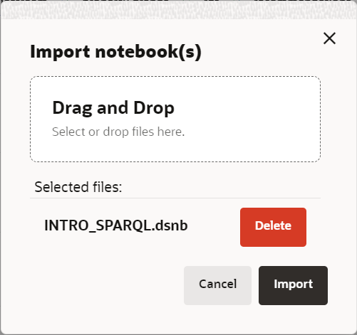
    
4.  インポートしたら、Graph Studioで開きます。
    
    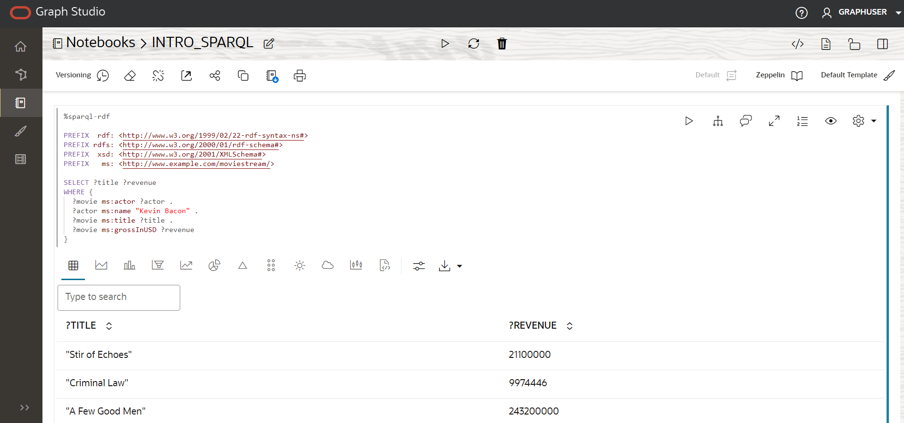
    
    次の**タスク2**の説明に従って、段落を順番に実行し、ビジュアライゼーション設定を試すことができます。
    

## タスク2: Graph Studioでのノートブックの作成(オプションB)

Graph Studioでノートブックを作成するには、次のステップを実行します。

1.  「ノートブック」ページに移動し、「作成」ボタンをクリックします。
    
    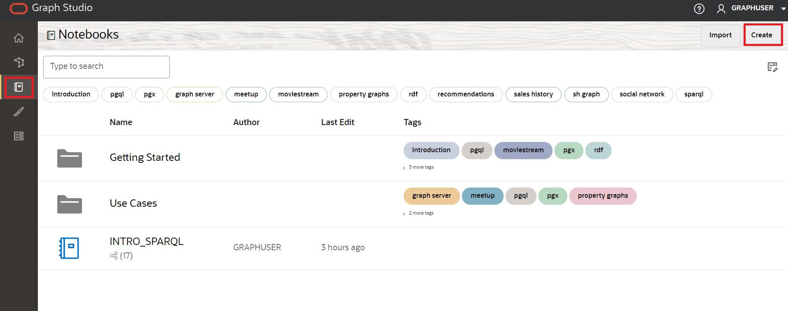
    
2.  ノートブック名を入力します。オプションで、摘要とタグを入力できます。**「Create」**をクリックします。
    
    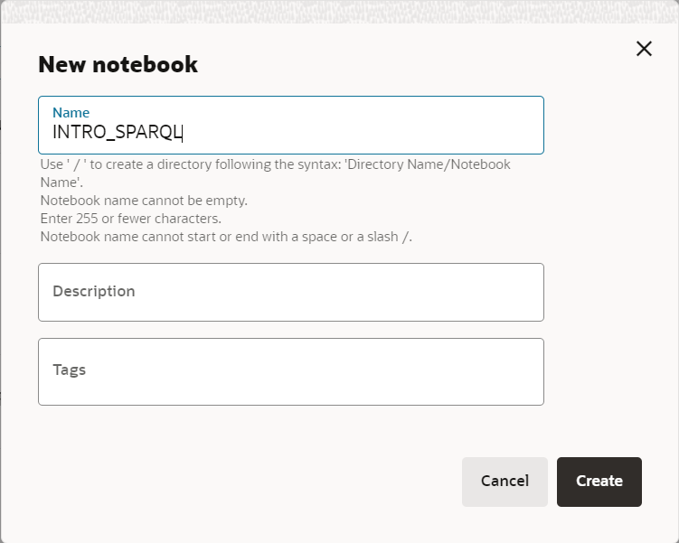
    

## タスク3: ノートブック段落でのRDFインタプリタの使用

新しく作成したノートブックの場合、ノートブック・ページに空の段落が表示されます。サポートされている次のいずれかのインタプリタを使用して、ノートブックの段落を実行できます。

*   コンダ
*   SQL
*   値引き
*   Java
*   Python
*   PGQL
*   RDF
*   SPARQL

値下げ段落は%mdで始まり、RDF段落は%sparql-RDFで始まります。他のGraph Studioインタプリタの詳細は、[使用可能なノートブック・インタプリタ](https://docs.oracle.com/en/cloud/paas/autonomous-database/csgru/available-notebook-interpreters.html)を参照してください。前の図で強調表示されている「段落の実行」アイコンをクリックして、段落を実行できます。Graph Studioは、作成されていないインタプリタ環境がバックグラウンドで構築されます。段落は環境の作成後に実行されます。インタプリタのメモリー構成を表示するには、Inspect the Environmentを参照してください。

「段落の実行」アイコンをクリックして、段落を実行できます。

RDF段落を作成するには、既存の段落の下部にマウスを置き、「RDF段落の追加」記号をクリックします。

**RDFグラフの問合せと分析を開始します**

この項では、MOVIESTREAM RDFグラフを使用した一連の問合せ例によるSPARQL 1.1問合せ言語の概要を示します。

アカウントにRDFグラフ(MOVIESTREAM)が1つしかない場合は、次の項の例に示す問合せを直接実行できます。グラフが自動的に選択されます。

ただし、アカウントに複数のRDFグラフがある場合は、次に示すようにノートブックで最初のSPARQL問合せを実行すると、選択ボックスが表示されます。

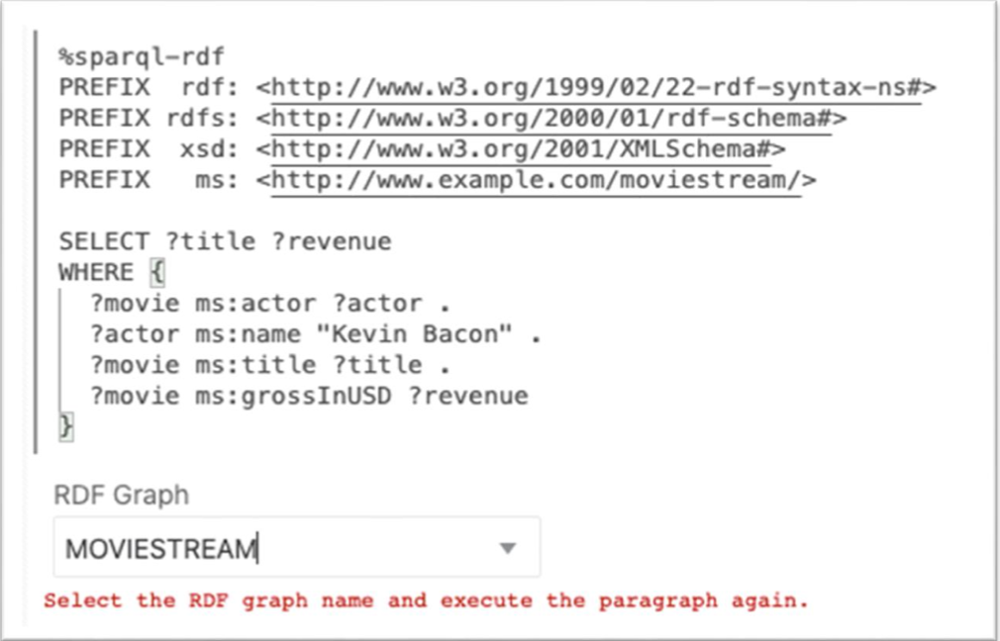

1.  SPARQL問合せでのグラフ・パターンの使用
    
    問合せ1は、Kevin Baconが主演するすべての映画のタイトルと収益をUSDで検索する単純なSPARQL問合せを示しています。
    
    ネームスペース接頭辞定義を使用すると、問合せの他の部分で短い形式でURIを記述できます。たとえば、`ms:actor`は`<http://www.example.com/moviestream/actor>`の短縮形です。
    
    `SELECT`句は問合せから投影する変数を指定し、`WHERE`句は中カッコで囲まれた3つのトリプル・パターンを指定します。'.'は、トリプル・パターン間のセパレータとして使用されます。トリプル・パターン間で共有される変数は、暗黙的な結合条件として機能します。
    
    この問合せでは、`?actor`が1番目と2番目のトリプル・パターンに表示され、`?movie`が1番目、3番目および4番目のトリプル・パターンに表示されます。つまり、3つのトリプルがこのパターンに一致することを意味します。最初のトリプルの対象は2番目のトリプルの対象と等しくなければならず、最初のトリプルの対象は3番目と4番目のトリプルの対象と等しくなければなりません。中カッコ内のトリプル・パターンのセットをグラフ・パターンと呼びます。単一のSPARQL問合せには複数のグラフ・パターンが含まれ、グラフ・パターンは他のグラフ・パターン内でネストできます。
    
    SPARQL段落で次を実行します。
    
        <copy>%sparql-rdf
        
        PREFIX  rdf: <http://www.w3.org/1999/02/22-rdf-syntax-ns#>
        PREFIX rdfs: <http://www.w3.org/2000/01/rdf-schema#>
        PREFIX  xsd: <http://www.w3.org/2001/XMLSchema#>
        PREFIX   ms: <http://www.example.com/moviestream/>
        
        SELECT ?title ?revenue
        WHERE {
          ?movie ms:actor ?actor .
          ?actor ms:name "Kevin Bacon" .
          ?movie ms:title ?title .
          ?movie ms:grossInUSD ?revenue
        }</copy>
        
    
    問合せの出力は次のようになります。
    
    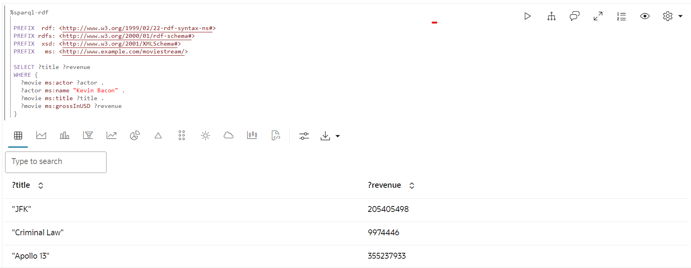
    
2.  SPARQL DESCRIBE WHERE問合せの使用
    
    問合せ2は、`DESCRIBE WHERE`フォームを使用して、Toy Storyのディレクタを記述します。
    
    SPARQL段落で次を実行します。
    
        <copy>%sparql-rdf
        
        PREFIX rdfs: <http://www.w3.org/2000/01/rdf-schema#>
        PREFIX xsd: <http://www.w3.org/2001/XMLSchema#>
        PREFIX ms: <http://www.example.com/moviestream/>
        
        DESCRIBE ?director
        WHERE {
          ?movie ms:title "Toy Story" ;
            ms:director ?director
        }</copy>
        
    
    問合せの出力は次のようになります。
    
    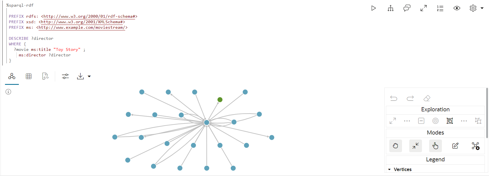
    
3.  SPARQL問合せでのデータセットの説明の使用
    
    問合せ3は、このデータセットで定義されたRDFプロパティとその数を示しています。
    
    集計問合せは、RDFデータセットを特徴付けるときに非常に役立ちます。使用可能なエッジ・タイプ(RDFプロパティ)と頂点タイプ(クラス)とその分布を表示できます。
    
    SPARQL段落で次を実行します。
    
        <copy>%sparql-rdf
        
        PREFIX  rdf: <http://www.w3.org/1999/02/22-rdf-syntax-ns#>
        PREFIX rdfs: <http://www.w3.org/2000/01/rdf-schema#>
        PREFIX  xsd: <http://www.w3.org/2001/XMLSchema#>
        PREFIX   ms: <http://www.example.com/moviestream/>
        
        SELECT ?p (COUNT(*) AS ?cnt)
        WHERE { ?s ?p ?o }
        GROUP BY ?p</copy>
        
    
    問合せの出力は次のようになります。
    
    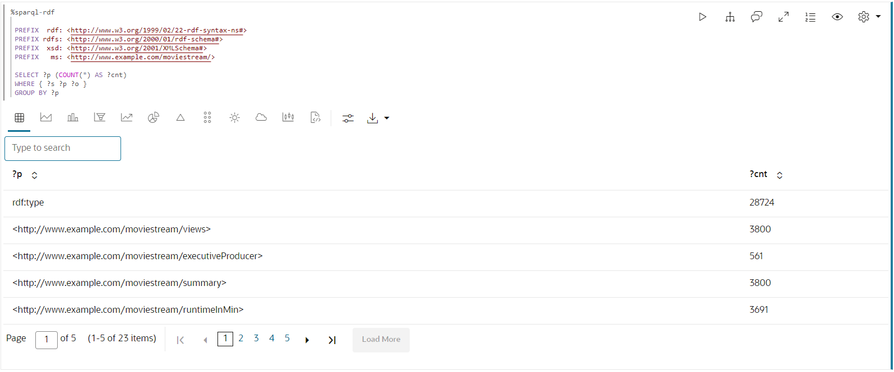
    
4.  SPARQL問合せでのOPTIONAL句の使用
    
    Query 4は、Jack Nicholsonとそのアワードを含む映画を検索します。
    
    SPARQLは、`OPTIONAL`キーワードを使用して、グラフ・パターンをベストエフォート方式で照合する必要があることを示します。つまり、オプション・パターンの結果がある場合はそれを返し、それ以外の場合はNULLまたは値なしを返します。この機能は、RDFデータの不規則な性質および不規則なデータの許容範囲のために特に役立ちます。RDFグラフの同じタイプのリソースは、多くの場合、異なるプロパティを持ちます。`OPTIONAL`を使用すると、パターンが存在する場合はパターンを照合できますが、パターンが一致しない場合は結果を除外できません。`OPTIONAL`句内に複数のトリプル・パターンがある場合、`OPTIONAL`パターンが結果を返すには、それらのトリプル・パターンのすべてが一致する必要があります。また、1つの問合せには、ネストできる複数の`OPTIONAL`句を含めることができます。
    
    SPARQL段落で次を実行します。
    
        <copy>%sparql-rdf
        
        PREFIX  rdf: <http://www.w3.org/1999/02/22-rdf-syntax-ns#>
        PREFIX rdfs: <http://www.w3.org/2000/01/rdf-schema#>
        PREFIX  xsd: <http://www.w3.org/2001/XMLSchema#>
        PREFIX   ms: <http://www.example.com/moviestream/>
        
        SELECT ?title ?awardName
        WHERE {
          ?movie ms:title ?title ;
             ms:actor/ms:name "Jack Nicholson" .
          OPTIONAL {  
            ?movie ms:award/ms:awardName ?awardName .  
          }
        }
        ORDER BY DESC(?awardName) ?title</copy>
        
    
    問合せの出力は次のようになります。
    
    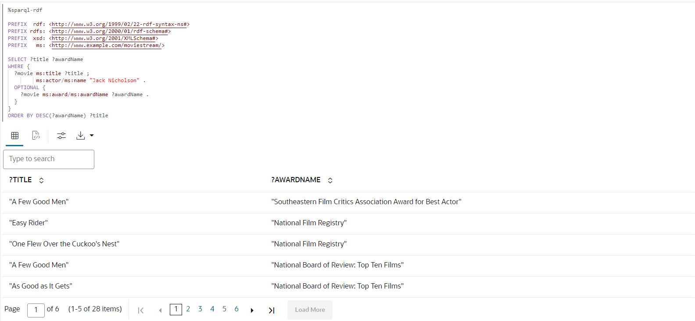
    
5.  SPARQL問合せでの副問合せの使用
    
    問合せ5は、15を超える異なる取締役と仕事をしたアクターに関する情報を検索します。この問合せでは、副問合せを使用してアクターの小さなセットを検索し、それらのアクターのみのms:nameトリプルを検索します。
    
    SPARQLは副問合せをサポートします。SPARQL `SELECT`問合せは、グラフ・パターン内でネストできます。副問合せを使用すると、問合せ全体の一部から返される結果の数を制限するなどの便利な機能が有効になります。
    
    RDF段落で次を実行します。
    
        <copy>%sparql-rdf
        
        PREFIX  rdf: <http://www.w3.org/1999/02/22-rdf-syntax-ns#>
        PREFIX rdfs: <http://www.w3.org/2000/01/rdf-schema#>
        PREFIX  xsd: <http://www.w3.org/2001/XMLSchema#>
        PREFIX   ms: <http://www.example.com/moviestream/>
        
        SELECT ?name
        WHERE {
          { SELECT ?actor
            WHERE {
              ?movie ms:actor ?actor ;
                 ms:director ?director .
            }
            GROUP BY ?actor
            HAVING (COUNT(DISTINCT ?director) > 15)
          }
          ?actor ms:name ?name .
        }</copy>
        
    
    問合せの出力は次のようになります。
    
    
    
6.  SPARQLのCONSTRUCT問合せの使用
    
    問合せ6は、ms:coStar関係を使用して共星グラフを作成します。この場合、`WHERE`句から返される各ソリューションは、`?actor1`、`?actor2`、`?name1`および`?name2`のバインディングを使用して3つのトリプルを生成します。
    
    SPARQL `CONSTRUCT`問合せは、変数バインディングを構成テンプレートに挿入することによって構築されたRDFグラフを返します。
    
    SPARQL段落で次を実行します。
    
        <copy>%sparql-rdf
        
        PREFIX rdfs: <http://www.w3.org/2000/01/rdf-schema#>
        PREFIX  xsd: <http://www.w3.org/2001/XMLSchema#>
        PREFIX   ms: <http://www.example.com/moviestream/>
        
        CONSTRUCT { ?actor1 ms:coStar ?actor2 .
                    ?actor1 ms:name ?name1 .
                    ?actor2 ms:name ?name2 }
        WHERE { ?movie ms:actor ?actor1 .
                    ?actor1 ms:name ?name1 .
                    ?movie ms:actor ?actor2 .
                   ?actor2 ms:name ?name2 .
             FILTER (!sameTerm(?actor1, ?actor2))
        }
        LIMIT 50 </copy>
        
    
    問合せの出力は次のようになります。
    
    
    
7.  SPARQL問合せでのプロパティ・パスの使用
    
    問合せ7は、4つの共演関係内でKevin Baconに接続されているアクターの数を検出します。
    
    SPARQLプロパティ・パスを使用すると、RDFグラフで接続されたリソースを検索するときに、リブラリア長パスを照合できます。プロパティ・パスの開始位置と宛先位置は、問合せ変数または定数RDF語句ですが、パス式iselfでは定数URIのみが許可されます。プロパティ・パスは、正規表現スタイルの構文を使用してパス・パターンを表現します。次に、構文の一部のハイライトを示します(構文の詳細は、SPARQL 1.1仕様の9.1項を参照してください)。
    
    *   `elt*` - `elt`の0個以上の繰返し
    *   `elt+` - `elt`の1つ以上の繰返し
    *   `elt1/elt2` - elt1の後に`elt2`が続きます
    *   `elt1|elt2` - `elt1`または`elt2`の代替パス
    *   `^elt` - 逆のパス(オブジェクトからサブジェクト)
    *   `elt{m,n}` - `elt`の`m`から`n`の繰返しの間
    
    SPARQL段落で次を実行します。
    
        <copy>%sparql-rdf
        
        PREFIX  rdf: <http://www.w3.org/1999/02/22-rdf-syntax-ns#>
        PREFIX rdfs: <http://www.w3.org/2000/01/rdf-schema#>
        PREFIX  xsd: <http://www.w3.org/2001/XMLSchema#>
        PREFIX   ms: <http://www.example.com/moviestream/>
        
        SELECT (COUNT(?actor2) as ?cnt)
        WHERE {
          ms:entity_kevin%20bacon (^ms:actor/ms:actor){1,4} ?actor2
        }</copy>
        
    
    問合せの出力は次のようになります。
    
    
    
8.  SPARQL問合せでのプロパティ・パス構文の使用
    
    問合せ8では、`|`プロパティ・パス構文を使用して問合せをより簡潔に表現します。
    
    SPARQL段落で次を実行します。
    
        <copy>%sparql-rdf
        
        PREFIX  rdf: <http://www.w3.org/1999/02/22-rdf-syntax-ns#>
        PREFIX rdfs: <http://www.w3.org/2000/01/rdf-schema#>
        PREFIX  xsd: <http://www.w3.org/2001/XMLSchema#>
        PREFIX   ms: <http://www.example.com/moviestream/>
        
        SELECT DISTINCT ?name
        WHERE {
          ?movie ms:actor/ms:name "Carl Weathers" .
          ?movie (ms:director|ms:screenwriter)/ms:name ?name.
        }</copy>
        
    
    問合せの出力は次のようになります。
    
    
    
9.  SPARQL ASK問合せの使用
    
    問合せ9は、Danny DeVitoがActionムービーで動作したかどうかを尋ねます。
    
    SPARQL `ASK`問合せは、問合せに空でない結果があるかどうかを示すブール値を返します。問合せフォームは、SPARQL `SELECT`問合せの場合と同じですが、`SELECT`句はキーワード`ASK`に置き換えられます。
    
    SPARQL段落で次を実行します。
    
        <copy>%sparql-rdf
        
        PREFIX rdfs: <http://www.w3.org/2000/01/rdf-schema#>
        PREFIX  xsd: <http://www.w3.org/2001/XMLSchema#>
        PREFIX   ms: <http://www.example.com/moviestream/>
        
        ASK
        WHERE {  
          ?movie ms:actor/ms:name "Danny DeVito" ;
                 ms:genre/ms:genreName "Action" .
        } </copy>
        
    
    問合せの出力は次のようになります。
    
    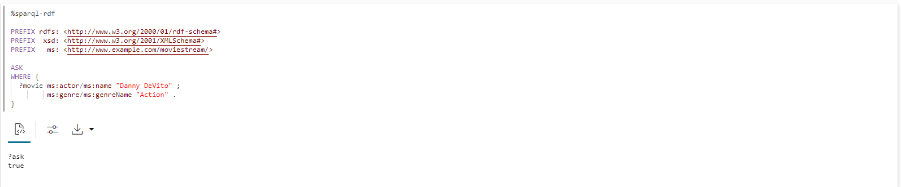
    
10.  SPARQL DESCRIBE問合せの使用
    
    問合せ10では、単純フォームを使用してリソースms:movie\_1216を記述します。
    
    SPARQL `DESCRIBE`問合せは、変数バインディングのセットではなくRDFグラフも返します。`DESCRIBE`問合せは、問合せ結果のリソースを記述するRDFグラフを返します。リソースの説明には、リソースがサブジェクトまたはオブジェクトの位置に表示されるトリプルが含まれます。
    
    SPARQL段落で次を実行します。
    
        <copy>%sparql-rdf
        
        PREFIX rdfs: <http://www.w3.org/2000/01/rdf-schema#>
        PREFIX  xsd: <http://www.w3.org/2001/XMLSchema#>
        PREFIX   ms: <http://www.example.com/moviestream/>
        
        DESCRIBE ms:movie_1216</copy>
        
    
    問合せの出力は次のようになります。
    
    
    

## タスク4: RDFグラフの問合せおよび分析の続行(オプション)

1.  ショートカットを使用した簡潔なSPARQL問合せの実行
    
    問合せ1は、Keanu Reevesが主演する映画の異なるジャンルを昇順に検索します。
    
    SPARQL構文では、一般的な問合せパターンをより簡潔に書き込むためのいくつかのショートカットを使用できます。
    
    同じサブジェクトを繰り返すトリプル・パターンのシーケンスは、ピリオドではなくセミコロンが続く通常の方法で最初のトリプルを指定することで記述でき、後続のトリプルはセミコロンで区切られた述語オブジェクトのペアとして記述でき、シーケンスの最後のトリプルに続くピリオドがあります。
    
    SPARQL段落で次を実行します。
    
        <copy>%sparql-rdf
        
        PREFIX rdf: <http://www.w3.org/1999/02/22-rdf-syntax-ns#>
        PREFIX rdfs: <http://www.w3.org/2000/01/rdf-schema#>
        PREFIX xsd: <http://www.w3.org/2001/XMLSchema#>
        PREFIX ms: <http://www.example.com/moviestream/>
        
        SELECT DISTINCT ?gname
        WHERE {
          ?movie ms:actor/ms:name "Keanu Reeves" ;
                 ms:genre/ms:genreName ?gname .
        }
        ORDER BY ASC(?gname)</copy>
        
    
    問合せの出力は次のようになります。
    
    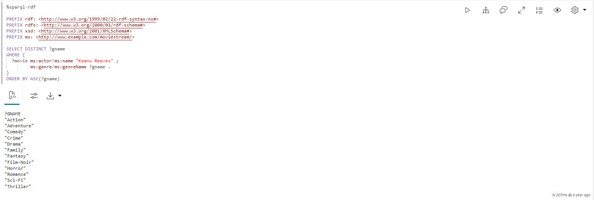
    
2.  SPARQL問合せでのグループ化および集計の使用
    
    問合せ2は、トム・ハンクスが主演する映画のジャンル、各ジャンルの映画の数、および各ジャンルの映画の平均総収益を見つけます。
    
    Grouping and aggregation in SPARQL is very similar to grouping and aggregation in SQL. SPARQL provides the following built-in aggregates: `COUNT`, `SUM`, `MIN`, `MAX`, `AVG`, `GROUP_CONCAT`, and `SAMPLE`. Grouping is specified with `GROUP BY` and conditions on groups are specified with a `HAVING` clause. In SPARQL, expressions in the `SELECT` clause must be surrounded by parenthesis and given a variable name as an alias, for example `(COUNT(*) AS ?cnt)`, and elements in the `SELECT` clause are separated by blank space instead of with a comma. Expressions are also allowed in `GROUP BY` and `ORDER BY` and must be surrounded by parenthesis, with blank space used as a separator
    
    SPARQL段落で次を実行します。
    
        <copy>%sparql-rdf
        
        PREFIX  rdf: <http://www.w3.org/1999/02/22-rdf-syntax-ns#>
        PREFIX rdfs: <http://www.w3.org/2000/01/rdf-schema#>
        PREFIX  xsd: <http://www.w3.org/2001/XMLSchema#>
        PREFIX   ms: <http://www.example.com/moviestream/>
        
        SELECT ?gname (COUNT(*) AS ?cnt) (ROUND(AVG(?revenue)) AS?avg_revenue)
        WHERE {  
          ?movie ms:actor/ms:name "Tom Hanks" ;
                 ms:genre/ms:genreName ?gname ;
                 ms:grossInUSD ?revenue .
        }
        GROUP BY ?gname
        ORDER BY DESC(?avg_revenue)</copy>
        
    
    問合せの出力は次のようになります。
    
    
    
3.  SPARQL問合せでのLIMIT句の使用
    
    問合せ3は、最も多くのアクターを持つ10の映画を検索します。
    
    `LIMIT`句を使用して、結果の合計数を10に制限します。SPARQLでは、問合せ結果を返す前に複数のソリューションをスキップする`OFFSET`句もサポートされています。
    
    SPARQL段落で次を実行します。
    
        <copy>%sparql-rdf
        
        PREFIX  rdf: <http://www.w3.org/1999/02/22-rdf-syntax-ns#>
        PREFIX rdfs: <http://www.w3.org/2000/01/rdf-schema#>
        PREFIX  xsd: <http://www.w3.org/2001/XMLSchema#>
        PREFIX   ms: <http://www.example.com/moviestream/>
        
        SELECT ?title (COUNT(?actor) AS ?acnt)
        WHERE {
          ?movie ms:actor ?actor ;
                 ms:title ?title .
        }
        GROUP BY ?title
        ORDER BY DESC(?acnt)LIMIT 10</copy>
        
    
    問合せの出力は次のようになります。
    
    
    
4.  SPARQL問合せでのクラス・メンバーシップの使用
    
    問合せ4は、このデータセットに定義されているクラスと各クラスのインスタンスの数を示しています。RDF: typeは、クラス・メンバーシップを示すためにW3Cで定義された特別なRDFプロパティです。
    
    SPARQL段落で次を実行します。
    
        <copy>%sparql-rdf
        
        PREFIX  rdf: <http://www.w3.org/1999/02/22-rdf-syntax-ns#>
        PREFIX rdfs: <http://www.w3.org/2000/01/rdf-schema#>
        PREFIX  xsd: <http://www.w3.org/2001/XMLSchema#>
        PREFIX   ms: <http://www.example.com/moviestream/>
        
        SELECT ?c (COUNT(*) AS ?cnt)
        WHERE { ?s rdf:type ?c }
        GROUP BY ?c</copy>
        
    
    問合せの出力は次のようになります。
    
    
    
5.  SPARQL問合せでのFILTER句の使用
    
    問合せ5では、150分を超える長さのMatt Damonを含む映画を検索します。
    
    SPARQLは、`FILTER`キーワードを使用して、問合せ要素のフィルタ条件を指定します。SPARQLの`FILTER`句は、SQLの`WHERE`句に似ています。通常の論理比較演算子、ブール・コネクタおよび数値演算子を使用できます。SPARQLでは、キーワード`OR`のかわりにキーワード`AND`および`||`のかわりに`&&`が使用されます。SPARQLは、RDF固有の関数に加えて、いくつかの組込み文字列、数値、日付、時間およびハッシュ関数も提供します。完全なリストは、SPARQL 1.1仕様を参照してください。
    
    SPARQL段落で次を実行します。
    
        ```
        <copy>%sparql-rdf
        
        PREFIX  rdf: <http://www.w3.org/1999/02/22-rdf-syntax-ns#>
        PREFIX rdfs: <http://www.w3.org/2000/01/rdf-schema#>
        PREFIX  xsd: <http://www.w3.org/2001/XMLSchema#>
        PREFIX   ms: <http://www.example.com/moviestream/>
        
        SELECT ?title ?rt
        WHERE {  
        ?movie ms:actor/ms:name ?aname ;
               ms:runtimeInMin ?rt ;
               ms:title ?title .
        FILTER (?aname = "Matt Damon" && ?rt > 150)
        }</copy>
        ```
        
    
    問合せの出力は次のようになります。
    
    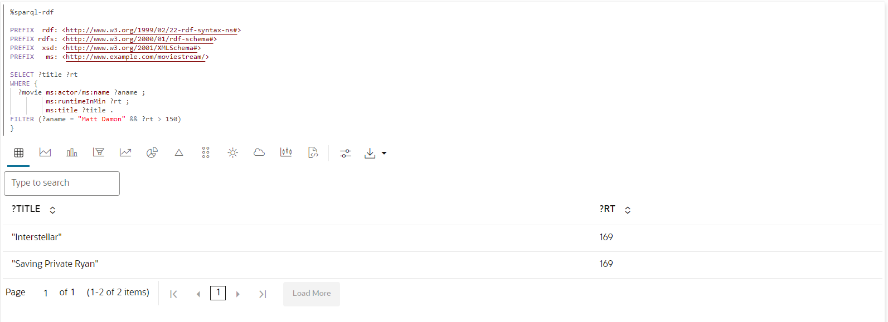
    
6.  SPARQL問合せでのUNION句の使用
    
    Query 6は、Carl Weathersで作家や映画監督の名前を検索します。ネストされたグラフ・パターンを使用して、`UNION`の一部であるパターンを識別することに注意してください。
    
    SPARQLは、1つ以上の代替パターンと一致する`UNION`句を提供します。
    
    SPARQL段落で次を実行します。
    
        <copy>%sparql-rdf
        
        PREFIX  rdf: <http://www.w3.org/1999/02/22-rdf-syntax-ns#>
        PREFIX rdfs: <http://www.w3.org/2000/01/rdf-schema#>
        PREFIX  xsd: <http://www.w3.org/2001/XMLSchema#>
        PREFIX   ms: <http://www.example.com/moviestream/>
        
        SELECT DISTINCT ?name
        WHERE {
          ?movie ms:actor/ms:name "Carl Weathers" .
         {  
          { ?movie ms:director/ms:name ?name }
          UNION
          { ?movie ms:screenwriter/ms:name ?name }
         }
        }</copy>
        
    
    問合せの出力は次のようになります。
    
    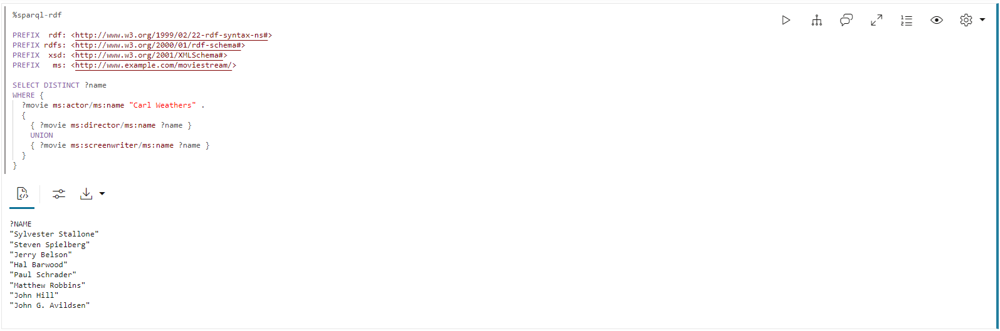
    
7.  SPARQL問合せでの否定の使用
    
    問合せ7は、賞を獲得しなかったRobert De Niroとの映画を見つけます。FILTER問合せで'NOT EXISTS'キーワードを使用することに注意してください。
    
    SPARQL `FILTER`では、`EXISTS`および`NOT EXISTS`キーワードがサポートされており、グラフ・パターンが一致するかどうかに基づいて問合せ結果をフィルタできます。
    
    SPARQL段落で次を実行します。
    
        <copy>%sparql-rdf
        
        PREFIX  rdf: <http://www.w3.org/1999/02/22-rdf-syntax-ns#>
        PREFIX rdfs: <http://www.w3.org/2000/01/rdf-schema#>
        PREFIX  xsd: <http://www.w3.org/2001/XMLSchema#>
        PREFIX   ms: <http://www.example.com/moviestream/>
        
        SELECT ?title
        WHERE {
          ?movie ms:title ?title ;
                 ms:actor/ms:name "Robert De Niro" .
          FILTER (NOT EXISTS { ?movie ms:award ?award . })
        }</copy>
        
    
    問合せの出力は次のようになります。
    
    
    

これで、このラボは終了です。ありがとうございます!

## 確認

*   **著者**\- Bronze Martinソリューション・エンジニア、Ethan Shmargad氏、Matthew McDanielソリューション・エンジニア、Ramu Murakami Gutierrez製品マネージャー
*   **技術貢献者** - Melliyal Annamalai Distinguished Product Manager、Joao Paiva Consulting Member of Technical Staff、Lavanya Jayapalanプリンシパル・ユーザー・アシスタンス開発者
*   **最終更新者/日付** - Ramu Murakami Gutierrez製品マネージャー、2023年6月