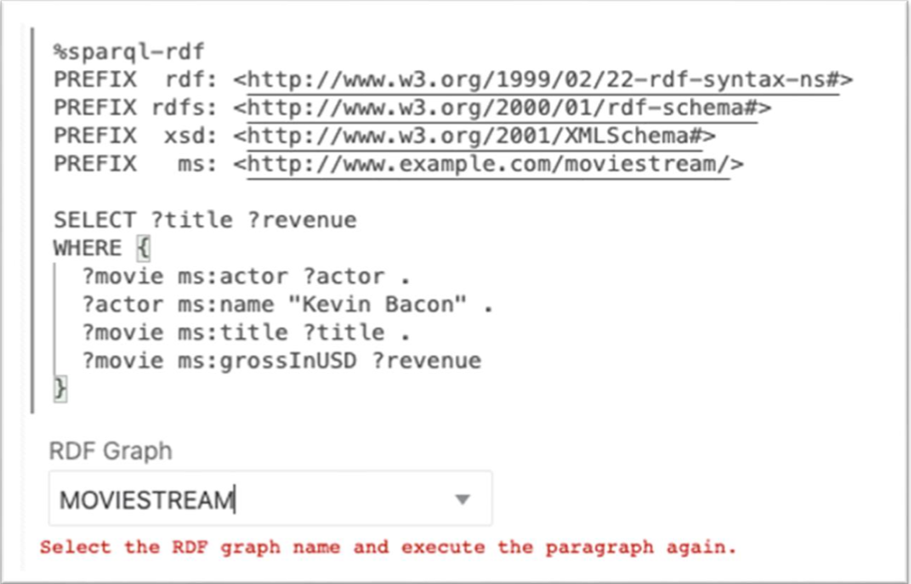
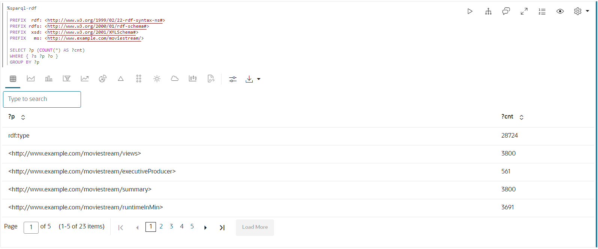
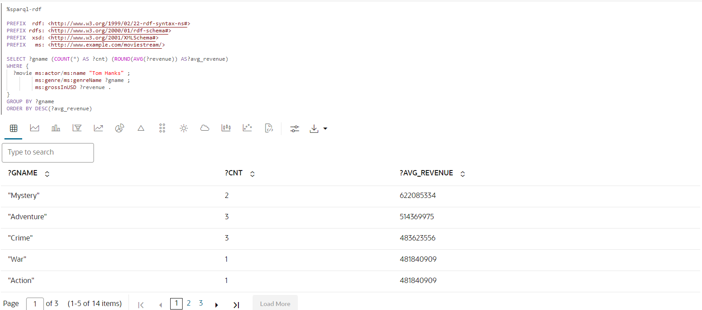

# RDF 그래프 쿼리 및 시각화

## 소개

노트북 단락의 Moviestream RDF 파일에서 작성된 RDF 그래프를 분석, 쿼리 및 시각화할 수 있습니다. 이 섹션에서는 Graph Studio에서 노트북을 생성하는 단계와 RDF 그래프에서 SPARQL 질의 실행을 시작하는 방법에 대해 설명합니다.

실습 과정을 간단히 살펴보려면 아래 비디오를 시청하십시오. [연습](videohub:1_c1am3hb1)

예상 시간: 10분

### 목표

*   Graph Studio에서 노트북 생성
*   Graph Studio에서 노트북 임포트
*   노트북 단락에서 RDF 인터프리터 사용
*   RDF 그래프 쿼리 및 분석

### 필요 조건

이 실습에서는 다음을 가정합니다.

*   Oracle Cloud 계정
*   프로비저닝된 Autonomous Database-서버리스 인스턴스
*   Graph Studio 작업에 적합한 롤과 권한을 가진 데이터베이스 사용자로, Lab 2를 성공적으로 완료하면 이 작업을 수행할 수 있습니다.

## 작업 1: 노트북 가져오기(옵션 A)

아래 지침은 각 노트북 단락을 만들고, 실행하고, 필요에 따라 기본 시각화 설정을 변경하는 방법을 보여줍니다.  
먼저 샘플 노트북을 **가져오고** 작업 3의 각 단계에 대한 관련 단락을 실행합니다.

1.  이 [링크](https://objectstorage.us-ashburn-1.oraclecloud.com/p/uaOb7jHZFcCWy4Y-OPjS3MYydBdIWL8OY2qAq5OUDmUUOZ8L-h8fggF_mjP4H0_e/n/c4u04/b/livelabsfiles/o/data-management-library-files/INTRO_SPARQL.dsnb)를 사용하여 내보낸 노트북을 다운로드합니다.
    
2.  **메모장** 메뉴 아이콘을 누른 다음 오른쪽 위에 있는 **메모장 임포트** 아이콘을 누릅니다.
    
    
    
3.  다운로드한 파일을 끌어오거나 올바른 폴더로 이동하여 업로드할 파일을 선택합니다. **임포트**를 누릅니다.
    
    
    
4.  가져온 후에는 Graph Studio에서 열어야 합니다.
    
    
    
    단락을 순서대로 실행하고 아래의 **작업 2**에 설명된 대로 시각화 설정을 실험할 수 있습니다.
    

## 작업 2: Graph Studio에서 노트북 생성(옵션 B)

다음 단계를 수행하여 Graph Studio에서 노트북을 생성할 수 있습니다.

1.  Notebooks 페이지로 이동하고 Create 버튼을 누릅니다.
    
    
    
2.  노트북 이름을 입력합니다. 선택적으로 설명 및 태그를 입력할 수 있습니다. **생성**을 누릅니다.
    
    
    

## 작업 3: 노트북 단락에서 RDF 인터프리터 사용

새로 만든 노트북의 경우 빈 단락이 포함된 노트북 페이지가 표시됩니다. 지원되는 다음 인터프리터 중 하나를 사용하여 노트북 단락을 실행할 수 있습니다.

*   콘다
*   SQL
*   마크다운
*   Java
*   Python
*   PGQL
*   RDF
*   스파로크

마크다운 단락은 %md로 시작하고 RDF 단락은 %sparql-rdf로 시작합니다. 다른 Graph Studio 인터프리터에 대한 자세한 내용은 [사용 가능한 노트북 인터프리터](https://docs.oracle.com/en/cloud/paas/autonomous-database/csgru/available-notebook-interpreters.html)를 참조하십시오. 이전 그림에 강조 표시된 단락 실행 아이콘을 눌러 단락을 실행할 수 있습니다. Graph Studio는 인터프리터 환경이 생성되지 않은 경우 백그라운드에서 빌드하기 시작합니다. 환경 생성 후 단락이 실행됩니다. 인터프리터 메모리 구성을 보려면 환경 검사를 참조하십시오.

단락 실행 아이콘을 눌러 단락을 실행할 수 있습니다.

RDF 단락을 만들려면 기존 단락의 아래쪽을 마우스로 가리키고 RDF 단락 추가 기호를 클릭합니다.

**RDF 그래프 쿼리 및 분석 시작**

이 섹션에서는 MOVIESTREAM RDF 그래프를 사용하는 일련의 예제 질의를 통해 SPARQL 1.1 질의 언어를 소개합니다.

계정에 RDF 그래프(MOVIESTREAM)가 하나만 있는 경우 다음 절의 예제에 표시된 질의를 직접 실행할 수 있습니다. 그래프가 자동으로 선택됩니다.

그러나 계정에 둘 이상의 RDF 그래프가 있는 경우 다음과 같이 노트북에서 첫 번째 SPARQL 쿼리를 실행할 때 선택 상자가 표시됩니다.



1.  SPARQL 질의에서 그래프 패턴 사용
    
    쿼리 1은 Kevin Bacon이 출연하는 모든 영화의 제목과 수익을 USD로 찾는 간단한 SPARQL 쿼리를 보여줍니다.
    
    네임스페이스 접두어 정의를 통해 질의의 다른 부분에서 짧은 형식으로 URI를 쓸 수 있습니다. 예를 들어, `ms:actor`는 `<http://www.example.com/moviestream/actor>`에 대해 짧습니다.
    
    `SELECT` 절은 질의에서 투영할 변수를 지정하고, `WHERE` 절은 중괄호 안에 묶인 세 개의 삼중 패턴을 지정합니다. '.'는 삼중 패턴 사이의 구분자로 사용됩니다. 삼중 패턴 간의 공유 변수는 암시적 조인 조건으로 사용됩니다.
    
    이 질의에서 `?actor`는 첫번째 및 두번째 삼중 패턴에 나타나고 `?movie`는 첫번째, 세번째 및 네번째 삼중 패턴에 나타납니다. 즉, 세 개의 삼중 패턴에 대해 이 패턴과 일치해야 합니다. 첫 번째 삼중의 대상은 두 번째 삼중의 대상과 같아야 하고, 첫 번째 삼중의 대상은 세 번째와 네 번째 삼중의 대상과 같아야 한다. 중괄호 내의 삼중 패턴 세트를 그래프 패턴이라고 합니다. 단일 SPARQL 질의는 여러 그래프 패턴을 포함할 수 있으며 그래프 패턴은 다른 그래프 패턴 내에 중첩될 수 있습니다.
    
    SPARQL 단락에서 다음을 실행합니다.
    
        <copy>%sparql-rdf
        
        PREFIX  rdf: <http://www.w3.org/1999/02/22-rdf-syntax-ns#>
        PREFIX rdfs: <http://www.w3.org/2000/01/rdf-schema#>
        PREFIX  xsd: <http://www.w3.org/2001/XMLSchema#>
        PREFIX   ms: <http://www.example.com/moviestream/>
        
        SELECT ?title ?revenue
        WHERE {
          ?movie ms:actor ?actor .
          ?actor ms:name "Kevin Bacon" .
          ?movie ms:title ?title .
          ?movie ms:grossInUSD ?revenue
        }</copy>
        
    
    query 출력은 다음과 같습니다.
    
    
    
2.  SPARQL DESCRIBE WHERE Query 사용
    
    쿼리 2는 `DESCRIBE WHERE` 양식을 사용하여 토이 스토리의 디렉터를 설명합니다.
    
    SPARQL 단락에서 다음을 실행합니다.
    
        <copy>%sparql-rdf
        
        PREFIX rdfs: <http://www.w3.org/2000/01/rdf-schema#>
        PREFIX xsd: <http://www.w3.org/2001/XMLSchema#>
        PREFIX ms: <http://www.example.com/moviestream/>
        
        DESCRIBE ?director
        WHERE {
          ?movie ms:title "Toy Story" ;
            ms:director ?director
        }</copy>
        
    
    query 출력은 다음과 같습니다.
    
    
    
3.  SPARQL 질의에서 데이터 집합 설명 사용
    
    질의 3은 이 데이터 세트에 정의된 RDF 등록 정보 및 해당 수를 보여줍니다.
    
    집계 질의는 RDF 데이터 세트를 특성화할 때 매우 유용할 수 있습니다. 사용 가능한 모서리 유형(RDF 특성)과 정점 유형(클래스) 및 해당 분포를 표시할 수 있습니다.
    
    SPARQL 단락에서 다음을 실행합니다.
    
        <copy>%sparql-rdf
        
        PREFIX  rdf: <http://www.w3.org/1999/02/22-rdf-syntax-ns#>
        PREFIX rdfs: <http://www.w3.org/2000/01/rdf-schema#>
        PREFIX  xsd: <http://www.w3.org/2001/XMLSchema#>
        PREFIX   ms: <http://www.example.com/moviestream/>
        
        SELECT ?p (COUNT(*) AS ?cnt)
        WHERE { ?s ?p ?o }
        GROUP BY ?p</copy>
        
    
    query 출력은 다음과 같습니다.
    
    
    
4.  SPARQL Query에서 OPTIONAL 절 사용
    
    쿼리 4는 잭 니콜슨과 선택적으로 그들의 상을 가진 영화를 찾습니다.
    
    SPARQL은 `OPTIONAL` 키워드를 사용하여 그래프 패턴이 최선의 방식으로 일치해야 함을 나타냅니다. 즉, 선택적 패턴에 대한 결과가 있으면 반환하고, 그렇지 않으면 NULL을 반환하거나 값을 반환하지 않습니다. 이 기능은 불규칙한 데이터에 대한 스키마리스 특성 및 공차로 인해 RDF 데이터에 특히 유용합니다. RDF 그래프에서 동일한 유형의 리소스는 종종 다른 속성을 가지며, `OPTIONAL`를 사용하면 패턴이 존재할 때 패턴을 일치시킬 수 있지만 해당 패턴이 일치하지 않을 때는 결과를 제외할 수 없습니다. `OPTIONAL` 절 내에 여러 개의 삼중 패턴이 있는 경우 결과를 반환하려면 `OPTIONAL` 패턴에 대해 이러한 모든 삼중 패턴이 일치해야 합니다. 또한 단일 질의에는 중첩될 수 있는 여러 `OPTIONAL` 절이 있을 수 있습니다.
    
    SPARQL 단락에서 다음을 실행합니다.
    
        <copy>%sparql-rdf
        
        PREFIX  rdf: <http://www.w3.org/1999/02/22-rdf-syntax-ns#>
        PREFIX rdfs: <http://www.w3.org/2000/01/rdf-schema#>
        PREFIX  xsd: <http://www.w3.org/2001/XMLSchema#>
        PREFIX   ms: <http://www.example.com/moviestream/>
        
        SELECT ?title ?awardName
        WHERE {
          ?movie ms:title ?title ;
             ms:actor/ms:name "Jack Nicholson" .
          OPTIONAL {  
            ?movie ms:award/ms:awardName ?awardName .  
          }
        }
        ORDER BY DESC(?awardName) ?title</copy>
        
    
    query 출력은 다음과 같습니다.
    
    
    
5.  SPARQL Query에서 Subquery 사용
    
    Query 5는 15개 이상의 다른 디렉터와 함께 작업한 배우에 대한 정보를 찾습니다. 이 질의는 하위 질의를 사용하여 작은 작업자 집합을 찾은 다음 해당 작업자에 대해서만 ms:name 세 쌍을 찾습니다.
    
    SPARQL은 subquery를 지원합니다. SPARQL `SELECT` 질의는 그래프 패턴 내에 중첩될 수 있습니다. subquery를 사용하면 전체 query의 일부에서 반환되는 결과 수를 제한하는 등의 유용한 기능을 사용할 수 있습니다.
    
    RDF 단락에서 다음을 실행합니다.
    
        <copy>%sparql-rdf
        
        PREFIX  rdf: <http://www.w3.org/1999/02/22-rdf-syntax-ns#>
        PREFIX rdfs: <http://www.w3.org/2000/01/rdf-schema#>
        PREFIX  xsd: <http://www.w3.org/2001/XMLSchema#>
        PREFIX   ms: <http://www.example.com/moviestream/>
        
        SELECT ?name
        WHERE {
          { SELECT ?actor
            WHERE {
              ?movie ms:actor ?actor ;
                 ms:director ?director .
            }
            GROUP BY ?actor
            HAVING (COUNT(DISTINCT ?director) > 15)
          }
          ?actor ms:name ?name .
        }</copy>
        
    
    query 출력은 다음과 같습니다.
    
    
    
6.  SPARQL CONSTRUCT Query 사용
    
    Query 6은 ms:coStar 관계를 사용하여 공동 별표를 작성합니다. 이 경우 `WHERE` 절에서 반환된 각 솔루션은 `?actor1`, `?actor2`, `?name1` 및 `?name2`에 대한 바인딩을 사용하여 세 개의 세 배를 생성합니다.
    
    SPARQL `CONSTRUCT` 질의는 생성자 템플리트에 변수 바인딩을 삽입하여 작성된 RDF 그래프를 반환합니다.
    
    SPARQL 단락에서 다음을 실행합니다.
    
        <copy>%sparql-rdf
        
        PREFIX rdfs: <http://www.w3.org/2000/01/rdf-schema#>
        PREFIX  xsd: <http://www.w3.org/2001/XMLSchema#>
        PREFIX   ms: <http://www.example.com/moviestream/>
        
        CONSTRUCT { ?actor1 ms:coStar ?actor2 .
                    ?actor1 ms:name ?name1 .
                    ?actor2 ms:name ?name2 }
        WHERE { ?movie ms:actor ?actor1 .
                    ?actor1 ms:name ?name1 .
                    ?movie ms:actor ?actor2 .
                   ?actor2 ms:name ?name2 .
             FILTER (!sameTerm(?actor1, ?actor2))
        }
        LIMIT 50 </copy>
        
    
    query 출력은 다음과 같습니다.
    
    
    
7.  SPARQL 질의에서 속성 경로 사용
    
    Query 7은 공동 스타 관계 4개 내에서 Kevin Bacon과 연결된 배우 수를 찾습니다.
    
    SPARQL 속성 경로를 사용하면 RDF 그래프에서 연결된 리소스를 검색할 때 보조 길이 경로를 일치시킬 수 있습니다. 속성 경로의 시작 및 대상 위치는 질의 변수 또는 상수 RDF 조건일 수 있지만 경로 표현식 iself에서는 상수 URI만 허용됩니다. 속성 경로는 정규식 스타일 구문을 사용하여 경로 패턴을 표현합니다. 구문의 일부 강조 표시는 다음과 같습니다. 구문에 대한 자세한 내용은 SPARQL 1.1 사양의 섹션 9.1을 참조하십시오.
    
    *   `elt*` - 0개 이상의 `elt` 반복
    *   `elt+` - 하나 이상의 `elt` 반복
    *   `elt1/elt2` - elt1, `elt2`
    *   `elt1|elt2` - `elt1` 또는 `elt2`의 대체 경로
    *   `^elt` - 역방향 경로(제목에 대한 객체)
    *   `elt{m,n}` - `elt`의 `m` 및 `n` 반복 간
    
    SPARQL 단락에서 다음을 실행합니다.
    
        <copy>%sparql-rdf
        
        PREFIX  rdf: <http://www.w3.org/1999/02/22-rdf-syntax-ns#>
        PREFIX rdfs: <http://www.w3.org/2000/01/rdf-schema#>
        PREFIX  xsd: <http://www.w3.org/2001/XMLSchema#>
        PREFIX   ms: <http://www.example.com/moviestream/>
        
        SELECT (COUNT(?actor2) as ?cnt)
        WHERE {
          ms:entity_kevin%20bacon (^ms:actor/ms:actor){1,4} ?actor2
        }</copy>
        
    
    query 출력은 다음과 같습니다.
    
    
    
8.  SPARQL 질의에서 속성 경로 구문 사용
    
    질의 8은 `|` 속성 경로 구문을 사용하여 질의를 보다 간결하게 표현합니다.
    
    SPARQL 단락에서 다음을 실행합니다.
    
        <copy>%sparql-rdf
        
        PREFIX  rdf: <http://www.w3.org/1999/02/22-rdf-syntax-ns#>
        PREFIX rdfs: <http://www.w3.org/2000/01/rdf-schema#>
        PREFIX  xsd: <http://www.w3.org/2001/XMLSchema#>
        PREFIX   ms: <http://www.example.com/moviestream/>
        
        SELECT DISTINCT ?name
        WHERE {
          ?movie ms:actor/ms:name "Carl Weathers" .
          ?movie (ms:director|ms:screenwriter)/ms:name ?name.
        }</copy>
        
    
    query 출력은 다음과 같습니다.
    
    
    
9.  SPARQL ASK Query 사용
    
    쿼리 9는 대니 DeVito가 액션 영화에 출연했는지 여부를 묻습니다.
    
    SPARQL `ASK` 질의는 질의에 비어 있지 않은 결과가 있는지 여부를 나타내는 부울을 반환합니다. query form은 `SELECT` 절이 `ASK` 키워드로 바뀌는 것을 제외하고 SPARQL `SELECT` query에 대한 form과 동일합니다.
    
    SPARQL 단락에서 다음을 실행합니다.
    
        <copy>%sparql-rdf
        
        PREFIX rdfs: <http://www.w3.org/2000/01/rdf-schema#>
        PREFIX  xsd: <http://www.w3.org/2001/XMLSchema#>
        PREFIX   ms: <http://www.example.com/moviestream/>
        
        ASK
        WHERE {  
          ?movie ms:actor/ms:name "Danny DeVito" ;
                 ms:genre/ms:genreName "Action" .
        } </copy>
        
    
    query 출력은 다음과 같습니다.
    
    
    
10.  SPARQL DESCRIBE Query 사용
    
    질의 10은 단순 폼을 사용하여 리소스 ms:movie\_1216를 설명합니다.
    
    SPARQL `DESCRIBE` 질의는 변수 바인딩 집합 대신 RDF 그래프를 반환합니다. `DESCRIBE` 질의는 질의 결과의 리소스를 설명하는 RDF 그래프를 반환합니다. 리소스에 대한 설명에는 리소스가 주체 또는 객체 위치에 나타나는 3배가 포함됩니다.
    
    SPARQL 단락에서 다음을 실행합니다.
    
        <copy>%sparql-rdf
        
        PREFIX rdfs: <http://www.w3.org/2000/01/rdf-schema#>
        PREFIX  xsd: <http://www.w3.org/2001/XMLSchema#>
        PREFIX   ms: <http://www.example.com/moviestream/>
        
        DESCRIBE ms:movie_1216</copy>
        
    
    query 출력은 다음과 같습니다.
    
    
    

## 작업 4: 계속 RDF 그래프 질의 및 분석(선택사항)

1.  바로가기를 사용하여 간략한 SPARQL 질의 실행
    
    쿼리 1은 오름차순으로 Keanu Reeves가 출연 한 영화의 독특한 장르를 찾습니다.
    
    SPARQL 구문은 공통 질의 패턴을 보다 간결하게 작성하기 위한 여러 단축키를 허용합니다.
    
    동일한 주제를 반복하는 일련의 삼중 패턴은 첫 번째 삼중을 정규 방식으로 지정한 다음 마침표가 아닌 세미콜론을 지정하여 작성할 수 있으며, 이후 삼중 패턴은 세미콜론으로 구분된 술어 객체 쌍으로 작성할 수 있으며, 시퀀스의 마지막 삼중 뒤에 마침표가 붙습니다.
    
    SPARQL 단락에서 다음을 실행합니다.
    
        <copy>%sparql-rdf
        
        PREFIX rdf: <http://www.w3.org/1999/02/22-rdf-syntax-ns#>
        PREFIX rdfs: <http://www.w3.org/2000/01/rdf-schema#>
        PREFIX xsd: <http://www.w3.org/2001/XMLSchema#>
        PREFIX ms: <http://www.example.com/moviestream/>
        
        SELECT DISTINCT ?gname
        WHERE {
          ?movie ms:actor/ms:name "Keanu Reeves" ;
                 ms:genre/ms:genreName ?gname .
        }
        ORDER BY ASC(?gname)</copy>
        
    
    query 출력은 다음과 같습니다.
    
    
    
2.  SPARQL Query에서 그룹화 및 집계 사용
    
    Query 2는 Tom Hanks가 출연하는 영화의 장르, 각 장르의 영화 수 및 각 장르의 평균 총 매출을 찾습니다.
    
    Grouping and aggregation in SPARQL is very similar to grouping and aggregation in SQL. SPARQL provides the following built-in aggregates: `COUNT`, `SUM`, `MIN`, `MAX`, `AVG`, `GROUP_CONCAT`, and `SAMPLE`. Grouping is specified with `GROUP BY` and conditions on groups are specified with a `HAVING` clause. In SPARQL, expressions in the `SELECT` clause must be surrounded by parenthesis and given a variable name as an alias, for example `(COUNT(*) AS ?cnt)`, and elements in the `SELECT` clause are separated by blank space instead of with a comma. Expressions are also allowed in `GROUP BY` and `ORDER BY` and must be surrounded by parenthesis, with blank space used as a separator
    
    SPARQL 단락에서 다음을 실행합니다.
    
        <copy>%sparql-rdf
        
        PREFIX  rdf: <http://www.w3.org/1999/02/22-rdf-syntax-ns#>
        PREFIX rdfs: <http://www.w3.org/2000/01/rdf-schema#>
        PREFIX  xsd: <http://www.w3.org/2001/XMLSchema#>
        PREFIX   ms: <http://www.example.com/moviestream/>
        
        SELECT ?gname (COUNT(*) AS ?cnt) (ROUND(AVG(?revenue)) AS?avg_revenue)
        WHERE {  
          ?movie ms:actor/ms:name "Tom Hanks" ;
                 ms:genre/ms:genreName ?gname ;
                 ms:grossInUSD ?revenue .
        }
        GROUP BY ?gname
        ORDER BY DESC(?avg_revenue)</copy>
        
    
    query 출력은 다음과 같습니다.
    
    
    
3.  SPARQL Query에서 LIMIT 절 사용
    
    조회 3은 배우가 가장 많은 영화 10개를 찾습니다.
    
    `LIMIT` 절을 사용하여 총 결과 수를 10개로 제한합니다. 또한 SPARQL은 질의 결과를 반환하기 전에 여러 솔루션을 건너뛰도록 `OFFSET` 절을 지원합니다.
    
    SPARQL 단락에서 다음을 실행합니다.
    
        <copy>%sparql-rdf
        
        PREFIX  rdf: <http://www.w3.org/1999/02/22-rdf-syntax-ns#>
        PREFIX rdfs: <http://www.w3.org/2000/01/rdf-schema#>
        PREFIX  xsd: <http://www.w3.org/2001/XMLSchema#>
        PREFIX   ms: <http://www.example.com/moviestream/>
        
        SELECT ?title (COUNT(?actor) AS ?acnt)
        WHERE {
          ?movie ms:actor ?actor ;
                 ms:title ?title .
        }
        GROUP BY ?title
        ORDER BY DESC(?acnt)LIMIT 10</copy>
        
    
    query 출력은 다음과 같습니다.
    
    
    
4.  SPARQL 질의에서 클래스 멤버쉽 사용
    
    질의 4는 이 데이터 집합에 정의된 클래스와 각 데이터 집합의 인스턴스 수를 보여줍니다. rdf: type은 클래스 멤버쉽을 나타내기 위해 W3C에 정의된 특수 RDF 속성입니다.
    
    SPARQL 단락에서 다음을 실행합니다.
    
        <copy>%sparql-rdf
        
        PREFIX  rdf: <http://www.w3.org/1999/02/22-rdf-syntax-ns#>
        PREFIX rdfs: <http://www.w3.org/2000/01/rdf-schema#>
        PREFIX  xsd: <http://www.w3.org/2001/XMLSchema#>
        PREFIX   ms: <http://www.example.com/moviestream/>
        
        SELECT ?c (COUNT(*) AS ?cnt)
        WHERE { ?s rdf:type ?c }
        GROUP BY ?c</copy>
        
    
    query 출력은 다음과 같습니다.
    
    
    
5.  SPARQL Query에서 FILTER 절 사용
    
    Query 5는 Matt Damon이 150분 이상인 영화를 찾습니다.
    
    SPARQL은 `FILTER` 키워드를 사용하여 질의 요소에 대한 필터 조건을 지정합니다. SPARQL `FILTER` 절은 SQL `WHERE` 절과 유사합니다. 일반적인 논리 비교 연산자, 부울 커넥터 및 숫자 연산자를 사용할 수 있습니다. SPARQL은 `OR` 키워드 대신 `AND` 및 `||` 키워드 대신 `&&`를 사용합니다. 또한 SPARQL은 RDF 특정 함수 외에도 여러 내장 문자열, 숫자, 날짜, 시간 및 해시 함수를 제공합니다. 전체 목록은 SPARQL 1.1 사양을 참조하십시오.
    
    SPARQL 단락에서 다음을 실행합니다.
    
        ```
        <copy>%sparql-rdf
        
        PREFIX  rdf: <http://www.w3.org/1999/02/22-rdf-syntax-ns#>
        PREFIX rdfs: <http://www.w3.org/2000/01/rdf-schema#>
        PREFIX  xsd: <http://www.w3.org/2001/XMLSchema#>
        PREFIX   ms: <http://www.example.com/moviestream/>
        
        SELECT ?title ?rt
        WHERE {  
        ?movie ms:actor/ms:name ?aname ;
               ms:runtimeInMin ?rt ;
               ms:title ?title .
        FILTER (?aname = "Matt Damon" && ?rt > 150)
        }</copy>
        ```
        
    
    query 출력은 다음과 같습니다.
    
    
    
6.  SPARQL Query에서 UNION 절 사용
    
    쿼리 6은 Carl Weathers와 함께 영화 작가 및 감독의 이름을 찾습니다. 중첩된 그래프 패턴을 사용하여 `UNION`의 일부인 패턴을 식별합니다.
    
    SPARQL은 하나 이상의 대체 패턴과 일치하는 `UNION` 절을 제공합니다.
    
    SPARQL 단락에서 다음을 실행합니다.
    
        <copy>%sparql-rdf
        
        PREFIX  rdf: <http://www.w3.org/1999/02/22-rdf-syntax-ns#>
        PREFIX rdfs: <http://www.w3.org/2000/01/rdf-schema#>
        PREFIX  xsd: <http://www.w3.org/2001/XMLSchema#>
        PREFIX   ms: <http://www.example.com/moviestream/>
        
        SELECT DISTINCT ?name
        WHERE {
          ?movie ms:actor/ms:name "Carl Weathers" .
         {  
          { ?movie ms:director/ms:name ?name }
          UNION
          { ?movie ms:screenwriter/ms:name ?name }
         }
        }</copy>
        
    
    query 출력은 다음과 같습니다.
    
    
    
7.  SPARQL 질의에서 부정 사용
    
    쿼리 7은 Robert De Niro가 수상하지 않은 영화를 찾습니다. FILTER 쿼리에서 'NOT EXISTS' 키워드를 사용합니다.
    
    SPARQL `FILTER`은 `EXISTS` 및 `NOT EXISTS` 키워드를 지원하므로 그래프 패턴 일치 여부에 따라 질의 결과를 필터링할 수 있습니다.
    
    SPARQL 단락에서 다음을 실행합니다.
    
        <copy>%sparql-rdf
        
        PREFIX  rdf: <http://www.w3.org/1999/02/22-rdf-syntax-ns#>
        PREFIX rdfs: <http://www.w3.org/2000/01/rdf-schema#>
        PREFIX  xsd: <http://www.w3.org/2001/XMLSchema#>
        PREFIX   ms: <http://www.example.com/moviestream/>
        
        SELECT ?title
        WHERE {
          ?movie ms:title ?title ;
                 ms:actor/ms:name "Robert De Niro" .
          FILTER (NOT EXISTS { ?movie ms:award ?award . })
        }</copy>
        
    
    query 출력은 다음과 같습니다.
    
    
    

이 연습을 마칩니다. 감사합니다!

## 확인

*   **작성자**\- Bronze Martin 솔루션 엔지니어, Ethan Shmargad, Matthew McDaniel 솔루션 엔지니어, Ramu Murakami Gutierrez 제품 관리자
*   **기술 기여자** - Melliyal Annamalai Distinguished Product Manager, Joao Paiva Consulting Member of Technical Staff, Lavanya Jayapalan Principal User Assistance Developer
*   **최종 업데이트 기한/일자** - Ramu Murakami Gutierrez 제품 관리자, 2023년 6월