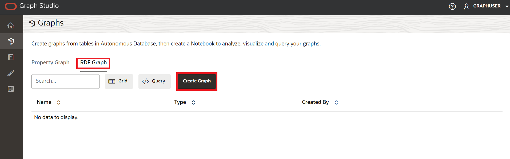
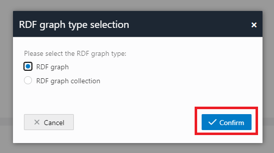

# Graph StudioでのRDFグラフの作成

## 概要

Oracle Autonomous DatabaseのGraph Studioを使用すると、ユーザーはグラフ・データをモデル化、作成、問合せおよび分析できます。ノートブック、PGQLを使用したグラフ問合せを実行するための開発者API、60以上の組込みグラフ・アルゴリズムが含まれ、ネイティブのグラフ・ビジュアライゼーションを含む多数のビジュアライゼーションが提供されます。プロパティ・グラフに加えて、Graph Studioでは、リソース記述フレームワーク(RDF)およびWebオントロジー言語(OWL)に基づくデータおよびオントロジのストレージ、推論および問合せ機能など、セマンティック・テクノロジのサポートが拡張されるようになりました。サポートされている次のRDF機能にGraph Studioを使用できるようになりました。

*   RDFグラフの作成
*   ノートブック段落のRDFグラフでSPARQL問合せを実行します
*   RDFグラフの分析と可視化

見積時間: 5分

ラボのクイック・ウォークスルーについては、次のビデオをご覧ください。[Graph StudioでのRDFグラフの作成](videohub:1_vvqhh26v)

### 目標

*   Graph StudioでのRDFグラフの作成
*   RDFグラフの検証
*   プレイグラウンド・ページでのSPARQL問合せの実行

### 前提条件

*   次の演習には、Autonomous Database - サーバーレスが必要です。
*   グラフ対応ユーザー(GRAPHUSER)が存在すること。つまり、正しいロールおよび権限を持つデータベース・ユーザーが存在します。

## タスク1: Graph StudioでのRDFグラフの作成

前の演習を完了し、現在ログインしていると仮定して、次のステップを実行します。

1.  左側のナビゲーション・メニューで**「グラフ」**をクリックして、「グラフ」ページに移動します。


2.  「グラフ・タイプ」ドロップダウン・メニューで**「RDF」**を選択し、インタフェースの右上隅にある**「作成」**ボタンをクリックします。



3.  **「RDFグラフ」**を選択し、**「確認」**ボタンをクリックします。



4.  「RDFグラフの作成」ウィザードが次のように開きます。


5.  OCIオブジェクト・ストレージURIパスを入力します:
    
          <copy>https://objectstorage.us-ashburn-1.oraclecloud.com/p/VEKec7t0mGwBkJX92Jn0nMptuXIlEpJ5XJA-A6C9PymRgY2LhKbjWqHeB5rVBbaV/n/c4u04/b/livelabsfiles/o/data-management-library-files/moviestream_rdf.nt
        
6.  **「資格証明なし」**をクリックします。
    
7.  **「次へ」**をクリックします。次のダイアログが表示され、「Graph Name」に「MOVIESTREAM」と入力します。
    


8.  **「作成」**をクリックします
    
    RDFグラフ作成ジョブが開始されます。RDFファイルには139461レコードが含まれているため、処理に3分から4分かかる場合があります。Graph Studioの**「ジョブ」**ページでジョブをモニターできます。
    


    When succeeded, the status will change from pending to succeeded and Logs can be viewed by clicking on the three dots on the right side of the job row and selecting **See Log**. The log for the job displays details as shown below:
    
    ```
    Tue, Mar 1, 2022 08:21:04 AM
    Finished execution of task Graph Creation - MOVIESTREAM.
    
    Tue, Mar 1, 2022 08:21:04 AM
    Graph MOVIESTREAM created successfully
    
    Tue, Mar 1, 2022 08:21:04 AM
    Optimizer Statistics Gathered successfully
    
    Tue, Mar 1, 2022 08:20:50 AM
    External table <graph-user>_TAB_EXTERNAL dropped successfully
    
    Tue, Mar 1, 2022 08:20:49 AM
    Data successfully bulk loaded from ORACLE_ORARDF_STGTAB
    
    Tue, Mar 1, 2022 08:20:39 AM
    Model MOVIESTREAM created successfully
    
    Tue, Mar 1, 2022 08:20:37 AM
    Network RDF_NETWORK created successfully
    
    Tue, Mar 1, 2022 08:20:24 AM
    Data loaded into the staging table ORACLE_ORARDF_STGTAB from <graph-user>_TAB_EXTERNAL
    
    Tue, Mar 1, 2022 08:20:19 AM
    External table <graph-user>_TAB_EXTERNAL created successfully
    
    Tue, Mar 1, 2022 08:20:19 AM
    Using the Credential MOVIES_CREDENTIALS
    
    Tue, Mar 1, 2022 08:20:19 AM
    Started execution of task Graph Creation - MOVIESTREAM.
    ```
    

## タスク2: RDFグラフの検証

次に示すように、Graph Studioの**「グラフ」**ページで、新しく作成したRDFグラフを確認および検証できます。

1.  **「グラフ」**ページにナビゲートし、ドロップダウン・メニューを使用して**「グラフ・タイプ」**をRDFに設定します。使用可能なRDFグラフからMOVIESTREAMグラフ行、サンプル文(トリプルまたはクワッドが表示されるはず)を選択し、3つの水平ドットを使用してこれらの文のサイズを変更し、表示させます。次のように、RDFグラフからのサンプル文(トリプルまたはクワッド)が下部パネルに表示されます。


2.  「MOVIESTREAM Graph」を選択した後、ページの下部までスクロールし、500行のRDFトリプルが取得されたことを確認します。


## タスク3: プレイグラウンド・ページでのSPARQL問合せの実行

**「問合せプレイグラウンド」**ページから、RDFグラフでSPARQL問合せを実行できます。

1.  **「グラフ」**ページで、「グラフ・タイプ」ドロップダウン・メニューから**「RDF」**を選択し、**「問合せ」**ボタンをクリックして問合せプレイグラウンド・ページに移動します。


2.  グラフ・スタジオに複数のグラフがある場合は、問い合せるグラフを選択する必要があります。「グラフ名」メニューで、ドロップダウンメニューから「MOVIESTREAM」を選択します。


3.  RDFグラフに対して次の問合せを実行します。
    
        <copy>PREFIX rdf: &lthttp://www.w3.org/1999/02/22-rdf-syntax-ns#&gt
        PREFIX rdfs: &lthttp://www.w3.org/2000/01/rdf-schema#&gt
        PREFIX xsd: &lthttp://www.w3.org/2001/XMLSchema#&gt
        PREFIX ms: &lthttp://www.example.com/moviestream/&gt
        
        SELECT DISTINCT ?gname
        WHERE {
          ?movie ms:actor/ms:name "Keanu Reeves" ;
          ms:genre/ms:genreName ?gname .
        }
        ORDER BY ASC(?gname)<copy>
        
    
    問合せが正常に実行されると、次のように問合せ出力が表示されます。
    


これで、このラボは終了です。**次の演習に進むことができます。**

## 確認

*   **著者** - Malia German、Ethan Shmargad、Matthew McDanielソリューション・エンジニア、Ramu Murakami Gutierrez製品マネージャー
*   **技術貢献者** - Melliyal Annamalai Distinguished Product Manager、Joao Paiva Consulting Member of Technical Staff、Lavanya Jayapalanプリンシパル・ユーザー・アシスタンス開発者
*   **最終更新者/日付** - 2023年8月、製品マネージャー、Ramu Murakami Gutierrez氏