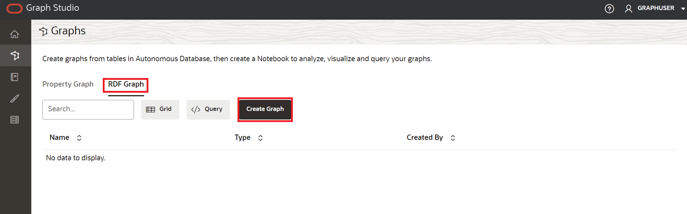
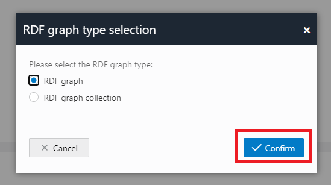
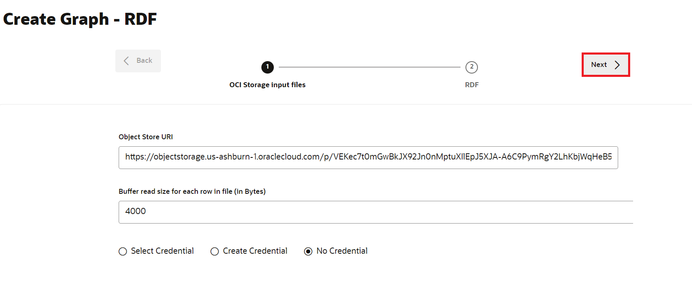
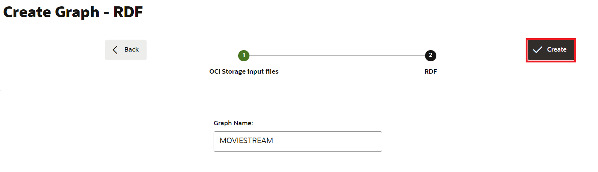

# Graph Studio에서 RDF 그래프 생성

## 소개

Oracle Autonomous Database의 Graph Studio를 통해 사용자는 그래프 데이터를 모델링, 생성, 쿼리, 분석할 수 있습니다. 여기에는 노트북, PGQL을 사용하여 그래프 쿼리를 실행하기 위한 개발자 API, 60개 이상의 내장된 그래프 알고리즘이 포함되며, 기본 그래프 시각화를 포함한 수십 개의 시각화가 제공됩니다. 이제 속성 그래프 외에도 Graph Studio는 RDF(Resource Description Framework) 및 OWL(Web Ontology Language)을 기반으로 데이터 및 온톨로지에 대한 저장, 추론 및 쿼리 기능을 포함한 의미 기술에 대한 지원을 확대합니다. 이제 지원되는 다음 RDF 기능에 대해 Graph Studio를 사용할 수 있습니다.

*   RDF 그래프 생성
*   노트북 단락의 RDF 그래프에서 SPARQL 질의 실행
*   RDF 그래프 분석 및 시각화

예상 시간: 5분

실습 과정을 간단히 살펴보려면 아래 비디오를 시청하십시오. [Graph Studio에서 RDF 그래프 생성](videohub:1_vvqhh26v)

### 목표

*   Graph Studio에서 RDF 그래프 생성
*   RDF 그래프 검증
*   플레이그라운드 페이지에서 SPARQL 질의 실행

### 필요 조건

*   다음 실습에서는 Autonomous Database - Serverless가 필요합니다.
*   그래프 지원 사용자(GRAPHUSER)가 있습니다. 즉, 올바른 롤과 권한을 가진 데이터베이스 유저가 있습니다.

## 작업 1: Graph Studio에서 RDF 그래프 생성

이전 연습을 완료했고 현재 로그인되어 있다고 가정하고 다음 단계를 실행합니다.

1.  왼쪽의 탐색 메뉴에서 **그래프**를 눌러 \[그래프\] 페이지를 탐색합니다.


2.  Graph Type 드롭다운 메뉴에서 **RDF**를 선택한 다음 인터페이스의 오른쪽 상단 모서리에 있는 **Create** 버튼을 누릅니다.



3.  **RDF 그래프**를 선택한 다음 **확인** 단추를 누릅니다.



4.  다음과 같이 Create RDF Graph Wizard가 열립니다.



5.  OCI 오브젝트 스토리지 URI 경로 입력:
    
          <copy>https://objectstorage.us-ashburn-1.oraclecloud.com/p/VEKec7t0mGwBkJX92Jn0nMptuXIlEpJ5XJA-A6C9PymRgY2LhKbjWqHeB5rVBbaV/n/c4u04/b/livelabsfiles/o/data-management-library-files/moviestream_rdf.nt
        
6.  **인증서 없음**을 누릅니다.
    
7.  **다음**을 누릅니다. 다음 대화 상자가 나타나면 Graph Name에 "MOVIESTREAM"을 입력합니다.
    



8.  **생성**을 누릅니다.
    
    RDF 그래프 생성 작업이 시작됩니다. RDF 파일에 139461개의 레코드가 포함되어 있으므로 프로세스는 3~4분 정도 걸릴 수 있습니다. Graph Studio의 **작업** 페이지에서 작업을 모니터할 수 있습니다.
    


    When succeeded, the status will change from pending to succeeded and Logs can be viewed by clicking on the three dots on the right side of the job row and selecting **See Log**. The log for the job displays details as shown below:
    
    ```
    Tue, Mar 1, 2022 08:21:04 AM
    Finished execution of task Graph Creation - MOVIESTREAM.
    
    Tue, Mar 1, 2022 08:21:04 AM
    Graph MOVIESTREAM created successfully
    
    Tue, Mar 1, 2022 08:21:04 AM
    Optimizer Statistics Gathered successfully
    
    Tue, Mar 1, 2022 08:20:50 AM
    External table <graph-user>_TAB_EXTERNAL dropped successfully
    
    Tue, Mar 1, 2022 08:20:49 AM
    Data successfully bulk loaded from ORACLE_ORARDF_STGTAB
    
    Tue, Mar 1, 2022 08:20:39 AM
    Model MOVIESTREAM created successfully
    
    Tue, Mar 1, 2022 08:20:37 AM
    Network RDF_NETWORK created successfully
    
    Tue, Mar 1, 2022 08:20:24 AM
    Data loaded into the staging table ORACLE_ORARDF_STGTAB from <graph-user>_TAB_EXTERNAL
    
    Tue, Mar 1, 2022 08:20:19 AM
    External table <graph-user>_TAB_EXTERNAL created successfully
    
    Tue, Mar 1, 2022 08:20:19 AM
    Using the Credential MOVIES_CREDENTIALS
    
    Tue, Mar 1, 2022 08:20:19 AM
    Started execution of task Graph Creation - MOVIESTREAM.
    ```
    

## 작업 2: RDF 그래프 검증

다음과 같이 Graph Studio의 **그래프** 페이지에서 새로 생성된 RDF 그래프를 탐색하고 검증할 수 있습니다.

1.  **그래프** 페이지로 이동하고 드롭다운 메뉴를 사용하여 **그래프 유형**을 RDF로 설정합니다. 사용 가능한 RDF 그래프에서 MOVIESTREAM 그래프 행을 선택하고, 샘플 명령문(3개 또는 쿼드가 나타나야 함)을 선택하고, 세 개의 가로 점을 사용하여 해당 명령문의 크기를 조정하고, 뷰로 가져옵니다. 다음과 같이 RDF 그래프의 샘플 문(3개 또는 4개)이 하단 패널에 표시됩니다.


2.  MOVIESTREAM Graph를 선택한 후 페이지 하단으로 스크롤하여 500개의 RDF 트리플 행이 검색되었는지 확인합니다.


## 작업 3: 플레이그라운드 페이지에서 SPARQL 질의 실행

**질의 플레이그라운드** 페이지에서 RDF 그래프에서 SPARQL 질의를 실행할 수 있습니다.

1.  **그래프** 페이지의 \[그래프 유형\] 드롭다운 메뉴에서 **RDF**를 선택하고 **질의** 단추를 눌러 \[질의 플레이그라운드\] 페이지로 이동합니다.


2.  그래프 스튜디오에 그래프가 여러 개 있는 경우 쿼리할 그래프를 선택해야 합니다. Graph Name 메뉴의 드롭다운 메뉴에서 MOVIESTREAM을 선택합니다.


3.  RDF Graph에 대해 다음 Query를 실행합니다.
    
        <copy>PREFIX rdf: &lthttp://www.w3.org/1999/02/22-rdf-syntax-ns#&gt
        PREFIX rdfs: &lthttp://www.w3.org/2000/01/rdf-schema#&gt
        PREFIX xsd: &lthttp://www.w3.org/2001/XMLSchema#&gt
        PREFIX ms: &lthttp://www.example.com/moviestream/&gt
        
        SELECT DISTINCT ?gname
        WHERE {
          ?movie ms:actor/ms:name "Keanu Reeves" ;
          ms:genre/ms:genreName ?gname .
        }
        ORDER BY ASC(?gname)<copy>
        
    
    질의가 성공적으로 실행되면 다음과 같이 질의 출력이 표시됩니다.
    


이 연습을 마칩니다. **이제 다음 실습을 진행할 수 있습니다.**

## 확인

*   **작성자** - Malia German, Ethan Shmargad, Matthew McDaniel 솔루션 엔지니어, Ramu Murakami Gutierrez 제품 관리자
*   **기술 기여자** - Melliyal Annamalai Distinguished Product Manager, Joao Paiva Consulting Member of Technical Staff, Lavanya Jayapalan Principal User Assistance Developer
*   **최종 업데이트 기한/일자** - Ramu Murakami Gutierrez, 2023년 8월 제품 관리자