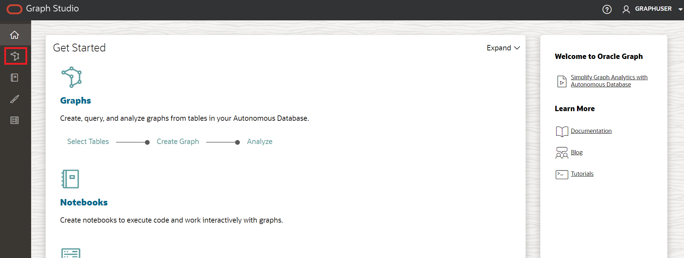
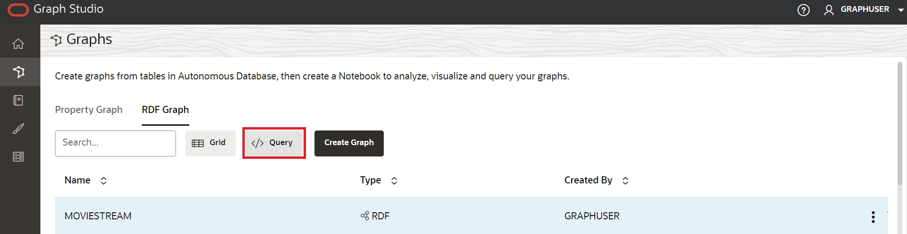

# Criar um gráfico RDF no Graph Studio

## Introdução

O Graph Studio no Oracle Autonomous Database permite que os usuários modelem, criem, consultem e analisem dados gráficos. Ele inclui notebooks, APIs do desenvolvedor para executar consultas gráficas usando PGQL, mais de 60 algoritmos gráficos incorporados e oferece dezenas de visualizações, incluindo visualização gráfica nativa. Além do gráfico de propriedades, o Graph Studio agora estende o suporte a tecnologias semânticas, incluindo recursos de armazenamento, inferência e consulta para dados e ontologias com base no Resource Description Framework (RDF) e na Web Ontology Language (OWL). Agora você pode usar o Graph Studio para os seguintes recursos RDF suportados:

*   Criar um gráfico RDF
*   Executar consultas SPARQL no gráfico RDF em um parágrafo de notebook
*   Analisar e visualizar gráficos RDF

Tempo Estimado: 5 minutos

Assista ao vídeo abaixo para uma rápida apresentação do laboratório. [Criar um gráfico RDF no Graph Studio](videohub:1_vvqhh26v)

### Objetivos

*   Criar Gráfico RDF no Graph Studio
*   Validar o Gráfico RDF
*   Executar Consultas SPARQL na Página Playground

### Pré-requisitos

*   O laboratório a seguir requer um Autonomous Database - Serverless.
*   E que o usuário habilitado para Gráfico (GRAPHUSER) existe. Ou seja, existe um usuário de banco de dados com as atribuições e os privilégios corretos.

## Tarefa 1: Criar gráfico RDF no Graph Studio

Supondo que você tenha concluído os laboratórios anteriores e esteja conectado no momento, execute as seguintes etapas:

1.  Clique em **Gráficos** no menu de navegação à esquerda para navegar na página Gráficos.



2.  No menu suspenso Tipo de Gráfico, selecione **RDF** e clique no botão **Criar** no canto superior direito da interface.


3.  Selecione **Gráfico RDF** e clique no botão **Confirmar**.


4.  O Assistente de criação de gráfico RDF é aberto conforme mostrado:


5.  Informe o caminho do URI do OCI Object Storage:
    
          <copy>https://objectstorage.us-ashburn-1.oraclecloud.com/p/VEKec7t0mGwBkJX92Jn0nMptuXIlEpJ5XJA-A6C9PymRgY2LhKbjWqHeB5rVBbaV/n/c4u04/b/livelabsfiles/o/data-management-library-files/moviestream_rdf.nt
        
6.  Clique em **Nenhuma Credencial**.
    
7.  Clique em **Próximo**. A caixa de diálogo a seguir deve aparecer, digite "MOVIESTREAM" para o Nome do Gráfico:
    


8.  Clique em **Criar**.
    
    O job de criação do gráfico RDF será iniciado. Como o arquivo RDF contém registros 139461, o processo pode levar de 3 a 4 minutos. Você pode monitorar o job na página **Jobs** no Graph Studio.
    


    When succeeded, the status will change from pending to succeeded and Logs can be viewed by clicking on the three dots on the right side of the job row and selecting **See Log**. The log for the job displays details as shown below:
    
    ```
    Tue, Mar 1, 2022 08:21:04 AM
    Finished execution of task Graph Creation - MOVIESTREAM.
    
    Tue, Mar 1, 2022 08:21:04 AM
    Graph MOVIESTREAM created successfully
    
    Tue, Mar 1, 2022 08:21:04 AM
    Optimizer Statistics Gathered successfully
    
    Tue, Mar 1, 2022 08:20:50 AM
    External table <graph-user>_TAB_EXTERNAL dropped successfully
    
    Tue, Mar 1, 2022 08:20:49 AM
    Data successfully bulk loaded from ORACLE_ORARDF_STGTAB
    
    Tue, Mar 1, 2022 08:20:39 AM
    Model MOVIESTREAM created successfully
    
    Tue, Mar 1, 2022 08:20:37 AM
    Network RDF_NETWORK created successfully
    
    Tue, Mar 1, 2022 08:20:24 AM
    Data loaded into the staging table ORACLE_ORARDF_STGTAB from <graph-user>_TAB_EXTERNAL
    
    Tue, Mar 1, 2022 08:20:19 AM
    External table <graph-user>_TAB_EXTERNAL created successfully
    
    Tue, Mar 1, 2022 08:20:19 AM
    Using the Credential MOVIES_CREDENTIALS
    
    Tue, Mar 1, 2022 08:20:19 AM
    Started execution of task Graph Creation - MOVIESTREAM.
    ```
    

## Tarefa 2: Validar o gráfico RDF

Você pode explorar e validar o gráfico RDF recém-criado na página **Gráficos** no Graph Studio, conforme mostrado:

1.  Navegue até a página **Gráficos** e defina o **Tipo de Gráfico** como RDF usando o menu suspenso. Selecione a linha do gráfico MOVIESTREAM entre os gráficos RDF disponíveis, exemplos de instruções (triplos ou quads devem aparecer), use os três pontos horizontais para redimensionar essas instruções e exibi-las. As instruções de amostra (triplos ou quádruplos) do Gráfico RDF são exibidas no painel inferior, conforme mostrado:


2.  Depois de selecionar o Gráfico MOVIESTREAM, role até a parte inferior da página e verifique se foram recuperadas 500 linhas de triplos RDF.


## Tarefa 3: Executar consultas SPARQL na página de playground

Você pode executar Consultas SPARQL no Gráfico RDF na página **Plano de Reprodução da Consulta**.

1.  Na página **Gráficos**, selecione o **RDF** no menu drop-down Tipo de Gráfico e clique no botão **Consultar** para navegar até a página Playground da Consulta.



2.  Se você tiver vários gráficos no Graph Studio, terá que escolher o gráfico a ser consultado. No menu Nome do Gráfico, selecione MOVIESTREAM no menu suspenso.


3.  Execute a consulta a seguir para o Gráfico RDF.
    
        <copy>PREFIX rdf: &lthttp://www.w3.org/1999/02/22-rdf-syntax-ns#&gt
        PREFIX rdfs: &lthttp://www.w3.org/2000/01/rdf-schema#&gt
        PREFIX xsd: &lthttp://www.w3.org/2001/XMLSchema#&gt
        PREFIX ms: &lthttp://www.example.com/moviestream/&gt
        
        SELECT DISTINCT ?gname
        WHERE {
          ?movie ms:actor/ms:name "Keanu Reeves" ;
          ms:genre/ms:genreName ?gname .
        }
        ORDER BY ASC(?gname)<copy>
        
    
    Quando a consulta for executada com sucesso, a saída da consulta será exibida conforme mostrado:
    


Isso conclui este laboratório. **Agora você pode prosseguir para o próximo laboratório.**

## Agradecimentos

*   **Autor** - Malia German, Ethan Shmargad, Matthew McDaniel Engenheiros de Soluções, Gerente de Produtos Ramu Murakami Gutierrez
*   **Contribuinte Técnico** - Melliyal Annamalai Gerente de Produto, Joao Paiva Consulting Membro da Equipe Técnica, Lavanya Jayapalan Principal User Assistance Developer
*   **Última Atualização em/Data** - Ramu Murakami Gutierrez, Gerente de Produtos, agosto de 2023