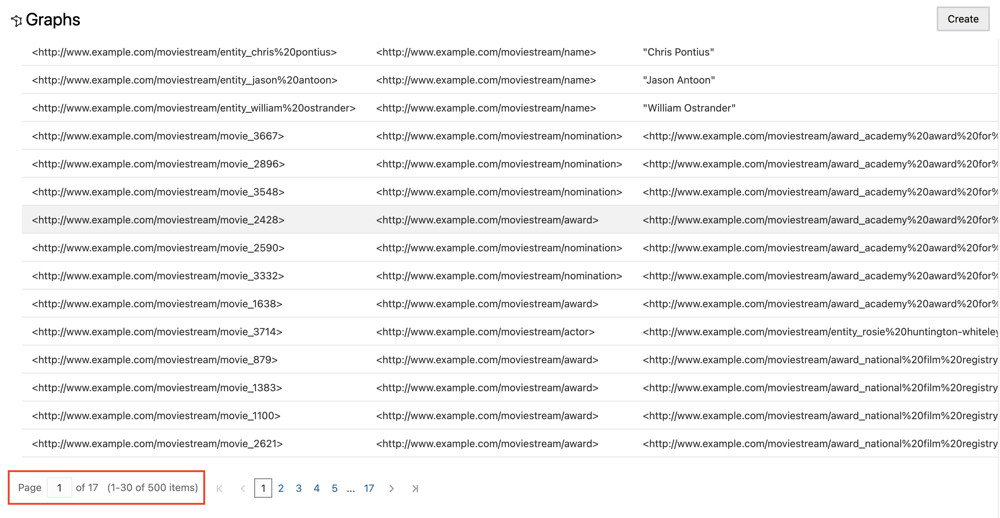

# 在 Graph Studio 中创建 RDF 图形

## 简介

Oracle Autonomous Database 中的 Graph Studio 支持用户对图形数据进行建模、创建、查询和分析。它包括笔记本、使用 PGQL 执行图形查询的开发人员 API、60 多个内置图形算法，并提供数十种可视化功能，包括本机图形可视化。除了属性图之外，Graph Studio 现在还扩展了对语义技术的支持，包括基于资源描述框架 (RDF) 和 Web 本体语言 (OWL) 的数据和本体的存储、推理和查询功能。您现在可以将 Graph Studio 用于以下支持的 RDF 功能：

*   创建 RDF 图形
*   对笔记本段落中的 RDF 图形执行 SPARQL 查询
*   分析和可视化 RDF 图形

估计时间：5 分钟

观看下面的视频，快速浏览实验室。[在 Graph Studio 中创建 RDF 图形](videohub:1_vvqhh26v)

### 目标

*   在 Graph Studio 中创建 RDF 图形
*   验证 RDF 图形
*   在“Playground（活动场）”页面上执行 SPARQL 查询

### 先备条件

*   下面的练习需要一个 Autonomous Database - Serverless。
*   并且存在启用图形的用户 (GRAPHUSER)。也就是说，存在具有正确角色和权限的数据库用户。

## 任务 1：在 Graph Studio 中创建 RDF 图形

假设您已完成以前的练习并且当前已登录，请执行以下步骤：

1.  单击左侧导航菜单上的**图形**以导航“图形”页。


2.  在“图形类型”下拉菜单中，选择 **RDF** ，然后单击界面右上角的**创建**按钮。


3.  选择 **RDF 图形**，然后单击**确认**按钮。


4.  “Create RDF Graph Wizard（创建 RDF 图形向导）”将打开，如下所示：


5.  输入 OCI 对象存储 URI 路径：
    
          <copy>https://objectstorage.us-ashburn-1.oraclecloud.com/p/VEKec7t0mGwBkJX92Jn0nMptuXIlEpJ5XJA-A6C9PymRgY2LhKbjWqHeB5rVBbaV/n/c4u04/b/livelabsfiles/o/data-management-library-files/moviestream_rdf.nt
        
6.  单击**无身份证明**。
    
7.  单击**下一步**。应显示以下对话框，为图形名称输入 "MOVIESTREAM"：
    


8.  单击**创建**。
    
    将启动 RDF 图形创建作业。由于 RDF 文件包含 139461 条记录，因此该过程可能需要 3 到 4 分钟。您可以在 Graph Studio 的**作业**页上监视作业。
    


    When succeeded, the status will change from pending to succeeded and Logs can be viewed by clicking on the three dots on the right side of the job row and selecting **See Log**. The log for the job displays details as shown below:
    
    ```
    Tue, Mar 1, 2022 08:21:04 AM
    Finished execution of task Graph Creation - MOVIESTREAM.
    
    Tue, Mar 1, 2022 08:21:04 AM
    Graph MOVIESTREAM created successfully
    
    Tue, Mar 1, 2022 08:21:04 AM
    Optimizer Statistics Gathered successfully
    
    Tue, Mar 1, 2022 08:20:50 AM
    External table <graph-user>_TAB_EXTERNAL dropped successfully
    
    Tue, Mar 1, 2022 08:20:49 AM
    Data successfully bulk loaded from ORACLE_ORARDF_STGTAB
    
    Tue, Mar 1, 2022 08:20:39 AM
    Model MOVIESTREAM created successfully
    
    Tue, Mar 1, 2022 08:20:37 AM
    Network RDF_NETWORK created successfully
    
    Tue, Mar 1, 2022 08:20:24 AM
    Data loaded into the staging table ORACLE_ORARDF_STGTAB from <graph-user>_TAB_EXTERNAL
    
    Tue, Mar 1, 2022 08:20:19 AM
    External table <graph-user>_TAB_EXTERNAL created successfully
    
    Tue, Mar 1, 2022 08:20:19 AM
    Using the Credential MOVIES_CREDENTIALS
    
    Tue, Mar 1, 2022 08:20:19 AM
    Started execution of task Graph Creation - MOVIESTREAM.
    ```
    

## 任务 2：验证 RDF 图形

您可以在 Graph Studio 的**图形**页上浏览和验证新创建的 RDF 图形，如下所示：

1.  定位至**图形**页，然后使用下拉菜单将**图形类型**设置为 RDF。从可用的 RDF 图形中选择 MOVIESTREAM 图形行，选择示例语句（应显示三元组或四元组），使用三个水平点调整这些语句的大小，然后查看它们。来自 RDF 图形的示例语句（三元组或四元组）显示在底部面板上，如下所示：


2.  选择“MOVIESTREAM Graph（电影图）”后，滚动到页面底部并验证是否已检索到 500 行 RDF 三元组。



## 任务 3：在操场页面上执行 SPARQL 查询

您可以从**查询游乐场**页对 RDF 图形执行 SPARQL 查询。

1.  在**图形**页上，从“图形类型”下拉菜单中选择 **RDF** ，然后单击**查询**按钮以导航到“查询游乐场”页。


2.  如果图形工作室中有多个图形，则必须选择要查询的图形。在“Graph Name（图形名称）”菜单中，从下拉菜单中选择“MOVIESTREAM（电影）”。


3.  对 RDF 图形执行以下查询。
    
        <copy>PREFIX rdf: &lthttp://www.w3.org/1999/02/22-rdf-syntax-ns#&gt
        PREFIX rdfs: &lthttp://www.w3.org/2000/01/rdf-schema#&gt
        PREFIX xsd: &lthttp://www.w3.org/2001/XMLSchema#&gt
        PREFIX ms: &lthttp://www.example.com/moviestream/&gt
        
        SELECT DISTINCT ?gname
        WHERE {
          ?movie ms:actor/ms:name "Keanu Reeves" ;
          ms:genre/ms:genreName ?gname .
        }
        ORDER BY ASC(?gname)<copy>
        
    
    成功执行查询后，查询输出将显示如下所示：
    


这个实验室结束了。**现在，您可以继续下一个练习。**

## 确认

*   **作者** - Malia German、Ethan Shmargad、Matthew McDaniel 解决方案工程师、Ramu Murakami Gutierrez 产品经理
*   **技术贡献者** - Lavanya Jayapalan 首席用户帮助开发人员 Melliyal Annamalai 杰出产品经理 Joao Paiva 技术人员咨询成员
*   **上次更新者/日期** - Ramu Murakami Gutierrez，产品经理，2023 年 8 月