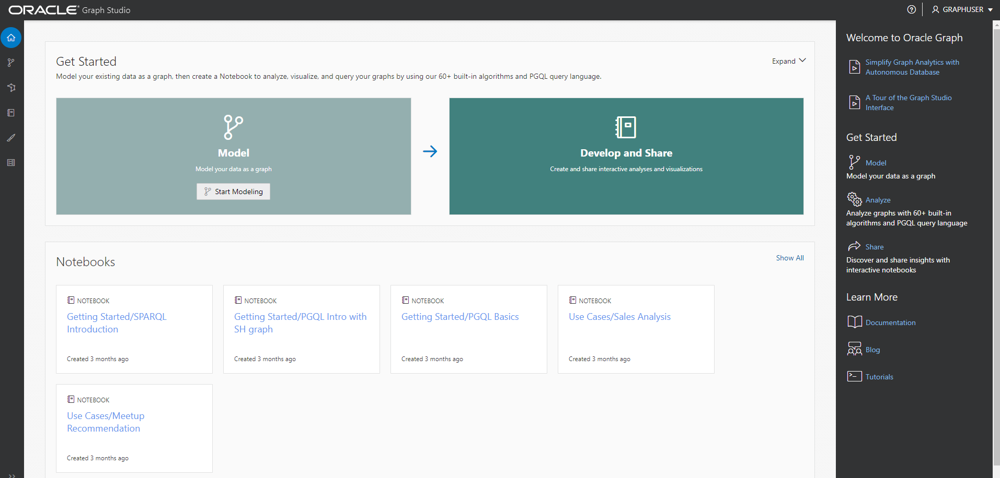

# Setup: Stack ausführen

## Einführung

In dieser Übung führen Sie einen Stack aus, der eine Autonomous Database generiert, einen Graphbenutzer erstellt und das verwendete Dataset hochlädt.

Geschätzte Zeit: 5 Minuten.

Sehen Sie sich das Video unten an, um einen schnellen Durchgang des Labors zu erhalten. [Einrichten](videohub:1_8z5ze0pe)

### Ziele

Vorgehensweise

*   Compartment erstellen (OPTIONAL)
*   Führen Sie den Stack aus, um ein Autonomous Database-, Graphbenutzer- und Upload-Dataset zu erstellen
*   Bei Graph Studio anmelden

## Aufgabe 1: OCI-Compartment erstellen (OPTIONAL)

> **Hinweis:** _Diese Übung ist optional, wenn Sie bereits über ein Compartment verfügen._

## Aufgabe 2: Stack ausführen

In den folgenden Anweisungen wird gezeigt, wie Sie einen Stack ausführen, der automatisch eine Autonomous Database mit einem Diagrammbenutzer und dem für die Eigenschaftsdiagrammabfragen erforderlichen Dataset erstellt.

1.  Melden Sie sich bei Oracle Cloud an.
    
2.  Verwenden Sie nach der Anmeldung diesen [Link](https://cloud.oracle.com/resourcemanager/stacks/create?zipUrl=https://github.com/oracle-quickstart/oci-arch-graph/releases/latest/download/orm-graph-stack.zip), um den Stack zu erstellen und auszuführen.
    

> Hinweis: Der Link wird in einer neuen Registerkarte oder einem neuen Fenster geöffnet.

3.  Sie werden zu dieser Seite umgeleitet:

4.  Aktivieren Sie das Kontrollkästchen "Ich habe die Oracle-Nutzungsbedingungen geprüft und akzeptiere sie", und wählen Sie Ihr Compartment aus. Übernehmen Sie den Rest als Standard. Klicken Sie auf **Weiter**.

5.  Wählen Sie das Compartment aus, um Autonomous Database zu erstellen, und übernehmen Sie den Rest als Standard. Klicken Sie auf **Weiter**. Danach gelangen Sie zur Seite "Prüfen", und klicken Sie auf **Erstellen**.

6.  Sie gelangen zu einer Seite mit Jobdetails mit einem Anfangsstatus in Orange. Das Symbol wird grün, sobald der Job erfolgreich abgeschlossen wurde.
    
    
    
    Um Informationen zu Ihrer Anwendung anzuzeigen, klicken Sie auf **Anwendungsinformationen**. Speichern Sie den Graph-Benutzernamen und das Graph-Kennwort, da Sie sich damit bei Graph Studio anmelden.
    
    
    

## Aufgabe 3: Anmelden bei Graph studio

1.  Klicken Sie unter "Anwendungsinformationen" auf **Open Graph Studio**. Dadurch wird eine neue Seite geöffnet. Geben Sie im Anmeldebildschirm Ihren Benutzernamen und Ihr Kennwort für die Grafik ein.

2.  Klicken Sie dann auf die Schaltfläche **Anmelden**. Sie sollten die Studio-Homepage sehen.

Graph Studio besteht aus einer Gruppe von Seiten, auf die über das Menü auf der linken Seite zugegriffen wird.

Mit dem Home-Symbol  gelangen Sie zur Homepage.  
Mit dem Symbol "Modelle"  gelangen Sie zur Seite "Modelle", auf der Sie mit der Modellierung Ihrer vorhandenen Tabellen und Ansichten als Diagramm beginnen und dann ein Diagramm erstellen oder instanziieren.  
Auf der Seite "Diagramm"  werden vorhandene Diagramme zur Verwendung in Notizbüchern aufgeführt.  
Auf der Seite "Notizbuch"  werden vorhandene Notizbücher aufgelistet. Sie können ein neues Notizbuch erstellen.  
Auf der Seite "Jobs"  wird der Status von Hintergrundjobs aufgeführt. Sie können das zugehörige Log gegebenenfalls anzeigen.

Damit endet diese Übung. **Jetzt können Sie mit der nächsten Übung fortfahren.**

## Danksagungen

*   **Autor** - Jayant Sharma, Ramu Murakami Gutierrez, Produktmanagement
*   **Mitwirkende** - Rahul Tasker, Jayant Sharma, Ramu Murakami Gutierrez, Produktmanagement
*   **Zuletzt aktualisiert am/um** - Ramu Murakami Gutierrez, Produktmanagement, Juni 2022