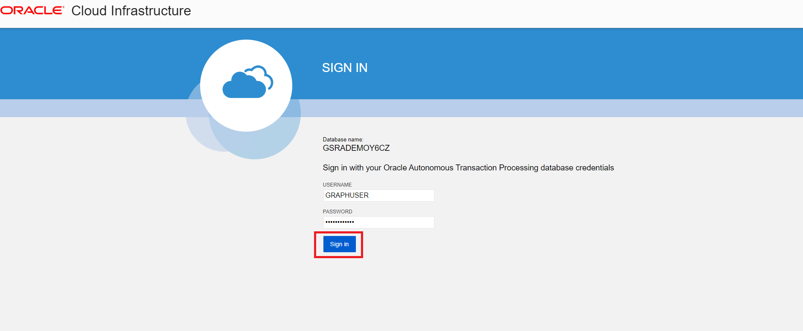

# Configuration : Exécuter la pile

## Présentation

Dans cet exercice, vous allez exécuter une pile qui génère une instance Autonomous Database, crée un utilisateur de graphique et télécharge l'ensemble de données qui sera utilisé.

Durée estimée : 5 minutes.

Regardez la vidéo ci-dessous pour une présentation rapide du laboratoire. [Configuration](videohub:1_8z5ze0pe)

### Objectifs

Découvrez comment :

*   Créer un compartiment (FACULTATIF)
*   Exécutez la pile pour créer une instance Autonomous Database, un utilisateur de graphique et télécharger l'ensemble de données
*   Connexion à Graph Studio

## Tâche 1 : création d'un compartiment OCI (FACULTATIF)

> **Remarque :** _Cet atelier est facultatif si vous disposez déjà d'un compartiment._

## Tâche 2 : exécuter la pile

Les instructions ci-dessous vous montreront comment exécuter une pile qui créera automatiquement une instance Autonomous Database contenant un utilisateur de graphique et l'ensemble de données requis pour les requêtes de graphique de propriétés.

1.  Connectez-vous à Oracle Cloud.
    
2.  Une fois connecté, utilisez ce [lien](https://cloud.oracle.com/resourcemanager/stacks/create?zipUrl=https://github.com/oracle-quickstart/oci-arch-graph/releases/latest/download/orm-graph-stack.zip) pour créer et exécuter la pile.
    

> Remarque : le lien s'ouvrira dans un nouvel onglet ou une nouvelle fenêtre.

3.  Vous allez être dirigé vers cette page :

4.  Cochez la case "J'ai vérifié et accepté les conditions d'utilisation d'Oracle" et choisissez votre compartiment. Laissez le reste par défaut. Cliquez sur **Suivant**.

5.  Sélectionnez le compartiment pour créer l'instance Autonomous Database et laissez le reste par défaut. Cliquez sur **Suivant**. Une fois que vous serez redirigé vers la page Vérifier, cliquez sur **Créer**.

6.  Vous serez redirigé vers une page Détails du travail avec un statut initial affiché en orange. L'icône devient verte une fois le travail terminé.
    
    
    
    Pour afficher des informations sur votre application, cliquez sur **Informations sur l'application**. Enregistrez le nom d'utilisateur et le mot de passe Graph, car vous l'utiliserez pour vous connecter à Graph Studio.
    
    
    

## Tâche 3 : Connexion à Graph Studio

1.  Cliquez sur **Ouvrir Graph Studio** sous Informations sur l'application. Cela ouvrira une nouvelle page. Entrez le nom utilisateur et le mot de passe du graphique fournis sous Informations sur l'application dans l'écran de connexion.

2.  Cliquez ensuite sur le bouton **Connexion**. Vous devriez voir la page d'accueil du studio.

Graph Studio se compose d'un ensemble de pages accessibles à partir du menu de gauche.

L'icône Accueil  permet d'accéder à la page d'accueil.  
L'icône Modèles  permet d'accéder à la page Modèles dans laquelle vous commencez à modéliser vos tables et vues existantes sous forme de graphique, puis à créer ou instancier un graphique.  
La page Graphique  répertorie les graphiques existants à utiliser dans les blocs-notes.  
La page Bloc-notes  répertorie les blocs-notes existants et vous permet d'en créer un.  
La page Travaux  répertorie le statut des travaux en arrière-plan et vous permet de visualiser le journal associé, le cas échéant.

Ceci conclut ce laboratoire. **Vous pouvez maintenant passer à l'exercice suivant.**

## Accusés de réception

*   **Auteur** - Jayant Sharma, Ramu Murakami Gutierrez, Product Management
*   **Contributeurs** - Rahul Tasker, Jayant Sharma, Ramu Murakami Gutierrez, Product Management
*   **Dernière mise à jour par/date** - Ramu Murakami Gutierrez, Product Management, juin 2022